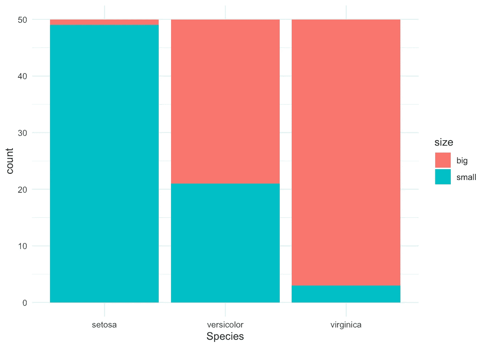
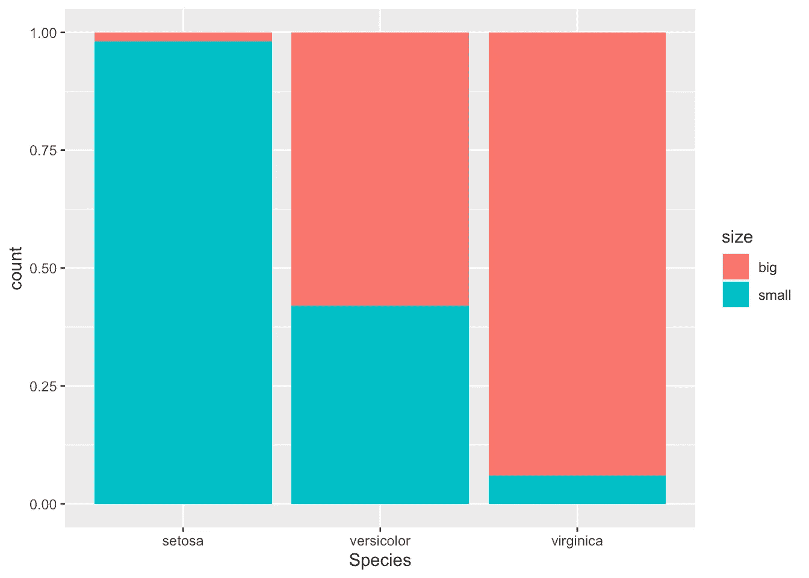
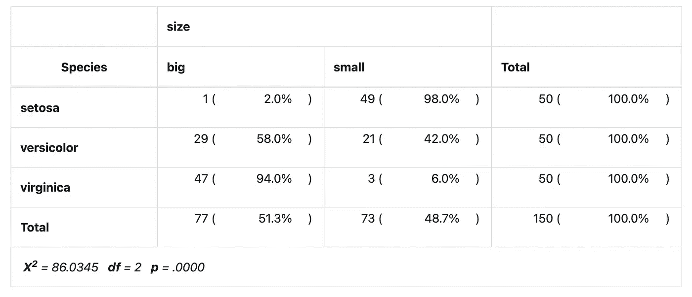
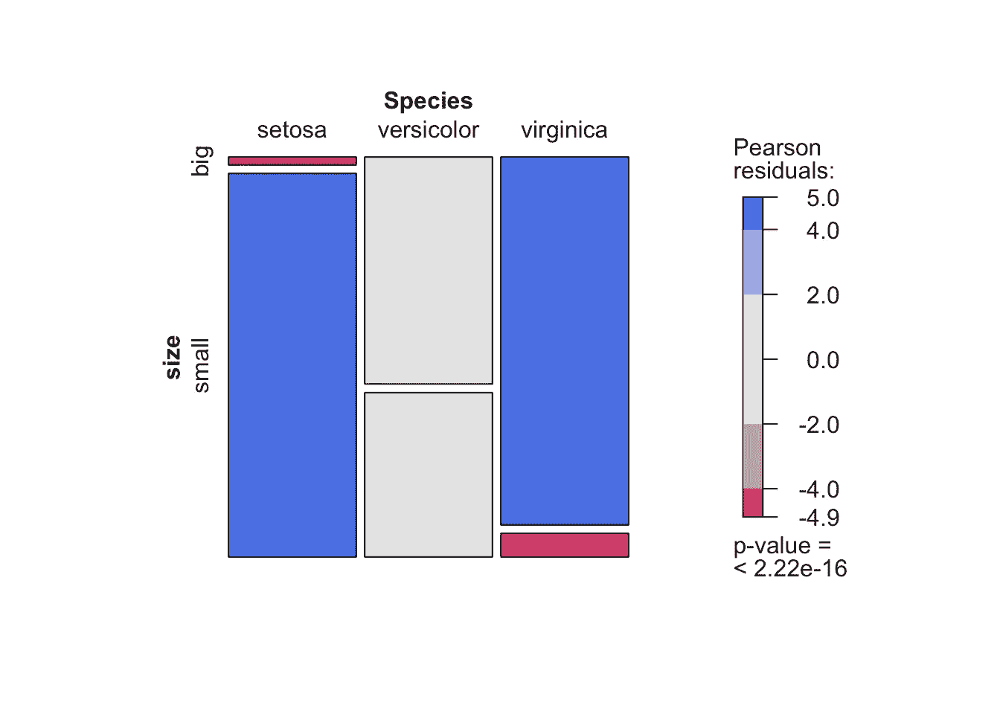
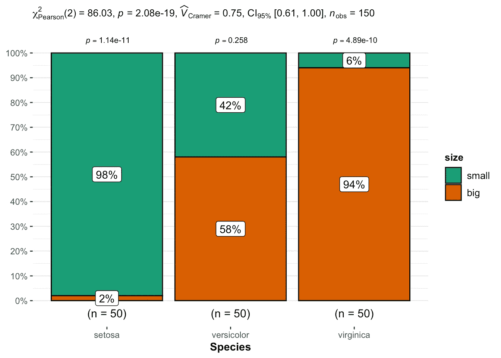

# R 中独立性的卡方检验

> 原文：<https://towardsdatascience.com/chi-square-test-of-independence-in-r-c109947ca73a?source=collection_archive---------15----------------------->

## 如何检验两个定性变量之间的独立性


乔治·托马塞蒂[拍摄的照片](https://unsplash.com/@gtomassetti?utm_source=medium&utm_medium=referral)

# 介绍

他的文章解释了如何在 R 中进行独立性卡方检验，以及如何解释其结果。要了解更多关于测试如何工作以及如何手工操作的信息，我邀请您阅读文章“[手工卡方独立性测试](https://www.statsandr.com/blog/chi-square-test-of-independence-by-hand/)”。

简要回顾一下那篇文章中所说的内容，卡方独立性检验测试两个[分类变量](https://www.statsandr.com/blog/variable-types-and-examples/#qualitative)之间是否存在关系。无效假设和替代假设是:

*   H0:变量是独立的，两个分类变量之间没有关系。知道一个变量的值无助于预测另一个变量的值
*   H1:变量是相关的，两个分类变量之间有关系。知道一个变量的值有助于预测另一个变量的值

独立性卡方检验的工作原理是，如果两个分类变量之间没有关系，则将观察到的频率(即样本中观察到的频率)与预期频率(即零假设为真时的预期频率)进行比较。

# 数据

对于我们的示例，让我们重用文章“[R](https://www.statsandr.com/blog/descriptive-statistics-in-r/)中的描述性统计”中介绍的数据集。这个数据集是众所周知的稍微增强的`iris`数据集。因为只有一个分类变量，而卡方检验需要两个分类变量，所以我们添加变量`size`，如果花瓣的长度小于所有花的中值，则对应于`small`，否则对应于`big`:

```
dat <- irisdat$size <- ifelse(dat$Sepal.Length < median(dat$Sepal.Length),
  "small", "big"
)
```

我们现在用`table()`函数创建两个变量`Species`和`size`的[列联表](https://www.statsandr.com/blog/descriptive-statistics-in-r/#contingency-table):

```
table(dat$Species, dat$size)##             
##              big small
##   setosa       1    49
##   versicolor  29    21
##   virginica   47     3
```

列联表给出了每个亚组中观察到的病例数。例如，只有一朵大刚毛藻花，而数据集中有 49 朵小刚毛藻花。

绘制一个[条形图](https://www.statsandr.com/blog/descriptive-statistics-in-r/#barplot)来直观地表示数据也是一个很好的做法:

```
library(ggplot2)ggplot(dat) +
  aes(x = Species, fill = size) +
  geom_bar() +
  scale_fill_hue() +
  theme_minimal()
```



如果您更喜欢用比例来形象化它(因此所有条形的高度都是 1 或 100%):

```
ggplot(dat) +
  aes(x = Species, fill = size) +
  geom_bar(position = "fill")
```



如果在 x 轴上绘制的变量的每个级别中有不同数量的观察值，则第二个条形图特别有用，因为它允许在相同的基础上比较两个变量。

参见文章“R 中的[Graphics with gg plot 2](https://www.statsandr.com/blog/graphics-in-r-with-ggplot2/)”了解如何在`{ggplot2}`中创建这种条形图。

# R 中独立性的卡方检验

对于这个例子，我们将在 R 中测试变量`Species`和`size`之间是否有关系。为此，使用`chisq.test()`功能:

```
test <- chisq.test(table(dat$Species, dat$size))
test## 
##  Pearson's Chi-squared test
## 
## data:  table(dat$Species, dat$size)
## X-squared = 86.035, df = 2, p-value < 2.2e-16
```

您需要的一切都会出现在这个输出中:

*   测试的标题，
*   使用了哪些变量，
*   测试统计，
*   自由度和
*   测试的 p 值。

您还可以使用以下方法检索χ2 检验统计和 p 值:

```
test$statistic # test statistic## X-squared 
##  86.03451test$p.value # p-value## [1] 2.078944e-19
```

如果你需要找到期望的频率，使用`test$expected`。

如果出现诸如“卡方近似可能不正确”的警告，这意味着最小预期频率低于 5。要避免此问题，您可以:

*   收集一些水平(尤其是那些具有少量观察值的水平)以增加子组中的观察值，或者
*   使用费希尔精确检验

费希尔的精确检验不需要假设最少 5 个预期计数。由于功能`fisher.test()`，它可以在 R 中应用。该检验在假设和结果解释方面类似于卡方检验。在专门讨论这种测试的文章中了解更多关于这种测试的信息。

供您参考，还有另外三种方法来执行 R 中独立性的卡方检验:

1.  具有`summary()`功能
2.  使用`{vcd}`包中的`assocstats()`功能
3.  使用`{summarytools}`包中的`ctable()`功能

```
# second method:
summary(table(dat$Species, dat$size))## Number of cases in table: 150 
## Number of factors: 2 
## Test for independence of all factors:
##  Chisq = 86.03, df = 2, p-value = 2.079e-19# third method:
library(vcd)
assocstats(table(dat$Species, dat$size))##                      X^2 df P(> X^2)
## Likelihood Ratio 107.308  2        0
## Pearson           86.035  2        0
## 
## Phi-Coefficient   : NA 
## Contingency Coeff.: 0.604 
## Cramer's V        : 0.757library(summarytools)
library(dplyr)

# fourth method:
dat %$%
  ctable(Species, size,
    prop = "r", chisq = TRUE, headings = FALSE
  ) %>%
  print(
    method = "render",
    style = "rmarkdown",
    footnote = NA
  )
```



如你所见，所有四种方法给出了相同的结果。

如果不同方法的数据没有相同的*p*-值，请确保在`chisq.test()`函数中添加`correct = FALSE`参数，以防止应用 Yate 的连续性校正，该校正在此方法中默认应用。 [1](https://www.statsandr.com/blog/chi-square-test-of-independence-in-r/#fn1)

# 结论和解释

从输出和`test$p.value`我们看到 p 值小于 5%的显著性水平。像任何其他统计检验一样，如果 p 值小于显著性水平，我们可以拒绝零假设。

在我们的上下文中，拒绝独立性卡方检验的零假设意味着物种和大小之间存在显著的关系。因此，知道一个变量的值有助于预测另一个变量的值。

# 绘图和统计检验相结合

我最近从`{vcd}`包中发现了`mosaic()`功能。该函数的优势在于它结合了[镶嵌图](https://www.statsandr.com/blog/descriptive-statistics-in-r/#mosaic-plot)(可视化列联表)和独立性卡方检验的结果:

```
library(vcd)mosaic(~ Species + size,
       direction = c("v", "h"),
       data = dat,
       shade = TRUE)
```



如您所见，镶嵌图类似于上面的柱状图，但是卡方检验的 *p* 值也显示在右下角。

此外，如果变量是独立的，这个彩色镶嵌图显示了观察频率与预期频率的偏差。红色情况表示观察频率比预期频率小，而蓝色情况表示观察频率比预期频率大。

另一种选择是`{ggstatsplot}`封装中的`ggbarstats()`功能:

```
# load packages
library(ggstatsplot)
library(ggplot2)# plot
ggbarstats(
  data = dat,
  x = size,
  y = Species
) +
  labs(caption = NULL) # remove caption
```



从剧情来看，似乎大花更有可能属于`virginica`种，小花更倾向于属于`setosa`种。因此，预计物种和大小是相互依赖的。

这一点得到了图表副标题中显示的统计结果的证实。有几个结果，但在这种情况下，我们可以关注显示在`p =`之后的 p 值。

和前面的测试一样，我们拒绝零假设，我们得出结论，物种和大小是相关的(p 值< 0.001)。

感谢阅读。我希望这篇文章有助于您执行 R 中独立性的卡方检验并解释其结果。如果你想了解如何手工做这个测试以及它是如何工作的，请阅读文章“[手工卡方独立性测试](https://www.statsandr.com/blog/chi-square-test-of-independence-by-hand/)”。

和往常一样，如果您有与本文主题相关的问题或建议，请将其添加为评论，以便其他读者可以从讨论中受益。

1.  感谢 Herivelto 指出这一点。 [↩︎](https://www.statsandr.com/blog/chi-square-test-of-independence-in-r/#fnref1)

**相关文章:**

*   一种安装和加载 R 包的有效方法
*   我的数据符合正态分布吗？关于最广泛使用的分布以及如何检验 R 中的正态性的注释
*   [R 中的 Fisher 精确检验:小样本的独立性检验](https://www.statsandr.com/blog/fisher-s-exact-test-in-r-independence-test-for-a-small-sample/)
*   [如何在简历中创建简历时间线](https://www.statsandr.com/blog/how-to-create-a-timeline-of-your-cv-in-r/)

*原载于 2020 年 1 月 27 日 https://statsandr.com*[](https://statsandr.com/blog/chi-square-test-of-independence-in-r/)**。**