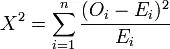

# 特征选择的卡方检验及其 Python 实现

> 原文：<https://towardsdatascience.com/chi-squared-test-for-feature-selection-with-implementation-in-python-65b4ae7696db?source=collection_archive---------5----------------------->

## 一个统计测试，用于识别两个变量之间的关联/关系及其在 Python 中的实现。


图片提供:全菲尼克斯，[Pinterest 邮报]。于 2020 年 2 月 13 日从 https://in.pinterest.com/pin/641059328193274870/[检索](https://in.pinterest.com/pin/641059328193274870/)

## 简介:

机器学习中有各种技术来确定我们的输入特征是否与要预测的结果相关。我们可以使用这些技术找出并删除对模型结果没有贡献的不重要的特性。在某种程度上，我们只选择那些真正重要的特征，因此这些技术被称为特征选择方法。卡方检验可用于特征选择。让我们深入细节。

## 特征选择方法:

确定特征重要性的方法有很多，主要分为两组:

1) **过滤器特征选择方法**
2) **包装器特征选择方法**

我们将只看到第一个，因为我们的卡方检验属于这一类。

简而言之，**滤波器特征选择方法**是那些使用一些统计技术(如卡方检验)考虑输入和目标变量的数据类型来评估它们之间关系的方法。

有许多其他的统计测量可用于基于过滤器的特征选择。因此，统计测量的选择高度依赖于特征和目标变量数据类型。

> 数据类型可以是数字的，也可以是分类的。

## **何时使用卡方检验:**

当要测试的特征的数据类型和目标变量都是分类的(即我们有一个分类问题)时，我们可以使用卡方检验。

## 卡方检验解释道:

皮尔逊卡方检验，或简称卡方检验，是以数学家 [**卡尔·皮尔逊**](https://en.wikipedia.org/wiki/Karl_Pearson) **命名的。**它也被称为**“拟合优度”**统计量。

让我们看看如何进行这个测试，以及 **8 个简单步骤**中的一个例子。

例如，让我们考虑一个只有两列的非常简单的数据集。我们将发现性别是否与对运动的兴趣相关/依赖/联系在一起。

```
╔════════╦══════════╗
║ Gender ║ Interest ║
╠════════╬══════════╣
║ Male   ║ Cricket  ║
║ Female ║ Tennis   ║
║ Male   ║ Cricket  ║
║ Male   ║ Football ║
║ ....   ║ ....     ║
╚════════╩══════════╝
```

## 步骤 1:定义假设

假设检验是一种统计方法，它评估两个陈述(假设)并确定哪个陈述是正确的。在假设检验中，最初的陈述被称为**零假设**，表示为 **H0** ，通常与第一个陈述互补的第二个陈述被称为**替代假设**，表示为 **H1。**

对于我们的例子，假设是:
**H0:** 特征**性别**和**兴趣**是**独立**(也就是说它们没有关联)。
**H1:** **性别**和**兴趣**是**不是独立的**(也就是说它们是关联的)。

## 第二步:选择一个重要级别

基本上，由α (alpha)表示的显著性水平是我们希望对我们的结果有多确定的度量。

或者简单地说，显著性水平用于确定是否应该拒绝零假设。对于要拒绝的零假设，p 值**(稍后解释)*应小于显著性水平。*

*较低的α值通常是优选的，可以在 0.01 至 0.10 的范围内。*

*我们选择 **α = 0.05***

## *步骤 3:创建列联表*

*以行和列显示一个变量和另一个变量的频率分布的表格，用于研究两个变量之间的相关性，称为列联表(也称为交叉制表或交叉表)。看到下表后你会更清楚:*

```
*╔══════════════╦═════════╦══════════╦════════╦═══════════╗
║              ║ Cricket ║ Football ║ Tennis ║ Row Total ║
╠══════════════╬═════════╬══════════╬════════╬═══════════╣
║ Male         ║      20 ║       30 ║     15 ║        65 ║
║ Female       ║      20 ║       15 ║     30 ║        65 ║
║ Column Total ║      40 ║       45 ║     45 ║       130 ║
╚══════════════╩═════════╩══════════╩════════╩═══════════╝*
```

*我们可以看到，在数据集中的 130 名候选人中，分别有 20 名、30 名和 15 名男性对板球、足球和网球感兴趣。同样，分别有 20、15 和 30 名女性对板球、足球和网球感兴趣。*

*表中的值称为**观察值。***

## *步骤 4:计算预期频率*

*我们计算每个单元的预期频率计数。计算预期频率的公式为:*

```
*E = (row total * column total)/grand total*
```

*第一个细胞(即雄性蟋蟀)的预期频率为:*

```
*E₁ = (65 * 40)/130 = **20***
```

*我们计算其余单元的预期频率，并得到下表，其中括号 **'[]'** 中的值表示预期频率:*

```
*╔══════════════╦═════════╦════════════╦═══════════╦═══════════╗
║              ║ Cricket ║  Football  ║  Tennis   ║ Row Total ║
╠══════════════╬═════════╬════════════╬═══════════╬═══════════╣
║ Male         ║ 20 [20] ║  30 [22.5] ║ 15 [22.5] ║        65 ║
║ Female       ║ 20 [20] ║  15 [22.5] ║ 30 [22.5] ║        65 ║
║ Column Total ║ 40      ║ 45         ║ 45        ║       130 ║
╚══════════════╩═════════╩════════════╩═══════════╩═══════════╝*
```

## ***步骤 5:计算卡方值或**卡方统计*

*计算卡方值或χ的公式为:*

**

*其中χ不是我们所知道的英语 aphabet 而是第 22 个希腊字母 [Chi](https://en.wikipedia.org/wiki/Chi_(letter)) 。
如图所示，χ是所有小区的观测频率和预期频率之间的平方差除以预期频率的总和。计算结果如下所示:*

```
***Χ² = ((20-20)^2/20) + ((30-22.5)^2/22.5) + ((15-22.5)^2/22.5) + ((20-20)^2/20) + ((15-22.5)^2/22.5) + ((30-22.5)^2/22.5)****Χ² = 0 + 2.5 + 2.5 + 0 + 2.5 + 2.5****Χ² = 10***
```

## *步骤 6:计算自由度*

*自由度可以计算如下:*

```
*df = (total_rows - 1) * (total_cols - 1)*
```

*列联表中有 **2 行**和 **3 列**，因此我们的自由度是 **2。***

## *第七步:寻找 p 值*

*我们可以看到像[这样的卡方分布表，这个](http://kisi.deu.edu.tr/joshua.cowley/Chi-square-table.pdf)使用卡方和自由度值找到 p 值。*

*如果您打开了到表的[链接，选择左边的自由度值(2)，沿着它的行找到最接近卡方值(10)的数字，然后检查第一行中的相应数字，得到 p 值 0.005](http://kisi.deu.edu.tr/joshua.cowley/Chi-square-table.pdf)*

*也有一些网站像[这个](https://www.socscistatistics.com/pvalues/chidistribution.aspx)一样为你计算 p 值。
这里我们得到的 p 值为. 0067，我们可以使用其中任何一个，让我们继续使用从表中得到的那个。*

## *步骤 8: **决定是拒绝还是保留我们的零假设***

*简而言之，如果我们的 **p 值小于显著性值**，我们**拒绝**零假设，如果我们的 **p 值大于显著性值**，我们**不拒绝它**。*

*由于 0.005 小于我们的显著性值 0.05，我们拒绝零假设，这意味着性别和感兴趣的运动之间存在关联。*

## *用 python 实现*

```
*# required imports
from scipy.stats import chi2_contingency# we create contingency table same as above
table = [[20, 30, 15], [20,  15,  30]]# Get chi-square value , p-value, degrees of freedom, expected frequencies using the function **chi2_contingency**
stat, p, dof, expected = chi2_contingency(table)# select significance value
alpha = 0.05# Determine whether to reject or keep your null hypothesis
print('significance=%.3f, p=%.3f' % (alpha, p))
if p <= alpha:
    print('Variables are associated (reject H0)')
else:
    print('Variables are not associated(fail to reject H0)')*
```

*为了简单起见，我创建了一个列联表。要从数据帧列中创建列联表，可以使用 [pandas](https://pandas.pydata.org/pandas-docs/stable/getting_started/overview.html) 中的[交叉表](https://www.geeksforgeeks.org/contingency-table-in-python/)函数。*

## *摘要*

*我们已经看到了如何进行卡方检验来检查两个分类变量之间是否存在某种关系。*

*用很少几行代码我们就可以使用 Python 的 **scipy** 库实现这个测试。*

*希望你喜欢。建议总是受欢迎的。*

## *参考资料:*

*[](https://machinelearningmastery.com/chi-squared-test-for-machine-learning/) [## 机器学习的卡方检验简介

### 应用机器学习中的一个常见问题是确定输入特征是否与输出相关

machinelearningmastery.com](https://machinelearningmastery.com/chi-squared-test-for-machine-learning/) [](https://en.wikipedia.org/wiki/Chi-squared_test) [## 卡方检验

### 术语“卡方检验”，也写作，指的是某些类型的统计假设检验是有效的…

en.wikipedia.org](https://en.wikipedia.org/wiki/Chi-squared_test)*