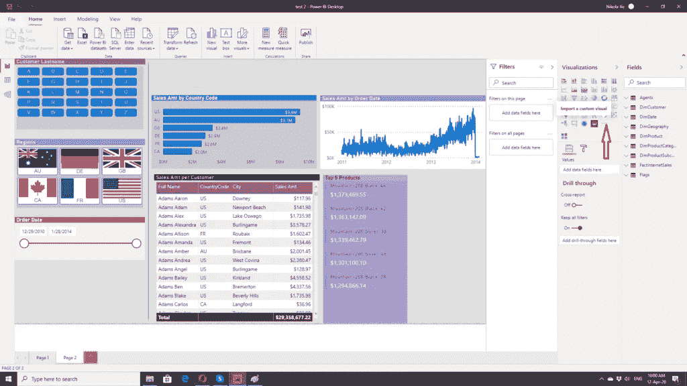
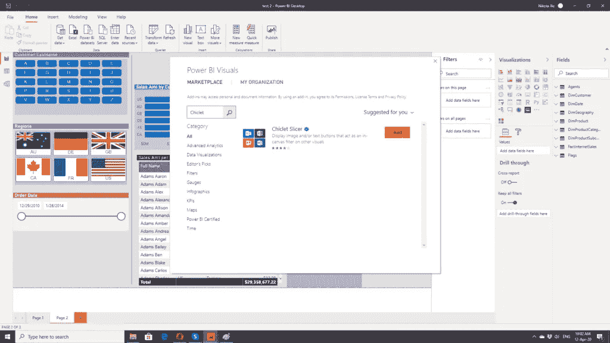
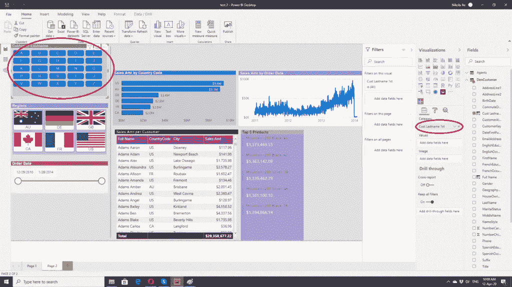
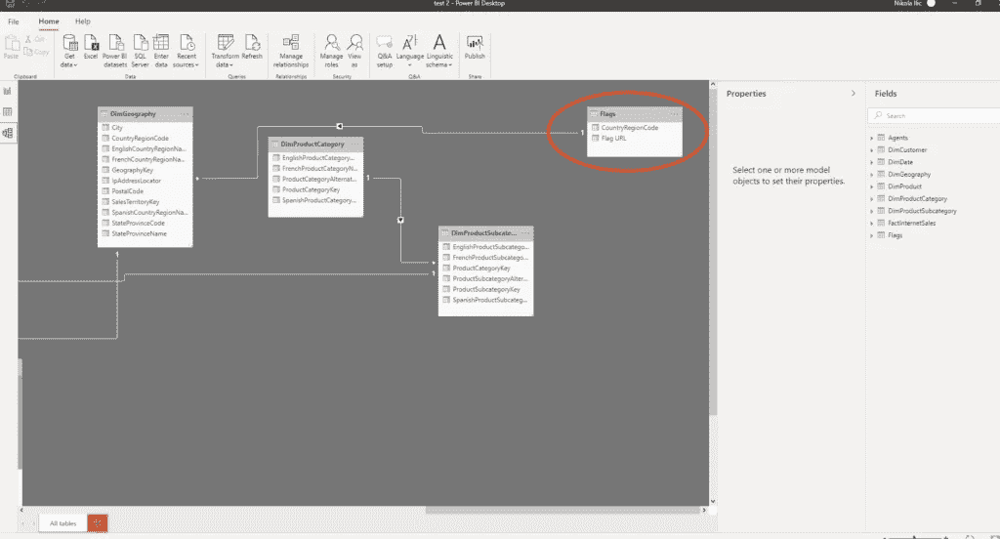
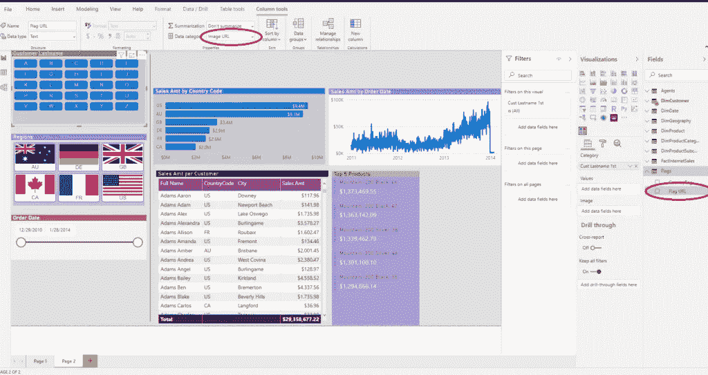
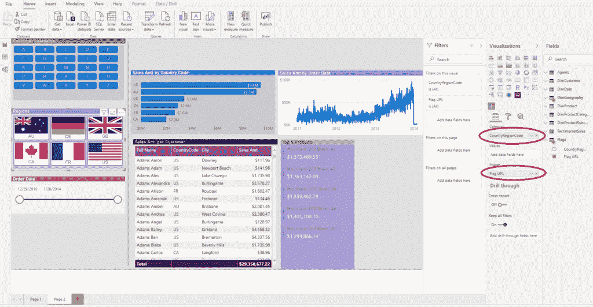
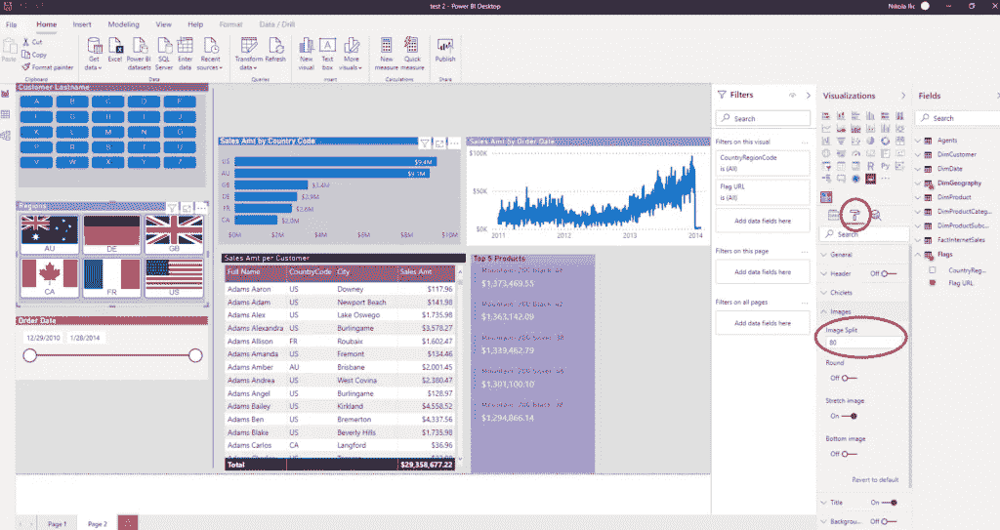

# 时尚外观，带 Chiclet 切片器的 Power BI

> 原文：<https://towardsdatascience.com/chic-look-in-power-bi-with-chiclet-slicer-ad726af94a14?source=collection_archive---------30----------------------->

## 使用新的切片选项增强您的功耗 BI 报告


Cottonbro 在 Pexels.com 拍摄的照片

在 Power BI 报告创建中使用自定义视觉效果，为您提供了扩展内置视觉功能的绝佳机会。Appstore 中有数百种自定义视觉效果，我建议你在想用非标准视觉效果丰富你的报告时查看它们。

这是 Power BI 的主要优势之一——您可以从[数百种视觉效果](/push-card-visuals-to-a-new-level-in-power-bi-174db7deaa7)中进行选择，以一种吸引人的方式讲述您的数据故事。

## Chiclet 切片机

最近，我遇到了一个基于姓氏对客户进行切片的特定请求。它们是按字母顺序排序的，但是要求只查看姓氏以 r 开头的客户。

第一步是从市场上导入 Chiclet Slicer visual。单击可视化窗格下的三个点，然后选择从 AppSource 导入。



在搜索字段中输入 Chiclet，看到它后，单击添加。



现在，您已经准备好在您的报告中使用 Chiclet Slicer 了。下一步是只提取客户姓氏的第一个字母。我将使用 Adventure Works 2017 数据库进行演示。

由于我想查看客户的全名，我将首先在 DimCustomer 表中创建一个新列，并将客户的姓和名连接起来:

```
*Full Name = DimCustomer[LastName] & " " & DimCustomer[FirstName]*
```

下一步是从该列中提取第一个字母，最简单的方法是使用 LEFT 函数:

```
*Cust Lastname 1st = LEFT(DimCustomer[LastName],1)*
```

数字 1 告诉函数只在文本左侧保留一个字符，并删除其他所有字符。

一旦我这样做了，我就可以在报表上拖动 Chiclet Slicer，并将我新创建的列 ***Cust Lastname 1st*** 作为切片的类别:



现在，我可以只选择那些姓氏以特定字母开头的客户，所有其他可视化结果也将被相应地过滤。

你也可以将“首字母技巧”用于其他类别，如产品、国家等。

## 用图像增强切片器

Chiclet slicer 还为您提供了一个很好的功能，可以将图像用作切片器。为了证明这一点，我将使用 Adventure Works 2017 数据库中作为地区存在的特定国家的国旗。

我使用维基百科的网址，但是你可以自由选择你想要的任何来源。您可以在 DimGeography 表中创建一个附加列，并为每个国家插入一个 web URL。但是，在这种情况下，您的[数据模型将变得更大](/how-to-reduce-your-power-bi-model-size-by-90-b2f834c9f12e)，因为您不能忘记[计算列是数据模型](/inside-vertipaq-in-power-bi-compress-for-success-68b888d9d463)的一部分，因此会占用内存空间。

为了避免这种情况，我使用 DimGeography 和 web URL 中的国家/地区代码将数据规范化到一个单独的表中。权力匕很聪明的认出了[这两张表的关系](/role-playing-dimensions-in-power-bi-185dc58f90f1):



现在，非常重要的一步是正确标记图像的 URL，以便 Power BI 可以将其作为图像处理。您可以通过单击列标志 URL 并将此列归类为图像 URL(列工具选项卡下的数据类别下拉菜单)来实现。



现在，是时候将 Chiclet Slicer 再次拖到我们的报告中了。将国家/地区代码作为一个类别，将标志 URL 作为图像。



然后，在格式窗格下，您可以尝试各种属性的不同定制。我已经将图像分割值设置为 80，这样类别和图像都可见，但是您也可以通过将该值放大到 100 来选择仅在您喜欢时查看图像。



正如我所说的，尝试不同的数字，直到你得到最适合你的报告的外观和感觉。

## 结论

Chiclet Slicer 是您的另一个有趣的工具，它通过扩展标准的可视化，为您提供了增强报表的可能性。但是，要小心，不要过度使用。最重要的是找到[正确的平衡](/how-i-speed-up-my-power-bi-report-5x-155255415895)并在一些有意义的特定场景中使用它。

感谢阅读！

订阅[这里](http://eepurl.com/gOH8iP)获取更多有见地的数据文章！