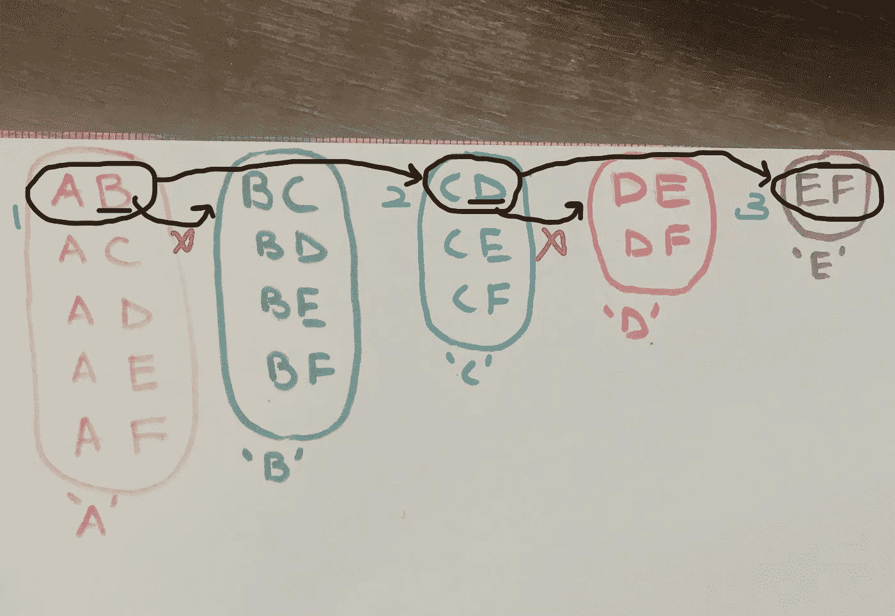
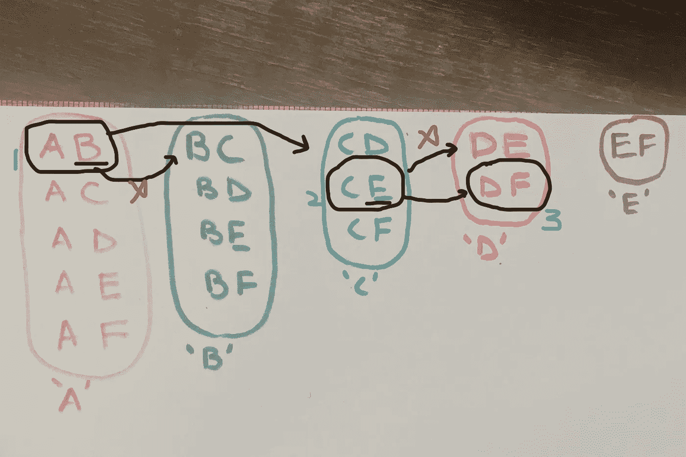
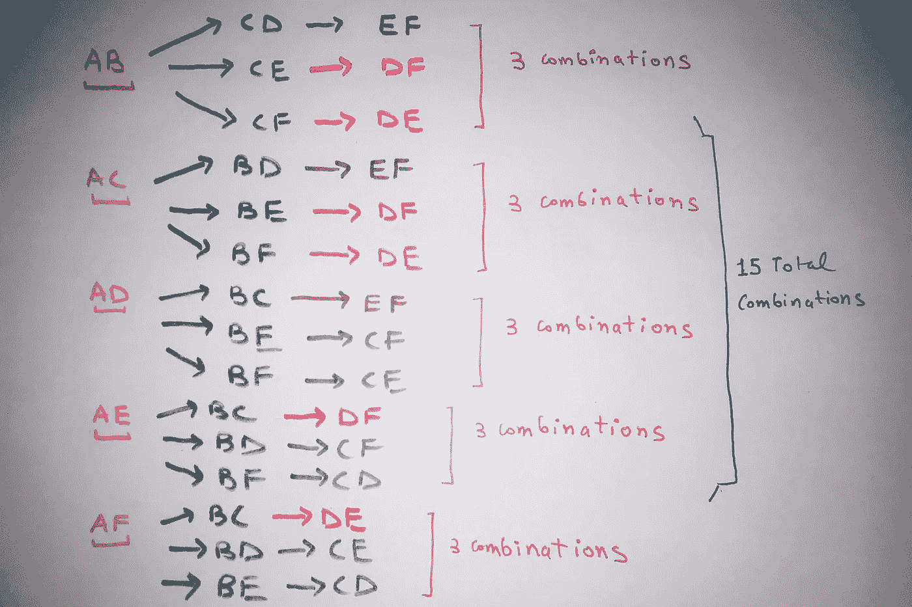
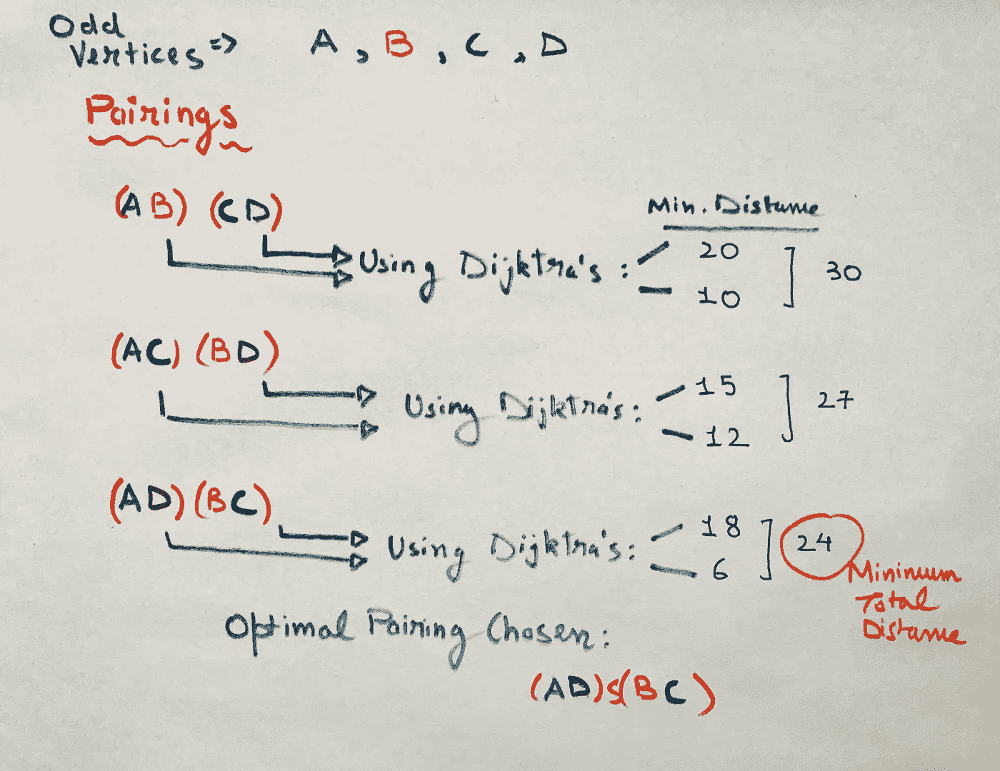
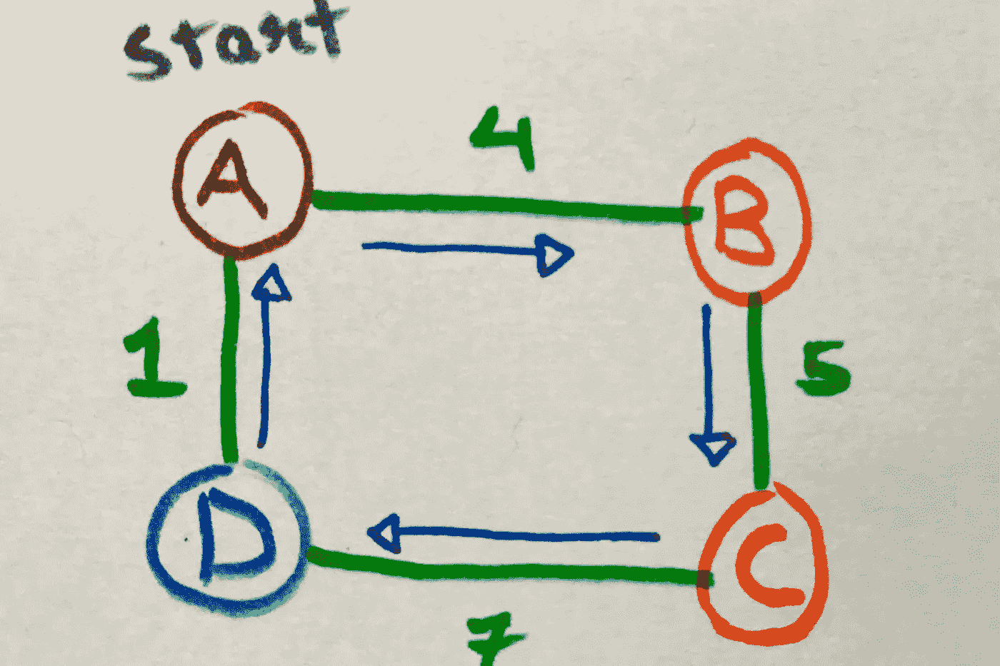
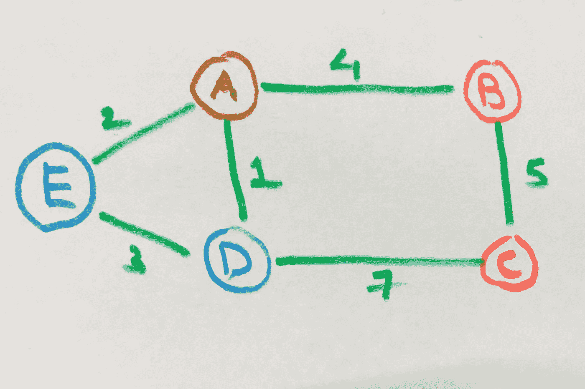
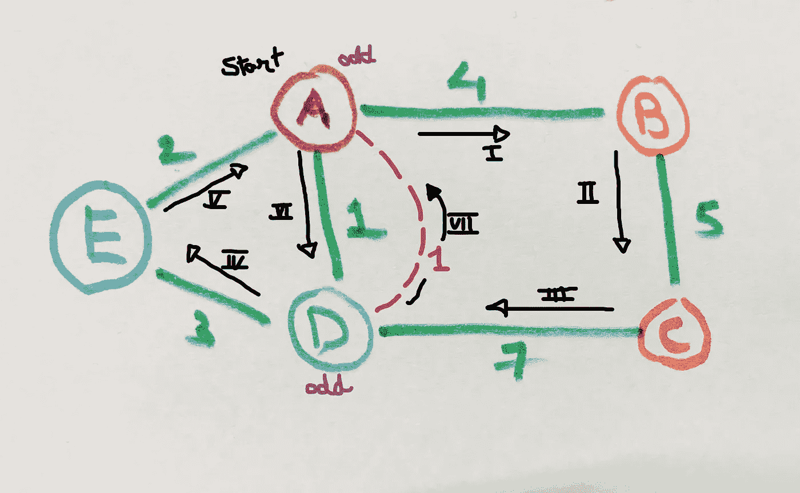

# 穿蟒蛇皮的中国邮递员

> 原文：<https://towardsdatascience.com/chinese-postman-in-python-8b1187a3e5a?source=collection_archive---------15----------------------->

## 详细的实现和解释，特别强调使用递归生成奇数顶点对的独特方法

由[梅森 B.](https://unsplash.com/@masoncbjpg?utm_source=medium&utm_medium=referral) 在 [Unsplash](https://unsplash.com?utm_source=medium&utm_medium=referral) 上拍摄的照片

今天，我将解释并实现流行的“中国邮递员”算法。

为了方便读者，本文分为以下几个部分，建议按顺序浏览所有部分。

*   [A .动机](#b11e)
*   [B .算法，先决条件&假设](#ffa9)
*   [C .实施](#2373)
*   [D .为什么会这样？](#25ac)
*   [E .最终代码和参考文献](#cf3b)

# 动机

中国邮递员问题最早是由中国数学家关美子在 20 世纪 60 年代初研究的。他提出了这样一个问题，如果一个邮递员(在他的情况下是一个中国邮递员，因此得名:D)希望以尽可能短的距离走遍一个城市的所有街道，投递信件并返回他的邮局。

由于我们生活在互联网时代，电子邮件和即时通讯已经取代了传统的信件，我将修改这个问题，以适应这一代人😃

[杰克·吉塞尔](https://unsplash.com/@jackgisel?utm_source=medium&utm_medium=referral)在 [Unsplash](https://unsplash.com?utm_source=medium&utm_medium=referral) 上的照片

让我们想象一下，你正在一个古老而美丽的城市里度过一个美妙的假期。鉴于目前的情况，我们必须想象这一点，并等到新冠肺炎疫情吹走来尝试这一点。

你想游览这座城市，并成为一名热情的游客，比如说一名摄影师；从您的酒店出发，您希望游览这个城市的每条街道至少一次，然后回到您的酒店。(街头摄影是你的爱好:D)

但是，你要背一个大背包，摄像器材，口粮等。这给你能走多远设置了一个物理限制。而且，你没有世界上所有的时间去蜿蜒曲折，整天不停地游荡，一条一条地寻找所有的街道。(虽然听起来很可爱！)

你想知道完成这次旅行的最小可能距离是多少，以及如何做到这一点？

嗯，读完这篇文章后，你将能够实现一个 python 程序，如果你以图表的形式输入城市地图，它将返回你游览所需的最小距离！

# **算法、前提条件和假设**

就图论而言，问题是简单地找出图中欧拉回路的路径距离。然而，一个图只能有一个欧拉回路(或也称为欧拉圈)，如果它的所有顶点的度数都是偶数。

因此，如果我们有一个所有顶点都是偶数的图，那么图中的欧拉回路将恰好穿过每条边一次。

这涵盖了我们算法的一种情况:如果我们的图有所有偶数顶点，我们只需要返回该图中所有边的权重之和。

但是现在这个世界并不完美，不是吗？找到一个所有顶点都是偶数的城市的图是不太可能的。事实上，人们甚至在他们的考试题中找不到这样的图表，更不用说古代城市了(我也是:D 的学生)

那么，如果一个图有一些奇数个顶点，会发生什么呢？这就是中国邮递员算法的优势所在。

1.  我们找到了图中所有的奇数顶点。

2.确定所有可能的奇数顶点对。

3.对于每一对，我们找到连接奇数顶点和最短可能路径的边。

4.从以上组合中，我们选择总长度最短的一个。

5.我们通过考虑新增加的最短额外边来计算中国邮递员的最小距离。

在我深入每一个步骤之前，我将详细阐述我将详细解释的算法的哪些部分，以及哪些部分是先决条件。

## **先决条件:**

1.  我们将使用 Dijkstra 算法来计算配对之间的最短可能路径。我将在 python 中实现这一点；然而，我不会解释算法本身的细节。
2.  python 数据结构和语法的基础知识，如列表、集合、循环等。
3.  熟悉递归的概念。
4.  熟悉图论的基本概念。
5.  愿意学习！:D

## **详细步骤:**

1.  生成奇数顶点配对:这是通过使用递归的算法来完成的，这是我在第一次解决这个问题时想到的。
2.  从所有组合中选择合适的一个。
3.  所有的计算导致一个中国邮差旅行的最后最小距离。

## **假设:**

1.  我在实现这个算法时考虑了一个连通的、无向的、加权的图，其权重为正。
2.  由于问题陈述通常被解释为寻找路线的最小距离，我认为无向和正加权图的假设是合理的。

**所以现在我们配备了一个算法来获得游览古城的最小距离。我将通过 python 代码块演示每一步，完整的代码将附在最后。请注意，我所做的实现可能不是社区中最有效的，但是，它们反映了一个普通学生编写这个算法:D** 所需的思想和方法

# **实施**

## 该算法的实现遵循以下步骤:

[一、将输入定义为图形](#2fba)

[二。将 Dijkstra 算法实现为一个函数](#402a)

[三世。用函数寻找奇数次顶点](#6ee5)

[四。用递归生成所有奇数顶点对](#aaef)

[五、借助 Dijkstra 函数选择最佳配对](#a8ad)

[六。实现函数以获得所有边的和](#8a5e)

[七。将所有代码块组合在一起](#b051)

[八。给定中国邮递员距离作为图形输入的输出](#0fcf)

## I .将输入定义为图形

我们将一个无向的正加权图作为我们的输入。我们将以列表的形式存储它，如代码块所示。

注意:我们可以在运行时获取用户输入的图形，但是由于逐个输入值会很麻烦，所以我们使用预定义的图形来简化我们的工作😄

如代码块所示，我们将两个图作为输入。

**图形输入:**列表列表

## 将 Dijkstra 算法实现为一个函数

该算法的目标是在图中给定的两个节点之间找到最短的可能路线，从而也找到距离。它属于贪婪算法的范畴，试图通过寻找最近的邻居和自我调整来找到最佳路径。Dijkstra 的唯一主要缺点是当权重为负时它会失败，此时我们使用贝尔曼福特或其他算法来寻找最短路径。

代码块显示了对于一组给定的图的源和目的顶点，实现该算法所采用的方法。要了解有关该算法实现的更多详细信息，请参见参考资料。

**迪杰斯特拉算法** ***作为函数***

## 寻找奇数次顶点

对奇数顶点执行这些步骤的决定取决于我们的图中是否存在奇数顶点这一事实。如果不是，我们可以吃颗定心丸&只返回所有边的权重之和😎否则我们需要叫中国邮递员来支援👊

由于我们的输入图是加权的和无向的，找到每个顶点的度数并不困难。我们只需要计算图中每个节点的非零条目的数量。

为此，我们运行一个简单的嵌套 for 循环，并计算每个顶点的度数。一旦我们有了每个顶点的度数，我们使用列表理解来找到奇数个顶点，并将顶点编号存储在另一个名为 odds 的列表中，这是我们将来需要的。

记住，根据握手定理，输入图中奇数顶点的数量总是偶数。

**在一个列表中得到图的所有奇数顶点**

## IV 生成所有奇数顶点对

这一步通常被认为是该算法中最难实现的部分，需要大量的思考和努力。当我第一次自己解决这个问题时，我花了几乎 3-4 个小时来想出一个算法来生成这些配对！然而，结果是非常令人满意和值得的🔥我鼓励你也这样做，并且考虑一下这一步。如果你有逻辑地思考和进行，你也许能解决这个问题。

**这个算法是我做的，但它可能不是独一无二或原创的，从某种意义上说，有人可能遵循相同的思维过程，并提出了类似的算法。然而，我非常自豪自己有这样的想法，这也是我写这篇文章的原因之一，为了社区的利益，分享我的方法:)**

**直觉和逻辑**

我们的任务是得到所有可能的配对，包括所有奇数顶点。例如，如果奇数顶点是:A，B，C & D，可能的配对是:-

(A，B)和(C，D)

(A，C)和(B，D)

(A，D)和(B，C)

这看起来很简单，但是随着奇数顶点数量的增加，这种组合的数量会呈指数增长。例如，对于 10 个奇数顶点，有 945 种可能的组合！

因此，要解决这个问题，我们必须理性地对待它。如果我们观察这些对是如何被少量顶点组合的，我们可以推广到任意数量的顶点。

参考下面给出的图表。我已经写下了 6 个奇数顶点的所有唯一对:A，B，C，D，E & F。

图 1 作者的图片:这代表了我们如何将所有唯一的顶点对分组

每列包含从 A、B、C、D、E & F 开始的对。现在，任何对的组合都必须包括所有奇数顶点，从 A 到 f。因此，如果我们考虑第一种可能的组合:

*   我们可以结合 AB，
*   那么既然 B 被取->就去 C 列
*   拿 CD
*   那么既然 D 取了->去 E 列
*   拿 EF 来说

所以我们得到了第一个可能的组合:(A，B) & (C，D) & (E，F)

图 2 作者的图片:这是我们如何得到第一个组合的

对于第二种可能的组合:

*   因为 E 列没有剩余的线对，我们回到 C 列
*   现在我们拿 CE
*   现在既然 D 没有被取->去 D
*   因为 E 已经被取了，取 DF

所以我们得到了第二种可能的组合:(A，B) & (C，E) & (D，F)

**图 3 作者图片:这是我们如何得到第二个组合**

我们观察到这里出现了一种模式。如果我们能够以某种方式跟踪我们已经使用过的顶点，那么通过递归，我们可以很容易地得到所有可能的配对组合。请参考下图。在这里，我已经形象化了我们如何通过像树一样递归的每个分支得到所有的组合。我们看到，对于 6 个奇数顶点，我们将得到总共 15 个组合。

**图 4 作者图片:递归树获取所有组合**

**递归代码**

我们首先需要一个函数，它可以按照图 1 所示的顺序给出所有唯一的对。我们定义了一个函数“gen_pairs”，它使用一个简单的嵌套循环来获取所有唯一的对。因为我们希望这些对按照以每个字母开始的列进行分组，所以我们制作了一个 list-> ' pairs '，其中每一列都是一个列表。如代码块中所示，该函数获取包含所有奇数顶点的赔率列表，并返回对。

**生成所有唯一对:**如图- 1 所示

现在我们来看看递归函数。为了构造递归函数，我们总是需要考虑两种情况

基本情况，我们**返回**一些输出，或者停止递归

我们执行一些计算并再次调用函数的一般情况

我们需要两个列表作为递归函数的输入:

1.  ' done ':这将跟踪我们在组合中已经获得的顶点
2.  ' final ':这将存储我们想要生成的所有组合
3.  注意:这些需要从一个递归调用传递到另一个递归调用，不能被覆盖。为了解决这个问题，我使用 slice 操作符在没有引用的情况下复制了它们。Example - val = done[:]

递归将在我们之前生成的“pairs”列表中完成，每次都将通过切分 list -> pairs[1:]来调用该函数

只有当我们最终得到一个组合时，递归才会停止。但是由于组合的结束对可以来自任何列，我们通过匹配组合列表的长度是否等于“顶点数/ 2”来检查这个条件。出现这种情况的原因是，因为我们将有 2 对，所以对的总数将是“顶点数”/2。因此，我们预定义了一个变量“l”，其值为:(len(pairs) + 1)//2

(注意:我们使用 pairs 列表来检查这个条件，因为逻辑是相同的。请随意使用“赔率”来获得此条件)

如代码块中所示，代码是简短的和甜蜜的:D。这种情况下只需检查字母对中的任何字母是否在我们的完成列表中，如果它们不在，那么我们将该字母对视为组合。

**递归函数:**生成所有奇数对

我还附上了这段代码的调试版本，这是我最初在制作这个函数时使用的。如果您想了解函数在每次递归调用时是如何工作的，那么建议删除我的一些注释并运行它。

**递归代码** ***调试版本*** :带注释我原来用来测试代码的

## 借助 Dijkstra 的帮助选择最佳配对

首先，如果你已经走到这一步，那么我对你的努力表示赞赏，我也有一些好消息要告诉你。所有繁重的工作都完成了！🎊

我们现在寻求配对，其中配对之间的总距离最小。例如，如果我们有奇数个顶点:A，B，C & D

*   我们取每一个可能的配对，并计算该配对中每一对之间的总距离，加上该配对的总距离。这听起来很难理解，但是很容易理解和实现
*   举个例子，我们来看配对:(AB) & (CD):

使用 Dijkstra 的，让我们说 A & B 之间的最小距离是:20

使用 Dijkstra 的，让我们说 C & D 之间的最小距离是:10

那么这个配对的总距离是:20 + 10 = 30

*   我们对(AC)和(BD)以及(AD)和(BC)重复这个过程
*   我们从所有 3 个配对中选择距离最小的配对作为我们的最佳配对

下图也说明了这一点。(所有值都是随机考虑的，以演示该过程)

**图 5 作者图片:如何使用 Dijkstra 选择最佳配对**

这在下面的代码块中实现。我们将所有的距离存储在一个列表中，并获取其中的最小值作为完成中国邮递员距离所需的额外距离

**选择与 Dijkstra 的最佳配对**

## VI 函数获得所有边的和

下面的代码块使用简单的嵌套循环来获得所有边的权重之和。我们将需要这个来获得输入图的权重和，这将加上由最小奇数配对计算的额外距离。

**获取所有边总和的函数**

## VII 组合所有代码块

恭喜你！你坚持到了最后😃剩下的就是在一个函数中调用&使用我们写的所有函数。请记住，我们需要考虑输入图的两种情况:

如果所有顶点都是偶数:我们返回中国邮递员距离作为所有权重的和

如果有奇数个顶点:我们计算奇数对，从最优顶点得到最小距离，并把它加到所有权重的和上

## 第八卷最后的中国邮递员距离

下面的代码块具有最终编译的函数，当使用图形调用该函数时，将返回遍历图形所有边至少一次所需的最小距离，并返回到起始顶点。

**最终编译函数**

# **为什么会这样**

现在，你将成功地从上面的代码中找到中国邮递员的距离。然而，有些疑问可能会萦绕在你的脑海中，比如这在❔实际上是如何运作的

下图是一个简单的图，所有的顶点都是偶数。图中的欧拉回路沿着箭头方向，从 A -> B -> C -> D -> A。我们看到，为了能够访问所有边至少一次，并返回到起始顶点，我们需要经过的最小距离与所有边的权重之和相同。

**图 6 作者图片:所有顶点都是偶数的图**

现在考虑下图所示的图表的附加内容。现在我们有两个奇数顶点。因为这里唯一可用的配对是 AD，所以我们得到它们之间的最小距离作为最小配对距离。

**图 7 作者图片:修改后的奇数顶点图**

现在，为了形象化我们是如何完成旅程的，让我们沿着所选配对广告之间的最短距离添加一条新边

**图 8 作者图片:应用中国邮递员，我们添加一条新的边得到欧拉回路**

我们看到这条边会使图中所有的顶点都是偶数。现在，如果我们在这里考虑欧拉回路，我们会看到，我们需要穿越这个新的边缘，回到我们的出发点。因此，中国邮递员的总最小距离是原始图的所有权重之和，加上添加的边的权重。这正是我们的代码所做的，不需要显式地添加边。

所以上面的图传达了中国邮递员算法背后的光辉！

现在你可以访问世界上的任何一个城市，把它的地图做成图表，输入到你的代码中，就可以得到“中国邮差之旅”:D 所需的最短距离

安妮·斯普拉特在 [Unsplash](https://unsplash.com?utm_source=medium&utm_medium=referral) 上拍摄的照片

# **最终代码和参考文献**

附上实现中国邮递员算法的完整代码。如果你还想要最小距离的路径，那么你可以看看 Fleury 的算法，它可以用来在修改后的图形中显示欧拉回路。

**作者写的实现中国邮递员的完整代码**

我非常感谢我的大学图论教授 Surabhi Narayan 博士，他教会了我这些概念，激发了我对:D 这个领域的兴趣

我希望您喜欢这篇文章，并且现在已经准备好自己实现这个算法了！

下面是一些参考资料，可以阅读更多关于中国邮递员算法和 Dijkstra 算法的内容。

1.[https://www . geeks forgeeks . org/Chinese-postman-route-inspection-set-1-introduction/](https://www.geeksforgeeks.org/chinese-postman-route-inspection-set-1-introduction/)

2.https://en.wikipedia.org/wiki/Route_inspection_problem

3.【https://www.youtube.com/watch?v=XB4MIexjvY0 

4.[https://www . geeks forgeeks . org/dijkstras-shortest-path-algorithm-greedy-algo-7/](https://www.geeksforgeeks.org/dijkstras-shortest-path-algorithm-greedy-algo-7/)

马特·拉格兰在 [Unsplash](https://unsplash.com?utm_source=medium&utm_medium=referral) 上拍摄的照片