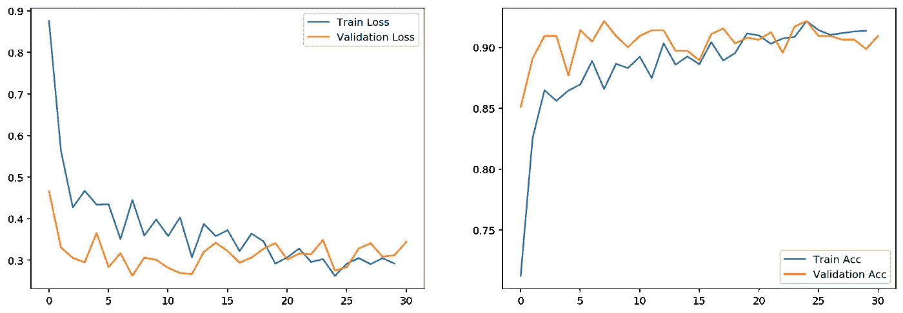

# Pytorch 挑战中国十二生肖分类

> 原文：<https://towardsdatascience.com/chinese-zodiac-sign-classification-challenge-with-pytorch-d89a8897d00b?source=collection_archive---------13----------------------->

在贝塔斯曼 AI Udacity 奖学金(Bertelsmann AI Udacity Scholarship)中，学者们不仅要完成 AI uda city 课程，而且还要相互挑战，以应用他们在课程期间收集和实践的技能和知识。这些挑战之一是中国十二生肖分类挑战。在，你知道，中国农历新年的时候。

[来源](https://www.farmersalmanac.com/)

中国的十二生肖被分为十二个年度周期，每一年都由一种特定的动物来标识。

我认为这将是一个有趣的挑战，所以我一头扎了进去。

对于那些想尝试这个挑战的人，你可以在这里得到数据[。](https://drive.google.com/file/d/1Bjope31ZX9p4jXyaYK6CazIOGcYhOjI6/view)

# 设置环境

最重要的是。使用 GPU 会使任务更容易，所以我尝试使用 Google Colab 和 Kaggle Notebook 来构建这个模型。但是因为我喜欢能够编辑(添加、更改、移动或删除)我的数据，我更喜欢使用 Google Colab，因为数据存储在我的 Google Drive 中。

[来源](https://medium.com/@bhadreshpsavani/how-to-use-kaggle-dataset-on-google-colab-910164234d05)

# 加载并检查数据

我们有 12 类图像，我们希望我们的 Pytorch 模型进行分类。将数据分为三组是一个好主意——训练数据，用于训练我们的模型；验证和测试数据，用于确保我们的模型不会过度拟合。

我们先来看看这些数据的分布情况。

十二生肖图像分布

好的，所以对于每个训练，我们有 600 个训练图像(一个是`goat`的缩写)，54 个验证图像(一个是`goat`的额外图像，这可能是因为一个图像放错了位置)，以及 54-55 个测试图像。

我觉得不错。

让我们来看看这些图片的样本。

样本图像

我也觉得不错。我们还可以看到，我们正在纳入绘图图像以及(因为龙并不存在)。

# 使用 Pytorch 创建模型

Pytorch(以及其他机器学习/深度学习框架)的一个好处是，它为我们提供了简化的样板代码。其中之一是加载列车值测试数据。

现在来建立模型。

我将使用预训练的 Resnet34 模型来转移它的学习，以构建这个分类模型。我还尝试了其他预训练的模型，如 Resnet101 和 VGG 19 与 BatchNorm，但 Resnet34 给我一个相当好的性能，所以我要用它。Resnet34 要求输入图像的宽度和高度为 224。

全模型架构如下。

这里我不会用什么很复杂的东西。只有两个额外的 FC 层，每个层有 512 个神经元，一个输出层有 12 个神经元(当然，每个十二星座类一个)。

**训练模型**

现在是第一个令人兴奋的部分，训练模型。

我们只需要迭代训练数据加载器，同时(a)对模型进行向前和向后传递，以及(b)测量模型的当前/运行性能。我选择每 100 个小批量做点(b)。

我选择在 7-15 个时期内训练模型。你会在下面的图表中看到原因。

训练和验证损失和精确度(Resnet50 try 1)

在每 100 次迷你批次传递中，该模型在训练数据集上肯定会随着时间而改进。但是当我们查看验证数据集的性能时，它似乎并没有提高太多(虽然随着时间的推移，准确性似乎提高了一点点，但我认为这还不够)。

但是当我们看一看具有不同架构的其他模型时，同样的事情发生了。

训练和验证损失和精确度(Resnet50 try 2)

培训和验证损失和准确性(VGG 协议 19 和批次标准)

第二个模型是 Resnet50，除了我把学习率从 0.001 改为 0.003 之外，与第一个模型基本相同。三是使用 VGG 19，批量常模，学习率 0.001。

三个不同的模型+参数讲述了相同的故事——在多个历元之后，验证的准确性性能并没有像训练一样显著提高(特别是对于最后两个模型)。

我们并不太关心模型的损失，因为这是对模型表现的“自信”程度的衡量，我们更关注准确性。

# 测试模型

让我们看看模型实际上是好的，还是满足测试数据集。

*   ResNet (lr 0.001) —损失:0.355 acc: 90.5%
*   ResNet (lr 0.003) —损失:0.385 acc: 90.6%
*   VGG 19 批次标准—损失:0.586 acc: 90.8%

从精确度来看，它们基本相同。对于损失，具有 0.001 lr 的 ResNet 至高无上。这些数字与我们的训练和验证几乎相同，所以我们可以说我们的模型没有过度拟合(或者至少我们在它与我们的小纪元发生之前停止了它)，并且在分类中国十二生肖方面工作得相当好。

我很好奇，哪张图片的问题最大。

混淆矩阵

喜欢混乱矩阵中的数字。

我们可以看到，模型很少会弄错一个`goat`，如果弄错了，也总是带着`ox`(喇叭)。

被模特误认为是公牛的山羊图像

我们还可以看到，这个模型在区分`dragon`和其他星座时有一点困难。最显著的是`oxes` (角)和`snake`(身体)。

# 最后的话

在贝塔斯曼 AI Udacity 奖学金期间参加中国十二生肖分类挑战赛非常棒，令人耳目一新。它推动并激励我做我热爱的事情——在人工智能/机器学习/深度学习领域进行实验和建设。

更多的挑战会到来，我已经等不及了。

你可以在我的 [Github 页面](https://github.com/mrakelinggar/zodiac_animal_classification)查看我的笔记本。请回顾并关注:)