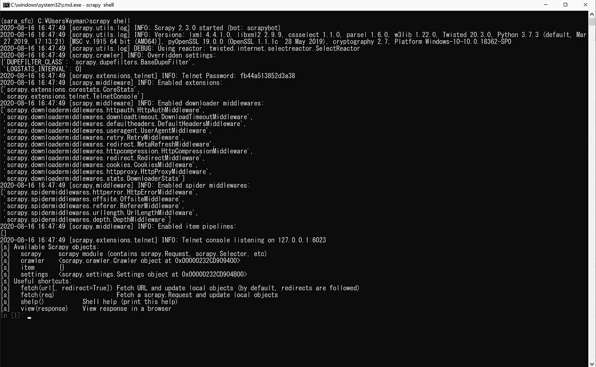

# 为您的应用选择最佳的 Python Web 抓取库

> 原文：<https://towardsdatascience.com/choose-the-best-python-web-scraping-library-for-your-application-91a68bc81c4f?source=collection_archive---------1----------------------->

## 前 5 个库的概述以及何时使用它们。


由[法扎德·纳兹菲](https://unsplash.com/@euwars?utm_source=medium&utm_medium=referral)在 [Unsplash](https://unsplash.com?utm_source=medium&utm_medium=referral) 上拍摄的照片

生活在当今世界，我们被周围不同的数据所包围。在我们的项目中收集和使用这些数据的能力是每个数据科学家必备的技能。

关于如何使用特定的 Python 库来获取在线数据，网上有很多教程。然而，您很少能找到为您的特定应用程序选择最佳库的教程。

Python 提供了各种可以用来抓取 web 的库，如 Scrapy、Beautiful Soup、Requests、Urllib 和 Selenium。考虑到 Python 有多受欢迎，我很确定会有更多的库存在，并且很快会有更多的库发布。

在这篇文章中，我将涵盖我刚刚提到的 5 个库，将对它们中的每一个进行概述，例如，代码以及它们中的每一个的最佳应用和案例。

对于本文的其余部分，我将使用包含书籍的这个[沙盒网站来解释每个库的具体方面。](http://books.toscrape.com/)

# 1.Scrapy

Scrapy 是目前最流行的 Python web 废弃库之一。它是一个开源框架。这意味着它甚至不是一个图书馆；它是一个相当完整的工具，你可以用它系统地在网络上抓取和爬行。

Scrapy 最初被设计用来构建可以自己爬网的网络蜘蛛。它可以用于监控和挖掘数据，以及自动化和系统化的测试。

与其他抓取网页的 Python 方法相比，它的 CPU 和内存效率也很高。使用 Scrapy 的缺点是，安装它并在你的设备上正常工作可能有点麻烦。

## 概述和安装

要开始使用 Scrapy，您需要确保您运行的是 Python 3 或更高版本。要安装 Scrapy，你可以简单地在终端中写下下面的命令。

```
pip install scrapy
```

Scrapy 成功安装后，您可以通过键入以下命令来运行 Scrapy shell:

```
scrapy shell
```

当您运行此命令时，您会看到类似这样的内容:



作者截图

您可以使用 Scrapy shell 运行简单的命令，例如，您可以使用`fetch`函数获取网站的 HTML 内容。所以，假设我想获取[这个](http://books.toscrape.com/)图书网站；我可以在 shell 中简单地实现它。


```
fetch("[http://books.toscrape.com/](http://books.toscrape.com/)")
```

现在，您可以使用`view`函数在默认浏览器中打开这个 HTML 文件。或者你可以直接打印出页面的 HTML 源代码。

```
view(response)
print(response.text)
```

当然，你不会仅仅为了在浏览器中打开一个网站而吓到它。您可能希望从 HTML 文本中获得一些特定的信息。这是使用 *CSS 选择器完成的。*

在开始之前，您需要检查要获取的网页的结构，以便使用正确的 CSS 选择器。

## 何时使用 Scarpy？

使用 Scrapy 的最佳情况是当你想做大规模的网络抓取或者自动化多个测试的时候。Scrapy 的结构非常好，它允许更好的灵活性和对特定应用程序的适应性。此外，Scrapy 项目的组织方式使得维护和扩展更加容易。

我建议你避免使用 Scrapy，如果你有一个小项目，或者你想抓取一个或几个网页。在这种情况下，Scarpy 会使事情变得过于复杂，而不会带来额外的好处。

# 2.要求

[Requests](https://requests.readthedocs.io/en/master/) 是你可以使用的最简单的 HTTP 库。 *Requests* 允许用户向 HTTP 服务器发送请求，并以 HTML 或 JSON 响应的形式获得响应。它还允许用户向服务器发送 POST 请求来修改或添加一些内容。

请求展示了使用设计良好的高级抽象 API 所能获得的真正力量。

## 概述和安装

*请求*通常包含在 Python 的内置库中。但是，如果由于某种原因您不能立即导入它，您可以使用 pip 轻松安装它。

```
pip install requests
```

您可以使用请求来获取和清理组织良好的 API 响应。例如，假设我想在 OMDB 的数据库中查找一部电影。请求允许我向 API 发送一个电影名称，清理响应，并在不到 10 行的代码中打印出来——如果我们省略注释的话😄。

## 何时使用请求？

*Requests* 是您开始网络抓取时的理想选择，并且您有一个 API tp 联系人。它很简单，不需要太多的练习就能掌握使用。*请求*也不需要你手动添加查询字符串到你的 URL。最后，它有一个写得非常好的文档，并支持整个 restful API 及其所有方法(PUT、GET、DELETE 和 POST)。

如果您尝试或期望的网页包含 JavaScrip 内容，请避免使用请求。则响应可能无法解析正确的信息。

# 3.Urllib

Urllib 是一个 Python 库，允许开发者打开并解析来自 HTTP 或 FTP 协议的信息。Urllib 提供了一些处理和打开 URL 的功能，即:

*   **urllib.request:** 打开并读取 URL。
*   **urllib.error:** 捕获 urllib.request 引发的异常。
*   **urllib.parse:** 解析 URL。
*   **urllib.robotparser:** 解析 robots.txt 文件。

## 概述和安装

好消息是，您不需要安装 Urllib，因为它是内置 Python 库的一部分。然而，在一些罕见的情况下，您可能在 Python 包中找不到 Urllib。如果是这种情况，只需使用 pip 安装即可。

```
pip install urllib
```

可以使用 Urllib 来探索和解析网站；然而，它不会给你提供太多的功能。

## 何时使用 Urllib？

Urllib 比*请求稍微复杂一点；然而*，如果你想更好地控制你的请求，那么 Urllib 是一个不错的选择。

# 4.美味的汤

[美汤](https://www.crummy.com/software/BeautifulSoup/bs4/doc/)是一个 Python 库，用来从 XML 和 HTML 文件中提取信息。美汤被认为是一个解析器库。解析器帮助程序员从 HTML 文件中获取数据。如果解析器不存在，我们可能会使用正则表达式从文本中匹配和获取模式，这不是一种有效或可维护的方法。

幸运的是，我们不需要这样做，因为我们有解析器！

Beautiful Soup 的优势之一是它能够检测页面编码，从而从 HTML 文本中获得更准确的信息。美丽的汤的另一个优点是它的简单和容易。

## 概述和安装

安装美丽的汤是非常简单和直接的。您所要做的就是在终端中键入以下内容。

```
pip install beautifulsoup4
```

就是这样！你可以开始刮了。

现在，Beautiful Soup 是我们刚刚提到的一个解析器，这意味着我们需要首先获取 HTML，然后使用 Beautiful Soup 从其中提取我们需要的信息。我们可以使用 *Urllib* 或 *Requests* 从网页中获取 HTML 文本，然后使用 Beautiful Soup 来清理它。

回到之前的网页，我们可以使用*请求*获取网页的 HTML 源代码，然后使用 Beautiful Soup 获取页面中< a >内的所有链接。我们只需要几行代码就可以做到。

## 什么时候用美人汤？

如果你刚开始学习 webs scarping 或 Python，Beautiful Soup 是最好的选择。此外，如果您将要抓取的文档不是结构化的，那么 Beautiful Soup 将是您的最佳选择。

如果你正在建立一个大项目，美丽的汤将不会是明智的选择。漂亮的汤项目不灵活，随着项目规模的增大，很难维护。

# 5.硒

Selenium 是一个开源的基于网络的工具。Selenium 是一个网络驱动程序，这意味着你可以用它打开网页，点击一个按钮，然后得到结果。它是一个主要用 Java 编写的自动化测试的强大工具。

尽管 Selenium 很强大，但它是一个初学者友好的工具，不需要很高的学习曲线。它还允许代码模仿人类行为，这在自动化测试中是必须的。

## 概述和安装

要安装 Selenium，只需在终端中使用 pip 命令。

```
pip install selenium
```

如果您想获得 Selenium 的全部功能——您很可能会这样做——您需要安装一个 Selenium WebDriver，以真实用户的身份在本地或远程设备上驱动浏览器。

您可以使用 Selenium 自动登录 Twitter——或者脸书或任何网站，真的。

## 什么时候用硒？

如果您是 web 抓取游戏的新手，但是您需要一个可扩展且灵活的强大工具，Selenium 是最佳选择。此外，如果您想浏览几页，这是一个很好的选择，但是您需要的信息在 JavaScript 中。

为您的项目使用正确的库可以节省您大量的时间和精力，这对项目的成功至关重要。

作为一名数据科学家，您可能会遇到所有这些库，在您的旅程中可能会遇到更多，在我看来，这是了解每个库的优缺点的唯一方法。这样做，你将会发展出一种第六感来引导你在未来的项目中选择和使用最好的库。