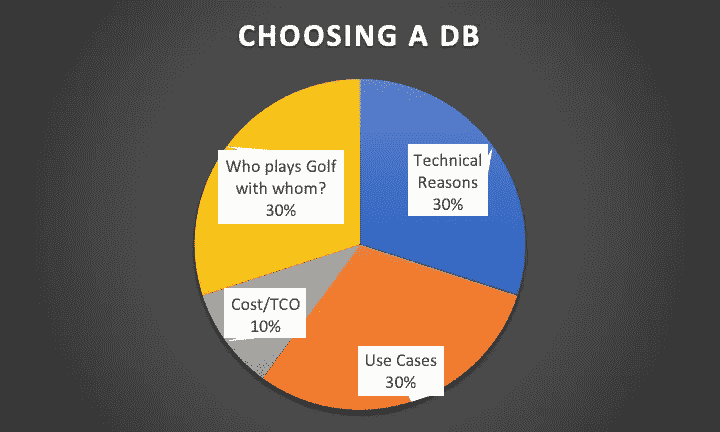
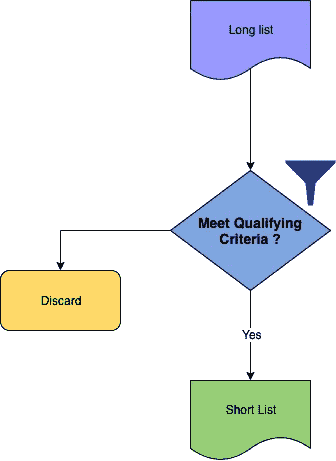
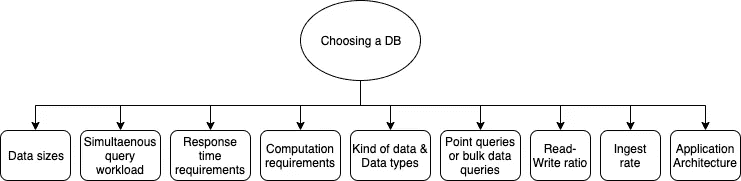
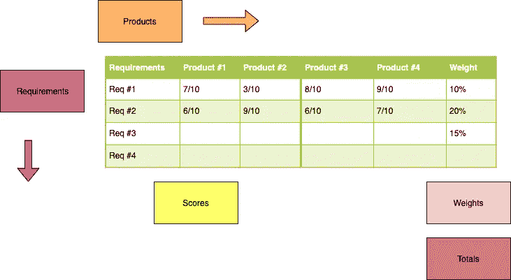

# 选择数据库技术

> 原文：<https://towardsdatascience.com/choosing-a-database-technology-d7f5a61d1e98?source=collection_archive---------18----------------------->

## 路线图和流程概述

奥利弗·鲁斯在 [Unsplash](https://unsplash.com/s/photos/fork-in-the-road?utm_source=unsplash&utm_medium=referral&utm_content=creditCopyText) 上拍摄的照片

选择数据库是数据架构师最近享受的一种奢侈。在过去，最常见的是，这是一个先前做出的决定，是一个需要接受的决定。责任、存储过程代码和太脆弱的数据管道带来了巨大的负担，每个人都不敢重新设计它们，因为害怕会损坏。数据库通常在应用程序之间共享，或者在许多情况下，功能是单个应用程序的模块。

现在，在多应用程序和多数据库的世界中，在一些作者称之为多语言持久性的世界中，情况有所不同。

大多数云提供商都有自己的技术，他们试图根据用例将用户引导到正确的数据库。

下面是我关于如何在数据库世界中做出技术选择的路线图。在某些情况下，您还可以扩展该方法来涵盖一般的技术选择。

# 这样的选择究竟是如何做出的？

根据我的经验，现实生活中做出这种决定的大致比例如下:

如何选择一个数据库？

*   技术原因:30%
*   用例适合度:30%
*   成本/总拥有成本/更换成本或实施成本:10%
*   利益相关者驱动(或者叫做“谁和谁打高尔夫？”): 30%.决策是由利益相关者的网络效应、与供应商的关系驱动的因素、销售人员、上级组织联系、共同投资者、交换交易和其他商业活动决定的。

# 选择和入围的过程

选择过程，从一个长名单开始，缩小到一个短名单

## **从候选人名单开始——一个“长名单”**

*   作为一名顾问，您将从自己的经验、团队成员的经验、客户 IT 团队推荐的名字以及对 Gartner、Forrester、Bloor Research 和其他公司报告的研究中收集一份清单。
*   分析产品文献、特性和局限性
*   看看“民间讨论”发生的来源——论坛、stackoverflow、slashdot、reddit(！)，github 问题，bug 报告
*   寻找独立的测试和排名( [Jepsen](https://jepsen.io/analyses) 、 [db-engines](https://db-engines.com/en/) 和类似的来源)

## **定义一个合格标准**。不符合资格标准将会取消选择。

作为数据库选择基础的能力和特征

技术能力、特性和非功能性需求

*   NFRs 或“完整性”要求，如可扩展性、容量、可恢复性、耐用性。
*   上面给出了一些选择参数，以及与该参数相关的一些候选参数
*   数据大小— MBs、GBs、TBs、PBs — SQLite、MySQL、PostgreSQL、Oracle、Teradata、AWS 红移
*   大量并发用户—使用缓存、Redis、DynamoDB
*   快速响应时间要求— ElasticSearch，MemSQL
*   计算量大(矩阵计算、Python/R 集成)— SQL Server 与 R、存储过程
*   文档数据(JSON)、地理数据(GIS)、时间数据、多媒体数据—适合数据存储格式的数据库— MongoDB、PostGIS、TICK stack
*   点查询或批量数据查询— Redis、键值存储、雪花、Google Cloud SQL
*   平衡的读写，主要是读，主要是写，事务和分析处理— OLTP(在线事务处理)，OLAP(在线分析处理)，HTAP(混合事务和分析处理)
*   大量数据的快速接收、涓滴流、计划作业、数据湖(Cassandra、Kafka、Spark、Presto)
*   微服务 v/s 整体架构、ACID 要求、最终一致性要求

用例及适用性

*   现有的编程语言投资(Java，。NET)、市场上托管服务的可用性或技能可用性，以了解和管理技术的复杂性、云可用性、法律或地理或合同限制
*   在数据存储和处理以及数据库(如 Oracle 数据库云服务器或 Teradata)方面的现有投资
*   由云提供商提供的数据库，确保与云生态系统的良好集成，统一或相似的 API，以及相同的 DevOps 工具。
*   成本/总体拥有成本或实施/迁移成本

## **候选名单**

从候选名单中剔除不符合资格标准的候选人后剩下的名单。

# 产生了最终的竞争者

接下来，一个非常详细的需求列表(包括技术、成本、用例以及适用性)和评分标准被制定出来。通常这是在以下格式的电子表格中完成的。

评分和加权要求

它总是有助于记录为什么分配一个特定的分数，或者为什么分配或调整一个权重。我可以向您保证，这样一个带注释的文档将在组织中被多次引用，因为注释和指定的分数一样有价值。

与客户的最终讨论总是在电子表格的基础上进行，客户及其技术、业务和 IT 团队可以对权重进行权衡和调整。

在这个过程的最后，通常会有 1-2 名候选人脱颖而出。

根据我的经验，在入围过程中，或者在前 2-3 名的选择之后，需要一个结构化的 PoC，以确保文档中的声明是真实的，并且可以解决提到的限制。

# 混合数据库架构的案例

每个数据库都有一些核心特性，以及一些为了“打勾”而添加的特性。这里的危险是，随着时间的推移，这些“其他”功能会被放弃，因为它们没有得到应有的关注。

数据库也不能孤立地考虑，而是要放在为请求服务的能力、应用程序架构和整个数据流的业务用例的整体环境中考虑。

出于上述原因，为了获得最佳性能，有时使用专门的数据处理组件比使用一个数据库来处理所有请求更有意义。

在这里，您可以看到 SAS Grid 等技术、SciDB 等专用数据处理平台或 Intersystems Cache shine。

在某些方面，Hadoop 堆栈(文件存储、Hive 元数据存储、HBase、Impala)或各种 Spark 组件(GraphX、Spark SQL、Spark streaming、Mlib)也是一种混合 DB 架构。

# 共享数据库的使用和集成需求

通用数据库仍然满足大多数需求。然而，正在发生变化的是数据库使用的共享模式。

以前，销售和营销、交易、财务和会计以及服务应用程序都将数据存储在同一个数据存储中(可能是相同的模式，也可能是不同的模式)。考虑到数据量小、许可成本高、DBA 预算有限，这是有意义的。它确实提供了单一存储位置、更少的模式差异和更低的复杂性的优势。

现在，每个应用程序都有单独的数据存储和数据库。数据鸿沟增加了。随着这种分离，集成需求增加了。公共数据和主数据的维护也有所增加。分析层现在使用来自所有这些不同数据源的数据。API 提供了应用程序之间的集成。企业应用程序集成(EAI)和提取-转换-加载或提取-加载-转换(ETL/ELT)的双重性，以及两者的重叠角色增加了，两者混合使用，导致了更大的复杂性，有时会导致更多的成本和开销。

# 结论

作为数据架构师，做出正确的技术选择非常重要。平衡适用性需求、降低运营和集成的复杂性和成本的需求，以及防止堆栈失控和激增的需求。使用正确的数据库和数据存储的案例应该只针对正确的应用程序和用例。

# 参考

m .福勒(2011 年 11 月 16 日)。bliki:多语种持久性。从[https://martinfowler.com/bliki/PolyglotPersistence.html](https://martinfowler.com/bliki/PolyglotPersistence.html)取回