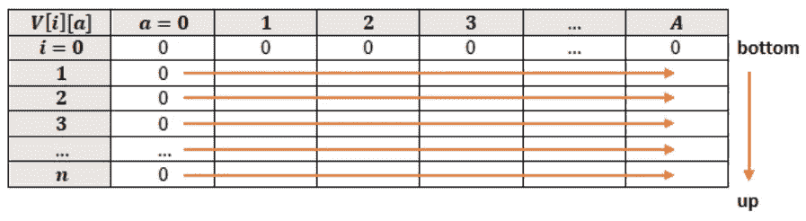
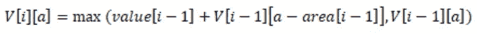
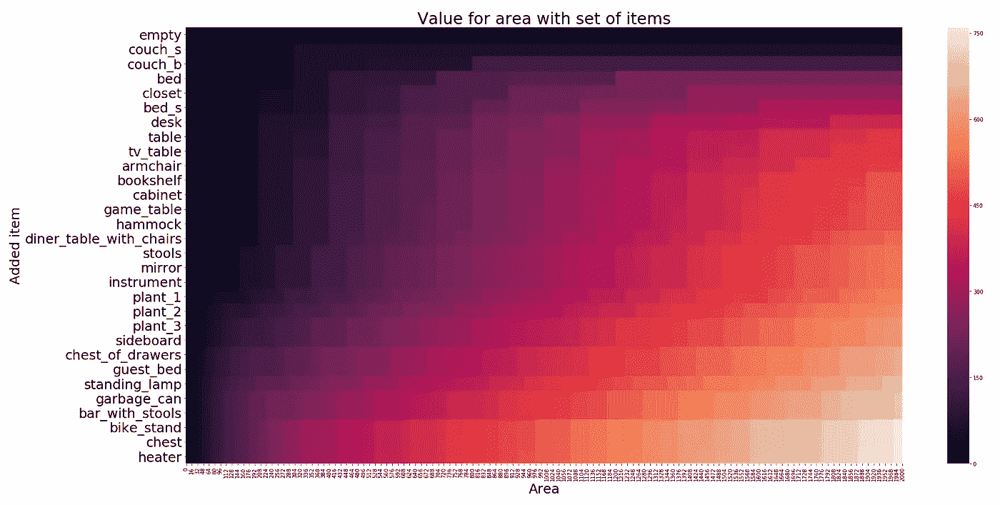

# 用动态规划快速选择

> 原文：<https://towardsdatascience.com/choosing-fast-with-dynamic-programming-b6916da543f4?source=collection_archive---------25----------------------->

## 用真实世界的例子和 Python 代码简单解释背包问题。


马丁·范·登·霍维尔在 [Unsplash](https://unsplash.com?utm_source=medium&utm_medium=referral) 上的照片

**终于到了，你要搬到三藩市成为一名著名的数据科学家了！你将在一家大公司工作，很快就会出名！但是，首先。你将住在一个小公寓里，比你现在在山谷里的房子要小得多。所以你必须决定带走哪些东西。因为你是一个数据科学家，你会以一种聪明而有效的方式来决定这件事。让我们找到最优解！**

# 问题描述

目前你的房子是 100 平方米。你的东西所占的面积是 50 平方米。你的新公寓有 40 平方米，你希望你的东西最多占 20 平方米，因为你喜欢在地板上有一些自由空间。你以一种方式列出你的物品，你给它们分配它们占据的区域和它们给你的生活增加的价值。你的目标是最大化这 20 平方米的价值。

## 项目

你开始列出你的物品。你可以指定面积(以平方分米为单位)以及物品给你的生活带来的价值(从 0 到 100)。您最终得到了下面这本包含 29 个条目的字典:

好吧！例如，床占 4 平方米(= 400 平方分米)，它给你的生活增加的价值是 100，游戏桌占 1.5 平方米，增加的价值是 30。

## 价值最大化

你如何最大限度地利用这本词典？您可以尝试所有可能的组合，并计算每个组合的总值。通过为 20 平方米的最大面积选择最大值，您将获得最佳解决方案。一个问题，这 29 个项目给了 2 个⁹选择项目的可能组合！超过 5.36 亿了！那需要一些时间！

你想想其他的选择。如果你从给你的生活增加最大价值的物品开始，然后是第二高价值的物品，以此类推，直到 20 平方米都满了，会怎么样？这又简单又快捷！但是它会给出最优解吗？你怀疑。如何快速解决问题，获得最佳解？

*注:上面提到的算法分别叫做* [*蛮力*](https://en.wikipedia.org/wiki/Brute-force_search) *和* [*贪婪*](https://en.wikipedia.org/wiki/Greedy_algorithm) *。*

# 动态规划

幸运的是，一个朋友告诉你一个更聪明的处理问题的方法。他解释说，你可以用递归的方式把问题分成更小更简单的子问题。如果您将结果存储在记忆表中，您可以快速找到最佳解决方案，因为您可以重复使用这些结果。这样你就用记忆空间换取了时间。所以你从这个方法开始，叫做动态编程。事实上，一个小时后你就解决了这个问题，并且知道了你要把哪些东西带到新家去。

## 动态编程步骤

你需要完成四个步骤来获得你的 SF 公寓的最佳库存清单:

**第一步。用条目及其包含的区域/值创建一个字典。**
这是前面提到的带有条目的 stuffdict(见第一个代码块)。

**第二步。从字典中创建面积和值列表。**
你使用 stuffdict 创建两个带有面积和值的列表。

**第三步。使用这些列表建立记忆表。**
有了面积列表、数值列表、最大面积和项目数，就可以建立记忆表。

**第四步。获取包含在记忆表最后一行中的项目。** 记忆表的最后一行包含最优解。有可能存在多个最优解。例如，当您有两个具有相同面积和价值的项目时，或者当一些项目加起来与另一个项目的面积和价值相同时。

让我们更深入地研究这些步骤，并检查代码。

**第一步。用条目及其包含的区域/值创建一个字典。** 这是包含项目、区域和值的字典:

**第二步。从字典中创建面积和值列表。**
使用 stuffdict 创建两个包含面积和值的列表。为此，您可以使用下面的函数。输入是步骤 1 中的 stuffdict，它返回两个列表:一个包含区域，另一个包含值。

**第三步。使用这些列表建立记忆表。** 现在你将创建记忆表来寻找最优解。您需要步骤二中的面积和值列表，总面积 *A* 和项目总数 *n* 。表格有 *n+1* 行和 *A+1* 列。从第一行开始，零个条目，然后计算每个单元格的值。您将以自下而上的方式逐行执行此操作。数值表 *V* 看起来是这样的:



用代码创建表:

在第二和第三行，表被创建。创建完成后，您将填充表格的每个单元格。第六和第七行显示了基本情况:当面积或项目数为零时，值为零。第八行和第九行的意思是，当当前项的面积小于或等于单元格的面积时，根据以下公式计算单元格的值:



选择当前项目的值加上前一行的值和当前区域减去当前项目的区域之间的最大值(1)，以及前一行的值加上当前单元格的区域(2)。第 10 行和第 11 行的意思是:如果单元格的面积小于当前项目的面积，则您将单元格的值设置为等于具有相同面积的前一行的值。

**第四步。获取包含在记忆表最后一行中的项目。**

你可以使用以下代码找到你的完美家具组合:

此代码返回:

```
['bike_stand', 'garbage_can', 'standing_lamp', 'chest_of_drawers', 'plant_3', 'plant_2', 'diner_table_with_chairs', 'bookshelf', 'armchair', 'table', 'desk', 'bed', 'couch_s']
```

现在你知道你需要带什么了吧！我们搬到旧金山去吧！

*注意:注意，这段代码也返回重复项(面积和值对相同的项)！在这个例子中，情况并非如此。*

# 结论

希望这篇文章能帮助你快速有效地找到最佳解决方案。您可以将面积值对替换为想要优化的其他参数，如权重和值或时间和改进。重要的一点是，通过存储更小的子问题的解，你可以更快地找到最优解，这种技术被称为动态规划。

## 额外收获:记忆表的热图

下面的热图很好地展示了记忆表。在 x 轴上，您可以看到可用的面积(2000 平方分米)。y 轴显示项目列表。您从一个空列表开始，然后开始添加项目。这些颜色代表某个区域内可用项目的总价值。你可以看到当你继续前进时，这个值会变得越来越高。



使用记忆表和 stuffdict 构建该热图的代码:

*别忘了* [*订阅*](https://hennie-de-harder.medium.com/subscribe) *如果你想在我发表新文章时收到电子邮件。*