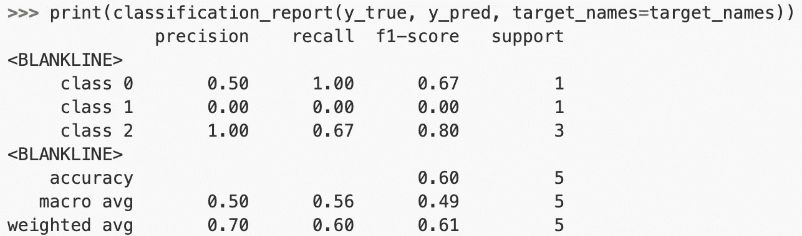
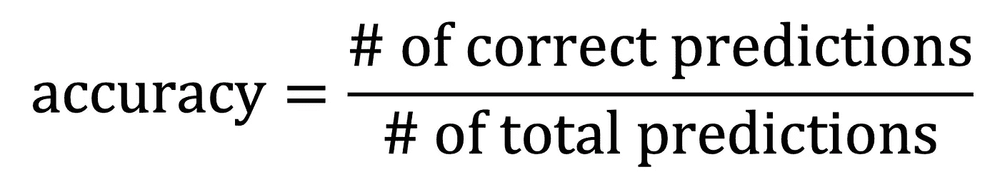
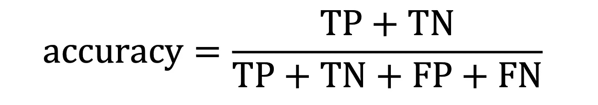
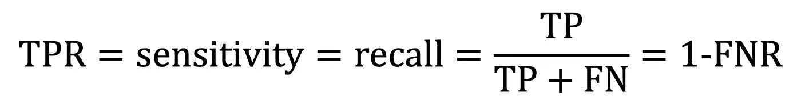
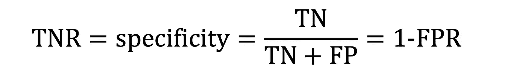
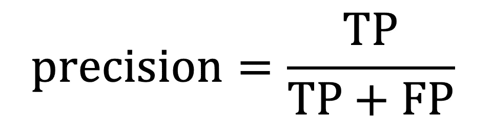
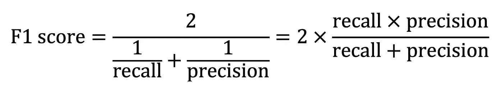
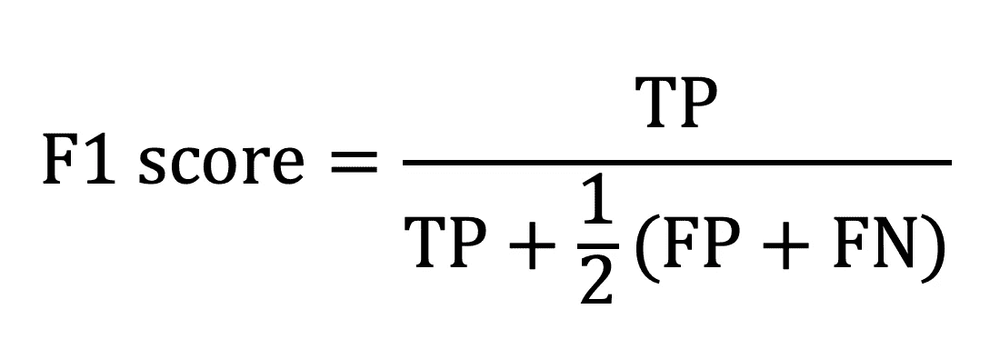
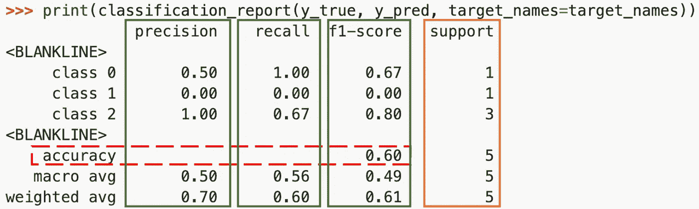

# 选择绩效指标

> 原文：<https://towardsdatascience.com/choosing-performance-metrics-61b40819eae1?source=collection_archive---------11----------------------->

## 准确性、敏感性与特异性、精确性与回忆性以及 F1 分数

[分类 _ 报告](https://scikit-learn.org/stable/modules/generated/sklearn.metrics.classification_report.html)来自 scikit-learn。

准确度、召回率、精确度、F1 分数--如何选择衡量模型性能的指标？一旦你选择了，你想要宏观平均值吗？加权平均？对于这些指标中的每一个，我将更仔细地研究它是什么以及它的最佳用例是什么。我还将介绍如何从 scikit-learn 的`[classification_report](https://scikit-learn.org/stable/modules/generated/sklearn.metrics.classification_report.html)`中读取输出表，如上图所示。

# 准确(性)

我从准确性开始，因为我认为，从它的名字来看，我们觉得我们对它有一个直观的理解，而没有见过任何数学公式。“我们想要一个更准确的模型。”一直都是，我们甚至还没有严格意义上的定义。我确实从项目的准确性开始(现在仍然如此),因为它感觉熟悉而不专业。

从理论上讲，准确性就是预测正确的百分比，用 0 (0%的预测正确)到 1 (100%的预测正确)之间的小数表示。

作者图片

因为预测 TP(真阳性)、FP(假阳性)、TN(真阴性)和 FN(假阴性)对后面的指标很重要，所以让我们继续讨论它们与准确性的关系。

对于二元分类问题。作者图片

举一个例子，如果我们试图将图像分为两类，狗和非狗，我们的模型将只预测 1)图像是狗，在这种情况下它可能是正确的，并且图像确实是狗(TP)，或者不正确的，并且图像不是狗，尽管模型认为它是(FP)；或者 2)模型可以预测图像不是狗，在这种情况下，它可以再次是正确的，并且图像确实不是狗(TN)，或者是不正确的，并且图像实际上是狗，尽管模型认为它不是(FN)。

从上面看，我们可以看出，无论我们使用哪种准确性定义，我们只是将模型正确的预测数除以其预测总数。

对于你遇到的大多数普通的、不复杂的数据集来说，准确性确实是一种“金发姑娘”。**只要类别或多或少是平衡的**(在前面的例子中，狗和非狗图像的数量相等)，准确性在融合特异性和敏感性、召回率和精确度方面做得很好。*特异性*和*灵敏度*在这个例子中本身就是相当*具体的*词语，*回忆*和*精度*也是如此，接下来我们要谈到它们。

# **敏感性(回忆)和特异性**

就像准确性一样，我认为我们已经对特异性和敏感性有了相当直观的理解，或者至少感觉我们有，但现实是它们在统计学领域有一些相当具体的定义。

TPR 代表真阳性率，FNR 代表假阴性率。作者图片

**敏感度**，剧透一下，和**回忆**是同一个东西，也被称为**真阳性率(TPR)** ，用通俗英语来说，就是所有被放入正确箱子的真阳性的分数；在前面的例子中，在*实际上是*的狗的图像中，模型得到了其中的多少部分，并且称之为狗？这个模型在捕捉“是”方面有多好？敏感度/回忆/TPR 就是这么回答的。

你会注意到一些有趣的事情:我们没有包括任何关于非狗的图片。事实上，如果你认真思考上面等式，你会意识到那些非狗或没有图像，以及模型预测或分类它们的成功或失败(TN 和 FP)，根本不会影响灵敏度/回忆。事实上，再举一个早先的例子，一个对每一张图像都预测“是的，狗”的模型将具有完美的灵敏度/回忆/TPR。

这给了 sensitivity/recall/TPR 一个非常具体的用例，它可以归结为:当你所寻找的每一个实例都太珍贵而不能错过时，就使用它。例子包括检测恐怖袭击、检测疾病、检测欺诈等。在每一种情况下，一个以敏感度为中心的模型将捕捉所有真正的恐怖袭击，所有真正的心脏病病例，以及所有真正的欺诈性信用卡购买*，同时警告*它也将提取一些假阳性的实例:将有一些无辜的旅行者，一些健康的人，一些正常的目标购买被检测到。

**特异性**，也称为真阴性率(TNR)，是敏感性的另一面。它关心敏感做的每一件事，但不关心“不”的情况(真的不是狗)。

TNR 为真阴性率，FPR 为假阳性率。作者图片

一个对每一张图像都称之为“不是狗”的模型将具有完美的特异性(因此，灵敏度为 0)。这与敏感性/回忆相反，通常两者之间的选择归结为你关注的是或否。在理想的世界中，你会得到一个在两方面都出色的模型，但有时我们被迫做出选择，特别是在[医疗保健领域，特异性和敏感性之间的区别源于](https://en.wikipedia.org/wiki/Sensitivity_and_specificity#cite_note-1)。

# 召回率和精确度

**回想一下**我们已经讨论过——它是敏感性——和**精确性**,第三方面——万圣节快乐，各位——是这样的:在所有被模型认为是(狗)的东西中，有多少是正确的(真的是狗)？

作者图片

像灵敏度和特异性一样，在计算精度时，有一个模型性能的元素被忽略，但这一次是模型判断为“否”的所有东西被忽略。如果有 1000 张照片，500 张狗的照片，500 张非狗的照片，而模型只正确地分类了 5 只狗，并将其他所有照片都称为非狗，那将是完美的，精度为 1.0(即使分类器错过了 495 张狗的照片)。

那么，Precision 也有一个非常具体的用例。当你想对模型给你的“是”有信心时，就把注意力集中在它上面。当然，它会错过一些是，但它会做什么，如果模型有很好的精度，你可以放心。

# F1 分数

简答， **F1 评分是召回率和准确率的调和平均值，取 0 到 1 之间的值。**

作者图片

当您用它们的 TP/FP/TN/FN 定义替换 recall 和 precision 时，F1 分数的定义如下:

作者图片

也许，你和我一样，从来没有听说过[谐音的意思是](https://en.wikipedia.org/wiki/Harmonic_mean)。[这里有一个很好的视频](https://www.youtube.com/watch?v=kfEuqcA6vYw)用一个例子来解释它，但快速和肮脏的是，它最常见的用例是平均利率，我们熟悉的算术平均值并不足够。

如果你回到 F1 得分的第一个等式，你可以通过查看第二个定义，即分子中的召回率乘以精度，来判断**如果召回率或精度为 0，那么 F1 得分也为 0**。这使得它成为召回率和精确度之间的一个很好的折衷，这样你就不会遇到像我刚才给出的例子那样的极端情况。在最近的例子中，只有 5 张正确分类的狗的图片，精度是 1.0，但是回忆是 5/500 = 0.01，所以 F1 分数类似地被抑制在(大约)0.02。准确地说，是 0.51。

在这种情况下，精确度和 F1(分别为 0.51 和 0.02)都反映了较差的整体性能，但这是因为这是一个平衡的数据集。 ***在一个不平衡的数据集中，F1 分数而不是准确率会在查全率和查准率之间取得一个很差的平衡*** 。那是 F1 score 的用例。

一个例子:5 张狗的图片，995 张其他东西的图片(不平衡)。我们让一个分类器运行，它正确地将其中一张狗的图片分类，但称其他图片都不是狗。这意味着有 4 张错误分类的狗的图片。召回率是 0.2(相当差)，精确度是 1.0(完美)，但是精确度是 0.999，并没有反映出这个模型在捕捉这些狗的图片上做得有多差；F1 分数等于 0.33，反映了查全率和查准率之间的不均衡。

# 阅读分类报告

我的标记版本[分类 _ 报告](https://scikit-learn.org/stable/modules/generated/sklearn.metrics.classification_report.html)来自 scikit-learn。

第一次看到 scikit-learn 时，它对我来说非常难以理解，以至于我推迟了为项目选择指标，因为我无法找出它们在报告中的位置。我希望有人给了我上面的小抄。

我认为让它如此难以阅读的部分原因是它打印出了`accuracy`，然后是`macro avg`和`weighted avg`，我的大脑认为是`accuracy`；但那是错的，他们属于`precision`、`recall`、`f1-score`。恰好有一个数字属于`accuracy`，我在上面用红色画了一个虚线框。

精确度、召回率和 F1 分数，每个都在上面自己的绿框中，都按类别细分，然后给出每个的宏观平均值和加权平均值。宏观平均数是我们习惯看到的通常平均数。把它们加起来，然后除以它们的数量。加权平均值考虑了计算中每个类别的数量，因此一个类别的数量越少，意味着它的精确度/召回率/F1 分数对每个类别的加权平均值的影响就越小。橙色框中的`support`表示每个职业有多少个:1 个`class 0`，1 个`class 1`，3 个`class 2.`

例如，阅读上面的图表可能是这样的:对于`class 0`、`class 1`和`class 2`，精度分别是 0.5、0 和 1。这意味着在模型归类为 0 类的事物中，只有 50%是真实的；在模型归类为 1 类的事物中，0%是真实的；在模型归类为第二类的事物中，100%都是真实的。宏观平均精度为 0.5，加权平均精度为 0.7。此模型的加权平均值较高，因为精度下降的地方是类 1，但它在此数据集中的代表性不足(仅 1/5)，因此在加权平均值中所占比例较小。

# 何时使用什么(概述)

*   使用**精确度**获得带有**平衡数据集**的模型性能的一般报告。
*   当你寻找的每一个实例都太珍贵而不能错过时，使用**特异性/回忆性/敏感性**。示例包括医疗保健、欺诈检测和安全事务中的测试。你会得到一些假警报，但这是让真正的疾病/欺诈/危险逃脱的较小的罪恶。
*   当你想确信你的模型是真的时，使用 **precision** 。您正在寻找的一些东西会跑掉，但您可以确信，当您的模型 pings 某个东西时，它确实是它所说的那样。想想申请人筛选。一些可行的申请人将会逃脱，但是当模型 pings 一个可行的申请人时，你可以对此有信心。
*   使用 **F1 分数**作为召回率和精确度的平均值，尤其是在使用**不平衡数据集**时。如果召回率或精确度是 0，F1 分数将反映 an 也是 0。举例来说，我最近试图按情绪对推文进行分类，积极的、消极的或中性的，但数据集不平衡，中性的评论比积极或消极的评论多得多。只有 macro F1 score 很好地描述了整体模型性能(同等关注所有三个类)。

# 进一步阅读

*   [https://en.wikipedia.org/wiki/Sensitivity_and_specificity](https://en.wikipedia.org/wiki/Sensitivity_and_specificity)
*   [https://en.wikipedia.org/wiki/Precision_and_recall](https://en.wikipedia.org/wiki/Precision_and_recall)
*   [https://en.wikipedia.org/wiki/F-score](https://en.wikipedia.org/wiki/F-score)
*   [https://sebastianraschka . com/FAQ/docs/computing-the-f1-score . html](https://sebastianraschka.com/faq/docs/computing-the-f1-score.html)
*   [https://towards data science . com/beyond-accuracy-precision-and-recall-3da 06 bea 9 f6c](/beyond-accuracy-precision-and-recall-3da06bea9f6c)
*   [https://sci kit-learn . org/stable/modules/generated/sk learn . metrics . class ification _ report . html](https://scikit-learn.org/stable/modules/generated/sklearn.metrics.classification_report.html)