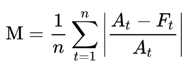
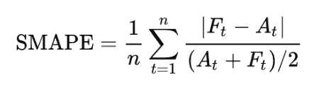

# 选择正确的误差度量:MAPE 与斯马普

> 原文：<https://towardsdatascience.com/choosing-the-correct-error-metric-mape-vs-smape-5328dec53fac?source=collection_archive---------2----------------------->

图片来自 [Pixabay](https://pixabay.com/?utm_source=link-attribution&utm_medium=referral&utm_campaign=image&utm_content=1841158) 的[像素](https://pixabay.com/users/pexels-2286921/?utm_source=link-attribution&utm_medium=referral&utm_campaign=image&utm_content=1841158)

## 两种流行的误差度量标准的利弊

MSE、RMSE、MAE、MAPE、sMAPE……仅举几例。有大量不同的错误度量标准，每一个都有其优点和缺点，并且应该比前一个覆盖更多的情况。那么，如何决定在我们的项目中使用哪种度量呢？

我认为回答这个问题的关键是了解最流行的度量标准的优点和局限性。这样，我们可以选择最适合手头任务的指标。这就是为什么在这篇文章中，我介绍了我最近使用的两个指标。

# 平均绝对百分比误差(MAPE)

平均绝对百分比误差是评估预测性能的最流行的度量之一。它由下面的公式给出。

其中 *A_t* 代表实际值，而 *F_t* 是预测值。在这种情况下，我们可以将 *t* 解释为进行一般回归问题(预测人的体重或房屋价格)时的观察值，或者时间序列分析时的时间指数。

该公式通常包括将该值乘以 100%，以百分比形式表示该数字。

## 优势

*   以百分比表示，与尺度无关，可用于比较不同尺度的预测。但是我们应该记住，MAPE 的值可能超过 100%。
*   易于向利益相关者解释。

## 缺点

*   当实际值为零时，MAPE 会采用未定义的值，例如在需求预测中就可能出现这种情况。此外，当实际值非常接近零时，它采用极值。
*   MAPE 是不对称的，它对负误差(当预测高于实际时)的惩罚比对正误差的惩罚更重。这是因为预测值过低时，百分比误差不能超过 100%。而过高的预测没有上限。因此，MAPE 将倾向于低估而非高估的模型。
*   MAPE 假设变量的测量单位具有有意义的零值。因此，虽然预测需求和使用 MAPE 是有意义的，但当预测以摄氏度表示的温度(不仅仅是摄氏度)时就没有意义了，因为温度有一个任意的零点。
*   MAPE 不是处处可微的，这在将其用作优化准则时会导致问题。

有关在商业环境中使用 MAPE 的更多信息，请参见本文[。](https://blog.arkieva.com/two-sides-of-the-mape-coin/)

# 对称平均绝对百分比误差

在讨论了 MAPE 之后，我们也来看看它的一个替代方案——对称 MAPE。它应该克服上面提到的不对称——预测高于实际的无限性。

sMAPE 有几个不同的版本。另一种流行且普遍接受的方法是在分母中的两个项上加上绝对值，以说明当实际值和预测值都等于 0 时 sMAPE 是不确定的。

## 优势

*   用百分比表示。
*   修复了原始 MAPE 的缺点-它同时具有下限(0%)和上限(200%)。

## 缺点

*   当真实值和预测值都非常接近零时，不稳定。当这种情况发生时，我们会用一个非常接近于零的数来处理除法。
*   sMAPE 可以取负值，因此对“绝对百分比误差”的解释可能会产生误导。
*   0%到 200%的范围解释起来并不直观，因此 sMAPE 公式中分母除以 2 的部分经常被忽略。
*   每当实际值或预测值为 0 时，sMAPE 将自动达到上限值。
*   与 MAPE 关于有意义的零值的假设相同。
*   在修正无边界的不对称时，sMAPE 引入了另一种由公式的分母引起的微妙不对称。想象两种情况。在第一个例子中，A = 100，F = 120。sMAPE 为 18.2%。现在有一个非常类似的例子，A = 100，F = 80。这里我们得出了 22.2%的 sMAPE。

# 结论

在本文中，我描述了回归问题的两种流行的性能评估方法。虽然它修复了 MAPE 的一些缺点，但仍有一些问题和一些新的问题。您可以研究的一些其他指标有:

*   平均绝对标度误差
*   平均方向精度(MDA)
*   准确率的对数(预测值与实际值之比)

一如既往，我们欢迎任何建设性的反馈。你可以在[推特](https://twitter.com/erykml1?source=post_page---------------------------)或评论中联系我。

如果您对本文感兴趣，您可能也会喜欢:

 [## 我最喜欢的 10 个在线学习数据科学的资源

### 这些网站将帮助您跟上数据科学的最新趋势

towardsdatascience.com](/my-10-favorite-resources-for-learning-data-science-online-c645aa3d0afb)  [## 有助于时间序列分析的 5 种绘图类型

### 以及如何使用 Python 快速创建它们！

towardsdatascience.com](/5-types-of-plots-that-will-help-you-with-time-series-analysis-b63747818705)  [## Python 统计块中的新成员:pingouin

### 图书馆的快速参观，以及它是如何从老守卫中脱颖而出的

towardsdatascience.com](/the-new-kid-on-the-statistics-in-python-block-pingouin-6b353a1db57c)