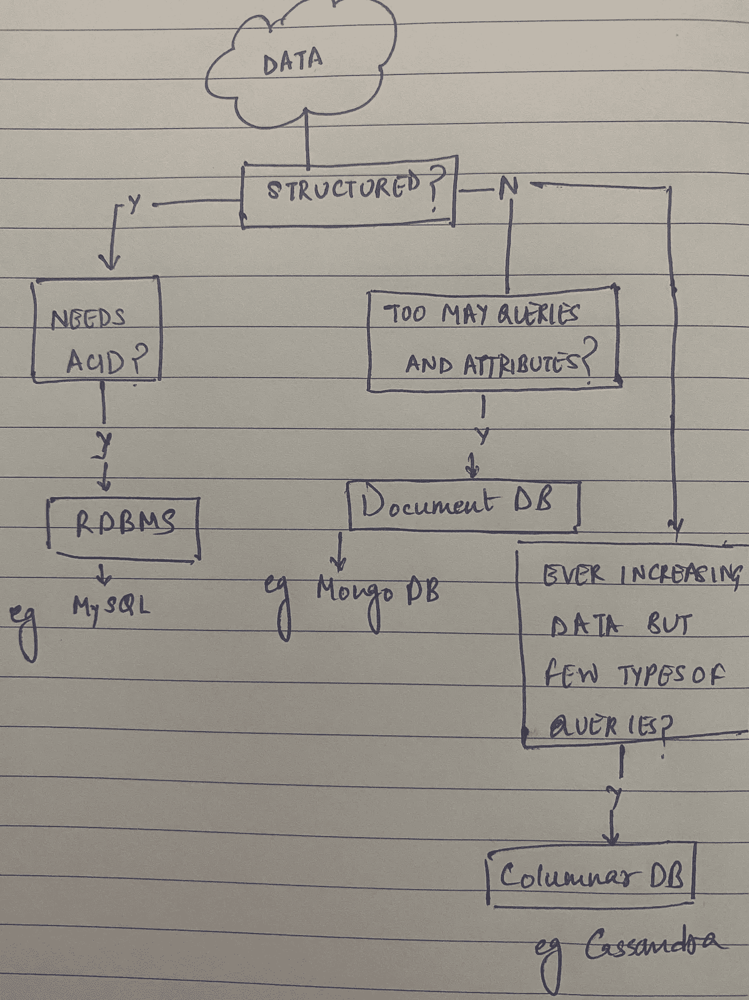

# 选择正确的数据库

> 原文：<https://towardsdatascience.com/choosing-the-right-database-in-a-system-design-interview-b8af9c6dc525?source=collection_archive---------5----------------------->

## 如何根据您的需求选择合适的存储解决方案

存储解决方案和数据库—如何选择最佳方案？Jan Antonin Kolar 在 Unsplash 上拍摄的照片

想象一下——你正在参加一个系统设计面试，需要选择一个数据库来存储，比如说，一个电子商务系统中与订单相关的数据。您的数据是结构化的，需要保持一致，但是您的查询模式与标准的关系数据库不匹配。你需要你的事务被隔离，原子的和所有的东西都是酸的…但是 OMG 它需要像 Cassandra 一样无限扩展！！那么，您如何决定选择哪种存储解决方案呢？好吧，让我们看看！

首先，我们在处理什么样的数据？是记录、文件系统还是音频/视频内容？我们打算对这些数据做什么样的处理？我们需要搜索什么或者运行复杂的分析算法吗？

# 有哪些不同类型的存储解决方案？

根据我们的要求以及我们使用或访问数据的方式，我们可能会寻找以下存储解决方案:

**缓存解决方案** —如果我们正在设计一个像 Twitter 或脸书这样的读负载系统，我们可能会捕获大量数据，甚至是完整的时间线，以满足低延迟要求。这里的一些选项可能是 *Redis* 或 *Memcached* 。

**文件系统存储** —如果我们正在设计某种资产交付服务，其中我们可能需要存储图像或音频/视频文件，我们可能需要使用称为 blob 存储的东西。一个非常受欢迎的例子是亚马逊 S3。

**文本搜索引擎** —如果我们正在设计一个像亚马逊一样的系统，并且需要实现一个搜索功能，该怎么办？关于搜索功能，我们也需要考虑错别字。假设用户想要搜索“*衬衫*”，但是却键入了“*衬衫*”。现在，如果我们不显示任何结果，这将是非常糟糕的用户体验。我们的系统需要足够智能，以显示“*衬衫*”或“*短裤*”的结果。这就是所谓的模糊搜索，这就是我们使用文本搜索引擎的地方，比如 *Elasticsearch* 。

数据仓库——我知道！我们一直在讨论数据和存储，怎么能不考虑大数据呢！有时，我们只需要将所有数据转储到一个存储中，然后我们可以在那里执行各种分析。这些系统更多地用于通常交易的离线报告。这就是我们最终使用像 *Hadoop* 这样的数据仓库解决方案的地方。

现在，您可能已经注意到，我们一直在谈论“存储解决方案”，而不是“数据库”。所以现在让我们来看看**数据库**！

# **SQL？NoSQL？这是怎么回事？**

作者图片

嗯，我们可以根据几个因素来决定使用哪种数据库，这些因素是——数据的结构、查询模式和规模。

我知道有点困惑！这就是为什么我会附上我在这篇文章中提到的视频。他们解释得很好，但我们也将在接下来的章节中讨论它，所以请继续阅读。

在系统设计面试中选择最佳数据库——CodeKarle

现在，**规模**，**结构**，以及**查询模式**。没错。如果信息是结构化的，可以用表来表示，如果我们需要我们的事务是原子的、一致的、隔离的和持久的(ACID)，我们就用关系数据库。最常用的是 MySQL。

现在，如果不需要 ACID 属性，那么您仍然可以使用关系数据库，或者您可以使用 NoSQL 替代方案。但是如果你的数据缺乏结构，它就不能用表格来表示，现在我们需要使用 NoSQL 数据库，比如 MongoDB、Cassandra、HBase、Couchbase、T19 等等。这就是查询模式成为决定性因素的地方。

> psst:elastic search 是文档数据库的一个特例。

如果我们的数据中有各种各样的属性和各种各样的查询，我们使用一个**文档数据库**，比如 *MongoDB* 或 *Couchbase* 。但是，如果我们必须在非常大的规模上工作，但是我们需要运行的查询类型很少，那么我们会选择像 *Cassandra* 或 *HBase* 这样的**列式 DB** 。甚至在列数据库之间，你可能知道，HBase 是建立在 Hadoop 之上的。因此，在设置 HBase 时，我们首先需要设置 Hadoop 和相关组件，然后在其上设置 HBase。这增加了设置系统的复杂性，所以我个人会选择 Cassandra，即使只是为了简单。性能方面两者给出相似的结果。

现在，像 Cassandra 这样的列数据库的问题是，它们主要通过划分和复制数据来工作。因此，如果您可以选择分区键，使所有查询都在 where 子句中使用公共分区键，那么 Cassandra 是一个不错的选择。

我看到了“codekarle”写的这篇关于[如何选择最佳存储解决方案](https://www.codekarle.com/system-design/Database-system-design.html)的文章，这篇文章很好地解释了什么时候使用列式数据库与文档数据库可能是有意义的，并举例说明了优步如何与系统的司机端和骑手端进行交互。让我用同样的场景来解释一下。

假设优步已经将与乘车相关的信息保存在一个 Cassandra 中，并将司机 id 作为分区键。现在，当我们运行一个查询来获取某一天特定驱动程序的所有数据时，它会根据分区键驱动程序 id 来获取数据。这是卡珊德拉解决方案的隔断部分。现在，如果我们试图通过客户 id 查询客户在某一天的乘车情况会怎样。现在，查询将被发送到所有分区，效率也随之降低！这就是解决方案的复制方面的用武之地。我们可以简单地复制整个数据，现在使用客户 id 作为分区键。现在，当基于客户 id 的查询到来时，它将被定向到使用客户 id 作为分区键的实例。这就是卡珊德拉可以无限扩展的原因。还记得 Cassandra 的查询模式吗？我们提到过，只有在查询种类有限的情况下，它才是有用的。这是因为我们只能复制数据这么多次。

# 让我们现实一点，一个数据库够吗？

现在，我们已经看到了各种存储解决方案，以及如何根据我们的需求和需要存储的信息类型在各种数据库之间进行选择。但这就够了吗？参考上述文章中的另一个例子，在某些情况下，单个 DB 不足以满足我们的需求。例如，在 Amazon 的例子中，订单数据需要遵循 ACID 属性，但是它需要像列数据库一样具有无限的可伸缩性。在这种情况下，我们将使用 MySQL + Cassandra 这样的数据库组合。现在，所有关于正在进行的订单的信息，需要遵循 ACID 属性，将存储在 MySQL 数据库中，一旦完成，我们可以将它们移动到 Cassandra，这可以用作永久存储。因此，只要我们需要 ACID 属性，数据就会保留在关系数据库中，然后转移到一个列数据库中，该列数据库可以根据数据的大小进行伸缩。问题解决了！

我希望这能帮助你在下一次系统设计面试中提出一个参考清单。认为我错过了一个重要的数据库/存储解决方案？请在评论中告诉我！

另外，这里有一个 [youtube 链接](https://youtu.be/cODCpXtPHbQ)指向我提到的解决方案。