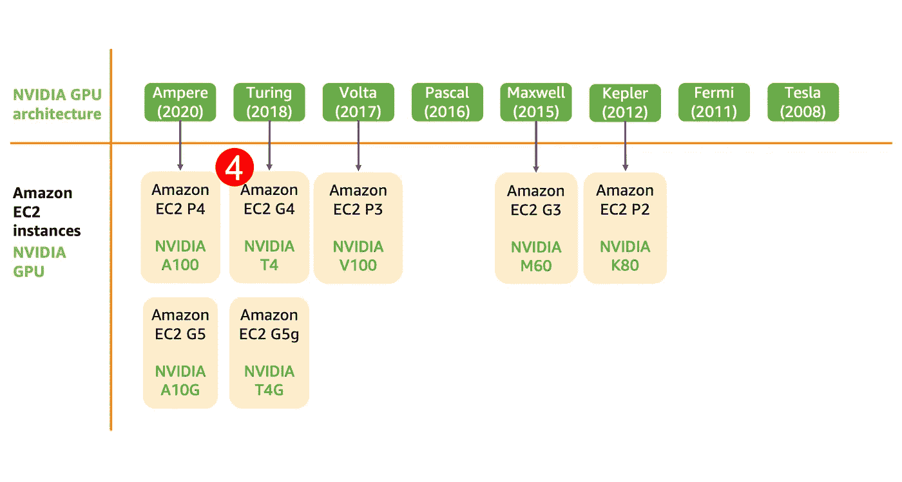

# 为 AWS 上的深度学习选择合适的 GPU

> 原文：<https://towardsdatascience.com/choosing-the-right-gpu-for-deep-learning-on-aws-d69c157d8c86?source=collection_archive---------2----------------------->

## 如何选择正确的亚马逊 EC2 GPU 实例进行深度学习训练和推理——从最佳性能到最具成本效益，以及介于两者之间的一切

> **最新更新:【2022 年 2 月 17 日。
> -添加了**新的** G5 和 G5g 实例类型
> -添加了新的部分:“对忙碌的数据科学家的重要建议”
> -更新了所有现有的部分和图形以代表当前的产品组合
> -添加了一个电子表格，其中包含 AWS 上所有 GPU 及其特性的详细列表**

作者插图

就在十年前，如果你想使用 GPU 来加速数据处理或科学模拟代码，你要么找一个电脑游戏玩家，要么联系你友好的邻居超级计算中心。今天，你可以登录你的 AWS 控制台，从一系列基于 GPU 的 Amazon EC2 实例中进行选择。

你问 AWS 上可以访问哪些 GPU？您可以启动具有不同 GPU 内存大小(8 GB、16 GB、24 GB、32 GB、40 GB)、NVIDIA GPU 代(Ampere、Turing、Volta、Maxwell、Kepler)不同功能(FP64、FP32、FP16、INT8、Sparsity、TensorCores、NVLink)、每个实例不同数量的 GPU(1、2、4、8、16)以及与不同 CPU(Intel、AMD、Graviton2)配对的 GPU 实例。您还可以选择具有不同 vCPUs(核心线程数)、系统内存和网络带宽的实例，并添加一系列存储选项(对象存储、网络文件系统、块存储等)。)—总而言之，你有选择。

我这篇博客的目标是为您提供指导，告诉您如何在 AWS 上为您的深度学习项目选择正确的 GPU 实例。我将讨论各种 EC2 GPU 实例的主要特性和优势，以及最适合每种实例类型和规模的工作负载。如果你是 AWS 新手，或者 GPU 新手，或者深度学习新手，我希望你能找到为项目做出正确选择所需的信息。

## 这篇博文涉及的主题:

1.  给忙碌的数据科学家/ML 从业者的主要建议
2.  为什么您应该选择正确的 ***GPU 实例*** 而不仅仅是正确的 ***GPU***
3.  深入探讨 GPU 实例类型:P4、P3、G5 (G5g)、G4、P2 和 G3
4.  AWS 上的其他机器学习加速器和实例
5.  为 ML 使用 GPU 实例时的成本优化技巧
6.  在 AWS 上使用什么软件和框架？
7.  HPC 使用案例应考虑哪些 GPU？
8.  所有 AWS GPU 实例及其特性的完整且详细的电子表格

# **关键**建议**针对忙碌的数据科学家/ML 从业者**

赶时间？只想要没有深潜的最终推荐？我掩护你。这里有 5 个 GPU 实例建议，应该适用于大多数深度学习用例。但是，我建议您回来阅读本文的其余部分，这样您可以做出更明智的决定。

## **1。AWS 上性能最高的多 GPU 实例**

**实例:** `p4d.24xlarge` **何时使用:**需要你能得到的所有性能的时候。将其用于大型模型和数据集的分布式培训。
**你得到的:** 8 个**NVIDIA A100**GPU，每个 GPU 40gb GPU 内存。基于最新的 NVIDIA Ampere 架构。包括用于快速多 GPU 培训的第三代 NVLink。

## 2.AWS 上性能最高的单 GPU 实例:

**实例:** **你得到的:** 1 x **NVIDIA V100** GPU 配 16gb GPU 内存。基于较老的 NVIDIA Volta 架构。性能最好的单 GPU 仍然是 P4 实例上的 NVIDIA A100，但你只能在 P4 获得 8 个 NVIDIA A100 GPUs。在接下来讨论的 G5 实例上，这种 GPU 比 NVIDIA A10G 有轻微的性能优势，但 G5 更具成本效益，并具有更多的 GPU 内存。

## 3.**最佳性价比，AWS 上的单 GPU 实例**

**实例:** `g5.xlarge`**何时使用:**当你想要高性能、比 P3 更低成本的更多 GPU 内存实例 **你得到的:** 1 x **NVIDIA A10G** GPU 拥有 24 GB 的 GPU 内存，基于最新的 Ampere 架构。NVIDIA A10G 可以被视为`p4d.24xlarge`上 A100 的低功耗近亲，因此当您需要更多计算时，可以轻松迁移和扩展。如果您有更多的预处理或后处理步骤，请考虑使用`g5.(2/4/8/16)xlarge`为具有更多 vCPUs 和更高系统内存的相同单 GPU 提供更大的尺寸。

## 4.最佳性价比，AWS 上的多 GPU 实例:

**实例:** `p3.(8/16)xlarge`
**何时使用:**性价比高的多 GPU 模型开发与训练。 **你得到的:** `p3.8xlarge`有 4 个**英伟达 V100**GPU，`p3.16xlarge`有 8 个英伟达 V100 GPUs，每个 GPU 上有 16 GB 的 GPU 内存，基于较旧的英伟达 Volta 架构。对于更大的模型、数据集和更快的性能，请考虑 P4 实例。

## 5.AWS 上的高性能 GPU 实例，价格适中

**实例:** `g4dn.xlarge`
**何时使用:**在模型开发和训练的成本上，性能低于其他选项。成本有效的模型推理部署。 **你得到的:** 1 x **英伟达 T4** GPU 配 16gb GPU 内存。基于上一代英伟达图灵架构。如果您有更多的预处理或后处理，请考虑使用`g4dn.(2/4/8/16)xlarge`来获得更多的 vCPUs 和更高的系统内存。

有了这些，你应该有足够的信息来开始你的项目。如果你仍然渴望了解更多，让我们深入研究每个实例类型、GPU 类型及其在 AWS 上的特性，并讨论何时以及为什么应该考虑它们。

# 为什么您应该选择正确的“GPU 实例”而不仅仅是正确的“GPU”

> 或者为什么您应该着眼于整个系统，而不仅仅是 GPU 的类型

GPU 是深度学习系统的主力，但最好的深度学习系统不仅仅是 GPU。您必须选择合适的计算能力(CPU、GPU)、存储、网络带宽和优化软件，以最大限度地利用所有可用资源。

一些深度学习模型需要更高的系统内存或更强大的 CPU 来进行数据预处理，其他模型可能在更少的 CPU 内核和更低的系统内存下运行良好。这就是为什么你会看到许多亚马逊 EC2 GPU 实例选项，有些具有相同的 GPU 类型，但不同的 CPU，存储和网络选项。如果你是 AWS 新手，或者是 AWS 深度学习新手，做出这个选择可能会感到不知所措。

让我们从 AWS 上的高级 EC2 GPU 实例命名开始。GPU 实例有两个系列——P 系列和 G 系列 EC2 实例，下图显示了各种实例代和实例大小。

用于深度学习的亚马逊 EC2 GPU 实例

历史上， **P** 实例类型代表更适合高性能计算(HPC)工作负载的 GPU，其特点是更高的性能(更高的瓦数、更多的 cuda 内核)和对科学计算中使用的双精度(FP64)的支持。 **G** 实例类型的 GPU 更适合图形和渲染，其特点是缺乏双精度和更低的性价比(更低的瓦数，更少的 cuda 内核)。

随着近年来 GPU 上的机器学习工作量快速增长，这一切都开始发生变化。今天，新一代的 **P** 和 **G** 实例类型都适合机器学习。对于 HPC 工作负载和要求苛刻的机器学习培训工作负载，仍然推荐使用 P**实例类型，对于机器学习推理部署和计算密集型程度较低的培训，我推荐使用 G** 实例类型。在下一节讨论特定的 GPU 实例类型时，所有这些将变得更加清晰。

每个实例大小都有一定的 vCPU 计数、GPU 内存、系统内存、每个实例的 GPU 数和网络带宽。字母(P **3** ，G **5)** 旁边的数字代表实例代。数字越大，实例类型越新。每个实例代可以有不同架构的 GPU，下面的时间线图像显示了 NVIDIA GPU 架构代、GPU 类型和相应的 EC2 实例代。

现在，让我们按照下面列出的顺序，按系列、代和规模来看一下这些实例。

我们将按照这里显示的顺序讨论每个 GPU 实例类型

# 亚马逊 EC2 P4:AWS 上性能最高的深度学习训练 GPU 实例类型。

[P4 实例](https://aws.amazon.com/ec2/instance-types/p4/)提供对基于 NVIDIA Ampere 架构的[NVIDIA A100 GPU](https://www.nvidia.com/en-us/data-center/a100/)的访问。它只有**一种尺寸**——每个实例有多个 GPU，每个 GPU 有 8 个 A100 GPUs，每个 GPU 有 40 GB 的 GPU 内存，96 个 vCPU，以及 400 Gbps 的网络带宽，用于[记录设置训练性能](https://aws.amazon.com/blogs/compute/amazon-ec2-p4d-instances-deep-dive/)。

## **P4 实例特征一目了然:**

*   **GPU 一代**:英伟达安培
*   **支持的精度类型** : FP64、FP32、FP16、INT8、BF16、TF32、第三代张量核(混合精度)
*   **GPU 内存**:每颗 GPU 40 GB
*   **GPU 互连** : NVLink 高带宽互连，第三代

## **基于 NVIDIA Ampere 的 NVIDIA A100 GPU 在 P4 实例上有什么新功能？**

每一代新的 GPU 都比上一代更快，这里也不例外。NVIDIA A100 明显快于 NVIDIA V100(在稍后讨论的 P3 实例中发现)，但也包括适合深度学习的更新精度类型，特别是 BF16 和 TF32。

深度学习训练通常在单精度或 FP32 中完成。FP32 IEEE 标准格式的选择早于深度学习，因此硬件和芯片制造商已经开始支持更好地用于深度学习的更新精度类型。这是一个很好的例子，说明硬件的发展是为了满足应用程序的需求，而开发人员必须改变应用程序才能在现有的硬件上工作。

NVIDIA A100 包括用于深度学习的特殊核心，称为张量核心，以运行混合精度训练，这是首次在 Volta 架构中引入的。而不是在单精度(FP32)下训练模型，你的深度学习框架可以使用张量核在半精度(FP16)下进行矩阵乘法，在单精度(FP32)下进行累加。这通常需要更新您的训练脚本，但可以带来更高的训练性能。每个框架对此的处理方式不同，所以请参考您的框架的官方指南( [TensorFlow](https://www.tensorflow.org/guide/mixed_precision) 、 [PyTorch](https://pytorch.org/docs/stable/notes/amp_examples.html) 和 [MXNet](https://mxnet.apache.org/api/python/docs/tutorials/performance/backend/amp.html) )来了解混合精度的使用。

NVIDIA A100 GPU 支持两种新的精密格式——BF16 和 TensorFloat-32 (TF32)。TF32 的优势在于 NVIDIA A100 上的 TF32 张量核心可以从深度学习框架中读取 FP32 数据，并使用和产生标准的 FP32 输出，但在内部它使用了降低的内部精度。这意味着与混合精度训练不同，混合精度训练通常需要对训练脚本进行代码修改，像 TensorFlow 和 PyTorch 这样的框架可以支持 TF32 开箱即用。BF16 是 IEEE FP16 标准的替代产品，具有更高的动态范围，更适合处理梯度而不损失精度。TensorFlow 已经[支持 BF16](https://cloud.google.com/tpu/docs/bfloat16) 有一段时间了，你现在可以在使用`p4d.24xlarge`实例时利用 NVIDIA A100 GPU 上的 BF16 precision。

P4 实例只有一种大小:`p4d.24xlarge`。让我们仔细看看。

## p4d.24xlarge:云中最快的 GPU 实例

如果你需要云中绝对最快的训练 GPU 实例，那么只需看看`p4d.24xlarge.`就行了，这个头衔以前由`p3dn.24xlarge`拥有，它拥有 8 个基于 Volta 架构的 NVIDIA V100 GPU。

您可以访问 8 个配有 40 GB GPU 内存的 NVIDIA A100 GPUs，通过[第三代 NVLink](https://www.nvidia.com/en-us/data-center/nvlink/) 互连，理论上，与我们将在下一节讨论的 P3 实例类型上可用的 NVIDIA V100 上的第二代 NVLink 相比，第三代 NVLink 的 GPU 间带宽增加了一倍。这使得`p4d.24xlarge`实例类型非常适合分布式数据并行训练，以及不适合单个 GPU 的大型模型的模型并行训练。该实例还允许您访问 96 个 vCPUs、1152 GB 系统内存(EC2 GPU 实例中最高的)和 400 Gbps 网络带宽(EC2 GPU 实例中最高的)，这对于实现大规模分布式培训作业的近线性扩展非常重要。

在这个实例上运行`nvidia-smi`，可以看到 GPU 内存是 40 GB。这是目前 AWS 上每 GPU 最大的 GPU 内存。如果您的模型很大，或者您正在处理 3D 图像或其他大批量数据，那么这就是要考虑的实例。运行`nvidia-smi topo -matrix`，你会看到 NVLink 被用于 GPU 之间的通信。与 PCIe 相比，NVlink 提供了更高的 GPU 间带宽，这意味着多 GPU 和分布式培训作业将运行得更快。

# Amazon EC2 G5:推理部署的最佳性价比单 GPU 实例和多 GPU 实例选项

G5 实例很有趣，因为在这种实例类型下有两种类型的 NVIDIA GPUs。这与 EC2 实例类型和 GPU 架构类型之间具有 1:1 关系的所有其他实例类型不同。

G5 实例类型有两个不同的子类别，具有不同的 CPU 和 GPU 类型

它们都有不同的实例大小，包括单个和多个 GPU 实例。

首先让我们看看 G5 实例类型，特别是`g5.xlarge`实例大小，我在开始时的关键要点/建议列表中讨论过。

# G5 实例:AWS 上单 GPU 实例的最佳性价比

## G5 实例功能一览:

*   **GPU 一代** : NVIDIA Ampere
*   **支持的精度类型** : **支持的精度类型** : FP64、FP32、FP16、INT8、BF16、TF32、张量核第三代(混合精度)
*   **GPU 内存** : 24 GB
*   **GPU 互连** : PCIe

## G5 给你带来了什么？

GPU 实例:`g5.(2/4/8/16)xlarge`为 AWS 上的单 GPU 实例提供了最佳的性价比。从`g5.xlarge`开始，作为您的单个 GPU 模型开发、原型制作和培训实例。您可以将大小增加到`g5.(2/4/8/16).xlarge`，以获得更多 vcpu 和系统内存，从而更好地处理依赖 CPU 能力的数据预处理和后处理。您可以访问单个和多个 GPU 实例大小(4 个 GPU、8 个 GPU)。NVIDIA A10G 的单 GPU 选项`g5.(2/4/8/16)xlarge`为训练和推理部署提供了最佳的性能/成本配置。

如果你看一下`g5.xlarge`实例的`nvidia-smi`的输出，你会看到热设计功率(TDP)，这是 GPU 可以汲取的最大功率，是 300W。将此与上面 P4 部分显示的`nvidia-smi`的输出进行比较，后者显示的 TDP 为 400W。这使得在 G5 实例中的 NVIDIA A10G 是在 P4 实例类型上发现的 NVIDIA A100 的较低功率表亲。因为它也基于相同的 NVIDIA Ampere 架构，这意味着它包括 P4 实例类型支持的所有功能。

如果您的模型和数据规模增长，您需要进行分布式培训，或者如果您希望在更快的 GPU 上运行多个并行培训实验，这使得 G5 实例非常适合单 GPU 培训并将您的培训工作负载迁移到 P4。

`g5.xlarge`上 nvidia-smi 的输出

虽然您可以访问多 GPU 实例大小，但我不建议将它们用于多 GPU 分布式培训，因为没有 NVIDIA 高带宽 NVLink GPU 互连，通信将回退到速度明显较慢的 PCIe。G5 上的多 GPU 选项意味着在每个 GPU 上托管多个模型，用于推理部署用例。

# G5g 实例:良好的性能和成本效益的 GPU 实例，如果你对 ARM CPU 没问题的话

## G5g 实例功能一览:

*   **GPU 一代**:英伟达图灵
*   **支持的精度类型** : **支持的精度类型** : FP32，FP16，张量核(混合精度)，INT8
*   **GPU 内存** : 16GB
*   **GPU 互连** : PCIe

## 你用 G5g 得到了什么？

与 G5 实例不同，G5g 实例提供了基于旧的 NVIDIA 图灵架构的 NVIDIA T4G GPUs。NVIDIA T4G GPU 最接近的表亲是亚马逊 EC2 G4 实例上可用的 NVIDIA T4 GPU，我将在下一节讨论。有趣的是，G5g 实例和 G4 实例的关键区别在于 CPU 的选择。

> G5g 实例提供基于 ARM 的 AWS Graviton2 CPU，而
> G4 实例提供基于 x86 的英特尔至强可扩展 CPU。
> GPU(T4 和 T4g)在性能方面非常相似

我们在这两者之间的选择应该归结为您更喜欢的 CPU 架构。我个人倾向于今天的机器学习是 G4 实例而不是 G5g 实例，因为更多的开源框架被设计为在英特尔 CPU 上运行，而不是基于 ARM 的 CPU。

# 亚马逊 EC2 P3:AWS 上最高性能的单 GPU 实例和经济高效的多 GPU 实例选项

[P3 实例](https://aws.amazon.com/ec2/instance-types/p3/)提供对基于 NVIDIA Volta 架构的[NVIDIA V100 GPU](https://www.nvidia.com/en-us/data-center/v100/)的访问，您可以为每个实例启动单个 GPU 或多个 GPU(4 个 GPU、8 个 GPU)。单个 GPU 实例`p3.2xlarge`就可以成为你深度学习训练的日常驱动。最强大的实例`p3dn.24xlarge`可让您访问 8 个 V100，配有 32 GB GPU 内存、96 个虚拟 CPU 和 100 Gbps 网络吞吐量，非常适合分布式培训。

## **P3 实例特征一目了然:**

*   **GPU 一代**:英伟达 Volta
*   **支持的精度类型** : FP64、FP32、FP16、张量核(混合精度)
*   **GPU 内存** : 16 GB 在`p3.2xlarge, p3.8xlarge, p3.16xlarge`，32 GB 在`p3dn.24xlarge`
*   **GPU 互连** : NVLink 高带宽互连，第二代

NVIDIA V100 还包括张量核心来运行混合精度训练，但不提供 P4 实例上提供的 NVIDIA A100 中引入的 TF32 和 BF16 精度类型。然而，P3 实例有 4 种不同的大小，从单个 GPU 实例大小到 8 个 GPU 实例大小，使其成为灵活培训工作负载的理想选择。让我们来看看下面的每个实例大小`p3.2xlarge`、`p3.8xlarge`、`p3.16xlarge` 和`p3dn.24xlarge.`

## p3.2xlarge:单 GPU 训练的最佳 GPU 实例

如果你需要一个 GPU 并且性能是优先考虑的，这应该是你大多数深度学习培训工作的首选实例。G5 实例比 P3 的性能稍低，但更具成本效益。使用`p3.2xlarge`,您可以访问一个 NVIDIA V100 GPU，它具有 16 GB GPU 内存、8 个 vCPUs、61 GB 系统内存和高达 10 Gbps 的网络带宽。在撰写本文时，V100 是云中最快的 GPU，并且支持张量核，如果您的脚本可以利用混合精度训练，则可以进一步提高性能。

如果您启动一个 Amazon EC2 `p3.2xlarge` 实例并运行`nvidia-smi`命令，您可以看到实例上的 GPU 是支持 NVLink 的 V100-SXM2 版本(我们将在下一节讨论这一点)。在内存使用下，你会看到它有 16 GB 的 GPU 内存。如果您需要 16 GB 以上的 GPU 内存来处理大型模型或大数据量，那么您应该考虑`p3dn.24xlarge`(下面有更多详细信息)。

## **p3.8xlarge 和 p3.16xlarge:小规模多 GPU 训练和运行并行实验的理想 GPU 实例**

如果你需要更多的 GPU 用于实验，更多的 vCPUs 用于数据预处理和数据扩充，或者更高的网络带宽，可以考虑`p3.8xlarge` (带 4 个 GPU)和`p3.16xlarge` (带 8 个 GPU)。每个 GPU 都是 16 GB 内存的 NVIDIA V100。它们还包括用于高带宽 GPU 间通信的 NVLink 互连，这将为多 GPU 培训提供便利。使用`p3.8xlarge` 您可以访问 32 个虚拟 CPU 和 244 GB 系统内存，使用`p3.16xlarge` 您可以访问 64 个虚拟 CPU 和 488 GB 系统内存。这个实例非常适合两个用例:

**多 GPU 培训工作**:如果你刚刚开始多 GPU 培训，4 个 GPU 在`p3.8xlarge` 上或者 8 个 GPU 在`p3.16xlarge` 上可以给你一个不错的加速。您还可以使用该实例为更大规模的多节点培训作业准备您的培训脚本，这通常需要您使用 Horovod 、 [tf.distribute.Strategy](https://www.tensorflow.org/guide/distributed_training) 或 [torch.distributed](https://pytorch.org/docs/stable/distributed.html) 等[库来修改您的培训脚本。参考我的使用 Horovod 进行分布式培训的分步指南:](https://github.com/horovod/horovod)

> 博文:[在 Amazon SageMaker 上使用 TensorFlow 和 Horovod 进行分布式培训的快速指南](/a-quick-guide-to-distributed-training-with-tensorflow-and-horovod-on-amazon-sagemaker-dae18371ef6e?source=friends_link&sk=0a1f6a2e7716d4272c79156cf7c5f294)

**并行实验**:当您必须并行运行模型架构和超参数的变体以加快实验速度时，多 GPU 实例也会派上用场。使用`p3.16xlarge` ,您可以在多达 8 种型号上进行训练。与多 GPU 训练作业不同，由于每个 GPU 都独立运行训练，并且不会阻止其他 GPU 的使用，因此您可以在模型探索阶段提高工作效率。

## **p3dn.24xlarge:** 高性能且经济高效的培训

这个实例之前拥有云头衔中最快的 GPU 实例，现在属于`p4d.24xlarge`。这并不使`p3dn.24xlarge`显得没精打采。它仍然是今天你能在云上找到的最快的实例类型之一，并且比 P4 实例更具成本效益。你可以访问 8 个 NVIDIA V100 GPUs，但与拥有 16 GB GPU 内存的`p3.16xlarge`不同，`p3dn.24xlarge` 上的 GPU 拥有 32 GB GPU 内存。这意味着你可以适应更大的模型和更大批量的训练。该实例允许您访问 96 个 vCPUs、768 GB 系统内存和 100 Gbps 网络带宽，这对于实现大规模分布式培训作业的近线性扩展非常重要。

在这个实例上运行 `nvidia-smi`，可以看到 GPU 内存是 32 GB。唯一一个拥有比这更多 GPU 内存的实例是`p4d.24xlarge`，它是一个拥有 40gb GPU 内存的 A100 GPU。如果您的模型很大，或者您正在处理 3D 图像或其他大批量数据，那么这就是要考虑的实例。运行`nvidia-smi topo — matrix`，你会看到 NVLink 被用于 GPU 之间的通信。与 PCIe 相比，NVlink 提供了更高的 GPU 间带宽，这意味着多 GPU 和分布式培训作业将运行得更快。

# Amazon EC2 G4:用于训练的高性能单 GPU 实例和用于经济高效推理的多 GPU 选项

[G4 实例](https://aws.amazon.com/ec2/instance-types/g4/)提供对基于英伟达图灵架构的英伟达 T4 GPU 的访问。您可以为每个实例启动一个 GPU，也可以为每个实例启动多个 GPU(4 个 GPU，8 个 GPU)。在下面的时间线图中，你会看到 G4 instance 的正下方是 G5g instance，这两个实例都是基于采用 NVIDIA 图灵架构的 GPU。我们已经在前面的部分讨论了 G5g 实例类型，G4(英伟达 T4)和 G5g(英伟达 T4G)中的 GPU 在性能上非常相似。在这些情况下，您的选择将归结为 CPU 类型的选择。

> G5g 实例提供基于 ARM 的 AWS Graviton2 CPU，而
> G4 实例提供基于 x86 的英特尔至强可扩展 CPU。
> GPU(T4 和 T4g)在性能方面非常相似

在 GPU 时间轴图中，您可以看到 NVIDIA Turing 架构是在 NVIDIA Volta 架构之后推出的，并为机器学习引入了几个新功能，如下一代张量核心和整数精度支持，这使它们成为经济高效的推理部署和图形的理想选择。

## **G4 实例特征一览:**

*   **GPU 一代**:英伟达图灵
*   **支持的精度类型** : FP64、FP32、FP16、张量核(混合精度)、INT8、INT4、INT1
*   **GPU 内存** : 16 GB
*   **GPU 互连** : PCIe

## G4 实例上的英伟达 T4 GPU 有什么新功能？

NVIDIA Turing 率先引入了对整数精度(INT8)数据类型的支持，这可以显著提高推理吞吐量。在训练期间，模型权重和梯度通常以单精度(FP32)存储。事实证明，要在训练好的模型上运行预测，实际上并不需要全精度，并且可以在半精度(FP16)或 8 位整数精度(INT8)中进行精度降低的计算。这样做可以提高吞吐量，而不会牺牲太多的准确性。准确性会有一些下降，下降的程度取决于具体到你的模型和训练的各种因素。总的来说，与其他 GPU 实例相比，G4 实例可以获得最佳的推理性能/成本。[英伟达的支持矩阵](https://docs.nvidia.com/deeplearning/tensorrt/support-matrix/index.html)显示了哪些神经网络层和 GPU 类型支持 INT8 等精度进行推理。

英伟达 T4(和英伟达 T4G)是 AWS 上任何 EC2 实例中功耗最低的 GPU。在这个实例上运行`nvidia-smi`，你可以看到`g4dn.xlarge`有一个 16gb GPU 内存的英伟达 T4 GPU。你还会注意到，与 NVIDIA A10G 的 300 瓦相比，功率上限为 70 瓦。

以下实例大小都可以让您访问单个 NVIDIA T4 GPU，并增加 vCPU、系统内存、存储和网络带宽的数量:`g4dn.xlarge` (4 个 vCPU，16 GB 系统内存)、`g4dn.2xlarge` (8 个 vCPU，32 GB 系统内存)、`g4dn.4xlarge` (16 个 vCPU，64 GB 系统内存)、`g4dn.8xlarge` (32 个 vCPU，128 GB 系统内存)、`g4dn.16xlarge` (64 个 vCPU，256 GB 系统内存)。您可以在产品详情部分的[产品 G4 实例页面](https://aws.amazon.com/ec2/instance-types/g4/)上找到差异的完整列表。

G4 实例大小还包括两种多 GPU 配置:`g4dn.12xlarge`4 个 GPU 和 g4dn.metal 个 GPU。但是，如果您的用例是多 GPU 或多节点/分布式训练，您应该考虑使用 P3 实例。在一个多 GPU `g4dn.12xlarge`实例上运行`nvidia-smi topo --matrix`，您将看到 GPU 并没有通过高带宽 NVLink GPU 互连进行连接。P3 多 GPU 实例包括高带宽 NVLink 互连，可以加速多 GPU 训练。

# Amazon EC2 P2:对于 HPC 工作负载具有成本效益，不再推荐用于纯 ML 工作负载

[P2 实例](https://aws.amazon.com/ec2/instance-types/p2/)让你接触到基于英伟达开普勒架构的英伟达 K80 GPUs。开普勒架构已经有几代历史了(开普勒- >麦克斯韦- >帕斯卡- >、伏打- >图灵)，因此它们不是最快的 GPU。它们确实有一些特定的功能，如全精度(FP64)支持，这使它们对于依赖额外精度的高性能计算(HPC)工作负载来说具有吸引力和成本效益。P2 实例有 3 种不同的大小:p2.xlarge (1 个 GPU)、p2.8xlarge (8 个 GPU)、p2.16xlarge (16 个 GPU)。

NVIDIA K80 是一个有趣的 GPU。单个 NVIDIA K80 其实就是一块物理板上的两个 GPU，NVIDIA 称之为双 GPU 设计。这意味着，当您启动一个`p2.xlarge`实例时，您只能在物理 K80 板上获得这两个 GPU 中的一个。同样，当你启动一个`p2.8xlarge`时，你可以在 4 个 K80 GPU 上访问 8 个 GPU，而使用`p2.16xlarge`时，你可以在 8 个 K80 GPU 上访问 16 个 GPU。在`p2.xlarge`上运行`nvidia-smi`，你看到的是 NVIDIA K80 板上的两个 GPU 中的一个，它有 12 GB 的 GPU 内存

**P2 实例特征一目了然:**

*   **GPU 一代** : NVIDIA Kelper
*   **支持的精度类型** : FP64、FP32
*   **GPU 内存:** 12 GB
*   **GPU 互连** : PCIe

## **那么，我甚至应该使用 P2 实例进行深度学习吗？**

不，上面讨论过有更好的选择。在亚马逊 EC2 G4 和 G5 实例推出之前，P2 实例是推荐的具有成本效益的深度学习训练实例类型。自从 G4 实例推出以来，我推荐 G4 作为深度学习培训的首选性价比培训和原型 GPU 实例。P2 对于科学计算中的 HPC 工作负载来说仍然是经济高效的，但你会错过几个新功能，例如支持混合精度训练(张量核)和降低精度推断，这已经成为新一代的标准。

如果您在`p2.16xlarge` GPU 实例上运行 `nvidia-smi` ，由于 NVIDIA K80 具有双 GPU 设计，您将看到 16 个 GPU，它们是 8 个 NVIDIA K80 GPUs 的一部分。这是您在 AWS 上的单个实例中可以获得的最大数量的 GPU。如果你运行`nvidia-smi topo --matrix`，你会看到所有的 GPU 间通信都是通过 PCIe，不像 P3 多 GPU 实例使用更快的 NVLink。

# Amazon EC2 G3:不再推荐仅用于 ML 工作负载

[G3 实例](https://aws.amazon.com/ec2/instance-types/g3/)让您访问基于 NVIDIA Maxwell 架构的 NVIDIA M60 GPUs。NVIDIA 将 M60 GPUs 称为虚拟工作站，并将其定位于专业图形。然而，对于 P3、G4、G5、G5g 实例的深度学习，G3 具有更强大和更具成本效益的选项，因此不是深度学习的推荐选项。我把它包括在这里只是为了一些历史和完整性。

**G3 实例特征一览:**

*   **GPU 一代**:英伟达 Maxwell
*   **支持的精度类型** : FP32
*   **GPU 内存** : 8 GB
*   **GPU 互连** : PCIe

## **应该考虑深度学习的 G3 实例吗？**

在 Amazon EC2 G4 实例发布之前，单个 GPU G3 实例在开发、测试和原型制作方面非常经济。尽管 Maxwell 架构比在 P2 实例上发现的 NVIDIA K80 的开普勒架构更新，但对于深度学习，您仍然应该考虑 G3 之前的 P2 实例。你的选择顺序应该是 P3 > G4 > P2 > G3。

G3 实例有 4 种大小，`g3s.xlarge`和`g3.4xlarge` (2 个 GPU，不同系统配置)`g3.8xlarge` (2 个 GPU)和`g3.16xlarge` (4 个 GPU)。在一个`g3s.xlarge`上运行`nvidia-smi`，你会看到这个实例让你访问一个 8 GB GPU 内存的 NVIDIA M60 GPU。

# AWS 上的其他机器学习实例选项

NVIDIA GPUs 无疑是深度学习的主要产品，但 AWS 上还有其他实例选项和加速器，可能是您训练和推理工作负载的更好选择。

*   **CPU** :用于训练传统的 ML 模型，原型和推理部署
*   **基于英特尔 Habana-Gaudi 的 DL1 实例**:借助 8 x Gaudi 加速器，您可以将其用作 P3dn 和 P4d GPU 实例的替代方案，用于培训
*   **Amazon EC2 Trn1 实例**:使用多达 16 个 AWS Trainium 芯片，您可以使用它作为 P3dn、P4d 和 DL1 实例的替代方案进行培训
*   **AWS 弹性推理**:通过利用 EI 为您的 CPU 实例添加适量的 GPU 加速来节省推理工作负载的成本[在这篇博文](/a-complete-guide-to-ai-accelerators-for-deep-learning-inference-gpus-aws-inferentia-and-amazon-7a5d6804ef1c?source=friends_link&sk=adf7b78cea61ed9b8415c8371777ba3d)中讨论
*   **Amazon EC2 Inf1 实例**:最多 16 个 AWS 推理芯片，每个芯片上有 4 个神经元内核，这是推理部署的一个强大且经济高效的选项，在这篇博文的[中有更详细的讨论。](/a-complete-guide-to-ai-accelerators-for-deep-learning-inference-gpus-aws-inferentia-and-amazon-7a5d6804ef1c?source=friends_link&sk=adf7b78cea61ed9b8415c8371777ba3d)

关于推理部署选项的详细讨论，请参考关于为推理选择正确的 AI 加速器的博文:

***博文:***[*深度学习推理 AI 加速器完全指南——GPU、AWS 推理和亚马逊弹性推理*](/a-complete-guide-to-ai-accelerators-for-deep-learning-inference-gpus-aws-inferentia-and-amazon-7a5d6804ef1c?source=friends_link&sk=adf7b78cea61ed9b8415c8371777ba3d)

# 为 ML 使用 GPU 实例时的成本优化技巧

您有几个不同的选项来优化您的训练和推理工作负载的成本。

## **斑点实例**

即时定价使高性能 GPU 更加实惠，并允许您以比按需费率更低的折扣访问多余的 Amazon EC2 计算能力。要按实例和地区查看最新的价格列表，请访问 [Spot Instance Advisor](https://aws.amazon.com/ec2/spot/bid-advisor/) 。在某些情况下，您可以节省 90%以上的培训成本，但您的实例可能会被抢占，并且只需 2 分钟的通知就可以终止。您的训练脚本必须实现频繁的检查点操作，并且能够在 Spot 容量恢复后恢复训练。

## **亚马逊 SageMaker 管理培训**

在开发阶段，你的大部分时间都花在原型制作、调整代码和在你最喜欢的编辑器或 IDE(显然是 VIM)中尝试不同的选项上——所有这些都不需要 GPU。你可以通过简单地分离你的开发和培训资源来节省成本，而[亚马逊 SageMaker](https://aws.amazon.com/sagemaker/?trk=el_a134p000006vgXgAAI&trkCampaign=NA-FY21-GC-400-FTSA-SAG-Overview&sc_channel=el&sc_campaign=Y21-SageMaker_shshnkp&sc_outcome=AIML_Digital_Marketing) 将让你轻松做到这一点。使用 Amazon SageMaker Python SDK，您可以在您的笔记本电脑、台式机、EC2 实例或 SageMaker 笔记本实例上本地测试您的脚本。

当你准备好训练时，指定你想要训练的 GPU 实例类型，SageMaker 将提供实例，将数据集复制到实例，训练你的模型，将结果复制回亚马逊 S3，并拆除实例。您只需为培训的确切时间付费。Amazon SageMaker 还支持管理现场培训，以提供额外的便利和成本节约。

> 下面是我的指南:[亚马逊 SageMaker 使用 Spot 实例的快速指南](/a-quick-guide-to-using-spot-instances-with-amazon-sagemaker-b9cfb3a44a68?source=friends_link&sk=937b581bef3605c84c07cfd32c5842d1)

## **通过 Amazon Elastic 推论使用所需数量的 GPU**

通过利用 EI 为本文讨论的 CPU 实例添加适量的 GPU 加速来节省推理工作负载的成本: [*深度学习推理的 AI 加速器完整指南——GPU、AWS 推理和亚马逊弹性推理*](/a-complete-guide-to-ai-accelerators-for-deep-learning-inference-gpus-aws-inferentia-and-amazon-7a5d6804ef1c?source=friends_link&sk=adf7b78cea61ed9b8415c8371777ba3d)

## **通过提高利用率来优化成本**

1.  通过[启用混合精度训练](https://docs.aws.amazon.com/dlami/latest/devguide/tutorial-gpu-opt-training.html)，优化您的训练代码，以充分利用 P3、G4 和 G5 实例张量核。每个深度学习框架都有不同的做法，你必须参考特定框架的文档。
2.  对 G4 和 G5 实例类型使用降低精度(INT8)推理来提高性能。NVIDIA 的 TensorRT 库提供了将单精度模型转换为 INT8 的 API，[在其文档中提供了示例](https://docs.nvidia.com/deeplearning/tensorrt/developer-guide/index.html#optimizing_int8_python)。

# 在 Amazon EC2 GPU 实例上使用什么软件？

下载你最喜欢的深度学习框架很容易，对吗？只需`pip install XXX`或`conda install XXX`或`docker pull XXX`就可以了，对吗？不尽然，您从上游存储库安装的框架通常没有针对它们将运行的目标硬件进行优化。这些框架旨在支持各种不同的 CPU 和 GPU 类型，因此它们将支持最小公分母的功能和性能优化，这可能会导致 AWS GPU 实例的性能大幅下降。

为此，我强烈推荐使用 [AWS 深度学习 AMIs](https://docs.aws.amazon.com/dlami/latest/devguide/what-is-dlami.html) 或者 [AWS 深度学习容器(DLC)](https://docs.aws.amazon.com/deep-learning-containers/latest/devguide/deep-learning-containers-images.html) 来代替。AWS 在所有亚马逊 EC2 GPU 实例上对它们进行了资格认证和测试，它们包括针对网络、存储访问以及最新的 NVIDIA 和英特尔驱动程序和库的 AWS 优化。深度学习框架在上游和下游依赖于更高级别的调度器和编排器以及更低级别的基础设施服务。通过使用 AWS AMIs 和 AWS DLCs，您知道它已经过端到端测试，并保证为您提供最佳性能。

# HPC 使用案例应考虑哪些 GPU？

高性能计算(HPC)是另一个科学领域，它依靠 GPU 来加速模拟、数据处理和可视化的计算。虽然深度学习训练可以在从 FP32(单精度)到 FP16(半精度)的较低精度算法以及 Bfloat16 和 TF32 等变体上进行，但 HPC 应用需要高达 FP64(双精度)的高精度算法。NVIDIA A100、V100 和 K80 GPUs 支持 FP64 precision，这些分别在 P4、P3 和 P2 提供。

# 所有 GPU 实例及其特性的完整且详细的电子表格

在今天的“ ***中，我把这个放在一起，因为我已经找不到一个“*** 的贡献了，我向你呈现一个 AWS 特性列表上的 GPU。我经常想知道特定的 GPU 上有多少内存，或者 GPU 是否支持特定的精度类型，或者该实例是否有 Intel、AMD 或 Graviton CPU 等。在我启动一个 GPU 实例之前。为了避免浏览各种网页和 NVIDIA 白皮书，我煞费苦心地将所有信息汇编成一个表格。你可以使用下面的图片，或者直接进入文章末尾嵌入的 markdown 表，这个表由你选择的 GitHub 托管。尽情享受吧！

GPU 特性一览

您是否喜欢以图形格式消费内容，我也为您做了介绍！下图显示了 AWS 上所有 GPU 实例的类型和大小。没有足够的空间容纳所有的功能，因此我仍然推荐电子表格。

# 你好。感谢阅读！

感谢您的阅读。如果你觉得这篇文章很有趣，可以考虑给它一点掌声，然后在 medium 上跟我学。也请查看我在[媒体](https://medium.com/@shashankprasanna)上的其他博客帖子，或者在 twitter ( [@shshnkp](https://twitter.com/shshnkp) )、 [LinkedIn](https://www.linkedin.com/in/shashankprasanna/) 上关注我，或者在下面留下评论。想让我写一个特定的机器学习主题吗？我很想收到你的来信！