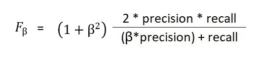

# 选择正确的性能指标可以挽救新冠肺炎的生命

> 原文：<https://towardsdatascience.com/choosing-the-right-performance-metrics-can-save-lives-against-coronavirus-2f27492f6638?source=collection_archive---------21----------------------->

## 评估深度学习模型的性能，以使用相关指标检测新冠肺炎

冠状病毒病例的地理分布显示，它几乎影响了所有国家

最近宣布的疫情新冠肺炎震撼了世界上所有的医疗保健系统。它已经显示出[的指数增长率](https://www.youtube.com/watch?v=Kas0tIxDvrg)，并且已经传播到 [164 个国家](https://www.worldometers.info/coronavirus/#countries)。每个国家都处于指数曲线的不同点，都在采取预防措施和实施降低增长率的政策。

各国正在通过使用技术并在其基础设施中纳入大数据分析和实时监控来跟踪潜在的感染者和与他们有过互动的人，从而抗击疫情。这标志着这种技术首次被用于防止疫情病毒的传播。

虽然采取了这些预防措施，但病例数量仍在迅速增加。原因之一是测试套件不可用(或者使用了[有故障的测试套件](https://www.washingtonpost.com/business/2020/03/16/cdc-who-coronavirus-tests/))。另一个原因是像意大利这样的国家缺少医疗专家，那里的病人流入量远远超过了他们的处理能力。为了克服这种情况，学者和研究人员正在研究使用深度学习来帮助专家诊断这种疾病。来自中国的一项研究显示了深度学习在 CT 扫描上的使用，“以便在病原测试之前提供临床诊断，从而为疾病控制节省关键时间”。与此同时，蒙特利尔大学的一名学者已经编译并开源了一个数据集，这样研究就可以实施并测试不同的算法(比如在这里的[上完成的](/using-deep-learning-to-detect-ncov-19-from-x-ray-images-1a89701d1acd))。

[左](https://radiopaedia.org/cases/covid-19-pneumonia-14):新冠肺炎阳性 x 光片。[右图](https://radiopaedia.org/cases/streptococcus-pneumon%20iae-pneumonia-temporal-evolution-1):链球菌感染。(两者都被授权为 CC-NC-SA)

随着更多的数据变得可用，来自不同研究人员和机构的更健壮和准确的实现将变得可用。部署这样的系统可以减轻医生和医院面临的负担，特别是在亚洲和非洲的发展中国家。

根据所用数据的类型以及模型的[参数和超参数](/neural-networks-parameters-hyperparameters-and-optimization-strategies-3f0842fac0a5)，这些系统将具有不同的精确度。大多数数据科学家和人工智能专家使用准确性作为标准衡量标准，来决定他们的模型有多有效，以及它与其他模型相比如何排名。他们力争**最准确的型号**，但在现实生活中，我们会想要**最有用的型号**。

通过使用在特定阶段有用的指标，有多种方法来衡量模型的性能。为了解释它们，我将使用疾病在地理位置上的两个阶段(在这种情况下是新冠肺炎):当在一个地区发现感染并开始传播时，我们称之为**感染出现**和当病原体感染的人数超过该地区的治疗能力时，即**感染饱和**。但是在进入这些阶段之前，我想解释一下什么是混淆矩阵。混淆矩阵显示了实际标签与预测标签的组合计数。它有四个街区。让我们以狗和非狗的图像分类器为例。

1.  真阳性:有多少张狗的图片被模型标记为“狗”
2.  假阳性:有多少非狗的图像(如猫、树等)被模型标记为“狗”
3.  假阴性:有多少张狗的图片被模型标记为“非狗”
4.  真阴性:有多少张非狗图片被模特贴上了“非狗”的标签

混淆矩阵[显示了数据集中实际标签的数量与你预测的数量的对比。](https://medium.com/@awabmohammedomer/confusion-matrix-b504b8f8e1d1)

我们开始吧。

# 1.感染出现

让我们假设我们是深度学习专家，在一个出现了前 20 个案例的国家。我们有一个训练集，包括从全球收集的 400 个健康人的 CT 扫描和 100 个感染者的 CT 扫描。我们已经训练了两个模型，模型 A 和模型 B，它们都具有不同的架构。我们有一个 100 个 CT 扫描的测试集(70 个健康，30 个受感染),并对它们的预测制作一个混淆矩阵，以观察实际标签与预测的计数:

为了评估两个模型的性能，最常用的指标是**准确性**，它决定了模型正确预测的案例百分比，即它正确分配了多少标签。它的公式是:

模型 A 的准确度为 **80%** ，而模型 B 的准确度为 **76%** 。使用模型 A 进行诊断似乎是非常明显的。但模型 A 的问题是，在假阴性的情况下(即诊断受感染的患者为健康)，它宣布 18 名患者为健康并让他们出院，**让感染传播得更快**。模型 B 做得更好，它宣布 10 个被感染的病人是健康的，从而多诊断了 8 个病人。在这种情况下应该使用的指标是**召回。**据[维基百科](https://en.wikipedia.org/wiki/Precision_and_recall):

> *Recall(也称为 sensitivity)是实际检索到的相关实例总数的一部分。*

它的基本意思是，它衡量模型捕捉尽可能多的正面案例的能力。为了计算召回率，我们使用:

A 型召回 40%，B 型召回 **67%！**这意味着我们应该使用模型 B，因为它可以正确诊断更多受感染的患者。

关于模型及其召回，有一些事情需要注意:

1.  模型 B 预测 14 名健康患者被感染，模型 A 预测 2 名。这意味着你将会隔离 12 名健康的人。如果最终目标是减缓传播速度并且隔离资源可用，这可能是一个有效的选择。
2.  通过降低根据模型的预测概率决定标签的阈值，可以提高召回率。这也可能导致更多健康的人被隔离。同样，如果目标如前所述，那么这是一个有效的选择。

# 2.感染饱和度:

现在，让我们假设我们在一个传染病已经蔓延全国的国家。医院和隔离区已经接近满负荷。在这种情况下，你是否正确地诊断某人被感染并不重要，因为流入的病人太多了，难以处理。如何选择谁接受治疗是一个单独的话题。但是有一件事是有害的:将健康人诊断为感染者。当感染者没有机会接受治疗时，没有人会想把资源用在健康人身上。

让我们使用模型 A 和模型 b 的混淆矩阵。为了强调影响，我将数字乘以 50:

假设所有的医院都满负荷运转，只有一家医院能容纳 500 人。这些是模型 A 对模型 B 的预测，可以通过沿着预测轴将各个类别相加得到:

模型 A 和模型 B 的每类预测数

虽然模型 B 似乎更优越，但如果我们计算有多少预测实际上是正确的概率，我们会发现其他东西。我们来计算一下有多少结果实际上是正确的概率。对于模型 A，700 个病例中有 600 个实际被感染，也就是说，如果我们从这 700 个病例中随机选择 1 个人，他或她被感染的几率为 85.7%。相反，对于模型 B，如果我们随机选择一个人，他/她有 **58.8%** 的几率被感染。为了比较这种影响，我们将得到 420 名真正的 A 型患者和 290 名真正的 b 型患者。使用 A 型，**将增加 130 名患者**得到所需的治疗。这一指标被称为**精度**，它是实际案例占预测案例总数的百分比。根据[维基百科](https://en.wikipedia.org/wiki/Precision_and_recall):

> *精度(也称为正预测值)是检索实例中相关实例的分数。*

使用以下公式计算:

# 真实世界场景

疫情的饱和总会有一个起点(即浮现)。这是一条连续的指数曲线。因此，为了防止最终的危机，你会想要一种模型，它不仅能捕获尽可能多的病人，而且不会因为允许健康的人占据隔离区和医院病床而成为资源的负担。为了量化这样一个场景，需要一个能够结合精确度和召回率属性的度量。一个简单的平均值似乎是合适的，但是如果任何一个单独的指标较低，则没有惩罚。如果模型 1 的精度为 0，召回率为 100%，而模型 2 的精度和召回率都为 50%，则两个模型的平均值都为 50，这意味着它们的性能相似。有一个称为 **F1 得分**的指标，它将两者结合起来，如果其中一个指标较低，也会导致较低的值。它通过采用精度和召回的*调和平均值*来实现:

因此，模型 1 的 F1 值为 0，而模型 2 的 F1 值为 25%

让我们以模型 A 和模型 B 的混淆矩阵为例

两个模型的 F1-分数对于模型 A 是 27.3%，对于模型 B 是 31%。这可以通过模型 B 在识别受感染患者方面相对较好并且将健康人标记为受感染的比率也不太差的事实来观察。对于这两个任务，它比模型 A 更平衡。

还有一种 F1 分数的加权形式，称为 F-Beta

如果 0 < beta < 1, then more weightage is given to precision and if beta > 1，则给予回忆更多的权重。

注意:上面讨论的度量标准有缺陷，因为它们都依赖于测试集的数量和分布。而且有[黑](https://stats.stackexchange.com/questions/64862/how-to-get-confusion-matrix-with-100-precision-or-100-recall-in-weka)才能 100%召回。但是，如果模型经过适当的训练，并且测试集中有大量的示例与真实世界的分布相匹配，那么这些度量是可以依赖的。

# 结论

根据为不同情景计算的模型 A 和模型 B 的指标，最合理的方法是在紧急情况下使用模型 B，并随着越来越多的情况出现而倾向于模型 A。但是如果你因为某种原因只能使用一种模式，你可以把钱押在模式 b 上。

[1]:王等。艾儿，*[*一种深度学习算法利用 CT 图像来筛查冠状病毒疾病(新冠肺炎)*](https://www.medrxiv.org/content/10.1101/2020.02.14.20023028v3)*

**[2]: [新冠肺炎 CT 扫描数据集](https://github.com/ieee8023/covid-chestxray-dataset)由约瑟夫·保罗·寇恩收集。蒙特利尔大学 Mila 博士后研究员。**

*****编者注:*** [*走向数据科学*](http://towardsdatascience.com/) *是一份以数据科学和机器学习研究为主的中型刊物。我们不是健康专家或流行病学家，本文的观点不应被解释为专业建议。想了解更多关于疫情冠状病毒的信息，可以点击* [*这里*](https://www.who.int/emergencies/diseases/novel-coronavirus-2019/situation-reports) *。***