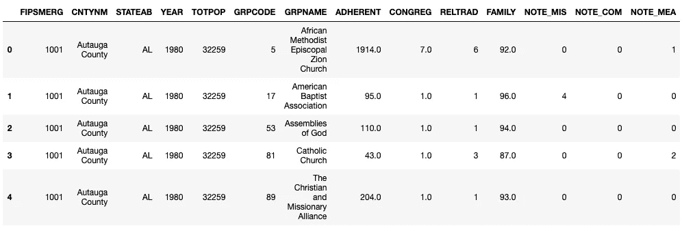
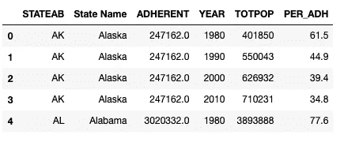
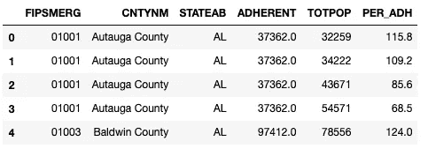
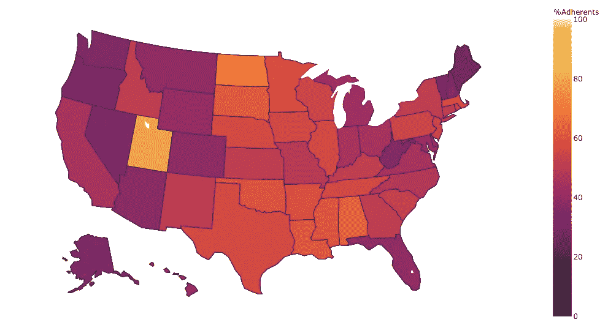
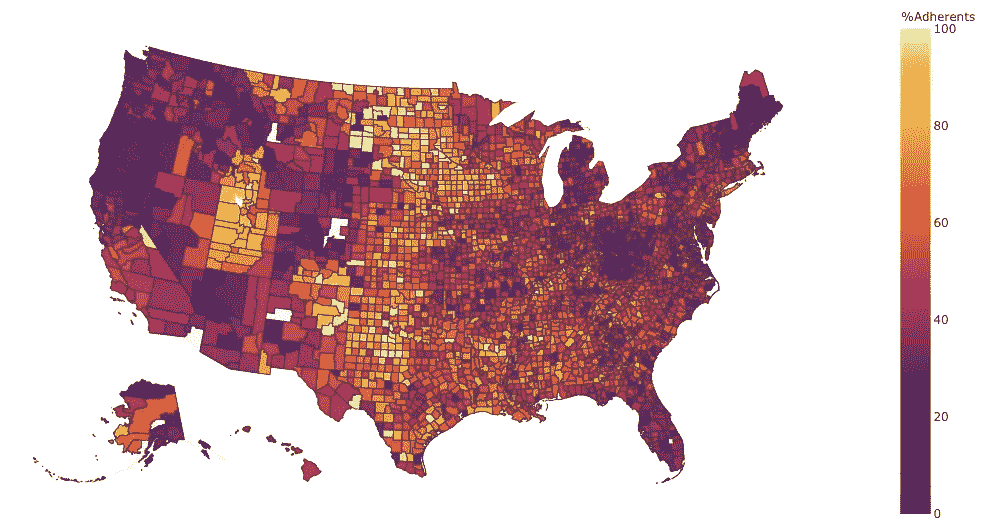
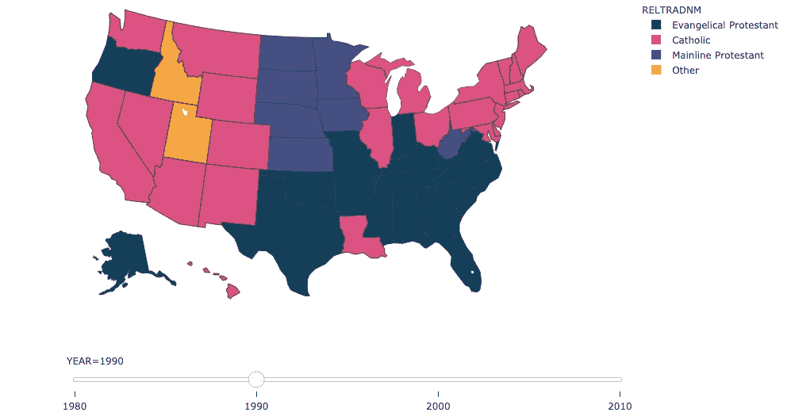
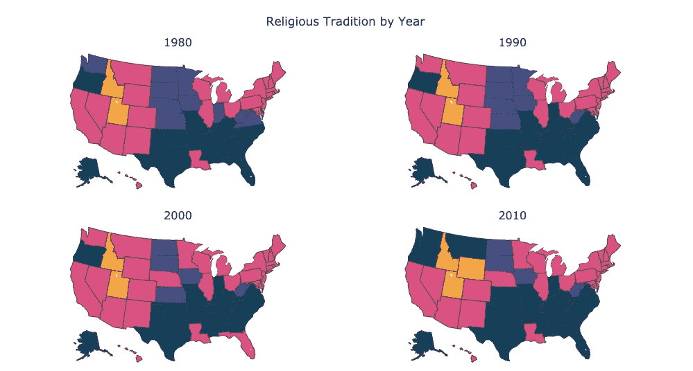

# 使用 Plotly 的 Choropleth Maps - 101

> 原文：<https://towardsdatascience.com/choropleth-maps-101-using-plotly-5daf85e7275d?source=collection_archive---------13----------------------->

## 使用 Plotly 图形库绘制 Choropleth 图的介绍。


谢栋豪在 [Unsplash](https://unsplash.com?utm_source=medium&utm_medium=referral) 上的照片

我已经做了将近 5 年的数据分析师，但是在这段时间里，我主要使用商业智能软件来完成我所有的数据可视化任务。所以我在可视化方面的经验仅限于知道何时绘制条形图，何时绘制折线图。为了纠正这一点，我最近开始学习 matplotlib 和其他绘图和图形库。这是朝着那个方向的尝试。你可以用它来指导 choropleth 地图，或者 plotly，或者两者都有。希望这有所帮助。


由[绘制的地图我们的数据世界](https://ourworldindata.org/)

Choropleth 地图是一种专题地图，其中的区域按照统计变量的比例进行阴影化或图案化(来自维基百科)。例如，这张地图显示了 2016 年肥胖成年人的比例。

**Plotly** 是一家总部位于加拿大的公司，开发分析和数据可视化工具。他们为 Python 创建了一个开源的科学图形库，我正在这里使用它。

为了这个任务，我正在寻找美国宗教信徒的数据(来源:[theARDA.com](https://www.thearda.com/))。该数据包含 1980 年、1990 年、2000 年和 2010 年不同宗教团体的县级信息。它还包括该年各县的人口，以及其他一些信息。

因此，让我们首先加载我们将需要的数据和库。

```
***#import libraries*** %matplotlib notebook
import pandas as pd
import numpy as np
import matplotlib.pyplot as plt
import plotly.express as px
import plotly.graph_objects as go
from plotly.subplots import make_subplots***#import raw data*** df = pd.read_excel(‘RCMSMGCY.xlsx’, dtype={“FIPSMERG”: str})
df.head()
```



现在，接下来的 3 个步骤涉及清理、过滤和汇总数据以供分析，因此如果您愿意，可以跳过这一步，直接进入 Choropleth 图。

## **数据清理**

为了绘制美国县数据，我将使用 FIPS 代码，存储在 FIPSMERG 列中。FIPS 代码是唯一的 5 位数字代码，用于标识美国的县。从上面的数据快照可以看出，在前 5 行中，FIPSMERG 只有 4 位数。这意味着前导零丢失了。让我们用 lambda 函数添加它。

```
***#adding 0 to FIPS code***
df[‘FIPSMERG’] = df[‘FIPSMERG’].apply(lambda x: str(0)+str(x) if len(str(x))<5 else x)
```

现在，每个宗教团体都被归类到一个宗教传统和家庭中，由 RELTRAD & FAMILY 列表示。我添加了这些类别的名称和州名，以使数据更容易理解。

```
***#religious family name mapping (FAMILY)***
rel_fam = pd.read_csv(‘religious_family.csv’)
***#religious tradition name mapping (RELTRAD)***
rel_trad = pd.read_csv(‘religious_tradition.csv’)
***#merging the 2 dataframes on group Code to get the corresponding religious family name & religious tradition catgeory*** df = pd.merge(pd.merge(df, rel_fam, left_on=’FAMILY’, right_on=’FAMILY’, how=’left’), rel_trad, left_on=’RELTRAD’, right_on=’RELTRAD’, how=’left’)
print(‘Shape: ‘+str(df.shape))***#state names mapping (STATEAB)***
state_code = pd.read_csv(‘us_state_code_data.csv’)
***#merging the dataframes***
df = (pd.merge(df, state_code, left_on=’STATEAB’, right_on=’Postal 
Code’, how=’inner’)).drop([‘Postal Code’], axis = 1)
```

## **过滤数据**

对于分析的第一部分，我想看看 2010 年州和县一级信徒的百分比。为此，我需要人口和信徒的数量。

```
***#filtering data for only 2010*** 
df_2010 = df[df['YEAR']==2010]***#population at county level (year wise)***
pop_county = df[[‘YEAR’,’FIPSMERG’,’STATEAB’, ‘State Name’, ‘CNTYNM’, ‘TOTPOP’]].drop_duplicates().reset_index(drop=True)***#population at state level (year wise)***
pop_state = pop_county.groupby(by=[‘YEAR’,’STATEAB’, ‘State Name’]).agg({‘TOTPOP’:sum}).reset_index()
```

## **汇总数据**

下一步是计算州和县一级信徒的百分比。使用 pandas groupby 函数和人口估计值，我创建了两个数据框架，一个汇总了州一级的数据，另一个汇总了县一级的数据。

```
***#creating state level data for %of adherents***
adh_state = df_2010.groupby(by=['STATEAB','State Name']).agg({'ADHERENT':sum}).reset_index()
adh_state = pd.merge(adh_state, pop_state[['YEAR','STATEAB', 'TOTPOP']], left_on='STATEAB', right_on='STATEAB', how='inner')
adh_state['PER_ADH'] = np.round(adh_state['ADHERENT']/adh_state['TOTPOP']*100,decimals=1)
```



州级汇总

```
***#creating county level data for %of adherents***
adh_county = df_2010.groupby(by=[‘FIPSMERG’, ‘CNTYNM’, ‘STATEAB’]).agg({‘ADHERENT’:sum}).reset_index()
adh_county = pd.merge(adh_county, pop_county[[‘FIPSMERG’, ‘TOTPOP’]], left_on=’FIPSMERG’, right_on=’FIPSMERG’, how=’inner’)
adh_county[‘PER_ADH’] = np.round(adh_county[‘ADHERENT’]/adh_county[‘TOTPOP’]*100,decimals=1)
```



县级汇总

## Choropleth 地图

现在，我们已经准备好了州和县一级的数据框架，我们可以绘制 Choropleth 图。我正在使用来自 plotly.express 的函数 [choropleth](https://plotly.github.io/plotly.py-docs/generated/plotly.express.choropleth.html)

choropleth 函数的 locations 参数与 locationmode 参数协同工作。对于美国州数据，locationmode = "USA-states "和 location 参数将采用州代码(AL、CA 等)。

```
***#shows %adherents at state level for the year 2010***
fig1 = px.choropleth(adh_state, locations=adh_state[‘STATEAB’], locationmode=”USA-states”,
 color=’PER_ADH’,color_continuous_scale=”inferno”,
 range_color=(0, 100),scope=”usa”,labels={‘PER_ADH’:’%Adherents’},hover_name=’State Name’,
 hover_data={‘STATEAB’:False,’State Name’:False,’ADHERENT’:False,’TOTPOP’:False,’PER_ADH’:True})fig1.update_layout(margin={“r”:0,”t”:0,”l”:0,”b”:0})
fig1.show()
```



要绘制各县的数据，请使用参数 geojson，该参数采用面的要素集合。你可以在这里 *找到我们这些县 [*的收藏。*同样，将位置参数设置为 FIPS 代码。](https://raw.githubusercontent.com/plotly/datasets/master/geojson-counties-fips.json)*

```
with urlopen(‘[https://raw.githubusercontent.com/plotly/datasets/master/geojson-counties-fips.json'](https://raw.githubusercontent.com/plotly/datasets/master/geojson-counties-fips.json')) as response:
 counties = json.load(response)***#plot %adherents at county level for the year 2010***
fig1 = px.choropleth(adh_county, geojson=counties, locations=’FIPSMERG’, color=’PER_ADH’,color_continuous_scale=”inferno”,
 range_color=(0, 100),scope=”usa”,labels={‘PER_ADH’:’%Adherents’},hover_name=’CNTYNM’,
 hover_data={‘FIPSMERG’:False,’CNTYNM’:False,’STATEAB’:False,’ADHERENT’:False,
 ‘TOTPOP’:False,’PER_ADH’:True})
fig1.update_layout(margin={“r”:0,”t”:0,”l”:0,”b”:0})
fig1.show()
```



现在我们知道了如何创建 Choropleth 地图，让我们试着给它们添加更多的功能。对于分析的第二部分，我想看看各州最大的宗教传统团体在 1980 年至 2010 年间是如何变化的。我将在我的 choropleth 地图上添加一个滑块，并使用它来改变年份。

首先，我需要确定每个州每年最大的传统群体。

```
df_ = df.copy()reltrad = df_.groupby([‘YEAR’,’STATEAB’,’State Name’,’RELTRADNM’]).agg({‘ADHERENT’:sum}).reset_index()
reltrad = pd.merge(reltrad, pop_state, left_on=[‘YEAR’,’STATEAB’,’State Name’], right_on=[‘YEAR’,’STATEAB’,’State Name’], how=’inner’) 
reltrad[‘PER_ADH’] = (reltrad[‘ADHERENT’]/reltrad[‘TOTPOP’])*100**#adding Ranks and filtering Rank = 1**
reltrad[‘RANK’] = reltrad.groupby([‘YEAR’,’STATEAB’])[‘PER_ADH’].rank(ascending=False,method=’first’)
reltrad_top = reltrad[reltrad[‘RANK’]==1].reset_index(drop=True)
```

要添加滑块，请使用函数 choropleth 的参数 animation_frame。

```
n = [‘Evangelical Protestant ‘,’Mainline Protestant ‘,’Black Protestant ‘,’Catholic ‘,’Orthodox ‘,’Other ‘]
cdm = dict(zip(n, [‘#003f5c’,’#444e86',’#955196',’#dd5182',’#ff6e54',’#ffa600']))figz = px.choropleth(reltrad_top, locations = ‘STATEAB’, locationmode = “USA-states”, scope = “usa”,
 color = ‘RELTRADNM’, hover_name = ‘State Name’, 
 color_discrete_map = cdm,
 hover_data = {‘YEAR’:False,’STATEAB’:False,’State Name’:True,’RELTRADNM’:False,
 ‘ADHERENT’:False,’TOTPOP’:False,’PER_ADH’:False,’RANK’:False}, 
 animation_frame=’YEAR’)figz.update_layout(margin={“r”:0,”t”:0,”l”:0,”b”:0})
figz[“layout”].pop(“updatemenus”)
figz.show()
```



我认为滑块在这里没有达到预期的目的。当你不得不在几年之间不停地移动时，比较这些州是很麻烦的。所以，我认为支线剧情会更好。

现在，因为一个 choropleth 没有参考笛卡尔坐标系，我们不能在子情节中使用 plotly.express' Choropleth 函数。所以我将在这里使用 plotly.graph_objects 中的 [choropleth](https://plotly.github.io/plotly.py-docs/generated/plotly.graph_objects.Choropleth.html) 函数。

```
ndf = reltrad_top[[‘YEAR’,’STATEAB’,’RELTRADNM’,’State Name’]]
ndf = pd.merge(ndf, df_[[‘RELTRADNM’,’RELTRAD’]].drop_duplicates(), left_on=’RELTRADNM’, right_on=’RELTRADNM’, how=’left’)
ndf[‘text’] = ‘State: ‘ + ndf[‘State Name’] + ‘<br>’ + ‘Tradition: ‘+ ndf[‘RELTRADNM’]years = (ndf[‘YEAR’].sort_values(ascending=True).unique()).tolist()cscale = [‘#003f5c’,’#444e86',’#dd5182',’#ffa600',’#ff6e54',’#955196']
rows = 2
cols = 2
fig = make_subplots(rows=rows, cols=cols, 
 specs = [[{‘type’: ‘choropleth’} for c in np.arange(cols)] for r in np.arange(rows)],
 subplot_titles = years, vertical_spacing=0.1, horizontal_spacing=0)for i, y in enumerate(years):
 fig.add_trace(go.Choropleth(locations=ndf.STATEAB[ndf[‘YEAR’]==y],z = ndf.RELTRAD[ndf[‘YEAR’]==y],
 locationmode = ‘USA-states’, zmin=1, zmax=6, colorscale=cscale,hoverinfo=’text’,
 hovertext=ndf.text[ndf[‘YEAR’]==y]), row = i//cols+1, col = i%cols+1)fig.update_layout(title={‘text’:’Religious Tradition by Year’, ‘xanchor’: ‘center’,’x’:0.5},
 **{‘geo’ + str(i) + ‘_scope’: ‘usa’ for i in [‘’] + np.arange(2,rows*cols+1).tolist()},
 coloraxis_showscale=False, margin={“r”:10,”t”:70,”l”:10,”b”:0},
 hoverlabel=dict(bgcolor=’#e6e6e6', font_size=12, font_family=”Rockwell”))fig.update_traces(showscale=False)
fig.show()
```



现在，我们有了。希望这个指南能在某些方面帮助你。你可以在这里找到数据和完整的源代码。你也可以跳到 Neptune.ai 的 Plotly Python 教程[这里](https://bit.ly/2Ssg2YF)获得更多的提示和技巧。

*PS:仅将此用作 Plotly 和 Choropleth 地图的指南。不要把数据看得太重。数据来源基于 ARDA 进行的调查，因此可能遗漏了较小的宗教团体，尤其是在 1980 年和 1990 年。*

*PPS:第一次写作，所以请原谅我的错误。欢迎建设性的反馈。提前感谢。*