# 带叶的 Choropleth 图

> 原文：<https://towardsdatascience.com/choropleth-maps-with-folium-1a5b8bcdd392?source=collection_archive---------7----------------------->

## 2018 年西班牙各社区总出生率的可视化

**choropleth 地图**是一个专题地图，根据地图上显示的统计变量对区域进行着色。这种可视化对于使用顺序配色方案来表示某个区域中测量值的可变性非常有用(测量值越高，颜色越强)。在这篇文章中，我们将学习如何使用**叶子**创建 choropleth 地图，以可视化**西班牙**各社区的**(每 1000 名居民的出生率)**。

# 探索性数据分析和数据清理

**探索性数据分析**包括分析数据集的主要特征，通常采用**可视化方法**和**汇总统计**。目标是理解数据，发现模式和异常，并在我们执行进一步评估之前检查假设。

在这篇文章中，我们采用了一个数据集，其中包含了从 1975 年到 2018 年西班牙各社区的总出生率(每 1000 名居民的出生率)的信息。

数据集(选项—*CSV separado por；*)可从以下链接下载:

 [## tasa Bruta de Natalidad for community autonom。无尾。自治社区。印度人…

### 自治社区土著居民基本情况表。无尾。自治社区。民主指数…

datos.gob.es](https://datos.gob.es/es/catalogo/ea0010587-tasa-bruta-de-natalidad-por-comunidad-autonoma-anual-comunidades-autonomas-indicadores-demograficos-basicos-identificador-api-1432) 

探索性分析的第一步包括使用[**Pandas . read _ CSV**](https://pandas.pydata.org/pandas-docs/stable/reference/api/pandas.read_csv.html)函数将 **csv 文件**加载到 Pandas 数据框中，并使用 [**pandas 可视化前 5 行。data frame . head**](https://pandas.pydata.org/pandas-docs/stable/reference/api/pandas.DataFrame.head.html)**方法。我们跳过了文件开头的 5 行(**skip prows = 5**)和底部的 2 行( **skipfooter=2** )，因为它们不包含有用的信息(只是关于正在显示的数据的注释)。**

**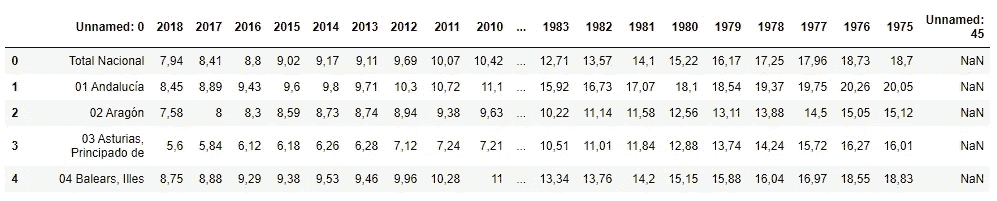**

**很容易观察到，数据帧的最后一列不包含有用的信息，应该删除。此外，我们必须用一个更具描述性的名称来修改第一列的名称。**

**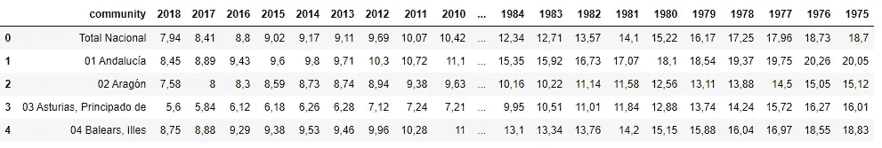**

**在删除并重命名列之后，我们可以使用 [**pandas 来评估数据类型和缺失值。DataFrame.info**](https://pandas.pydata.org/pandas-docs/stable/reference/api/pandas.DataFrame.info.html) 方法。**

**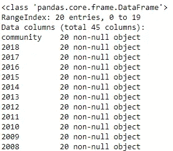**

**如上所示，数据集不包含空值，但是数据类型不是预期的类型。列 1975–2018 属于 object 类型，但它们包含数字数据。我们可以使用 [**熊猫将这些列转换成浮动。Series.astype**](https://pandas.pydata.org/pandas-docs/stable/reference/api/pandas.Series.astype.html) 函数，将逗号前的句点替换为**熊猫。Series.str.replace****

**正如我们所观察到的，我们已经成功地将 1975–2018 列的数据类型从对象修改为浮点数。**

**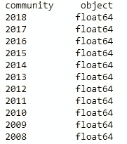**

**现在！我们有一个干净的数据集来创建 choropleth 地图:)**

# **带叶的 Choropleth 图**

# **数据帧的修改**

****leave**是一个 python 库，允许你创建多种类型的传单地图。为了创建一个 **choropleth 地图**，**叶子**需要一个 **Geo JSON** 文件，包括该地区的地理空间数据。对于西班牙的 choropleth 地图，我们需要一个 Geo JSON 文件来定义所有社区的边界。您可以从以下链接下载该文件:**

** [## code for America/click _ the _ hood

### permalink dissolve GitHub 是 4000 多万开发人员的家园，他们一起工作来托管和审查代码，管理…

github.com](https://github.com/codeforamerica/click_that_hood/blob/master/public/data/spain-communities.geojson) 

为了成功绑定**数据框**和 **json 文件**，数据框**中的社区名称必须与 **json 文件**中的社区名称完全匹配。因此，我们必须分析 **json 文件**中包含哪些名称，并相应地修改**数据帧**中的名称。**

以下代码显示了我们如何在 json 文件中获取社区的名称:

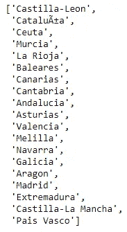

json 文件中的名称

如上图所示， **json.load()** 方法返回一个 **Python 字典**。然后，我们遍历字典来获得社区的名称。

现在，我们用 **json 文件**的名称来修改**数据帧**的名称。请注意，我们已经创建了一个 json 文件名列表，其顺序与它们在数据框中出现的顺序相同。

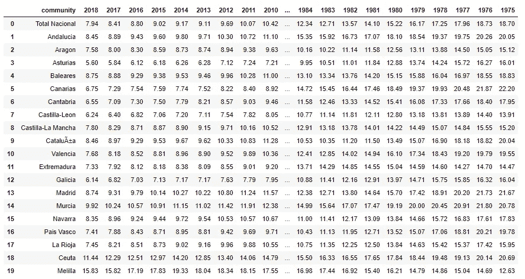

修改的数据帧

现在！我们准备使用**叶子**来创建 choropleth 地图。

# choropleth 图的生成

首先，我们创建一个**叶子地图对象，**以【40.416775，-3.703790】为中心(**位置**参数允许将地图居中在一个特定的位置)。我们还提供了一个初始缩放级别为 6 的**来放大地图。尽管有初始缩放级别，但生成的地图是交互式的，这意味着您可以轻松地放大和缩小。最后，我们指定了**瓷砖** ( **雄蕊水彩)**。**

一旦创建了地图对象，我们就使用**显示 choropleth 地图。choropleth()** 法(我们也可以用**叶。Choropleth()** 函数)。该方法将**数据帧**中包含的**数据**与 **json 文件**的**几何图形**绑定。

下图描绘了 2018 年西班牙各社区的**毛出生率**(每 1000 名居民的出生人数)。

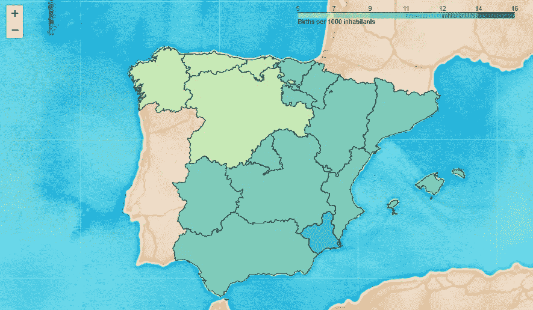

正如你所观察到的，北部地区的出生率较低。

梅利利亚是一个西班牙自治城市，位于非洲西北海岸，与摩洛哥接壤。这座城市的出生率是西班牙最高的。为了正确观察梅利利亚，我们需要放大。

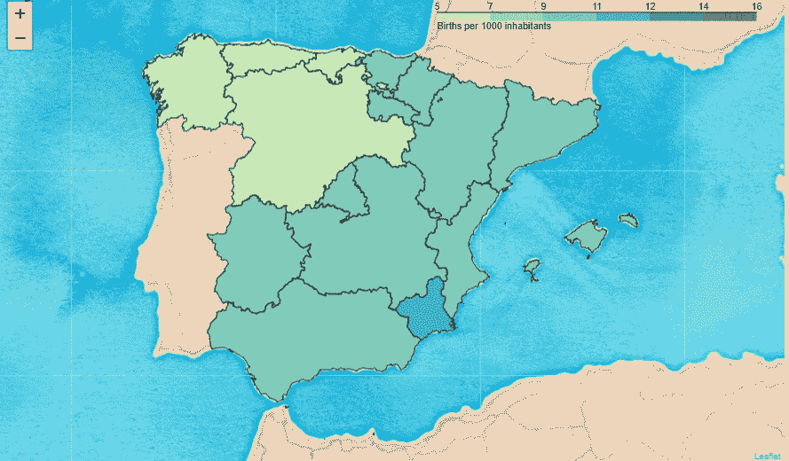

# 地图的定制

在**叶**中有多个参数可以自定义 **choropleth 贴图**。以下参数是我们之前在可视化中使用的参数:

## 地图功能

*   **位置** →地图经纬度。
*   **zoom_start** →地图的初始缩放级别。
*   **平铺** →地图平铺。

## Choropleth 函数

*   **地理数据→**JSON 文件的名称。该文件必须位于工作目录中。
*   **数据→** 包含数据的数据帧的名称。
*   **列→** 用于生成 choropleth 图的列。
*   **包含国家名称的 json 文件中的 key_on →** Key。
*   **填充颜色→** 可视化中使用的颜色方案。
*   **fill_opacity** →区域填充不透明度，范围 0–1(默认为 0.6)。
*   **线不透明度** → GeoJSON geopath 线不透明度，范围 0–1(默认为 1)。
*   **图例 _ 名称** →图例标题(默认空字符串)。
*   **smooth_factor →** 在每个缩放级别上将折线简化多少。

接下来，我详细解释一下我认为特别相关的三个参数:(1) **tiles** 、(2) **zoom_start** 、(3) **fill_color** 。

## 瓷砖

follow 包含多个内置 tilesets 来定制您的可视化。当创建一个地图对象时，我们可以很容易地用关键字 **tiles** 指定一个地图块。

我们可以使用**叶创建多个瓷砖层。Tilelayer()** 函数并将它们追加到地图中。为了在图层之间切换，我们添加了一个图层控件对象(**leav。LayerControl()** )到贴图如下。

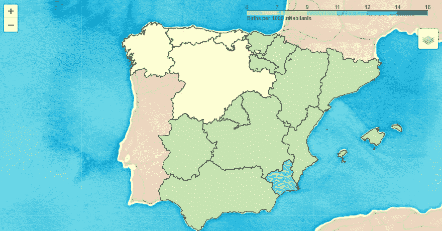

平铺层控制

## 缩放开始

在叶，地图是交互式的，这意味着我们可以很容易地放大和缩小。然而，当生成地图对象时，我们可以使用参数( **zoom_start** )指定初始缩放级别。如下所示，我们使用三种不同的初始缩放级别创建一个地图对象:(1) 2，(2) 4，(3) 6。

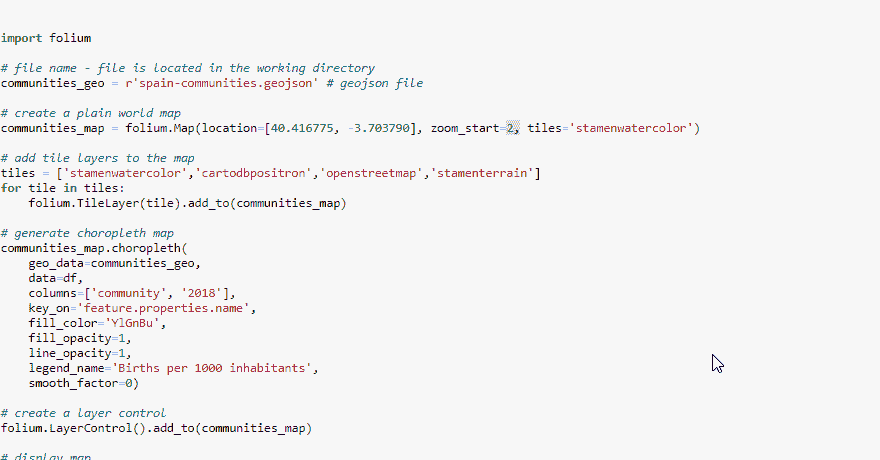

初始缩放级别的修改

## 填充颜色

正确传达你的信息的一个关键点是为你的设计选择一个合适的配色方案。**配色**主要有三种类型:(1) **顺序**、( 2) **发散**、(3) **定性**。

*   **顺序配色方案**从低到高进行逻辑排列，非常适合表示不包含关键中点或有序分类数据(低/中/高)的数字数据。

顺序配色方案

*   **发散配色方案**突出显示高于或低于有趣的中点值(如平均值)的值。发散方案用于可以被中点有意义地分割的数据。

发散配色方案

*   **定性颜色方案**用于名义分类数据(即数据没有内在排序)。类别之间的差异以不同的色调显示，亮度和饱和度相似。

定性配色方案

在我们的地图中，我们使用了**顺序配色方案**，因为我们想要表示一个没有有趣中点的数字变量(**总出生率**)。如下图所示，我们尝试了四种不同的**调色板**:(1)“YlGnBu”，(2)“BuPu”，(3)“OrRd”，(4)“RdPu”。

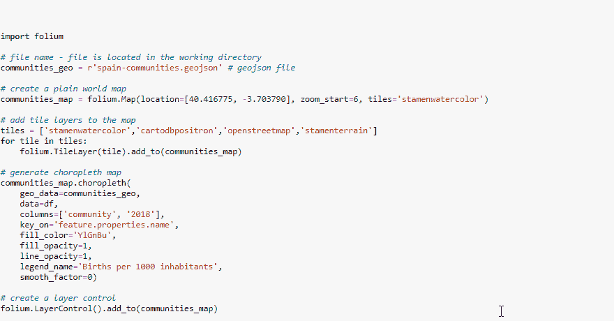

颜色的修改

正如你所观察到的，**叶子**为设计 **choropleth 贴图**提供了极大的灵活性。看一看文档，发现更多的参数来定制您的地图！🍁！

 [## 叶子——叶子 0.10.1 文件

### 使用用于绘制地图的 Python 和 fleed . js 类制作漂亮的交互式地图。基地…

python-visualization.github.io](https://python-visualization.github.io/folium/modules.html) 

# 信息标签

作为一个附加功能，我们使用**follow . features . geojsontooltip()**函数在悬停时显示社区的名称。我们提供想要显示的 **GeoJson** “属性”的标签作为输入(在本例中为**名称】**)。接下来，我们定义标签的样式，用 CSS 语言提供一个字符串。该语言描述了 **HTML** 元素应该如何显示。

在创建了 **GeoJsonTooltip** 对象之后，您可以将它传递给由 **Choropleth** 函数创建的 **geojson** 对象。

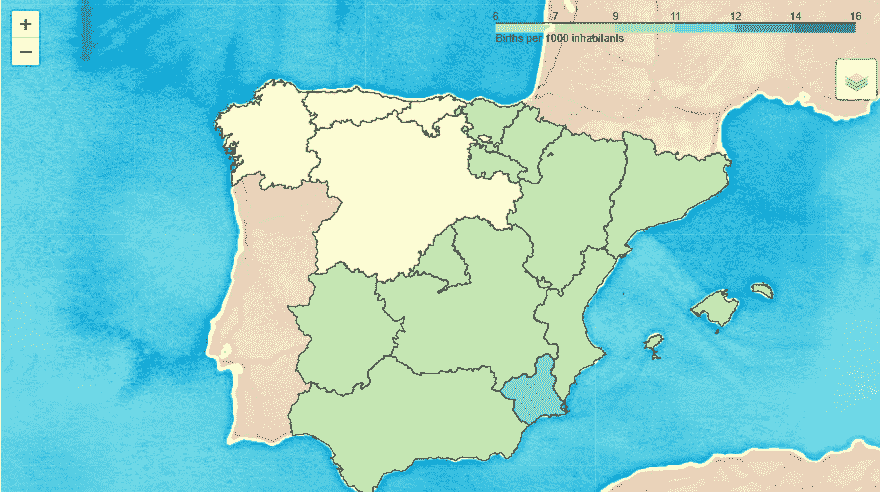

带有社区名称的标签

瞧！有标签的地图！

我鼓励你尝试用**叶子**来创建 choropleth 地图，记住在所有的地图中，我们已经可视化了**2018**年**总出生率**(每 100 名居民的出生率)。如果您想显示另一个年份，您只需将年份提供给**叶的参数(**列)**。Choropleth()函数。**

在以后的文章中，我将解释如何用其他库如 **Plotly** 或 **Geoviews** 创建地图。Sooo，继续读！

🍀阿曼达🍀**