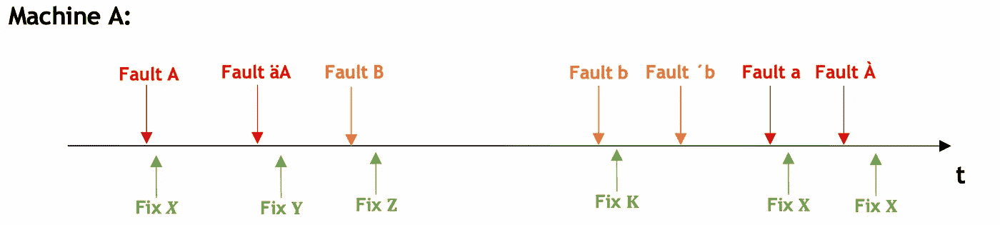

# 使用 Python 中的 NLTK 和 Fuzzy Wuzzy 构建故障故事并提高可靠性

> 原文：<https://towardsdatascience.com/chronic-failure-stories-for-better-component-reliability-using-python-64e142e112e1?source=collection_archive---------77----------------------->

## NLP 如何应用于航空或其他机器的部件可靠性分析

来源: [@flyingraffi](https://unsplash.com/@flyingraffi) 上[未刷](https://unsplash.com/)

O 操作员或机械师一般在看到机器(大型卡车、飞机或轮船)出现问题时，会在存储这类信息的历史故障手册或系统中描述并报告([***mro***](https://www.thomasnet.com/articles/procurement/what-is-mro/))。

在航空领域，每个故障都必须报告(由飞行员或机械师)。通常，这些故障是手工编写的，并存储在计算机系统中。但是作为人类，错误或描述失败的方式并不总是一致的，或者可能有打字错误，这使得很难联系或创建一个**慢性失败史**。

在离开之前，我们将定义什么是**故障历史**:

想象一条时间线(图 1 ),其中每个向下的箭头代表机器上的一个故障或问题，向上的箭头代表故障的解决方案，颜色代表相同的故障，但在词汇上它们是不同的。

随着时间的推移，会出现许多故障和解决方案，因此系统之间一定存在某种关系或模式，这可能是我们在通常的分类形式中所看不到的(故障通常按机器系统进行分组，但并不总是正确分类)。在这种情况下，对于红色故障，解决方案 X 比 y 更有效。

图 1:机器 A 的故障历史

所以我们有可以改善的情况:

*   能够对同一**故障模式**下的故障进行分组。
*   能够确定这种故障模式的最佳可能解决方案，从而保证更好的可靠性。

首先，我们可以定义一个问题，其中我们有 3 台机器，我们将只关注其中的 3 个系统，每个系统都有独立的故障(MF)，有不同的纠正措施。我们可以在图 2 中看到:

图 2:明确的问题

故障模式(MF)是部件的确切故障。我们不会深入 MF 的分类，但它可以通过专业工程师或部件手册进行组装。这是一个重要的输入，我们必须集中调查。无论如何，如果我们没有它，我们可以通过观察系统之间的单词可重复性来建立它，然后在专家工程师的支持下，定义故障模式。

# 噪声消除

让我们继续图 2 中提出的问题:我们有一个数据库，其中包含图 2 中 3 台机器的 MF 信息，它们的 3 个系统是:

1.  我们将寻找与我们的任何失败都不相关的词，以及机械师已经写下的词，例如，“*今天我发现了问题 X* ”，在本文中，只有“ *X* ”是重要的，其他所有我们必须消除的词，在文献中这种词被称为“停用词”。为此，我们将使用 [**Python NLTK 库**](https://www.nltk.org) 。
2.  在清理完我们所有的文本后，最好对我们归类为错误的单词进行第二次检查，但这第二步最好依靠专家工程师，我们将使用一种称为 ***标记化*** 的技术来进行单词处理。

这个过程可以在图 3 中清楚地看到:

图 3:文本数据处理

因此，用于标记化和文字处理的 python 代码如下:

图 4:实际情况

在前面的代码中，我们将机械师编写的所有内容进行了分组，并使用 NLTK 来消除*单词 stop* ，即使如此，在图 5 的图表中，我们可以看到我们可以继续移除与 MF 无关的单词，例如， *found* 、、 *form* 等。

图 Python 之后的词频

我们将继续清理我们的代码，我们将消除所有我们知道不是失败的单词(我们可以咨询专家)，我们还将消除所有的数字。

# **开始开发吧！**

现在，看上面的图，我们可以使用 pandas 来编写我们真正的代码(上一个是解释*标记化*的前一个)。我们将使用图 5 中的图表，我们将清理我们的代码，我们将删除停用词，然后我们将使用[***fuzzywuzzy***](https://github.com/seatgeek/fuzzywuzzy)匹配库，然后我们将对结果进行注释。

[***fuzzywuzzy***](https://github.com/seatgeek/fuzzywuzzy)匹配是每个人与每个人，按系统名称和每个人与每个人进行匹配会很有趣，在此之后，留下最佳结果(我们可以将此作为后续步骤)。

图 6:结果

在图 6 中，我们得到了问题的结果。
‘故障名称 _ 清除’列是我们去除了所有噪声的故障。
‘故障名称 _ 原始’列是由机械师编写的列。
‘模式 _ 故障’是每个系统 MF 词汇表的最佳匹配故障模式。
最后，列‘匹配’匹配‘故障 _ 名称 _ 清除’和‘模式 _ 故障’的百分比。

在绿色中，我们可以看到我们拥有的巧合，例如，我们成功地将 62%归类为“问题 v break”(“id _ failure”= 11)，这非常好！另一方面，红色表示仍有大量噪声可以消除

# 下一步！

大型机器上的系统可能非常多样，MF 甚至更多，因此进行交错匹配、系统之间的测试或同一系统的测试并最终留下所有匹配中的最佳匹配将非常有用(因为一个系统有其自己的 MF，但有时系统的选择可能是错误的)。了解更多关于[**【NLTK】**](https://www.nltk.org)以及查看同义词或反义词选项也是不错的。另一方面，与专家坐下来消除所有可能的噪音是很好的，噪音总是存在的。

我们仍然必须分析纠正措施，选择最佳解决方案，这样我们就可以得到 MF 排名及其最佳纠正措施。这可以通过查看对于相同的故障和机器，哪个动作花费最长时间而不再次失败来确定。我们已经迈出了创建失败案例的第一步，现在还缺少拥有完整工具的下一步。