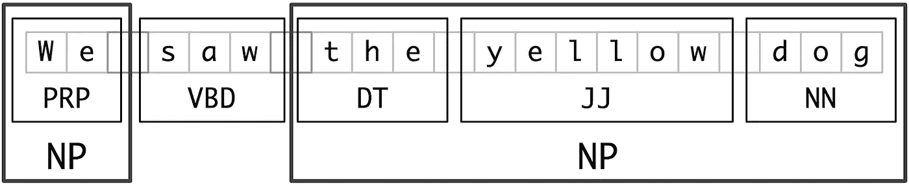
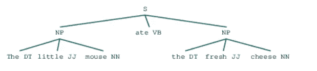
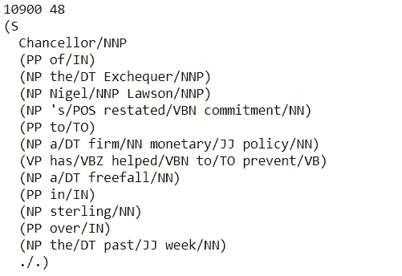
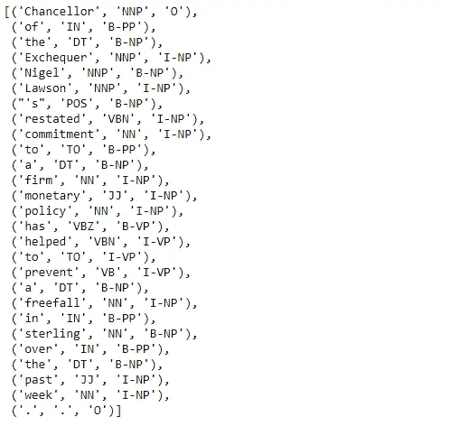
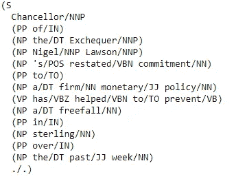
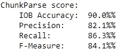
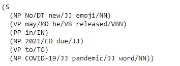
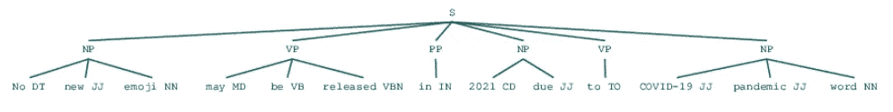

# 自然语言处理中的分块:解码

> 原文：<https://towardsdatascience.com/chunking-in-nlp-decoded-b4a71b2b4e24?source=collection_archive---------8----------------------->

## 它在文本处理中起什么作用

当我开始学习文本处理时，我坚持了很长时间的一个话题是组块。(我知道，很难相信🙆)通常，我们可以在网上找到许多文章，从容易到难的主题，但当谈到这个特定的主题时，我觉得没有一篇文章可以对组块有全面的理解，然而下面的一篇文章是我迄今为止研究的所有与该主题相关的文章或视频的合并。

所以下面是我对组块的理解。

# 那么，什么是组块？

组块是从非结构化文本中提取短语的过程，这意味着分析句子以识别成分(名词组、动词、动词组等)。)然而，它没有具体说明它们的内部结构，也没有说明它们在主句中的作用。

它工作在词性标注之上。它使用词性标签作为输入，并提供组块作为输出。

> 简而言之，组块意味着将单词/标记分组为组块

# 为什么需要？

我曾经认为，在我进一步了解这些主题之前，通常文本处理是通过简单地将句子分解成单词来完成的。所以简单的打断文字并没有太大的帮助。知道这个句子涉及到一个人、一个日期、一个地点等等是非常重要的..(不同实体)。所以他们单独是没有用的。

> 组块可以将句子分解成比单个单词更有用的短语，并产生有意义的结果。
> 
> 当你想从文本中提取信息时，比如地点、人名，组块是非常重要的。(实体提取)

让我们从头开始理解它。

一个句子通常遵循由以下部分组成的层次结构。

## 句子→从句→短语→单词

词组组成短语，有五大类。

*   名词短语
*   动词短语
*   形容词短语
*   副词短语
*   介词短语

***短语结构规则:***

S -> NP VP

NP--> { Det N，Pro，PN}

VP -> V (NP) (PP) (Adv)

PP -> P NP

AP -> A (PP)



组块:短语被分成组块(来源:[https://www.nltk.org](https://www.nltk.org/book/ch07.html))

> 在深入研究组块之前，先简要了解一下语法树和语法规则是有好处的。

正如我们所见，这里整个句子被分成两个不同的名词短语。

现在让我们用 python 实验来理解这个概念。

1.  **基于正则表达式的分块**

基于正则表达式模式的分块器代码段



解析树(名词短语基于给定的正则表达式生成)

这里，我们介绍了一个语法。
其中 NP(名词短语)由
DT 组合而成？→一个或零个限定词
JJ* →零个或多个形容词
NN →名词

我们用 NLTK 定义的正则表达式解析器来解析这个语法。正如我们所看到的，整个句子 S 被分成几个组块，并用树状结构表示。基于定义的语法，创建内部树状结构。所以你可以定义你的语法，基于这个句子将被分块。

**2。基于标签的训练分块器**

我使用了“conll2000”语料库来训练 chunker。conll2000 语料库使用 IOB 标签定义组块。

它指定了块的开始和结束位置，以及它的类型。
POS 标签员可以接受这些 IOB 标签的培训

块标签使用 IOB 格式。
IOB : Inside，Outside，Beginning
标签前的 B 前缀表示，它是块的开始
I 前缀表示它在块内
O 标签表示令牌不属于任何块

```
#Here conll2000 corpus for training shallow parser modelnltk.download('conll2000')
from nltk.corpus import conll2000data= conll2000.chunked_sents()
train_data=data[:10900]
test_data=data[10900:]print(len(train_data),len(test_data))
print(train_data[1])
```



“conll2000”数据集的记录

tree2conlltags，conlltags2tree 是分块实用函数。

→`**tree 2 conltags**`，获取三元组(每个令牌的单词、标签、块标签)。然后，这些元组最终用于训练标签器，并且它学习 POS 标签的 IOB 标签。

→ ` **conlltags2tree** `从这些令牌三元组生成解析树
Conlltags2tree()是 tree2conlltags()的反转。我们将使用这些函数训练我们的解析器

```
from nltk.chunk.util import tree2conlltags,conlltags2treewtc=tree2conlltags(train_data[1])
wtc
```



```
tree=conlltags2tree(wtc)
print(tree)
```



```
def conll_tag_chunks(chunk_sents):
    tagged_sents = [tree2conlltags(tree) for tree in chunk_sents]
    return [[(t, c) for (w, t, c) in sent] for sent in tagged_sents]def combined_tagger(train_data, taggers, backoff=None):
    for tagger in taggers:
        backoff = tagger(train_data, backoff=backoff)
    return backoff
```

# tagger 是什么？

它读取文本并给每个单词分配一个 POS 标签。(单词、标签)

**Unigram tagger** :确定 POS 时，只使用一个单词。(基于单词上下文的标记器)

`UnigramTagger`、`BigramTagger`和`TrigramTagger`是继承自基类`NGramTagger`的类，基类本身继承自`ContextTagger`类，后者继承自`SequentialBackoffTagger`类

我们现在将定义一个类`NGramTagChunker`，它将接受带标签的句子作为训练输入，获取它们的**(单词、词性标签、组块标签)WTC 三元组**并训练一个带有`UnigramTagger`的`BigramTagger`作为补偿标签。

我们还将定义一个 parse()函数来对一个新句子执行浅层解析。

```
from nltk.tag import UnigramTagger, BigramTagger
from nltk.chunk import ChunkParserI#Define the chunker class
class NGramTagChunker(ChunkParserI):
  def __init__(self,train_sentences,tagger_classes=[UnigramTagger,BigramTagger]):
    train_sent_tags=conll_tag_chunks(train_sentences)
    self.chunk_tagger=combined_tagger(train_sent_tags,tagger_classes)def parse(self,tagged_sentence):
    if not tagged_sentence:
      return None
    pos_tags=[tag for word, tag in tagged_sentence]
    chunk_pos_tags=self.chunk_tagger.tag(pos_tags)
    chunk_tags=[chunk_tag for (pos_tag,chunk_tag) in chunk_pos_tags]
    wpc_tags=[(word,pos_tag,chunk_tag) for ((word,pos_tag),chunk_tag) in zip(tagged_sentence,chunk_tags)]
    return conlltags2tree(wpc_tags)#train chunker model
ntc=NGramTagChunker(train_data)#evaluate chunker model performance
print(ntc.evaluate(test_data))
```



现在，我们将利用这个模型对我们的新闻标题样本进行浅层解析和分块。

```
import pandas as pd
sentence='No new emoji may be released in 2021 due to COVID-19 pandemic word'
nltk_pos_tagged=nltk.pos_tag(sentence.split())
pd.DataFrame(nltk_pos_tagged,columns=['word','POS tag'])
```


```
chunk_tree=ntc.parse(nltk_pos_tagged)
print(chunk_tree)
```



语法树

```
chunk_tree
```



解析树

你也可以根据需要定义基于分类器的分块器。你可以在这里了解更多。

[https://www . geeks forgeeks . org/NLP-classifier-based-chunking-set-1/？ref=rp](https://www.geeksforgeeks.org/nlp-classifier-based-chunking-set-1/?ref=rp)

## 分块的另一个子过程叫做“分块”

我们创建一个令牌序列，它不包含在块中。所以这是寻找洞察力或背景。(我不在这一部分讨论)

感谢您的阅读。🙏

我试图最大程度地涵盖这个话题。欢迎建议。

作为荣誉奖，我要感谢[迪潘然(DJ)萨卡尔](https://medium.com/u/6278d12b0682?source=post_page-----b4a71b2b4e24--------------------------------)。我一直跟着他的教程从零开始学 NLP。

> 页（page 的缩写）这是我的第一篇技术文章。希望随着学习的进步，我会继续写作。

## 参考

*   https://youtu.be/b4nbE-pG_TM
*   [https://towards data science . com/a-从业者-指南-自然语言-处理-第一部分-处理-理解-文本-9f4abfd13e72](/a-practitioners-guide-to-natural-language-processing-part-i-processing-understanding-text-9f4abfd13e72)
*   [https://www . geeks forgeeks . org/NLP-chunking-and-chinking-with-regex/](https://www.geeksforgeeks.org/nlp-chunking-and-chinking-with-regex/)
*   [https://www . geeks forgeeks . org/NLP-training-tagger-based-chunker-set-1/](https://www.geeksforgeeks.org/nlp-training-tagger-based-chunker-set-1/)