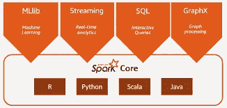
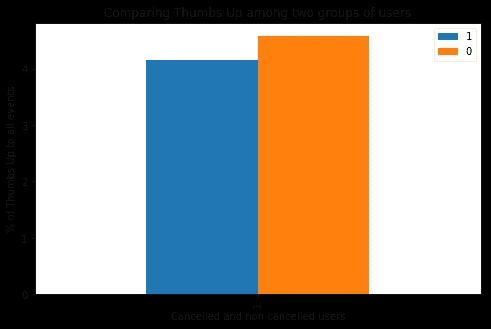
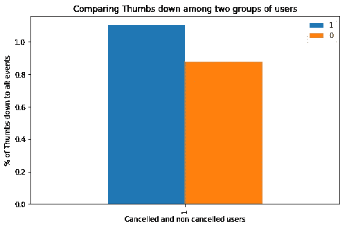
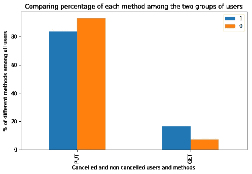
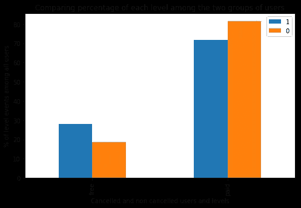
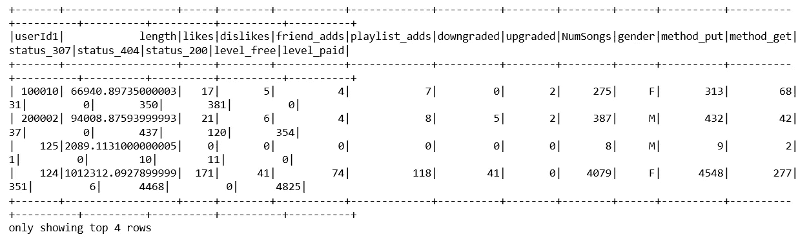
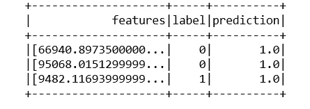
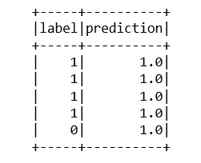

# 流失预测:使用 Apache Spark 的 Sparkify 案例研究

> 原文：<https://towardsdatascience.com/churn-prediction-a-case-study-of-sparkify-using-apache-spark-e67722a84de?source=collection_archive---------46----------------------->

## 音乐流媒体平台用户的大数据建模

**Soure:**[AWS](https://aws.amazon.com/big-data/what-is-spark/)

## 简介:

当前席卷各行业的数字化浪潮导致了数据的爆炸，因为信息正通过各种方式被利用。这一点，加上社交媒体的出现，极大地鼓励了对人工智能的倾向和匹配。[这种倾向建立在从海量数据中获得洞察力的能力上](https://www.forbes.com/sites/charlestowersclark/2019/02/15/big-data-iot-and-ai-part-one-three-sides-of-the-same-coin/#280ccae369da)这些数据有时是实时获得的，同时为依赖这些数据的产品提供动力。Apache Hadoop 和 Spark 正在支持处理这种大数据的技术[。一台计算机无法处理如此大规模的数据集，需要使用计算平台(如亚马逊网络服务(AWS)、微软 Azure、IBM Watson 和谷歌云)在线托管多台计算机。这就引出了本文的目标，它将应用大数据技术(Spark)并在 AWS 上运行，以分析 12 GB 大小的大数据。这里的数据集来自一个名为“Sparkify”的伪音乐流媒体服务的 Udacity。一些用户在作为付费用户使用该服务一段时间后，最终取消了他们的订阅。因此，目标是能够预测此类用户的流失，此处定义为当用户在“取消确认”页面中被跟踪时，使用用户使用平台时测量的不同特征。](https://www.datamation.com/big-data/big-data-technologies.html)

## 业务和数据理解:

使用探索性数据分析(EDA)，可以了解不同用户在决定取消订阅之前的行为。有些事实是惊人的，而有些是清晰的。

1. ***Length:*** 每个用户花在流媒体歌曲上的平均时间长度的合计长度。这表明没有取消用户具有稍高的歌曲平均长度。

2. ***点赞:*** 通过每个用户竖起大拇指的总计数来聚集点赞显示，与后来取消的用户相比，没有取消的用户更倾向于对歌曲竖起大拇指。

**图一。两个用户组在其他事件中的点赞百分比**

3. ***不喜欢:*** 按每个用户的 page -thumbs_down 总数合计不喜欢。与后来取消的用户相比，没有取消的用户不太喜欢歌曲。

**图二。两组用户对其他事件的不喜欢百分比**

4. ***新增好友:*** 按每个用户页面新增好友总数合计新增好友。与后来取消的用户相比，没有取消的用户更倾向于添加朋友(通过“添加朋友页面”与所有其他页面的百分比来衡量)。

5.***Playlist_adds:***按每个用户添加到播放列表的页面总数合计“Playlist _ adds”，显示与后来取消的用户相比，未取消的用户在“add_playlist”页面中出现的百分比更高。

6. ***降级:*** 按页面总计数累计降级-每个用户降级，已知未取消的用户在“降级”页面中出现的百分比比后来取消的用户低。

7. ***已升级:*** 根据每个用户的页面升级总数进行升级，已知未取消的用户比后来取消的用户具有更高的升级百分比。

8. ***NumSongs:*** 通过每个用户的歌曲总数来聚集歌曲，已知没有取消的用户与后来取消的用户相比具有更高的歌曲平均数。“NextSong”页面类似于播放长度不是 None 的有效播放，这应该是歌曲计数的同义词，如果包括在内，不会给模型增加额外的好处。

**图三。流失用户更多地使用 GET 方法。**

9. ***Method_PUT:*** 按每个用户使用 Put 方法的次数汇总 Put 方法。这是因为用户可能使用了不止一种方法，因此，将其设置为简单分类将不会清楚地反映此功能的效果

10. ***Method_GET:*** 按每个用户使用 Get 方法的次数来聚合 Get 方法。与 PUT 方法的逻辑相同

11. ***性别:*** 根据性别对用户进行分组，因为没有用户拥有一个以上的性别。因此，性别是一个纯粹的分类特征。

12. ***【状态 _307:*** 按每个用户使用状态 307 的次数汇总状态。这是因为某些用户使用了不止一种类型状态

13. ***状态 _200:*** 状态由每个用户使用状态的次数 200 来汇总。

14. ***【状态 _404:*** 通过每个用户使用状态 404 来流传送歌曲的次数来聚集状态。

15.***Level _ payed:***根据每个用户使用付费级别播放歌曲的次数来汇总级别。

**图 4。流失用户更多地作为免费用户流入**

**16*。Level_free:*** 根据每个用户使用免费级别播放歌曲的次数来汇总状态。

17. ***注销:*** 汇总每个用户注销的总次数。这表明取消的用户经常被发现已经注销。

## 特征工程:

这显然是任何机器学习中最重要的部分之一，因为无论你在这里做什么，都将决定你的模型能够在多大程度上对用户行为进行分类。对于这个项目，从对数据集(EDA)的探索性分析中获得了一些见解，以了解就其对因变量(此处为标签列)的影响而言可能重复的特征。一些列具有不特定于用户的子特征，因此给定用户可能具有不止一个这样的特征。每个用户使用的级别就是一个例子。有时，可能会发现用户使用了免费级别，后来又使用了付费级别。因为，在这种情况下，它们被设计成计数、总和或平均值的集合，这取决于哪个更有意义。另一方面，有些列是纯分类列，如性别。对于这些，简单的编码(使用字符串索引器)就可以了。其他列是可以使用每个用户的总和来设计的某些变量，例如每个用户的收听时长。在所有情况下，都要避免特征的重复，或者用两个特征来解释相似的事件。显示了一个列有所有所需特征的数据框:

**图 5:简要查看用于建模的特征数据框架**

***空元素:***

因为有些用户没有某些特性的值，所以它们被捕获为 NULL。实际上，考虑到使用了聚合，这些空元素是零值。因此，对于所有列，这些空元素都被替换为零。

***缩放:***

数据集中所有要素的值的范围显示出相当大的差异。因此，对于某些机器学习模型，如逻辑回归，它们需要被缩放。为了找到最合适的定标器，通过绘制所有列的直方图来检查所有特征的分布。这表明偏离了正态分布，在一些特征中存在异常值。因此，选择了 MinMaxScaler 而不是标准 Scaler。

***降维:***

使用主成分分析(PCA)，可以减少为预测而设计的特征，以提高模型的性能，同时加速预测。一项旨在了解不同要素在解释数据集中的差异方面所起作用的测试显示，前 10 个要素解释了数据集中 99.9%的差异。因此，预测中使用了前 10 个特征。

## 建模:

首先在 sparkify 数据集上尝试了三种不同的机器学习模型，看看哪一种能给出更好的预测。F1 分数被用作决定性指标。F1 定义为精确度和召回率的调和平均值。请记住，精度是对所有肯定预测的真实肯定的度量，而召回是对所有肯定标签的真实肯定预测的度量。因此，F1-score 用于捕捉模型在其预测中区分两个类别的程度，同时量化正电子的预测(此处定义为流失或标签== 1)。这与准确性相反，准确性将不会捕捉对将取消其订阅的用户做出的预测有多好。由于这是一个简单的二进制分类问题，即“流失”(标签 1)或“不流失”(标签 0 ),因此使用 multiclassclarticationevaluator 作为评估器。

***将数据分成训练集和测试集:***

数据集按照 0.75/0.25 的顺序分成两部分，训练集具有较大的份额。对于每种机器学习技术，训练集用于拟合/建立模型，而建立的模型应用于测试集以研究性能

***基线模型:***

构建了一个基线模型，用作衡量要在数据集上测试的其他机器学习模型的性能的起点。作为一个典型的二元分类问题，首先想到的模型是逻辑回归模型。使用大多数默认参数，除了定义的`elasticNetParam`、`maxIter`和`regParam`:

`regParam` = [0.3]
`elasticNetParam` = [0.8]

`maxIter` = [10]

逻辑回归分析的准确率和 F1 值分别为 82%和 72%。查看所有对流失用户的预测{1}可以发现，它未能成功预测测试集中的流失。

***随机森林分类器:***

Spark 的分类模块有一个随机森林分类器的实现，它是树和集成分类器的成员。作为被吹捧为分类任务中性能最好的算法之一，这也进行了实验。超级参数针对树的数量`numTree`和树构建的最大深度进行了调整，以使用折叠数量`numFold`等于 3 的交叉验证技术来尝试`maxDepth`。。此参数网格设置为:

`numTree`:【3，5，8，10，12，15】

`maxDepth:` [4，8]

交叉验证后，表现最好的模型的`numTree`为 8，而`maxDepth`为 4。这一最佳表现用于在测试集上进行预测，结果显示***F1-得分*** 为 0.73。该模型能够预测一个正确的流失用户。

使用 RandomForest 进行流失预测

***决策树分类器:***

假设我们有一个少于 200 行的数据框架可用于训练，我认为在预测用户流失时应用一个不太复杂的树技术是明智的，特别是使用***RandomForestClassifier 的不太好的性能。*** 超参数针对树的数量`maxBins`和`maxDepth`进行了调整。使用的参数网格是:

`maxBins`:[2，10，32]

`maxDepth:`【1，2，3】

交叉验证的最佳表现模型是 3 个模型中的`maxDepth`和 32 个模型中的`maxBins`。当该模型应用于测试集时，性能显示出 0.86 (86%)的*，0.85 (85%)的*，0.4 (40%)的*。***

******

***另一种机器学习算法 ***梯度推进树*** 也被测试，以查看是否可以在预测方面有所改进。与 ***决策树分类器*** 相比，这种技术显示出较高的*召回率*为 60%，但较低的 *F1 得分*为大约 82%。***

## **结论:**

**该项目利用了了解 Sparkify 音乐流媒体平台上用户行为的机会。利用***RandomForestClassifier******decisiontreeclassifier***等机器学习模型，可以预测订阅平台的用户可能的离开/取消。由于用户标签中存在巨大的不平衡，这两者对所用数据集的测试集进行预测的能力受到了阻碍。该数据集主要具有未取消的用户，比例为 173/52，只留下很少的数据集用于训练。这使得预测可能的流失更加困难。**

**然而， ***决策树分类器*** 表现更好，其 ***F1 得分*** 为 0.76，而 ***随机森林分类器*** 的 ***F1 得分*** 为 0.73，基准模型使用 ***逻辑回归*** 显示 ***F1 进一步提高性能的步骤包括添加新功能，如*注销*和*长度*从总和变为每个用户的平均值，然后使用 PCA 将功能减少到 10 个最重要的功能(解释了 99.9%以上的差异)，性能在结果(指标)和训练数据集的速度上都有显著提高。这使得 ***决策树*** 的 F1 分数从 76%提高到了 85%左右，同时召回率从 20%提高到了 40%。另一个提高性能的尝试包括测试另一个机器学习模型——***梯度提升树*** ，它看到了大约 82%的 F1 分数和 60%的召回率。*****

*这种改进很好，使我的最佳模型对可能流失的预测达到 60%——考虑到数据集中的不平衡，这个值足够大，不能称之为猜测。*

*此外，由于这种不平衡，有人试图通过 SMOTE 采样来增加流失用户的数量，改编自 [github](https://github.com/Angkirat/Smote-for-Spark/blob/master/PythonCode.py) 的代码。然而，这种尝试并没有产生结果的改善。*

## *建议:*

*进一步的工作应该包括测试其他机器学习算法，如 NaiveBayes。此外，通过对标签进行加权来增加数据集的另一种尝试，以便给予流失用户比非
流失用户更高的权重，可以帮助减轻数据集中不平衡的影响。最后，仍然可以设计更多的特征，同时仍然利用 PCA 将特征的数量减少到最多 10 个。*

****参考文献:****

*[https://github . com/Angkirat/Smote-for-Spark/blob/master/python code . py](https://github.com/Angkirat/Smote-for-Spark/blob/master/PythonCode.py)。

[https://medium . com/@ sajad 1009/credit-card-fraud-detection-with-spark-and-python-high-accuracy-27 A8 ba 8 ed 32](https://medium.com/@sajad1009/credit-card-fraud-detection-with-spark-and-python-high-accuracy-27a8ba8ed32)

[https://www . research gate . net/post/How _ to _ determine _ the _ number _ of _ trees _ to _ be _ generated _ in _ Random _ Forest _ algorithm](https://www.researchgate.net/post/How_to_determine_the_number_of_trees_to_be_generated_in_Random_Forest_algorithm)*

**源代码可以在我的 GitHub 资源库* [***这里***](https://github.com/cjayidoko/UDACITY_DSND)*

*我欢迎所有读者的评论和改进建议。在引用时，可以自由使用本书的内容和成果。*

***连接:***

*LinkedIn:[Chijioke Idoko](https://www.linkedin.com/in/chijioke-idoko-b14135a4/)*