# 基于 Spark 的 AWS 集群 Sparkify 客户流失预测

> 原文：<https://towardsdatascience.com/churn-prediction-on-sparkify-using-spark-f1a45f10b9a4?source=collection_archive---------60----------------------->

## 我的 Udacity 数据科学家 Nanodgree 的顶点项目


[https://up swell . org/2018/10/01/what-heck-is-a-spark-talk/](https://upswell.org/2018/10/01/what-the-heck-is-a-spark-talk/)

流失预测，即预测可能想要拒绝服务的客户，是机器学习最常见的商业应用之一。这对那些提供流媒体服务的公司尤为重要。在这个项目中，分析了一个虚构的音乐流媒体公司 Sparkify 的事件数据集。完整数据集(12GB)的一小部分(128MB)首先在 Jupyter Notebook 中使用 Spark 中的可扩展脚本进行本地分析，然后在 AWS EMR 集群上分析整个数据集。在这里找到代码。

## 数据准备

我们先来看一下数据。迷你数据集中有 286500 行和 18 列(大数据集中有 26259199 行)。列和前五行如下所示。

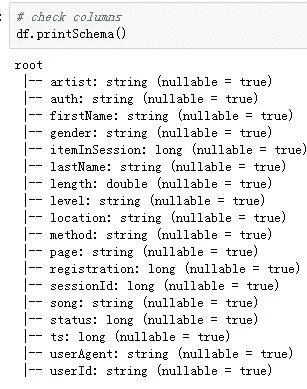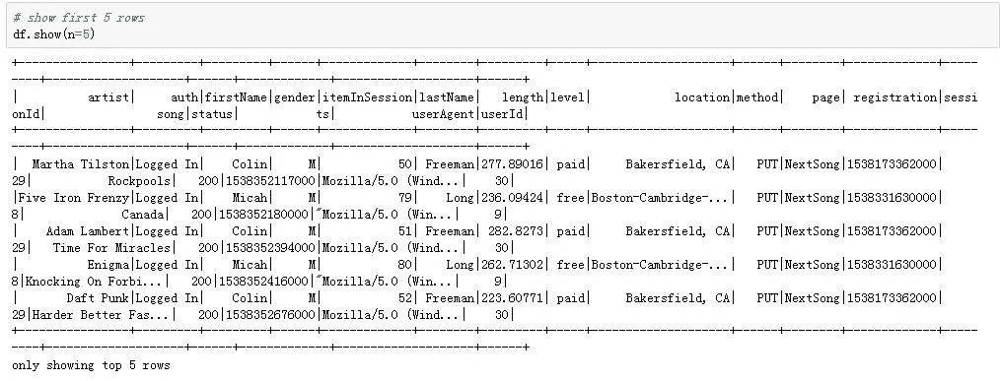

数据帧的前五行

让我们检查数据集中缺失的值。我们将从下表中找到缺失值的模式:在“艺术家”、“长度”和“歌曲”列中有相同数量的缺失值，在“名字”、“性别”、“姓氏”、“位置”、“注册”和“用户代理”列中有相同数量的缺失值。

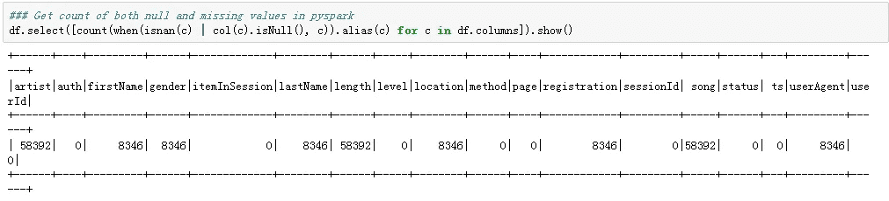

数据帧中缺少值

如果我们仔细观察“userId ”,它的“firstName”丢失了，我们会发现这些“userId”实际上是空字符串(在 bid 数据中是 Id 为 1261737 的用户),正好有 8346 条记录(在 bid 数据中有 778479 行),我决定将其视为丢失的值并删除。这可能是某个只访问过 Sparkify 网站而没有注册的人。


UserId 中的空字符串

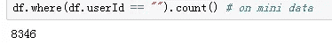

缺失用户 Id 的数量

删除“有问题的”userId 后，还剩下 255 个独立用户(对于大数据，这个数字是 22277)。

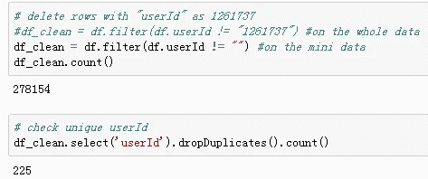

让我们进一步挖掘剩下的缺失值。由于数据是事件数据，这意味着单个用户的每一个操作都被记录下来。我假设“艺术家”列中那些丢失的值可能与用户的某些操作(访问的页面)有关联，这就是为什么我检查与丢失的“艺术家”相关联的访问的“页面”，并与完整数据中的“页面”进行比较，发现:“丢失的艺术家”与除“下一首歌”之外的所有其他页面相结合，这意味着只有当用户点击“下一首歌”时，才会记录“艺术家”(歌曲的演唱者)信息。

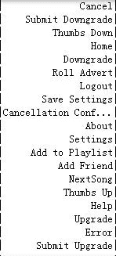

“页面”列中的类别

如果我删除那些“空”艺术家行，数据集中就不会再有丢失的值，干净数据集中的唯一用户数仍然是 255。

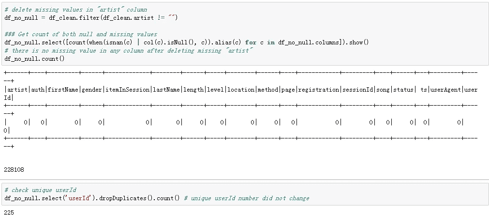

在处理了丢失的值之后，我将时间戳转换为纪元日期，并简化了两个分类列，只从“location”列中提取“states”信息，从“userAgent”列中提取用户使用的平台(标记为“agent”)。

数据清理步骤至此完成，我们开始探索数据，找出更多的信息。由于最终目的是预测流失，我们需要先对流失的用户进行标注(降级也是用同样的方法标注的)。我使用“取消确认”事件来定义流失:那些访问了“取消确认”页面的流失用户被标记为“1”，没有访问的被标记为“0”。类似地，谁访问页面“降级”至少一次被标记为“1”，谁没有被标记为“0”。现在，包含 278154 行和列的数据集已经准备好进行一些探索性分析了。让我们比较一下被搅动的用户和留下来的用户。

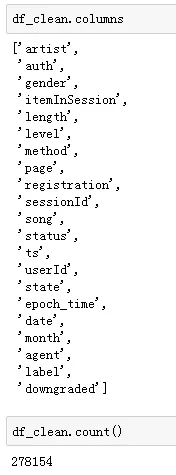

已清理数据框中的列名和行号

## 流失和滞留用户的数量、性别、级别和降级情况

在小数据集中，有 52 个被搅动的用户和 173 个停留的用户(对于大数据，这些数字分别是 5003 和 17274)，两组中男性略多于女性(下图)。在留下来的用户中，似乎有更多的人至少降级过一次他们的账户(下图)。

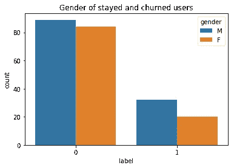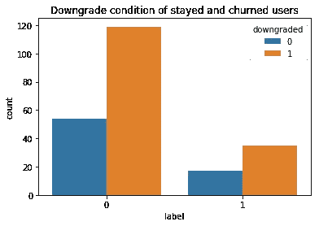

“级别”列有两个值“免费”和“付费”。有些用户可能不止一次更改了他们的级别。为了检查“级别”在流失和停留用户之间有什么不同，创建了一个“valid_level”列来记录最新的用户级别。如下图所示，入住用户中付费用户较多。

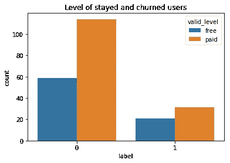

## 注册天数、每天的歌曲数量和每次会话的歌曲数量

显然，停留的用户比流失的用户注册了更多的天数，并且停留的用户平均每天播放的歌曲都比流失的用户多。

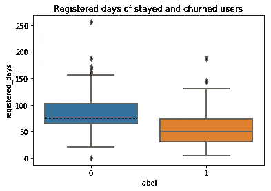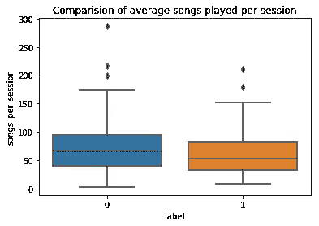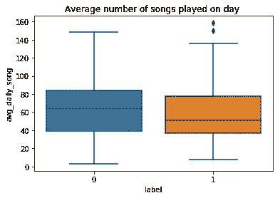

## 每个会话的每日平均项目和平均会话持续时间

如下图所示，停留用户的每日平均项目数略高于流失用户。

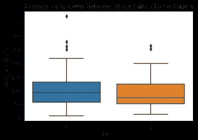

停留用户(标记为 0)和搅动用户(标记为 1)之间的平均每日项目数

停留用户的平均会话持续时间也比频繁使用的用户长。

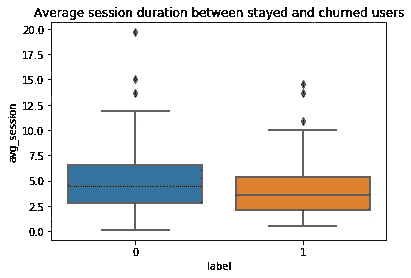

流失(标记为 1)和停留(标记为 0)用户之间的平均会话持续时间

## 用户活动分析

为了分析搅动和停留用户之间的用户活动有何不同，计算了每个用户的“竖起大拇指”、“添加到播放列表”、“添加朋友”、“滚动广告”和“拇指向下”的日平均数。之所以选择这些功能，是因为它们是访问量最大的页面(见下表)。

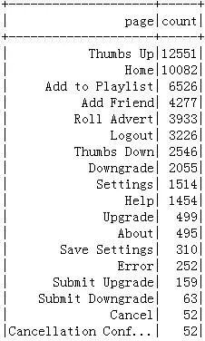

因此，与不变的用户相比，不变的用户添加的朋友更少，竖起大拇指的次数更少，每天添加到播放列表中的歌曲也更少。而与留下来的用户相比，被搅动的用户每天给出更多的“否定”和滚动更多的广告。

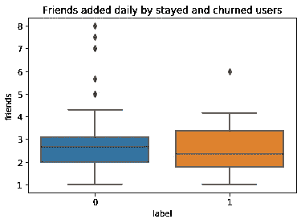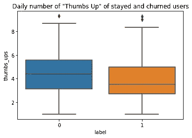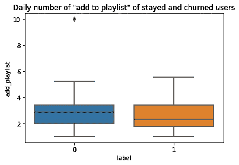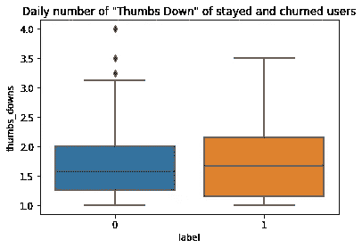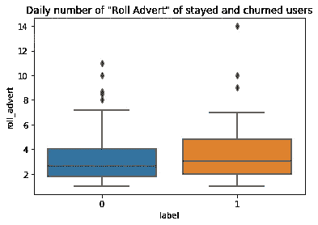

## 两组用户的平台和位置

用户使用的平台(表中标记为“代理”)如下图所示。六种试剂的搅拌速率似乎不同。这意味着用户使用 Sparkify 服务的平台可能会影响用户流失。

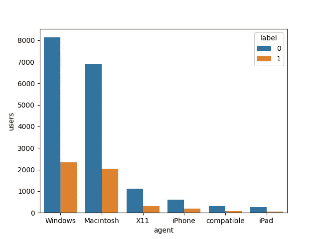

类似地，不同州的搅拌率似乎也在变化(见下图)。

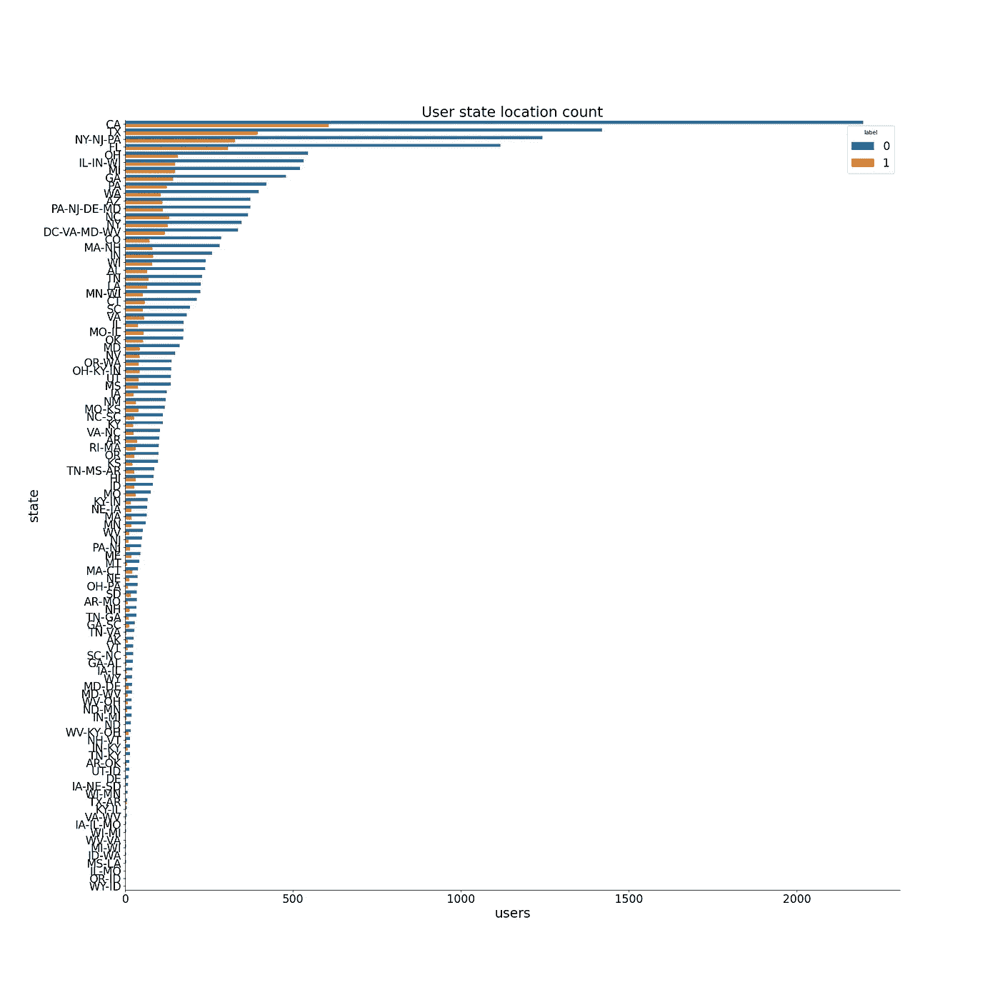

## 特征工程

在拟合任何模型之前，组装以下列以创建用于建模的最终数据集 **df_model** 。

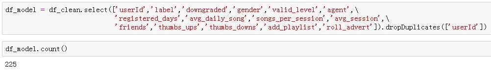

**响应变量**

标签:1 表示搅动，0 表示未搅动

**解释变量(分类变量)**

> 降级:1 表示降级，0 表示未降级
> 
> 性别:M 代表男性，F 代表女性
> 
> 有效级别:免费或付费
> 
> 代理:五类用户使用的平台(windows、macintosh、iPhone、iPad 和兼容)

**解释变量(数值)**

> registered_days:通过“ts”(动作的时间戳)的最大值减去“registration”时间戳来计算，并转换为天数
> 
> avg_daily_song:每天平均收听的歌曲
> 
> songs_per_session:每次会话收听的平均歌曲数
> 
> avg_session:平均会话时长
> 
> 朋友:用户每天添加的朋友数量
> 
> 竖起大拇指:用户每天竖起大拇指的次数
> 
> 否决:用户每天否决的次数
> 
> add_playlist:“添加到播放列表”操作的每日次数
> 
> 滚动广告:每日“滚动广告”的次数

分类变量“gender”、“valid_level”和“agent”首先使用 StringIndexer 转换为索引。

```
# creating indexs for the categorical columns
indexers = [StringIndexer(inputCol=column, outputCol=column+"_index").fit(df_model) for column in ['gender','valid_level','agent'] ]pipeline = Pipeline(stages=indexers)
df_r = pipeline.fit(df_model).transform(df_model)
df_model = df_r.drop('gender','valid_level','agent')
```

数字变量首先使用 VectorAssembler 组装成一个向量，然后使用 StandardScaler 进行缩放。

```
# assembeling numeric features to create a vector
cols=['registered_days','friends','thumbs_ups','thumbs_downs','add_playlist','roll_advert',\
      'daily_song','session_song','session_duration']assembler = VectorAssembler(inputCols=cols,outputCol="features")# use the transform method to transform df
df_model = assembler.transform(df_model)# standardize numeric feature vector
standardscaler=StandardScaler().setInputCol("features").setOutputCol("Scaled_features")
df_model = standardscaler.fit(df_model).transform(df_model)
```

最后，所有的分类和数字特征被组合并再次转换成一个向量。

```
cols=['Scaled_features','downgraded','gender_index','valid_level_index','agent_index']
assembler = VectorAssembler(inputCols=cols,outputCol='exp_features')# use the transform method to transform df
df_model = assembler.transform(df_model)
```

## 建模

由于目标是预测二元结果(1 表示流失，0 表示没有流失)，因此选择了逻辑回归、随机森林和梯度提升树分类器来拟合数据集。计算 F1 评分和 AUC 作为评价指标。因为我们的训练数据是不平衡的(搅动的用户比停留的用户少)。从公司的角度来看，错误地识别出一个将要流失的用户会付出更大的代价。在这种情况下，F1-score 是一个比准确性更好的指标，因为它提供了对错误分类情况的更好的衡量(有关更多信息，请单击[此处](https://medium.com/analytics-vidhya/accuracy-vs-f1-score-6258237beca2#:~:text=Accuracy%20is%20used%20when%20the,and%20False%20Positives%20are%20crucial&text=In%20most%20real%2Dlife%20classification,to%20evaluate%20our%20model%20on.))。[另一方面，AUC](/understanding-auc-roc-curve-68b2303cc9c5) 为我们提供了一个关于模型在可分性方面有多好的视角，换句话说，区分 1(流失)和 0(停留)。

数据集首先被分成 80%的训练数据和 20%的测试集。

```
rest, validation = df_model.randomSplit([0.8, 0.2], seed=42)
```

## 逻辑回归模型

在整个数据集中，停留用户比流失用户多，在我们的训练集中，流失用户的数量是 42，只占总用户的 22%左右。为了解决这一不平衡问题并获得更好的预测结果，在模型中引入了类权重值。

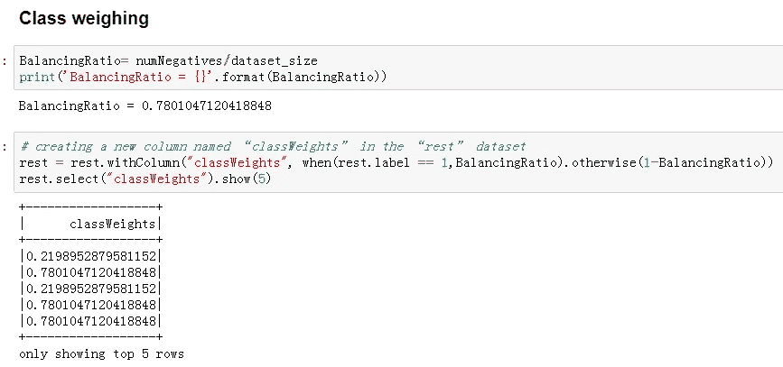

如下构建具有加权特征的逻辑回归模型，并使用 BinaryClassificationEvaluator 评估该模型。

```
# Initialize logistic regression object
lr = LogisticRegression(labelCol="label", featuresCol="exp_features",weightCol="classWeights",maxIter=10)# fit the model on training set
model = lr.fit(rest)# Score the training and testing dataset using fitted model for evaluation purposes
predict_rest = model.transform(rest)
predict_val = model.transform(validation)# Evaluating the LR model using BinaryClassificationEvaluator
evaluator = BinaryClassificationEvaluator(rawPredictionCol="rawPrediction",labelCol="label")#F1 score
f1_score_evaluator = MulticlassClassificationEvaluator(metricName='f1')
f1_score_rest = f1_score_evaluator.evaluate(predict_rest.select(col('label'), col('prediction')))
f1_score_val = f1_score_evaluator.evaluate(predict_val.select(col('label'), col('prediction')))#AUC 
auc_evaluator = BinaryClassificationEvaluator()
roc_value_rest = auc_evaluator.evaluate(predict_rest, {auc_evaluator.metricName: "areaUnderROC"})
roc_value_val = auc_evaluator.evaluate(predict_val, {auc_evaluator.metricName: "areaUnderROC"})
```

逻辑回归模型的得分如下:

```
The F1 score on the train set is 74.38%
The F1 score on the test set is 73.10%
The areaUnderROC on the train set is 79.43%
The areaUnderROC on the test set is 76.25%
```

特征重要性如下所示。该功能注册天数、每次会话收听的平均歌曲数和平均会话持续时间与客户流失呈负相关，而每次会话收听的平均歌曲数和降级行为与客户流失呈正相关。换句话说，每天听更多歌曲并且至少降级一次的用户更有可能流失。然而，一次会话持续的时间越长，每次会话听的歌曲越多，用户流失的可能性就越小。

一个人每天听的歌曲越多，他就越有可能流失，这听起来有点不合理。为了得出一个安全的结论，我将包含更多的样本来再次拟合模型。这将是以后的工作。

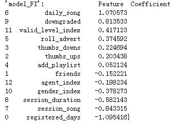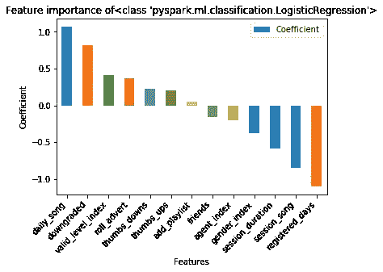

## 随机森林模型

以类似的方式，随机森林模型被拟合到训练数据中，参考原始代码[这里](https://github.com/Tselmeg-C/Churn_prediction_Udacity_Capstone.git)。衡量标准如下:

```
The F1 score on the train set is 90.21%
The F1 score on the test set is 70.31%
The areaUnderROC on the train set is 98.21%
The areaUnderROC on the test set is 80.00%
```

明显存在[过拟合](https://elitedatascience.com/overfitting-in-machine-learning)的问题。F1 和 AUC 分数对于训练集来说都非常高，而在测试集中较差。特征重要性分析显示:除了注册天数和每天收听的歌曲，每天添加的朋友数量、竖起大拇指和竖起大拇指是关于流失预测的最重要的特征。作为未来的工作，我将在大数据集上再次拟合这个模型，看看添加样本是否会解决过度拟合问题。

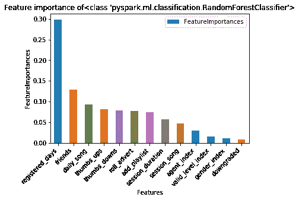

## 梯度增强树模型

GBT 模型显示了更严重的过度拟合问题。改进的建议将与前面提到的相同。首先在大数据集上尝试，如果必要的话做更精细的特征工程或者尝试[其他方法](https://elitedatascience.com/overfitting-in-machine-learning)。

```
The F1 score on the train set is 99.47%
The F1 score on the test set is 68.04%
The areaUnderROC on the train set is 100.00%
The areaUnderROC on the test set is 64.58%
```

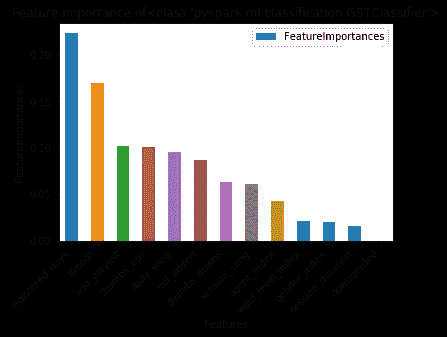

## 超参数调整和交叉验证

根据所有三个模型的 F1 和 AUC 分数，我决定选择逻辑回归模型来做进一步的超参数调整和 3 重交叉验证。

```
# logistic regression model parameters tuning
lrparamGrid = ParamGridBuilder() \
    .addGrid(lr.elasticNetParam,[0.0, 0.1, 0.5]) \
    .addGrid(lr.regParam,[0.0, 0.05, 0.1]) \
    .build()
```

然而，除了在训练集上模型性能的明显改善。测试组的 F1 和 AUC 分数都较低。对于过度拟合的情况，参数调整有点棘手，交叉验证在这种情况下无助于提高模型性能，检查这里的[链接](/when-cross-validation-fails-9bd5a57f07b5#:~:text=Cross%20Validation%20is%20usually%20a,result%20in%20worse%20performance%20measures.&text=This%20resulted%20in%20worse%20cross%20validation%20performance.)可能会对这个问题有所了解。

```
The F1 score on the train set is 87.73%
The F1 score on the test set is 72.74%
The areaUnderROC on the train set is 91.27%
The areaUnderROC on the test set is 78.33%
```

参数调整和交叉验证后，逻辑回归的特征重要性显示出与之前不同的模式。注册日是最有希望的客户流失指标(服务提供商公司可能对该信息不感兴趣)。此外，竖起大拇指、添加好友、竖起大拇指和滚动广告的数量是最重要的功能。

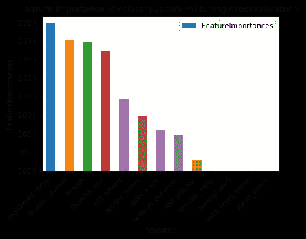

## 结论

在这个项目中，流失预测是基于一个音乐流媒体提供商的事件数据集进行的。这基本上是一个二元分类问题。在加载和清理数据之后，我进行了一些探索性的分析，并对特征工程的下一步提供了见解。总共选择了 13 个解释性特征，并将逻辑回归、随机森林和梯度增强树模型分别拟合到训练数据集。

在小数据集上，模型性能对于逻辑回归是最好的，在测试集上 F1 得分为 73.10。其他两个模型都遭受过拟合。超参数调整和交叉验证对解决过度拟合没有太大帮助，可能是因为样本数量较少。由于时间和预算的限制，最终的模型没有在大数据集上进行测试。然而，完全可扩展的流程为使用 Spark on Cloud 解决大数据上的客户流失预测问题带来了曙光。

## 讨论

> 特征工程

如何选择合适的解释特征是这项任务中最关键的步骤之一。在 EDA 之后，我简单地包含了我创建的所有特性。我想创建更多的功能，然而，进一步的计算被有限的计算能力所拖累。在这个步骤中，[特征工程](/feature-engineering-for-machine-learning-3a5e293a5114)中有一些技术(例如 Spark ML 提供的 ChiSqSelector)可能会有所帮助。“state”列有 58 个不同的值(大数据为 100)。我试图使用 StringIndexer 将它们转换成索引值，并将其包含到解释性特性中。然而，不可能构建索引超过 maxBins (= 32)的随机森林/GBTs 模型，这就是为什么我必须排除这个特性。如果可以使用该特性的虚拟变量，问题就可以避免。遗憾的是，我没有时间了，没能做进一步的实验。

> 计算能力

我花在这个项目上的大部分时间都是在“等待”结果。非常令人沮丧的是，由于集群内存不足，由于阶段错误，我不得不停下来一遍又一遍地从头运行代码。为了解决这个问题，我必须将我的代码分成两部分(一部分用于建模，另一部分用于绘图),并分别运行它们。我必须减少我创造的解释变量的数量。遗憾的是，我只成功地在 AWS 集群上运行了一次大数据集的简单版本代码(这里指的是代码)并且不得不停止，因为它花费了太多的时间和成本。不幸的是，构建模型在大数据集上的分数并不令人满意。但是，代码的最后版本(Github repo 中的 Sparkify_visualization 和 Sparkify_modeling)应该是完全可扩展的。如果要在大数据上再次运行最新的代码，那么模型在大数据集上的性能应该得到提高。

> 测试选择性抽样方法

因为训练数据集不平衡，带有“0”标签的行比“1”多，所以我想试试随机选择与“1”行数相同的“0”行是否会提高模型性能。由于时间的限制，这将只是未来的工作。

ps:一个额外的提示可能非常有用，在关键点上执行“缓存”来加速程序。

欢迎任何讨论！请通过 [LinkedIn](https://www.linkedin.com/in/tselmeg-chenlemuge/) 和 [Github](https://github.com/Tselmeg-C) 联系我