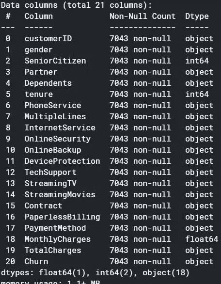

# 使用神经网络和 ML 模型的流失预测

> 原文：<https://towardsdatascience.com/churn-prediction-using-neural-networks-and-ml-models-c817aadb7057?source=collection_archive---------19----------------------->


在 [Unsplash](https://unsplash.com?utm_source=medium&utm_medium=referral) 上由 [Alexa](https://unsplash.com/@abstraction_by_alexa?utm_source=medium&utm_medium=referral) 拍摄的照片

这个故事是我上传到 Kaggle 上的一个笔记本的演练。最初，它只使用机器学习模型，从那以后，我添加了几个基本的神经网络模型。许多媒体博客和 Kaggle 上的笔记本广泛报道了客户流失预测主题，然而，很少有使用神经网络的。将神经网络应用于结构化数据本身在文献中很少涉及。我通过 Coursera 上的 deeplearning.ai 专门化和 Keras 的 Tensorflow 文档学习了神经网络。

# **简介**

当客户或订户停止与公司或服务做生意时，就会发生客户流失或客户流失。客户流失是一个关键指标，因为保留现有客户比获得新客户更具成本效益，因为它节省了销售和营销成本。留住客户更具成本效益，因为你已经赢得了现有客户的信任和忠诚。

有多种方法可以计算这一指标，因为流失率可能代表客户流失总数、客户流失占公司客户总数的百分比、经常性业务流失的价值或经常性价值流失的百分比。但是，在这个数据集中，它被定义为每个客户的二进制变量，计算费率不是目的。因此，这里的目标是确定和量化影响流失率的因素。

这是一个相当简单的初级项目，变数较少。对于神经网络来说，这不是一个有用的应用，因为训练样本的数量相对较少，但是使用它很容易理解神经网络。

# 探索性数据分析

这里跳过了数据清理步骤。丢失的值只是微小的，在总费用栏中找到，因此被删除。由于多重共线性，没有要素被删除，因为只存在少数几个要素。



熟悉自己的功能。

数据分析的第一步是熟悉数据变量、特征和目标。该数据集包含 20 个特征和一个目标变量。客户 ID 特性是一个字符串标识，因此对预测没有用处。


恰好有 3 个类的分类特征的唯一值。

在分类特征中，有些特征是二进制的，有些正好有 3 个唯一值。在检查时，注意到只有合同和互联网服务在分类特征中具有不同数量的唯一值。在 Kaggle 的一些笔记本中,“无互联网服务”类可以被指定为“否”。然而，虚拟变量似乎是更好的编码选择，因为在前一种情况下，尽管有互联网服务，但客户选择不选择服务，将会丢失数据。在特征的数量较大的情况下，将考虑标签编码或映射，因为然后一个热编码将变成大的稀疏矩阵。

检查数据中提供的这些特征的分布是很重要的，以检查特征值是否公平分布。下面的函数用于绘制分布图。

```
def srt_dist(df=df,cols=cat_feats):
    fig, axes = plt.subplots(8, 2,squeeze=True)
    axes = axes.flatten()

    for i, j **in** zip(cols, axes):

        (df[i].value_counts()*100.0 /len(df)).plot.pie(autopct='**%.1f%%**',figsize =(10,37), fontsize =15,ax=j )                                                                      
        j.yaxis.label.set_size(15)
srt_dist()
```


一些分类特征的分布

据观察，很少是老年人，只有 30%有家属，只有 10%没有电话服务。因此，从这些变量中得出的相关性是值得怀疑的。


合同任期。

自然，月合同客户的任期低于两年合同客户。


目标变量的分布。

因此，目标变量有 73 %的“无流失”实例。机器学习模型将因此而被扭曲，并且在更多“流失”的情况下，在看不见的数据上不会表现得那么好。

抵消这种类不平衡的一种方法是使用分层交叉验证，这种方法使实例的折叠具有统一的比例。

```
sns.pairplot(df,vars = ['tenure','MonthlyCharges','TotalCharges'], hue="Churn")
```


从顶行中间图可以观察到，租期较短和月费较高的客户倾向于流失，几乎呈线性关系。可以注意到，如总费用分布所示，神经网络模型也表明总费用较低的客户会流失。但是，这可能是因为随着时间的推移，任期越长的客户总费用越多。

也正如你在下面看到的；逐月合同和光纤 obtic 互联网对客户流失概率有着巨大的影响。

```
cat_feats=['gender', 'SeniorCitizen', 'Partner', 'Dependents','PhoneService','MultipleLines', 'InternetService', 'OnlineSecurity', 'OnlineBackup','DeviceProtection', 'TechSupport', 'StreamingTV', 'StreamingMovies','Contract', 'PaperlessBilling', 'PaymentMethod'] # As formed in notebook in upper blocks
fig,axes = plt.subplots(16)
axes = axes.flatten()
for i, j in zip(cat_feats, axes):
sortd = df.groupby([i])['Churn'].median().sort_values(ascending=False)
    j=sns.catplot(x=i,
                y='Churn',
                data=df,
                kind='bar')
    j.set_ylabels("Churn Probability")
```


根据不同的分类特征，此处显示了合同的流失概率。

据观察，对于高度相关的功能，如无合作伙伴或依赖关系、无技术支持、按月合同等，客户流失的可能性很高。

# 系统模型化

数据集根据范围为 0 到 1 的最小最大缩放器进行缩放，训练集是根据分配的前 3993 个观察值。

以下函数用于分层交叉验证。

```
def stratified_cv(X, y, clf_class, shuffle=True,  **kwargs):
    stratified_k_fold = StratifiedKFold().split(X,y)
    y_pred = y.copy()
    for ii, jj in stratified_k_fold: 
        Xtrain, Xtest = X.iloc[ii], X.iloc[jj]
        ytrain = y.iloc[ii]
        clf = clf_class(**kwargs)
        clf.fit(X_train,y_train)
        y_pred.iloc[jj] = clf.predict(Xtest)
    return y_predprint('Gradient Boosting Classifier:\n {}\n'.format(
    metrics.classification_report(y, stratified_cv(X, y,                                                  ensemble.GradientBoostingClassifier))))                                            
print('Support vector machine(SVM):\n {}\n'.format(
    metrics.classification_report(y, stratified_cv(X, y, svm.SVC))))
print('Random Forest Classifier:\n {}\n'.format(
       metrics.classification_report(y, stratified_cv(X, y,                                                  ensemble.RandomForestClassifier))))
print('K Nearest Neighbor Classifier:\n {}\n'.format(
       metrics.classification_report(y, stratified_cv(X, y,                                                  neighbors.KNeighborsClassifier,n_neighbors=11))))
print('Logistic Regression:\n {}\n'.format(
       metrics.classification_report(y, stratified_cv(X, y,                                            linear_model.LogisticRegression))))
print('XGBoost Classifier:\n {}\n'.format(
     metrics.classification_report(y, stratified_cv(X, y,        XGBClassifier))))Code used for classification reports of ML model
```


模型的加权平均 F1 分数。

> 最大似然模型的超参数调整

对于随机森林，调整每棵树的估计器数量和最大特征数:

```
# Tuning Random Forest
from sklearn.ensemble import RandomForestClassifier
# Create param grid.   
param_rf=[{'n_estimators' : list(range(10,150,15)),
            'max_features' : list(range(6,32,5))}]
# Create grid search object
clf = RandomizedSearchCV(RandomForestClassifier(), param_distributions = param_rf, n_iter=50, cv = 5, refit=True,verbose=1, n_jobs=-1,)
# Fit on data
best_clf = clf.fit(X, y)
print(best_clf.best_params_)
best_clf.best_score_
```

Out[]:

```
{'n_estimators': 130, 'max_features': 6}
0.78967497404260
```

对于逻辑回归，调整逆正则化参数 C:

```
# Tuning Logistic Regression
from sklearn.linear_model import LogisticRegression
param_grid = [
    {'penalty' : ['l1', 'l2'],
    'C' : np.logspace(-5, 5, 20),
    'solver' : ['liblinear'] }]
clf = RandomizedSearchCV(LogisticRegression(), param_distributions = param_grid, n_iter=20, cv = 5, refit=True,verbose=1, n_jobs=-1,)# Fit on databest_clf = clf.fit(X, y)
print(best_clf.best_params_)
best_clf.best_score_
```

Out[]:

```
{'solver': 'liblinear', 'penalty': 'l2', 'C': 8858.667904100832}
0.8043221203472578
```

# 神经网络

对于神经网络，两种类型的建模，预制估计和 Keras 序列模型都被使用。此外，我遇到的大多数参考资料是关于卷积神经网络和图像分类的超调预制估计器。Keras 模型对学习速率和层数进行了超调。超参数调整模型显示了类似的性能，因为数据集比通常的神经网络应用程序小。

为了使博客简洁，这里只展示了 Keras 模型。

使用一个 64–8–1 密集分层模型，学习率衰减，批量大小为 32。还使用了每一层的 L2 正则化和去除。

```
*# Model 1*
nn_model = Sequential()
nn_model.add(Dense(64,kernel_regularizer=tf.keras.regularizers.l2(0.001), input_dim=46, activation='relu' ))
nn_model.add(Dropout(rate=0.2))
nn_model.add(Dense(8,kernel_regularizer=tf.keras.regularizers.l2(0.001),activation='relu'))
nn_model.add(Dropout(rate=0.1))
nn_model.add(Dense(1, activation='sigmoid'))
lr_schedule = tf.keras.optimizers.schedules.InverseTimeDecay( 0.001,
      decay_steps=(X_train.shape[0]/32)*50,
      decay_rate=1,
      staircase=False)
#This time decay means for every 50 epochs the learning rate will be half of 0.001 value
def get_optimizer():
    return tf.keras.optimizers.Adam(lr_schedule)
def get_callbacks():
    return [tf.keras.callbacks.EarlyStopping(monitor='val_accuracy',patience=70,restore_best_weights=True)]nn_model.compile(loss = "binary_crossentropy", 
                  optimizer = get_optimizer(), 
                  metrics=['accuracy'])

history = nn_model.fit(X_train, y_train, validation_data=(X_test, y_test), epochs=150, batch_size=32,   callbacks=get_callbacks(),verbose=0)

plt.plot(history.history['accuracy']) 
plt.plot(history.history['val_accuracy']) 
plt.title('model accuracy') 
plt.ylabel('accuracy')
plt.xlabel('epoch') 
plt.legend(['train', 'test'], loc='upper left') 
plt.show()
```


根据被训练的时期的训练和准确性。

因此，由于批量较小，该模型在 20 个时期左右收敛得更快。测试集上的模型准确率为 80.72%。

> 估价

```
yprednn=nn_model.predict(X_test)
yprednn=yprednn.round()
print('Neural Network:**\n** **{}\n**'.format(
    metrics.classification_report(yprednn, y_test)))
nn_conf_matrix=metrics.confusion_matrix(yprednn,y_test)
conf_mat_nn = pd.DataFrame(nn_conf_matrix, 
    columns=["Predicted NO", "Predicted YES"], 
    index=["Actual NO", "Actual YES"])
print(conf_mat_nn)
```

Out[]:

```
Neural Network:
               precision    recall  f1-score   support
         0.0       0.92      0.84      0.87      2443
         1.0       0.51      0.69      0.58       596 accuracy                           0.81      3039
   macro avg       0.71      0.76      0.73      3039
weighted avg       0.84      0.81      0.82      3039
Confusion Matrix :
            Predicted NO  Predicted YES
Actual NO           2042            401
Actual YES           185            411
```

> 使用 Keras 进行超参数调谐

Keras tuner 的文档对此做了很好的解释。这里隐藏单元的数量、隐藏层中神经元的数量、学习率和辍学率都是超调的。

根据吴恩达的课程，学习率是最重要的，其次是动量贝塔、小批量和隐藏单元的数量。

```
from tensorflow import keras
from tensorflow.keras import layers
from kerastuner.tuners import RandomSearch
import IPython
import kerastuner as kt
def build_model(hp):
    inputs = tf.keras.Input(46,)
    x = inputs
    for i **in** range(hp.Int('num_layers', 1,3)):
        x =  tf.keras.layers.Dense(units=hp.Int('units_' + str(i),32,256, step=32, default=64),
             kernel_regularizer=tf.keras.regularizers.l2(0.001))(x)
        x = tf.keras.layers.BatchNormalization()(x)
        x = tf.keras.layers.ReLU()(x)
    x = tf.keras.layers.Dense(
      hp.Int('hidden_size', 4,64, step=4, default=8),
             kernel_regularizer=tf.keras.regularizers.l2(0.001),
             activation='relu')(x)
    x = tf.keras.layers.Dropout(
      hp.Float('dropout', 0, 0.5, step=0.1, default=0.5))(x)
    outputs = tf.keras.layers.Dense(1, activation='sigmoid')(x)model = tf.keras.Model(inputs, outputs)
    model.compile(
    optimizer=tf.keras.optimizers.Adam(
      hp.Float('learning_rate', 1e-3,1e-1, sampling='log')),
    loss="binary_crossentropy", 
    metrics=['accuracy'])
    return model

tuner = RandomSearch(
    build_model,
    objective='val_accuracy',
    max_trials=10,
    executions_per_trial=1)
batch_size=32
tuner.search(X_train, y_train,
                     epochs=100,batch_size=batch_size,
                     validation_data=(X_test,y_test),
                     callbacks= [tf.keras.callbacks.EarlyStopping(monitor='val_accuracy',                                                               patience=40,restore_best_weights=True)],verbose=False)
best_hp = tuner.get_best_hyperparameters()[0] 
best_hp.values
```

Out[]:

```
{'num_layers': 3,
 'units_0': 96,
 'hidden_size': 52,
 'dropout': 0.5,
 'learning_rate': 0.0075386035028952945,
 'units_1': 64,
 'units_2': 96}
```

超调建议采用 5 层模型，前三个单元如输出所示。


超调模型的历史图输出。

该图显示了一个复杂的模型可以有很大的差异。该模型的性能类似，但由于复杂性而略低。

超调对于小数据集可能没有大数据集有用。然而，在 Keras 文档的过拟合和欠拟合部分中，得出的结论是，随着神经网络的容量“变小”,精度会提高。因此，由于这是一个类似大小的数据集，我们也可以使用最多具有 64 到 128 个隐藏单元的 3 个隐藏层的网络。

测试不同的批量大小:小于 32 和大于 32 都会导致性能稍低。因此，此代码块可以跳过，但可以在笔记本中找到。具有 10e3 观测值的中小型数据集通常使用的批量大小为 8、32、64、128。8 的倍数使得批处理大小适合内存，并且运行更快。


批量大小为 1024 需要更长的时间来收敛，超过 100 个历元。

# 模型性能

混淆矩阵和 ROC 曲线给出了真正的正负准确性的意义，然而在不平衡的数据集中，正是精确-召回曲线给出了准确性的意义。在这个数据集中，负实例比正实例多，因此精确召回曲线显示了真实的性能。

ROC 可能过于乐观，因为如果模型正确地预测了负面实例，但在正面实例上失败，而精确召回曲线是基于正面实例的，则 ROC 会更乐观。

混淆矩阵值显示为百分比，因为神经网络模型使用一个集合验证，而不是 CV。XGBoost 性能与随机森林非常相似，因此这里没有显示。

> 1.随机森林性能

```
rf_conf_matrix  = metrics.confusion_matrix(y, stratified_cv(X, y, ensemble.RandomForestClassifier,n_estimators=113))
conf_mat_rf = pd.DataFrame(rf_conf_matrix, 
    columns=["Predicted NO", "Predicted YES"], 
    index=["Actual NO", "Actual YES"])
print((conf_mat_rf/7032)*100)
cv=StratifiedKFold(n_splits=6)
classifier=RandomForestClassifier(n_estimators=113)
from sklearn.metrics import auc
from sklearn.metrics import plot_roc_curve
from sklearn.model_selection import StratifiedKFold
tprs=[]
aucs=[]
mean_fpr=np.linspace(0,1,100)
fig,ax=plt.subplots()
for i,(train,test) **in** enumerate(cv.split(X,y)):
    classifier.fit(X.iloc[train],y.iloc[train])
viz=plot_roc_curve(classifier,X.iloc[test],y.iloc[test],name='ROC fold **{}**'.format(i),alpha=0.3,lw=1,ax=ax)
    interp_tpr = np.interp(mean_fpr, viz.fpr, viz.tpr)
    interp_tpr[0] = 0.0
    tprs.append(interp_tpr)
    aucs.append(viz.roc_auc)

ax.plot([0, 1], [0, 1], linestyle='--', lw=2, color='r',
        label='Chance', alpha=.8)
mean_tpr = np.mean(tprs, axis=0)
mean_tpr[-1] = 1.0
mean_auc = auc(mean_fpr, mean_tpr)
std_auc = np.std(aucs)
ax.plot(mean_fpr, mean_tpr, color='b',label=r'Mean ROC (AUC = **%0.2f** $\pm$ **%0.2f**)' % (mean_auc, std_auc),lw=2, alpha=.8)
std_tpr = np.std(tprs, axis=0)
tprs_upper = np.minimum(mean_tpr + std_tpr, 1)
tprs_lower = np.maximum(mean_tpr - std_tpr, 0)
ax.fill_between(mean_fpr, tprs_lower, tprs_upper, color='grey', alpha=.2,label=r'$\pm$ 1 std. dev.')
ax.set(xlim=[-0.05, 1.05], ylim=[-0.05, 1.05],
       title="Receiver operating characteristic example")
ax.legend(loc="lower right")
plt.show()
# Precision Recall # break code blockrfmodel=RandomForestClassifier(n_estimators= 130, max_features= 6,n_jobs=-1)
rfmodel.fit(X_train,y_train)
lg_probs = rfmodel.predict_proba(X_test)
lg_probs=lg_probs[:,1]
yhat = rfmodel.predict(X_test)
lr_precision, lr_recall, _ = precision_recall_curve(y_test,lg_probs)
lr_f1, lr_auc = f1_score(y_test, yhat), auc(lr_recall, lr_precision)
*# summarize scores*
print('RF: f1=**%.3f** auc=**%.3f**' % (lr_f1, lr_auc))
*# plot the precision-recall curves*
no_skill = len(y_test[y_test==1]) / len(y_test)
pyplot.plot([0, 1], [no_skill, no_skill], linestyle='--', label='No Skill')
pyplot.plot(lr_recall, lr_precision, marker='.', label='RF')
*# axis labels*
pyplot.xlabel('Recall')
pyplot.ylabel('Precision')
*# show the legend*
pyplot.legend()
*# show the plot*
pyplot.show()Out[]:
Confusion Matrix:
 Predicted NO  Predicted YES
Actual NO      70.036974       3.384528
Actual YES      6.143345      20.435154
Precision- Recall:
RF: f1=0.543 auc=0.603
```


> 2.逻辑回归

代码与上面类似。

```
Confusion matrix:
Predicted NO  Predicted YES
Actual NO      65.799204       7.622298
Actual YES     12.044937      14.533561
Precision-Recall AUC:
Logistic: f1=0.543 auc=0.640
```


> 3.神经网络模型性能

```
Confusion Matrix:
Predicted NO  Predicted YES
Actual NO      67.193156      13.195130
Actual YES      6.087529      13.524186
ROC:
No Skill: ROC AUC=0.500
Neural Network: ROC AUC=0.832
Precision-Recall:
Neural Network: f1=0.584 auc=0.628
```


我们可以看到，Random Forest 和 XGBoost 是最准确的模型，逻辑回归概括得最好，并且同样准确地预测了流失和不流失这两个类别。因此，根据精确召回曲线，逻辑回归具有最佳性能。神经网络在精确召回率上也比 RF 和 XGBoost 表现得更好。

因此，如果在看不见的数据中存在更多积极的实例，即流失标签，则逻辑回归将预测得更好。

# 4.特征重要性

> 1)根据逻辑回归的特征重要性。

```
weights = pd.Series(lgmodel.coef_[0],index=X.columns.values)
print (weights.sort_values(ascending = False)[:20].plot(kind='bar'))
```


逻辑回归模型使用的正负权重

> 2)根据随机森林的特征重要性

```
rf =  ensemble.RandomForestClassifier(n_estimators=130,max_features=6, n_jobs=-1)
rf.fit(X, y)
feature_importance = rf.feature_importances_
feat_importances = pd.Series(rf.feature_importances_, index=X.columns)
feat_importances = feat_importances.nlargest(19)
feat_importances.plot(kind='barh' , figsize=(10,10))
```


> 3)神经网络特征重要性

因为 Keras 在文档中没有提供特性重要性特性，所以我演示了两种方法。参考是一个堆栈流答案。

```
from keras.wrappers.scikit_learn import KerasClassifier, KerasRegressor
import eli5
from eli5.sklearn import PermutationImportance

def base_model():
    nn_model = Sequential()    nn_model.add(Dense(64,kernel_regularizer=tf.keras.regularizers.l2(0.001),
                input_dim=46, activation='relu' ))
    nn_model.add(Dropout(rate=0.2))
nn_model.add(Dense(8,kernel_regularizer=tf.keras.regularizers.l2(0.001),
                    activation='relu'))
    nn_model.add(Dropout(rate=0.1))
    nn_model.add(Dense(1, activation='sigmoid'))
    lr_schedule = tf.keras.optimizers.schedules.InverseTimeDecay(
                  0.001,
                  decay_steps=(X_train.shape[0]/32)*50,
                  decay_rate=1,
                  staircase=False)

    def get_optimizer():
        return tf.keras.optimizers.Adam(lr_schedule)
    def get_callbacks():
        return [
            tf.keras.callbacks.EarlyStopping(monitor='val_accuracy',patience=70,restore_best_weights=True)]
    nn_model.compile(loss = "binary_crossentropy", 
                  optimizer = get_optimizer(), 
                  metrics=['accuracy'])
    return nn_model

my_model = KerasRegressor(build_fn=base_model)    
my_model.fit(X_train, y_train, validation_data=(X_test, y_test), epochs=150, batch_size=32,
                    callbacks= get_callbacks(),verbose=0)

perm = PermutationImportance(my_model, random_state=1).fit(X[:500].values,y[:500].values,verbose=False)
eli5.show_weights(perm, feature_names = X.columns.tolist())
```


```
import shap
from tensorflow.keras import Sequential
*# load JS visualization code to notebook*
shap.initjs()

*# explain the model's predictions using SHAP*
*# (same syntax works for LightGBM, CatBoost, scikit-learn and spark models)*
explainer = shap.DeepExplainer(nn_model,data=X[:500].values)
shap_values = explainer.shap_values(X.values)

*# visualize the first prediction's explanation (use matplotlib=True to avoid Javascript)*
*#shap.force_plot(explainer.expected_value, shap_values[0,:], X.iloc[0,:])*

shap.summary_plot(shap_values, X, plot_type="bar")
```


# 结论

1.  可以看出，总费用是最重要的功能，理所当然。如果客户发现服务昂贵或负担不起，他们会“流失”的首要原因。
2.  任期也很重要，那些长期使用这项服务或签有长期合同的客户一般来说更便宜，不太可能流失。有趣的是观察到任期被列为更重要的神经网络模型。
3.  正如在 EDA 中观察到的，大多数月合同的客户更有可能流失。可以假设，原因是由于客户的个人原因，对长期合同有所保留，或每月合同导致单位时间成本较高。
4.  正如 EDA 中所看到的，其他重要的功能是在线安全、电子支付方式、光纤互联网服务、技术支持。
5.  不重要的功能是性别、家属、伴侣、流媒体电视、备份和设备保护。

优惠和提高流失率:

1.  折扣:由于最重要的特征是总费用，其次是月费用，通过建模确定的潜在客户应在下个月或几个月的合同中获得巨大折扣。这涵盖了 80 %的搅动原因。对于这个模型，应该最小化假阴性率或者最大化召回率，以便将折扣发送给最大的潜在顾客。
2.  新合同:应执行六个月或四个月的合同。这将鼓励想要短期合同的保留客户，并增加他们在服务中的任期，从而使他们不太可能流失。
3.  在线安全:这项服务应该得到更多的推广，并根据公司的成本在试用期内免费提供。没有在线安全的客户更有可能流失，因此此优惠可以与第一个提到的优惠相结合，折扣只能在此基础上提供。
4.  光纤:光纤互联网的成本很高，因此要么向适当的目标受众推广，要么采用更好的技术来降低这项服务的成本。最终，市场研究团队必须决定这项服务的盈亏平衡点，它的利润是否与它造成的客户流失一样多。

另一种量化报价的方法是使用手动生成的特征及其对模型的影响。

# 参考

1.  预测客户流失的随机森林与神经网络，Abhinav Sagar，Medium，[https://towards data science . com/random-Forest-vs-Neural-Networks-for-Predicting-Customer-Churn-691666 c 7431 e](/random-forest-vs-neural-networks-for-predicting-customer-churn-691666c7431e)
2.  电信客户流失预测， [Pavan Raj](https://www.kaggle.com/pavanraj159) ，[https://www . ka ggle . com/pavanraj 159/telecom-Customer-Churn-Prediction](https://www.kaggle.com/pavanraj159/telecom-customer-churn-prediction)
3.  电信客户流失预测，Melda Dede，[https://www . ka ggle . com/meldadede/turn-Prediction-of-Telco-Customers](https://www.kaggle.com/meldadede/churn-prediction-of-telco-customers)
4.  使用基本神经网络预测流失，Laurier Mantel，[https://www . ka ggle . com/Laurier Mantel/using-basic-neural-networks-to-predict-churn](https://www.kaggle.com/lauriermantel/using-basic-neural-networks-to-predict-churn)
5.  如何在 Python 中使用 ROC 曲线和精度召回曲线进行分类，Jason Brownlee，[https://machine learning mastery . com/ROC-Curves-and-Precision-Recall-Curves-for-class ification-in-Python/](https://machinelearningmastery.com/roc-curves-and-precision-recall-curves-for-classification-in-python/)
6.  Tensorflow、Keras、sklearn 文档
7.  神经网络的特征重要性，StackOverFlow，[https://stack overflow . com/questions/45361559/feature-importance-chart-in-Neural-Network-using-keras-in-python #:~:text = It % 20 most % 20 easily % 20 works % 20 with，using % 20it % 20is % 20very %直截了当。& text=At%20the%2](https://stackoverflow.com/questions/45361559/feature-importance-chart-in-neural-network-using-keras-in-python#:~:text=It%20most%20easily%20works%20with,using%20it%20is%20very%20straightforward.&text=At%20the%20moment%20Keras%20doesn,to%20extract%20the%20feature%20importance)