# 使用 PySpark 进行流失预测

> 原文：<https://towardsdatascience.com/churn-prediction-using-spark-1d8f6bd4092d?source=collection_archive---------58----------------------->

## 预测音乐流媒体应用的用户流失

# 项目概述

该项目旨在探索用户交互数据，以识别客户流失。这个问题特别关注使用 Spark 处理大型数据集。PySpark 用于清理、辩论和处理数据，并执行建模和调优以构建流失预测模型。

# 问题陈述

Sparkify 是一家音乐流媒体公司，和 Spotify 一样。[数据集](https://www.kaggle.com/saksri/sparkify)包含用户交互的日志。完整的数据集为 12 GB。我们正在处理一个 128MB 的较小数据集。使用用户日志，我们需要识别有流失倾向的客户，以便为他们提供促销。我们可以确定哪些因素是客户流失的重要指标。

# 探索性数据分析

该数据集包含 286，500 个用户交互的日志。它有关于用户、交互、时间戳、用户使用的设备等信息。数据的模式如下:

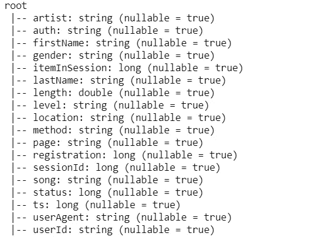

数据模式

数据集快照如下所示:

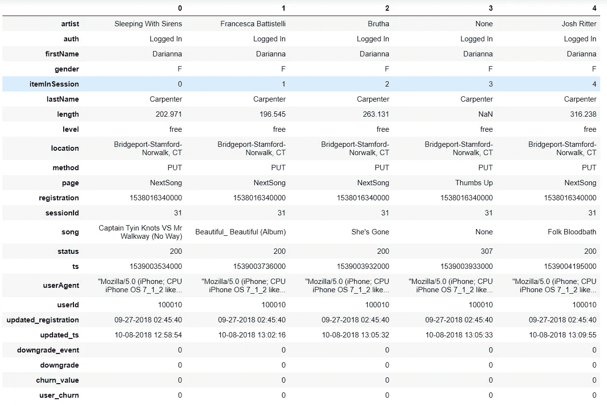

## 数据清理

我们清理数据集以删除缺少 ***userId*** 和 ***sessionId*** 的记录，其中 ***userId*** 为空，我们有 278，154 条记录，因为这些记录中的大部分是尚未登录或希望注册的用户。我们还将注册日期和当前时间从时间戳转换为更容易理解的日期时间格式。页面功能列出了数据集中所有可能的用户操作。

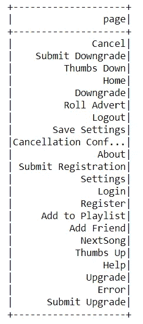

用户操作

我们将客户流失定义为用户执行取消确认操作。这项服务有两种订阅级别——免费和付费。用户可以升级或降级他们的订阅级别。我们创建了一个标志来标识用户何时降级他们的帐户，以及用户是否发生了搅动。

## 电子设计自动化(Electronic Design Automation)

我们通过观察一些特征的分布来识别数据中的模式。

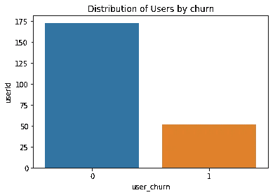

流失用户的分布

被搅动的用户在数据集中的分布表明数据集严重不平衡。虽然这是流失分析问题的标准，但我们需要在建模过程中考虑这一点。我们需要通过欠采样来平衡我们的数据集，或者选择适当的指标来更好地考虑少数类。

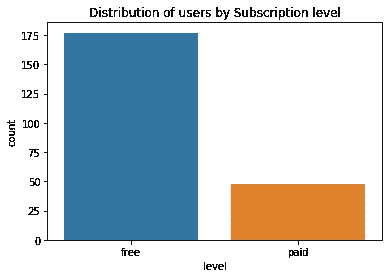

按订阅级别分发

我们音乐流媒体服务的免费用户比付费用户多得多。我们还应该检查给定订阅级别的用户是否有流失倾向。

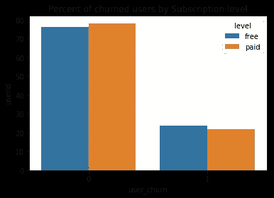

按订阅级别划分的流失

我们注意到付费用户比免费用户更有可能流失。这可能是预测用户流失的一个重要因素。

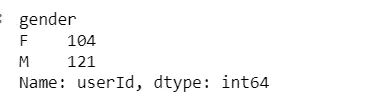

用户的性别

我们的男性用户比女性用户多，但数字相差不大，所以我们可以认为我们的数据集性别基本平衡。

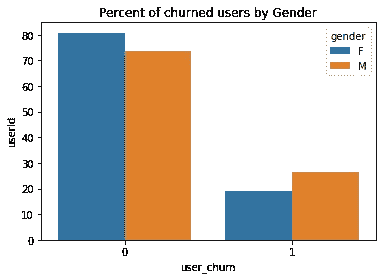

按性别划分的用户流失

我们注意到，与女性用户相比，男性用户更容易流失。我们还可以分析组合中订阅级别的趋势。

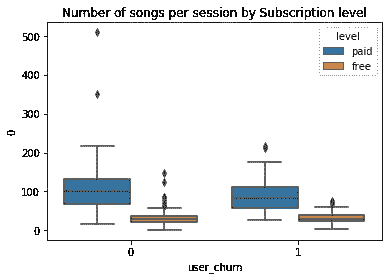

每次收听的歌曲数量

我们发现，与付费用户相比，免费用户每次收听的歌曲要少得多。此外，没有流失的用户平均每次听的歌曲略多，尤其是付费用户。

最后，让我们看看流媒体服务上最受欢迎的艺术家。

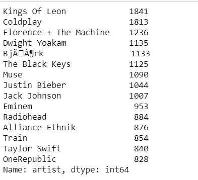

# 特征工程

由于数据集包含用户交互，我们需要在用户层面上对它们进行聚合，以构建用户档案，这将有助于识别客户流失倾向。

基于数据集中可用的特征和我们对用户行为的理解，我们创建代表用户参与度、用户简档等的特征。

我们识别用户寿命、用户性别等特征。

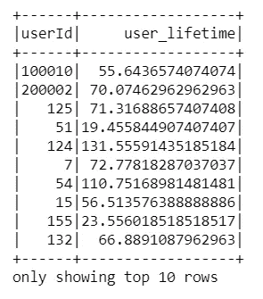

用户生命周期功能

我们还创建了用户参与功能，如添加的朋友数量，添加到播放列表的歌曲数量，对歌曲的褒贬。

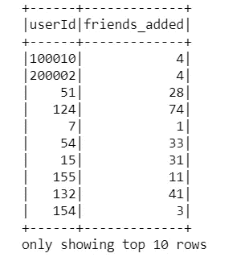

添加的好友数量

我们还创建了与他们的音乐收听行为相关的功能，如用户收听的歌曲数量、用户收听的艺术家数量、每次会话的歌曲数量等

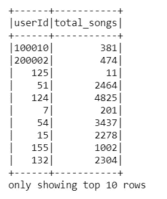

用户收听的歌曲数量

一旦我们创建了这些特征，我们就为每个用户合并它们，以创建我们将用于建模的最终数据库。

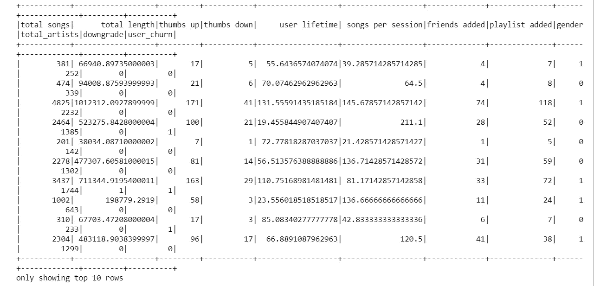

最终数据帧

接下来，我们移动到建模部分。

# 建模

> 注意:230 MB 的中型数据集用于建模部分，训练是在 IBM Watson 集群上完成的，而 EDA 是在 128 MB 的小型数据集上完成的。

在开始对数据集进行建模之前，我们需要将要素转换为数字要素，然后对要素进行缩放。是否缩放数据集取决于我们计划使用的模型。我们还将把我们的数据集分成训练验证测试集，以确保对模型性能的准确评估。我对数据集使用了 70:15:15 的分割。

现在我们已经准备好了数据集，我们将根据基线模型对其进行测试。在我们建立模型之前，我们将问题定义为一个二元分类问题，其中 0 表示用户没有流失，1 表示用户流失。此外，由于我们的数据集是不平衡的，准确性可能不是最好的衡量标准，因为我们可以预测所有值为 0，并具有高准确性，但召回率很低。因此，为了平衡这一点，我们使用 F1 作为我们的指标。

我认为虚拟分类器总是预测用户不会流失。我们也可以有一个随机预测用户流失的基线模型。我们的虚拟分类器的结果如下:

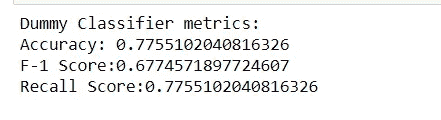

虚拟分类器

我们尝试其他模型，如逻辑回归、随机森林分类器、线性支持向量和梯度提升树分类器。我们在训练集上拟合模型，并对验证数据集进行预测。然后我们选择最好的 F1 分数。在我们的例子中，它是随机森林分类器。

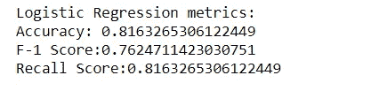

逻辑回归度量

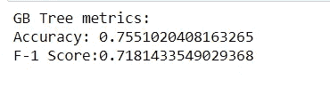

梯度增强的树分类器度量

接下来，我们调整我们的随机森林分类器模型。一旦我们有了一个最终的模型，我们就用它来对测试集进行预测，从而对模型性能进行基准测试。

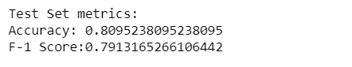

最终模型的测试集结果

我们可以看看我们模型的特征重要性。

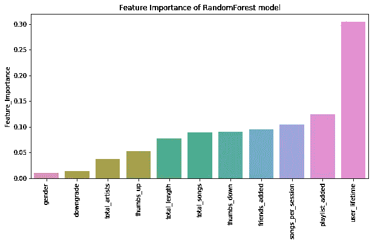

特征重要性

我们看到 user_lifetime 对预测客户流失的影响最大。

# 结论

我们利用 CRISP-DM 过程研究了客户流失预测问题。这与增加商业价值的真实问题非常相似。我们可以通过战略性地实施从探索和建模中收集的见解来留住用户并增加公司收入。

对于像这样高度不平衡的数据集，准确性不是一个可靠的指标，所以我们使用 F1 分数。我们还可以尝试对数据集进行 SMOTE 过采样或随机欠采样，以平衡类。

我们可以提取其他特征，如用户使用的设备，并查看它们对客户流失预测的影响。

我们尝试在中小型数据集上进行建模练习。我们可以探索完整的 12GB 数据集。拥有更多少数民族的记录将会提高预测能力。

该项目的完整代码可以在我的 Github 上找到。