# 使用 Spark 进行流失预测

> 原文：<https://towardsdatascience.com/churn-prediction-using-spark-d9c2da720bc8?source=collection_archive---------52----------------------->

扎拉克·汗在 [Unsplash](https://unsplash.com?utm_source=medium&utm_medium=referral) 上的照片

# 项目描述

下面这个项目试图预测一个名为 *Sparkify* 的虚拟音乐流媒体服务的用户流失率。

我在 Amazon Web Services ( **AWS** )中使用 Spark 和一个由 3 台 **m5.xlarge** 机器组成的弹性 Map Reduce ( **EMR** )集群。一名司机和两名工人。数据集大小为 12gb，以 JSON 格式从 AWS 简单存储服务(S3)桶中读取。该文件包含用户每天使用服务时注册的活动。

至于软件库，我用过 PySpark，Python 的 Spark API。AWS EMR 版本 5.29.0。逻辑回归、随机森林、梯度提升树(GBT)分类器和朴素贝叶斯形成了 Spark 的机器学习库。来自标准数据科学 Python 堆栈的 Pandas 和 Matplotlib。

# 商业理解

客户流失预测是银行、保险公司、电信公司、有线电视运营商以及网飞、Hulu、Spotify 和 Apple Music 等流媒体服务的一个重要分类用例。能够预测更有可能取消其服务订阅的客户的公司可以实施更有效的客户保留策略。

根据一家领先的客户参与度分析公司的研究，客户流失每年给公司带来大约 1360 亿美元的损失。

> 贝恩公司所做的研究显示，增加*客户保留率，仅增加***5%****25%至 95%*** [2](www2.bain.com/Images/BB_Prescription_cutting_costs.pdf) 。*

*在减少客户流失方面投入资源的理由是基于 Lee Resource Inc .的一项研究，该研究表明，吸引新客户的成本是保持现有客户的五倍以上！ [3](www.forbes.com/sites/alexlawrence/2012/11/01/five-customer-retention-tipsfor-entrepreneurs/) 。*

# *数据理解*

*数据集总共有**543705 行**和 **18 列**。该模式如下所示:*

*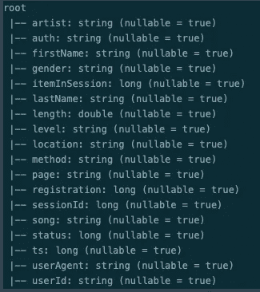*

*数据集架构*

*在*页面*类别中，我们总共有 22 个唯一的条目。*

*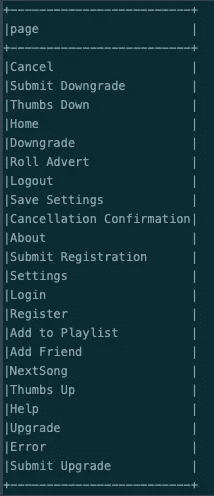*

***页面**栏目内容*

*我定义了一个名为 ***流失*** 的新列，它由任何 ***取消确认*** 或 ***提交降级*** 事件组成，作为用户已经离开服务或停止付费(免费订阅)的确认。每页的点击量分布如下:*

*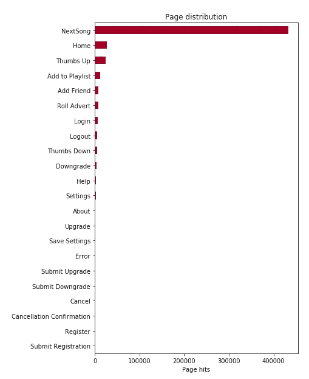*

*每页点击量的分布*

*我们可以看到 ***NextSong*** 页面被大量访问，这是有意义的，因为它表明用户正在听歌。接下来，是 ***首页*** 后跟三个表示与服务交互的: ***竖起大拇指*** ， ***添加到播放列表*** ， ***添加好友*** 。这三项表明对服务的积极体验。另一方面，我们有 ***滚动广告******拇指向下*** 和 ***错误*** 作为用户对服务的不良体验的可能指标。*

*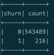*

*从总结中可以看出，我们面对的是一个非常不平衡的数据集。未流失(0)和流失(1)的比率为**2516**。*

*总共有 **225，393 名女性**和 **302，612 名男性**用户，其中有 15，700 名用户没有透露他们的性别，我将其归类为*(不可用):**

**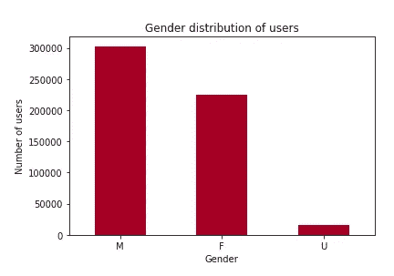**

**性别栏分布**

**我们在*计划/服务中共有 **428，597 *付费*** 用户和 **115，108** 用户。正如我们之前所说的，我们必须确保尽可能多地保留这些付费用户，以最大化收入(或最小化损失)。***

***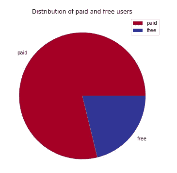***

***付费用户与免费用户***

# ***数据准备***

***我首先着手解决的是不平衡的问题。我用了一种叫做 ***过采样*** 的技术。这是一个非常基本的方法，我利用 PySpark 的 *explode* dataframe 特性从代表不足的类中选择尽可能多的事件(在本例中，流失等于 1)来填充差异，直到我得到一个平衡的数据集来处理。***

***我读到过一些更高级的方法，但它们大多是为**Pandas/Numpy**data frames/sets 构建的，在我的 Spark 环境中不能很好地并行化。这肯定需要更多的时间和调查，以找到一个更强大的解决方案。我了解到的最有希望的方法是**击打**，感兴趣的读者可以在这里[和](https://machinelearningmastery.com/smote-oversampling-for-imbalanced-classification/)[找到更多细节。](https://arxiv.org/abs/1106.1813)***

***应用这种技术后，我扩展并平衡了数据帧，使其增加了 **~50%** :***

***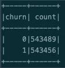***

***从总共 **543，705** 个条目到总共 **1，086，945** 个条目。这被证明是非常有用的，因为我的模型的准确性提高了，我大大减少了没有它时我所面临的过度拟合问题。尽管它并不完美，还可以进一步改进。***

******userAgent*** 提供了我构建的两个特性的一些信息，我使用了: ***os*** 和 ***浏览器*** 。***

***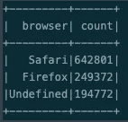***

***从*浏览器*可以看到**642801**使用 **Safari** 和**249372**使用 **Firefox** 。***

***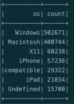***

*****Windows** 是使用较多的操作系统，其次是 **Macintosh** 和 **X11** (Linux)。 **iPhone** 是第四个更常用的，兼容*的*可能是指安卓？***

***我使用了 ***ts*** (时间戳)列来构建更多的特性。从 *ts* 我构造了 ***星期几*** 和 ***小时*** 列。***

***使用这些新的栏目，我们可以看到用户倾向于在一天结束时听更多的歌曲。用户在午饭后开始收听，下午 4-5 点达到高峰(在通勤开车期间？).***

***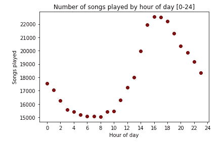***

***一天中每小时播放的歌曲数量***

***用户在工作日也更多地听歌。周四似乎是引人注目的一天，但并不能得出什么结论。***

***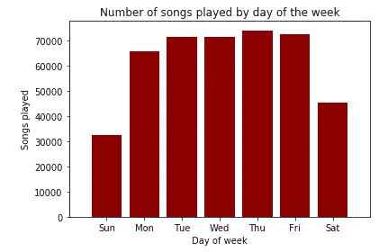***

***按星期几播放的歌曲数量***

***我构建了以下特征:***

*   ******saved _ Settings***所有按“ *userId* 分组的“*保存设置*”页面事件的计数***
*   ******num_songs*** 用户播放的'*歌曲*'的数量统计(按' *userId* '分组)***
*   ******拇指向上*** 按“*用户标识*”分组的所有“*拇指向上*”页面事件的计数***
*   ******num _ advertisement***按“ *userId* ”分组的所有“*滚动广告*”页面事件的计数***
*   ******thumbs_down*** 按“ *userId* ”分组的所有“ *Thumbs Down* 页面事件的计数***
*   ******Playlist _ added***所有按“ *userId* ”分组的“ *Add to Playlist* ”页面事件的计数***
*   ******好友 _ 添加*** 所有按“ *userId* ”分组的“*添加好友*”页面事件计数***
*   ******errors_pages*** 按“ *userId* ”分组的所有“ *Error* ”页面事件的计数***
*   ******songs _ persession***用户(按' *userId'* )在给定会话( *sessionId'* )上播放的平均歌曲数(按'*下一首歌*'页面事件分组)***

***我使用了 PySpark ML 特性库中的 StringIndexer、VectorAssembler 和 Normalizer。 **StringIndexer** 将一列标签编码成一列标签索引。 **VectorAssembler** 是一个转换器，它根据 ML 算法的要求，将给定的列/特征列表组合成一个向量列。最后，**规格化器**是一个**转换器**，它转换一个数据集的*向量*行，*规格化*每个*向量*以具有单位规格化。它采用参数 p，该参数指定用于归一化的 p 范数。(默认情况下 p=2。)这种规范化可以帮助标准化您的输入数据，并改进学习算法的行为。***

# ***建模***

***我已经在训练集和测试集中分别分割了 80–20%的数据集，以进入建模阶段。***

***对于建模，我使用了来自 Spark ML 库中的逻辑回归、随机森林分类器、GBT 分类器和朴素贝叶斯算法。我衡量了表现最好的人，使用 F-1 评分标准作为所有人的参数来选择最好的并进行微调。***

***F-1 分数对我们的流失率预测模型更有意义，因为我们对**假阴性**和**假阳性**更感兴趣。第一个是因为它表明我们预测用户不会离开，不会流失。第二个表示我们预测要离开但没有离开的用户。综上所述，我并不是说**真阴性**(预测离开服务的用户不会离开)也不重要！***

# ***型号选择***

***我用“训练”数据集上的默认参数训练了**逻辑回归**、**随机森林分类器**、 **GBT 分类器**和**朴素贝叶斯**算法，并用“测试”数据集对其进行了评估。***

***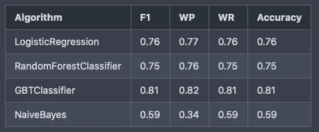***

***表 1 —模型结果总结***

***其中:***

*****F1-** F-1 得分***

*****WP -** 加权精度***

*****WR** -加权召回***

# ***最佳型号选择***

***从**表 1** 中我们可以看到性能最好的型号是 **GBTClassifier** 。我对这个模型进行了微调，运行了一个**交叉验证**，带有 **5 个**折叠和一个参数网格，如下所示:***

***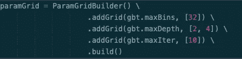***

***用于模型微调的参数网格***

***在获得以下值之前，我使用相同的指标对模型进行了评估:***

***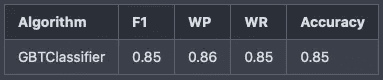***

***表 2 —最佳模型参数汇总***

# ***结论***

***正如我们所看到的，与之前的运行相比，这个经过微调的模型的所有指标都提高了 **4%** ，与其他模型相比几乎提高了 **10%** ！***

***我们的模型预测了 46，435 名离开的用户(真正)和 58，499 名没有离开的用户(真负)。该模型还预测了 **13，790 个**用户离开，而*没有*离开(假阳性)，以及 **4，047 个**用户没有离开(假阴性)。***

***尽管我们的模型远非完美。用一个*的精度只有***的 77%****和一个 ***的召回****的 92%*意味着我们准确地正确预测了 2/3 的流失案例。*******

***GBTClassifier 是我在这个项目中尝试的所有算法中最好的，也是需要更长时间训练的一个，因为它一个接一个地训练树。我在 EMR 集群的性能方面遇到了问题，必须进行一些配置才能成功地在 Spark 中训练所有这些模型。对于所有这些细节，请前往我的 [GitHub](https://github.com/pwolter/sparkify) 仓库。***

***正如我之前提到的，这个不平衡数据集的过采样/欠采样还有很大的改进空间。如果时间和预算允许，可以使用比我在这里使用的更多的超参数进行更广泛的网格搜索，以提高模型性能，但这将需要时间和预算，因为 EMR 不是免费服务。***