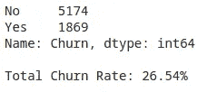
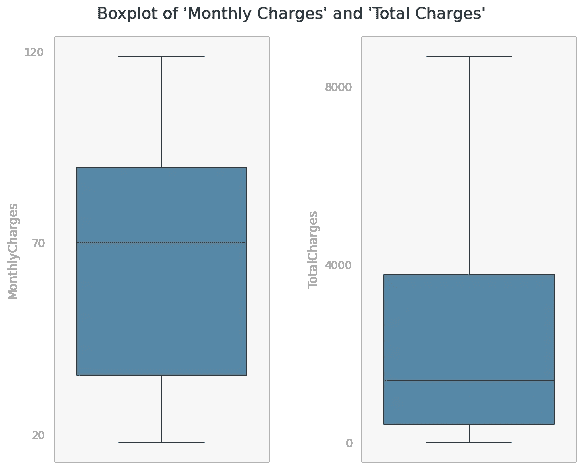
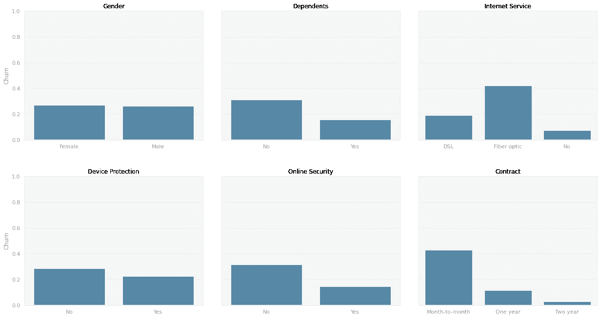
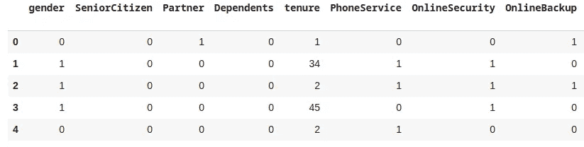
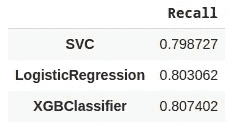
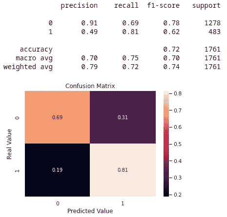
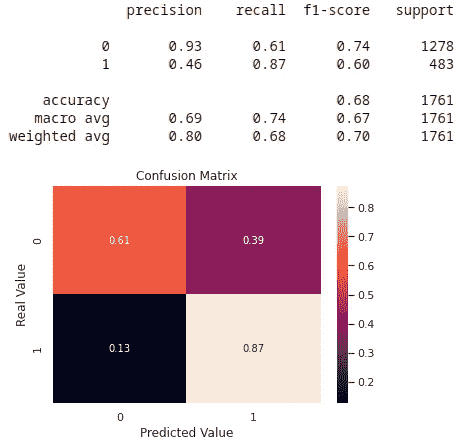
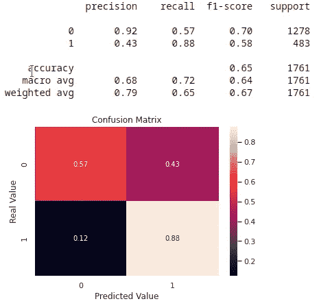

# 基于机器学习的客户流失预测

> 原文：<https://towardsdatascience.com/churn-prediction-with-machine-learning-c9124d932174?source=collection_archive---------14----------------------->


[斯科特·格雷厄姆](https://unsplash.com/@sctgrhm)在 [Unsplash](https://unsplash.com/) 上的照片

## 用 SVC、Logistic 回归和 XGBoost 构建流失预测模型

对任何公司来说，建立和保持忠诚的客户群都是一项挑战，尤其是当客户可以自由地从一个产品类别的众多供应商中进行选择的时候。此外，留住现有客户通常比获得新客户更划算。

因此，评估客户保持率对企业来说至关重要。重要的是，不仅要衡量客户满意度，还要衡量停止与某个公司或服务做生意的客户数量。

**客户流失**，也称为客户流失，是在特定时期内停止使用公司服务的客户的百分比。保持尽可能低的流失率是每个企业的追求，了解这些指标可以帮助公司及时识别潜在的客户，以防止他们离开客户群。

在本文中，我们将基于电信公司数据集构建客户流失预测模型。

# 关于数据

数据集由 IBM 开发者平台[提供，可在](https://developer.ibm.com/technologies/data-science/patterns/predict-customer-churn-using-watson-studio-and-jupyter-notebooks/#)[这里](https://raw.githubusercontent.com/carlosfab/dsnp2/master/datasets/WA_Fn-UseC_-Telco-Customer-Churn.csv)获得。一些信息，如公司名称和私人客户数据，为了保密而保持匿名，不会影响模型的性能。

我们将处理来自 7043 个客户的数据，我们有 20 个特征，如下所示:

**人口统计客户信息**

*   `gender`、`SeniorCitizen`、`Partner`、`Dependents`

**每位客户已签约的服务**

*   `PhoneService`、`MultipleLines`、`InternetService`、`OnlineSecurity`、`OnlineBackup`、`DeviceProtection`、`TechSupport`、`StreamingTV`、`StreamingMovies`

**客户账户信息**

*   `tenure`、`Contract`、`PaperlessBilling`、`PaymentMethod`、`MonthlyCharges`、`TotalCharges`

**上个月离开的客户(这是我们的模型将要预测的特征)**

*   `Churn`

让我们检查一下目标变量`Churn`的值分布。



图一。流失分布

流失率为 26.54%，我们正在处理一个不平衡的数据集。搅棒的数量明显小于非搅棒的数量。

# 数据准备

初步观察表明，我们正在处理 10 个分类变量、7 个二元变量和 3 个数值变量。然而，这项研究将这些分类特征中的一些视为二元的。为了说明，列`StreamingTV`和`TechSupport`具有值“否”、“是”和“没有互联网服务”。在这些情况下，“没有互联网服务”将被视为“没有”。最终模型将使用 4 个分类变量、13 个二元变量和 3 个数值变量进行计数。

在继续之前，让我们检查一下数值变量中的异常值，更具体地说，是在`MonthlyCharges`和`TotalCharges`中。



图二。检查异常值

乍一看，数字特性一切正常。检查箱线图，没有离群值的证据。

如前所述，对初始数据集进行了调整。为了改进我们的模型，一些具有 3 个唯一值的特征被转换为二进制。解决了所有特性之后，让我们来看一个这些特性的客户流失分布的例子。



图三。流失分布

看上面的例子，我们可以解释性别可能不是模型的一个有意义的变量，因为男女客户的流失率非常相似。另一方面，有受抚养人的客户不太可能停止与公司的业务往来。

至于互联网服务，有光纤计划的客户更有可能退出。他们的流失率是 DSL 和无互联网用户的两倍多。

谈到保护服务，拥有设备保护和在线安全计划的客户更有可能维持他们的合同。

最后，合同的类型可能是模型的一个有价值的特性。请注意，逐月合约的流失率远高于一年期和两年期合约的流失率。

在建立 ML 算法之前，我们需要执行一些预处理。考虑到大多数机器学习算法在处理数字输入时效果更好，我们将使用 Scikit Learn 的`LabelEncoder`和 pandas 的`get_dummies`对数据进行预处理。以下是数据集外观的示例:



图 4。预处理后的数据集示例

# 机器学习模型

需要做的第一件事是将数据分成训练集和测试集。之后，为了管理不平衡的情况，我们将使用`StardardScaler`标准化训练集的特性，然后应用`RandomUnderSampler`，根据[官方文档](https://imbalanced-learn.readthedocs.io/en/stable/under_sampling.html#controlled-under-sampling)，这是一种“通过为目标类随机选择数据子集来平衡数据的方法”。

数据经过标准化和平衡后，将使用以下模型，我们将确定哪种模型显示的结果更好:

*   支持向量分类器
*   逻辑回归
*   XGBoost

为了评估这些模型的有效性，我们可以使用`Precision`或`Recall`。精确将会给我们正确识别的比例，而回忆将会决定正确识别的比例。

考虑到我们正在努力解决的问题，`Recall`将更适合于这项研究，因为这里的目标是确定实际上倾向于停止与该公司做生意的客户的最大数量，即使一些“非搅动者”被错误地确定为“搅动者”。也就是说，在我们的情况下，最好是追求尽可能小的一些假阴性。

我们还使用了**交叉验证**来获得更好的结果。`cross_validate`方法不是简单地将数据分成训练集和测试集，而是将我们的训练数据分成 *k* 个*折叠*，从而更好地利用数据。在这种情况下，我们进行了 5 重交叉验证。



图五。回忆价值观

请注意，所有 3 个模型都提供了相似的结果，召回率约为 80%。我们现在将调整模型上的一些超参数，看看我们是否可以实现更高的召回值。这里使用的方法是`GridSearchCV`，它将搜索每个估计器的指定参数值。每个模型都有各种可以调整的参数，但我们只调整那些更有可能影响预测的参数(在`param_grid`参数中指定)，而其余的可以保留默认值。

请在下面找到每个型号的调校:

**支持向量分类器**

```
param_grid = {'kernel': ['linear', 'poly', 'rbf', 'sigmoid'], 'C': [0.0001, 0.001, 0.01, 0.1, 1, 10, 100]}
```

*最佳召回率:0.96 对于{'C': 0.01，' kernel': 'poly'}*

请注意超参数调整是多么有效。我们搜索了`C`和`kernel`的不同值，对于 C = 0.01 和内核类型“poly”，我们得到了 96%的增加的召回率。

**逻辑回归**

```
param_grid = {'solver': ['newton-cg', 'lbfgs', 'liblinear'], 'C': [0.0001, 0.001, 0.01, 0.1, 1, 10, 100]}
```

*最佳召回率:对于{'C': 0.0001，' solver': 'liblinear'}，召回率为 0.88*

转向逻辑回归，我们也实现了更好的召回，对于 C = 0.0001 和 solver =“liblinear”，召回率为 88%。

最后，让我们对 XGBoost 估计量进行一些调整。XGBoost 被认为是最有效的机器学习算法之一，因为它在分类和回归预测建模问题的结构化和表格化数据集上表现出色。它具有高度的可定制性，可以调节更大范围的参数。

**XGBoost**

第一步，我们将确定 XGBoost 模型中最优的树的数量，搜索`n_estimators`参数的值。

```
param_grid = {'n_estimators': range(0,1000,25)}
```

*最佳召回率:0.82 对于{'n_estimators': 25}*

我们已经可以检测到召回率的提高。现在我们已经确定了更好的`n_estimators`值，我们可以继续搜索两个相关参数`max_depth`和`min_child_weight`。

```
param_grid = {'max_depth': range(1,8,1), 'min_child_weight': np.arange(0.0001, 0.5, 0.001)}
```

*最佳召回率:{'max_depth': 1，' min_child_weight': 0.0001}的 0.86*

在接下来的步骤中，我们将确定`gamma`的最佳值，这是一个用于控制模型过度拟合趋势的重要参数。

```
param_grid = {'gama': np.arange(0.0,20.0,0.05)}
```

*最佳召回率:0.86 对于{'gama': 0.0}*

最后，我们将搜索最佳的`learning_rate`值。

```
param_grid = {'learning_rate': [0.0001, 0.01, 0.1, 1]}
```

*最佳召回率:{'learning_rate': 0.0001}的 0.88*

## 在测试集上评估模型

在调整了 SVC、逻辑回归和 XGBoost 的参数之后，我们注意到所有三个模型都有所改进。在**测试集**上运行每个模型的调整版本，以检查它们的性能是至关重要的。

现在，让我们为这些算法中的每一个绘制一个混淆矩阵，以可视化它们在**测试集**上的性能。

**支持向量分类器**



图六。SVC 混淆矩阵

**逻辑回归**



图 7。逻辑回归混淆矩阵

**XGBoost**



图 8。XGBoost 混淆矩阵

在测试集上运行算法后，我们有一个显示，显示当我们调整一些参数时，模型的性能如何得到改善。这三个模型在调优后召回率都有所提高，其中 XGBoost 的召回率最高。

# 结论

该项目的目的是开发一个模型，能够尽可能有效地确定电信公司的大量客户。

能够提前识别潜在的客户，使公司能够制定策略，防止客户离开客户群。有了这些数据，公司可以提供激励措施，如折扣或忠诚度计划，或提供额外的服务，以降低流失率。

值得一提的另一点是调整超参数的重要性，调整 ML 算法以获得更好的结果。参数调整后，三个模型的召回率都有所提高。

XGBoost 已经在数据科学项目中证明了它的有效性，在这个项目中，它提供了模型中最好的结果。出于这个原因，XGBoost 算法将是我们解决这里提出的问题的选择。

完整代码请参考[笔记本](https://github.com/rmpbastos/data_science/blob/master/Churn_Prediction.ipynb)。