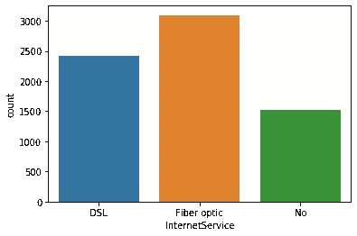

# 基于机器学习的客户流失预测

> 原文：<https://towardsdatascience.com/churn-prediction-with-machine-learning-ca955d52bd8c?source=collection_archive---------3----------------------->

## 机器学习项目的分步说明。

流失预测是机器学习领域的一个常见用例。如果你不熟悉这个术语，churn 的意思是“离开公司”。对于一个企业来说，了解客户可能流失的原因和时间是非常重要的。拥有一个强大而准确的客户流失预测模型有助于企业采取措施防止客户离开公司。


克里斯·利维拉尼在 [Unsplash](https://unsplash.com/s/photos/customer?utm_source=unsplash&utm_medium=referral&utm_content=creditCopyText) 上的照片

在这个项目中，我将使用 Kaggle 上的“电信客户流失”数据集。

对于 7043 个客户，有 20 个特征(自变量)和 1 个目标(因变量)。目标变量表明客户是否在上个月离开了公司(即客户流失=是)。由于目标变量有两种状态(是/否或 1/0)，这是一个二元分类问题。

这些变量是:' customerID '，' gender '，' SeniorCitizen '，' Partner '，' Dependents '，' tension '，' PhoneService '，' MultipleLines '，' InternetService '，' OnlineSecurity '，' OnlineBackup '，' DeviceProtection '，' TechSupport '，' StreamingTV '，' StreamingMovies '，' Contract '，' PaperlessBilling '，' PaymentMethod '，' MonthlyCharges '，' TotalCharges '，' Churn '。

乍一看，只有 customerID 似乎与客户流失无关。其他变量可能会也可能不会对客户流失产生影响。我们会弄清楚的。

该项目的结构如下:

1.  探索性数据分析
2.  数据预处理
3.  模型创建和评估
4.  改进模型

# **1。探索性数据分析**

让我们从导入所需的库开始，然后导入数据集:

```
import numpy as np
import pandas as pd
import matplotlib.pyplot as plt
import seaborn as sns
%matplotlib inline#Dataset
df = pd.read_csv("Telco-Customer-Churn.csv")
df.shape
(7043, 21)
```

我总是寻找缺失的值，并尝试处理它们。我们使用的数据集是预先清理过的，所以我认为没有丢失值。让我们检查一下以确保:

```
df.isna().sum().sum()
0
```

数据集中没有丢失的值，因此我们可以跳转来研究它。我们可以从目标变量开始:

```
df.Churn.value_counts()
No     5174
Yes    1869
```

目标变量具有不平衡的类分布。正类(流失=是)比负类(流失=否)少很多。不平衡的类别分布会对机器学习模型的性能产生负面影响。我们将使用上采样或下采样来克服这个问题。

在试图建立模型之前探索特征(独立变量)总是有益的。我们先来发现只有两个值的特性。

```
columns = df.columns
binary_cols = []for col in columns:
    if df[col].value_counts().shape[0] == 2:
        binary_cols.append(col)
```


剩余的分类变量有两个以上的值(或类)。


# **二元分类特征**

让我们检查二进制特征的类分布。

```
fig, axes = plt.subplots(2, 3, figsize=(12, 7), sharey=True)sns.countplot("gender", data=df, ax=axes[0,0])
sns.countplot("SeniorCitizen", data=df, ax=axes[0,1])
sns.countplot("Partner", data=df, ax=axes[0,2])
sns.countplot("Dependents", data=df, ax=axes[1,0])
sns.countplot("PhoneService", data=df, ax=axes[1,1])
sns.countplot("PaperlessBilling", data=df, ax=axes[1,2])
```


老年人和电话服务变量之间存在严重的不平衡。大多数顾客都不是老年人，同样，大多数顾客都有电话服务。

最好根据二进制特征检查目标变量(churn)如何变化。为了能够进行计算，我们需要改变目标变量的值。“是”将为 1，“否”将为 0。

```
churn_numeric = {'Yes':1, 'No':0}
df.Churn.replace(churn_numeric, inplace=True)
```

让我们看看男性和女性的流失率是否不同:

```
df[['gender','Churn']].groupby(['gender']).mean()
```


男性和女性的平均流失率大致相同，这表明性别变量不会给模型带来有价值的预测能力。因此，我不会在机器学习模型中使用性别变量。

同样，我们可以根据流失率检查其他二元分类特征:


其他二元特征对目标变量有影响。如果你认为 2%的差异可以忽略不计，电话服务也可能被跳过。我已经决定在模型中使用这个特性。

我们还可以使用 pandas pivot_table 函数来检查特征和目标变量之间的关系。

```
table = pd.pivot_table(df, values='Churn', index=['gender'],
                    columns=['SeniorCitizen'], aggfunc=np.mean)
table
```


# **其他分类特征**

是时候探索其他分类特征了。我们也有连续的功能，如任期，每月收费和总费用，我将在下一部分讨论。

**互联网服务**

互联网服务有 6 个变量，分别是流媒体电视、流媒体电影、在线安全、在线备份、设备保护和技术支持。如果客户有互联网服务，这些变量就会发挥作用。

```
sns.countplot("InternetService", data=df)
```



互联网服务变量在预测流失率方面无疑是重要的。如您所见，使用光纤互联网服务的客户比其他客户更容易流失，尽管使用 DSL 和光纤的客户数量没有太大差异。这家公司可能在光纤连接方面存在一些问题。然而，只根据一个变量进行假设并不是一个好方法。让我们也检查一下每月的费用。


光纤服务比 DSL 贵得多，这可能是客户流失的原因之一。

我们现在可以检查互联网服务相关变量的分布:

```
fig, axes = plt.subplots(2, 3, figsize=(12, 7), sharey=True)sns.countplot("StreamingTV", data=df, ax=axes[0,0])
sns.countplot("StreamingMovies", data=df, ax=axes[0,1])
sns.countplot("OnlineSecurity", data=df, ax=axes[0,2])
sns.countplot("OnlineBackup", data=df, ax=axes[1,0])
sns.countplot("DeviceProtection", data=df, ax=axes[1,1])
sns.countplot("TechSupport", data=df, ax=axes[1,2])
```


所有与互联网服务相关的功能对于它们的类别似乎具有不同的流失率，因为流失率根据拥有这些服务的客户而变化。流媒体电视和流媒体电影的区别并不大，但它们仍然可以为模式带来价值。您可以决定不包括这两个特性。

**电话服务**

```
df.PhoneService.value_counts()
Yes    6361
No      682df.MultipleLines.value_counts()
No                  3390
Yes                 2971
No phone service     682
```

如果客户没有电话服务，他/她就不能拥有多条线路。与 PhoneService 列相比，MultipleLines 列包含更具体的数据。所以我将不包括电话服务栏，因为我可以从多线栏了解有电话服务的人数。MultipleLines 列将 PhoneService 列向前推进了一步。

让我们看看拥有多条生产线是否会改变流失率:


它类似于 StreamingTV 和 StreamingMovies 变量，因此在模型中利用这些变量取决于您。我会将它们包含在模型中。

**合同及付款方式**

```
plt.figure(figsize=(10,6))
sns.countplot("Contract", data=df)
```


正如预期的那样，签订短期合同的客户更有可能流失。这清楚地解释了公司与客户建立长期关系的动机。

```
plt.figure(figsize=(10,6))
sns.countplot("PaymentMethod", data=df)
```


使用电子支票支付的客户更有可能流失，这种支付方式比其他支付方式更常见。因此，如果使用电子支票支付的客户有任何其他共同之处，可以进一步调查该细分市场。

# **连续特征**

连续功能是任期，每月收费和总费用。总费用栏中的金额与任期(月数)乘以每月费用成正比。因此没有必要在模型中包含总费用。添加不必要的特征会增加模型的复杂性。如果可能的话，最好有一个更简单的模型。复杂的模型往往会过度拟合，不能很好地推广到新的、以前看不到的观察结果。由于机器学习模型的目标是预测或解释新的观察结果，过拟合是一个至关重要的问题。

我们再来看看连续特征的分布。

```
fig, axes = plt.subplots(1,2, figsize=(12, 7))sns.distplot(df["tenure"], ax=axes[0])
sns.distplot(df["MonthlyCharges"], ax=axes[1])
```


> **任期**:客户在公司呆的月数。

根据任期变量的分布，大多数客户要么是新客户，要么已经在公司呆了很长时间。我们的目标应该是找到一种方法来留住这些客户长达几个月的任期。

月度费用也有类似的趋势。低利率和高利率之间似乎有差距。

让我们来看看流失率是如何随着任期和每月费用而变化的:


很明显，已经成为客户很长时间的人倾向于留在公司。离开公司的人的平均任期比留下来的人少 20 个月。

似乎月费对流失率也有影响。

合同和任期特征可能相互关联，因为长期合同的客户可能会在公司呆更长时间。让我们弄清楚。


正如所料，合同和任期是高度相关的。拥有长期合同的客户比拥有短期合同的客户成为客户的时间更长。我认为合同对保有权特性没有什么价值，所以我不会在模型中使用合同特性。

在研究了这些变量之后，我决定不使用下面的变量，因为它们很少或根本不增加模型的信息量:

*   客户 ID
*   性别
*   电话服务
*   合同
*   总费用

```
df.drop([‘customerID’,’gender’,’PhoneService’,’Contract’,’TotalCharges’], axis=1, inplace=True)
```

# **2。数据预处理**

分类特征需要转换为数字，以便它们可以包含在由机器学习模型完成的计算中。我们数据集中的分类变量不是有序的(也就是说，它们没有顺序)。例如，“DSL”互联网服务并不优于“光纤”互联网服务。有序分类变量的一个例子是从 1 到 5 的评级，或者是具有类别“差”、“一般”和“好”的变量。

当我们对分类变量进行编码时，会给每个类别分配一个数字。具有较高数字的类别将被认为更重要或对模型的影响更大。因此，我们需要对变量进行编码，使每个类别由一列表示，该列中的值为 0 或 1。

我们还需要缩放连续变量。否则，具有较高值的变量将被赋予更大的重要性，这会影响模型的准确性。

```
from sklearn.preprocessing import LabelEncoder, OneHotEncoder
from sklearn.preprocessing import MinMaxScaler
```

分类变量编码:

```
cat_features = ['SeniorCitizen', 'Partner', 'Dependents',
'MultipleLines', 'InternetService','OnlineSecurity'      'OnlineBackup', 'DeviceProtection', 'TechSupport', 'StreamingTV',
'StreamingMovies', 'PaperlessBilling', 'PaymentMethod']X = pd.get_dummies(df, columns=cat_features, drop_first=True)
```

缩放连续变量:

```
sc = MinMaxScaler()
a = sc.fit_transform(df[['tenure']])
b = sc.fit_transform(df[['MonthlyCharges']])X['tenure'] = a
X['MonthlyCharges'] = b
```

让我们检查数据集的新维度:

```
X.shape
(7043, 26)
```

# **重采样**

正如我们在开始时简要讨论的，具有不平衡类别分布的目标变量对于机器学习模型来说是不期望的。我将使用上采样，这意味着通过从类中随机选择行，用较少的样本增加类的样本数。

```
sns.countplot('Churn', data=df).set_title('Class Distribution Before Resampling')
```


分离积极类别(流失=是)和消极类别(流失=否):

```
X_no = X[X.Churn == 0]
X_yes = X[X.Churn == 1]
```

向上采样正类:

```
X_yes_upsampled = X_yes.sample(n=len(X_no), replace=True, random_state=42)print(len(X_yes_upsampled))
5174
```

结合正反类，检查类分布:

```
X_upsampled = X_no.append(X_yes_upsampled).reset_index(drop=True)sns.countplot('Churn', data=X_upsampled).set_title('Class Distribution After Resampling')
```


# **3。模型创建和评估**

我们需要将数据集划分为训练和测试子集，以便我们能够在新的、以前未见过的示例上测量我们的模型的性能。

```
from sklearn.model_selection import train_test_splitX = X_upsampled.drop(['Churn'], axis=1) #features (independent variables)y = X_upsampled['Churn'] #target (dependent variable)
```

将数据集划分为训练和测试子集:

```
X_train, X_test, y_train, y_test = train_test_split(X, y, test_size = 0.2, random_state=42)
```

**山脊分级机**

我已经决定使用脊分类器作为基础模型。然后我会尝试一款我认为性能会更好的车型。

```
from sklearn.linear_model import RidgeClassifier
from sklearn.metrics import accuracy_score
```

创建脊线分类器对象并对其进行训练:

```
clf_ridge = RidgeClassifier() #create a ridge classifier object
clf_ridge.fit(X_train, y_train) #train the model
```

对训练集进行预测并评估:

```
pred = clf_ridge.predict(X_train)accuracy_score(y_train, pred)
0.7574293307562213
```

对测试集进行预测并评估:

```
pred_test = clf_ridge.predict(X_test)accuracy_score(y_test, pred_test)
0.7608695652173914
```

该模型在训练集和测试集上的准确率分别达到了 75%和 76%。该模型没有过度拟合，因为训练集和测试集的精度非常接近。然而，75%的准确度不是很好，所以我们将尝试使用不同的模型来获得更好的准确度。

**随机森林**

```
from sklearn.ensemble import RandomForestClassifier
```

创建随机林对象并训练它:

```
clf_forest = RandomForestClassifier(n_estimators=100, max_depth=10)clf_forest.fit(X_train, y_train)
```

这里需要提到两个参数。

*   n_estimators:森林中树木的数量。
*   max_depth:树的最大深度。

这些参数在模型的准确性以及防止模型过度拟合方面具有关键作用。一般来说，如果我们使用深树(max_depth 非常高)，模型可能会过拟合。

对训练集进行预测并评估:

```
pred = clf_forest.predict(X_train)accuracy_score(y_train, pred)
0.8860835950712732
```

对测试集进行预测并评估:

```
pred_test = clf_forest.predict(X_test)accuracy_score(y_test, pred_test)
0.842512077294686
```

训练集的精度比测试集的精度高 4%,这表明有轻微的过度拟合。我们可以减少树在森林中的深度，因为随着树越来越深，它们会变得越来越具体，这导致不能很好地概括。但是，减少树深度也可能会降低准确性。所以我们在优化参数时需要小心。我们还可以增加森林中的树木数量，这将有助于模型更加通用，从而减少过度拟合。几乎在每个项目中，参数调整都是非常关键的部分。

另一种方法是进行交叉验证，允许使用训练集和测试集中的每个样本。

# **4。改进模型**

**GridSearchCV** 提供了一种简单的参数调整方法。我们可以使用 GridSearchCV 进行交叉验证并尝试不同的参数。

```
from sklearn.model_selection import GridSearchCV
```

创建 GridSearchCV 对象:

```
parameters = {'n_estimators':[150,200,250,300], 'max_depth':[15,20,25]}forest = RandomForestClassifier()clf = GridSearchCV(estimator=forest, param_grid=parameters, n_jobs=-1, cv=5)
```

cv = 5 意味着具有 5 重交叉验证。因此数据集被分成 5 个子集。在每次迭代中，4 个子集用于训练，另一个子集用作测试集。当 5 次迭代完成时，模型使用所有样本作为训练样本和测试样本。

n_jobs 参数用于选择使用多少处理器。-1 表示使用所有处理器。

```
clf.fit(X, y)
```

让我们检查一下最佳参数和总体精度:

```
clf.best_params_
{'max_depth': 20, 'n_estimators': 150}clf.best_score_
0.8999806725937379
```

> best _ score _:best _ estimator 的平均交叉验证分数。

我们已经实现了将近 90%的总体准确率。这是 best_estimator 的平均交叉验证分数。在前一个随机森林中，平均分数约为 86%(训练 88%，测试 84%)。使用 GridSearchCV，我们将模型精度提高了 4%。

我们总是可以尝试改进模型。机器学习模型的燃料是数据，因此如果我们能够收集更多的数据，对改进模型总是有帮助的。我们还可以在 GridSearchCV 中尝试更大范围的参数，因为稍微调整一个参数可能会略微增加模型。

最后，我们可以尝试更健壮或更高级的模型。请记住，在做出此类决定时，会有一个权衡。高级模型可能会提高准确性，但它们需要更多的数据和更多的计算能力。所以这归结为商业决策。

你可以从这个[回购](https://github.com/SonerYldrm/Churn-Prediction)下载该项目的完整笔记本。

感谢您的阅读。如果您有任何反馈，请告诉我。