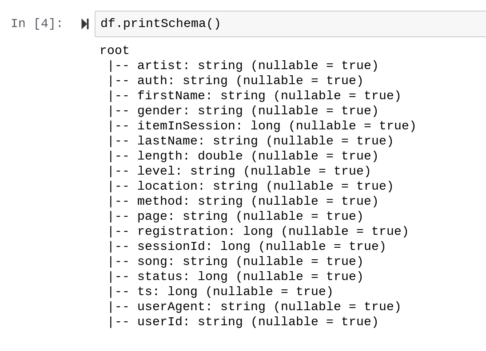
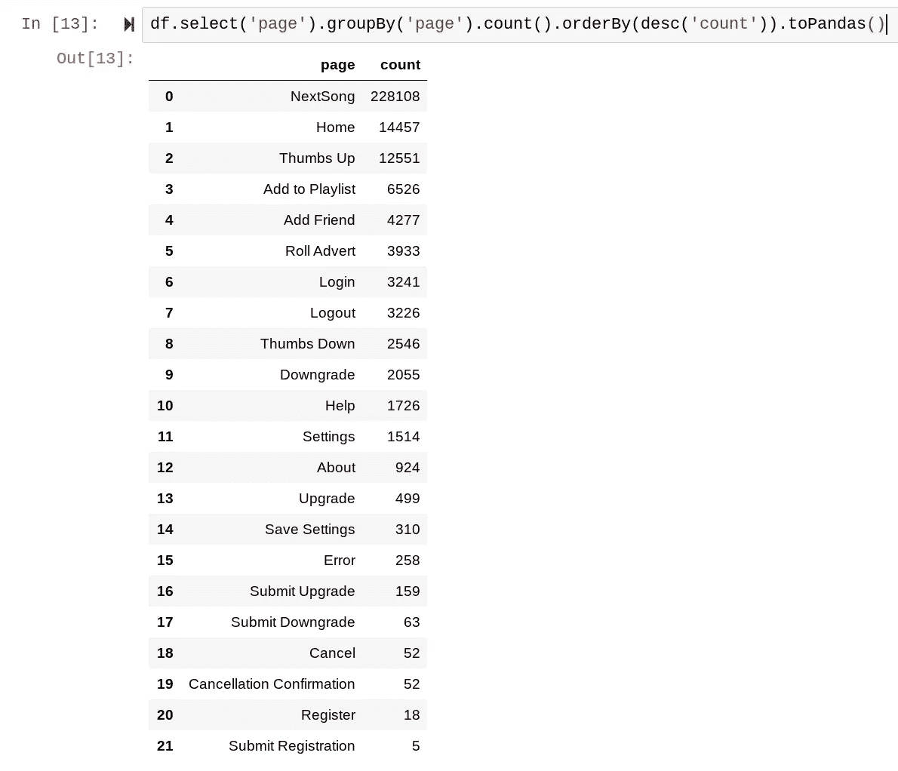
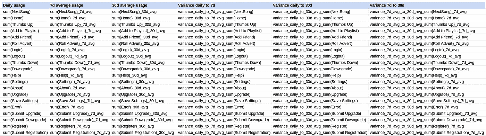
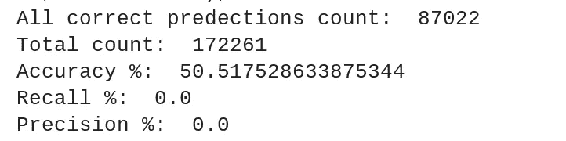
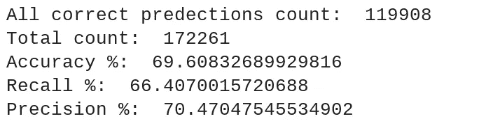
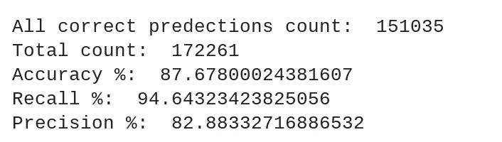
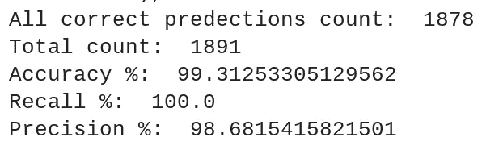
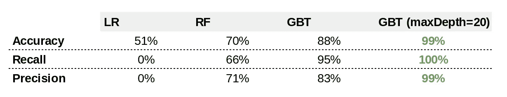
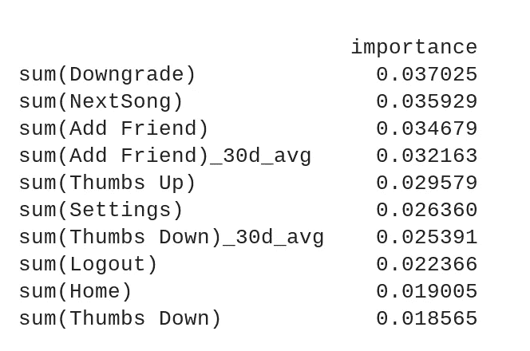

# 使用 PySpark 进行流失预测

> 原文：<https://towardsdatascience.com/churn-prediction-with-pyspark-cdb7293c0850?source=collection_archive---------38----------------------->

## 搅动婴儿搅动器！

> 你不讨厌你的顾客离开吗？

马科斯·保罗·普拉多在 [Unsplash](https://unsplash.com?utm_source=medium&utm_medium=referral) 上的照片

很难过，他们可能再也不会回来了！

正如 Flo 在[的文章](https://blog.markgrowth.com/eliminating-churn-is-growth-hacking-2-0-47a380194a06):*中提到的，根据* [*《哈佛商业评论》*](https://hbr.org/2014/10/the-value-of-keeping-the-right-customers) *的说法，获得新客户比留住现有客户要贵五到二十五倍。”*

> 你可以做点什么！

如果我告诉你，你可以预测客户流失。

在本文中，我将为您提供实用的机器学习实现，使用一个虚构的数字音乐流媒体服务来预测客户流失。

我们将讨论以下几点:

1.  客户参与度指标的特征工程
2.  秘方是过采样
3.  最佳性能模型

# 介绍

在讨论细节之前，让我们先解释一下数据源。

该数据集来自一个名为 Sparkify 的虚拟数字音乐流媒体服务。它包含几个从网站交互日志中派生出来的潜在有趣的字段。

我们使用 [Spark](https://spark.apache.org/) ，因为数据集是 12GB，我们需要分布式机器学习技术的力量来帮助我们完成繁重的工作。

在我们的例子中，客户流失被定义为 **page == "取消确认"**。

数据的模式如下所示:

# 客户参与度指标的特征工程

我们的数据集允许多种特征工程方法。我把重点放在结合使用“页面”字段和我们的时间“ts”组件来理解用户对我们网站的参与度。

页面字段是分类字段，有几个不同的值，如下所示:

在 PySpark 中，从分类列创建虚拟变量一点也不简单。值得展示这些步骤:

**使用 StringIndexer 将分类列转换为索引列**

**使用 OneHotEncoder 将索引转换为稀疏向量**

这可能就足够了，因为机器学习函数的输入接受特征作为稀疏向量。然而，让我们想想我们现在所拥有的。对于每个“页面”分类值，我们在稀疏向量矩阵中有 1 和 0。

**功能选择**

我们希望获得一种客户参与度指标。当从用户的角度考虑这个问题时，我希望我的所有页面交互都有每日使用量以及每周和每月的平均值。此时，我不确定哪个分类值在预测客户流失方面最重要，所以我将保留所有分类值。

为了检查特定参与度指标的增长或下降是否会影响流失率，我们将在每日、7 天和 30 天平均值之间进行比较。

以下是我想要的功能列表:

最后，我们将在平台上添加终身职位作为附加功能。这是一个常用的用户参与度指标。

为了获得每日、每周和每月的指标，我需要将“ts”转换为日期，并对每个功能使用某种窗口功能。

**使用行提取器获取每个稀疏事件项的各个列:**

**日期操作:从“ts”到天数**

**创建每日数据框**

这将为我们提供日常指标:

**创建衍生指标**

现在来点好玩的。我发现了一种很好的方法来遍历这个每日数据集，以获得 7d 和 30d 的平均值，并导出几个度量对的方差度量。听起来很复杂。但我预计，如果你每天听的歌曲明显低于你的 7d 平均水平，你就会变得无所事事，因此更有可能取消。

达到平均值:

获取差异指标:

**在平台上添加任期**

最后，我创建了一个任期指标，如下所示:

**检查您的空值**

我们现在已经做了许多计算。存在一种风险，即它们并不都产生值(例如除以 0)。使用这个[堆栈溢出答案](https://stackoverflow.com/questions/44627386/how-to-find-count-of-null-and-nan-values-for-each-column-in-a-pyspark-dataframe)检查每列的空值。

这告诉我，我肯定需要填充我的数据框架:

**矢量装配器**

在继续之前，对于 PySpark ML 中的建模，我们需要将所有单独的度量组合回一个 SparseVector 中。我们可以使用向量组装器:

# 秘方是过采样

你曾经因为你的逻辑回归只预测你标签的大多数类别而沮丧过吗？

不是模特的错。它正确地预测了最可能的分类。

这是由数据集中的不平衡造成的。有许多方法可以处理不平衡的数据。特别是，如果您感兴趣的类非常小，过采样可以工作。

> 这是你的模型表现更好的秘方，通过训练更多的少数民族的例子。

我为万军的 Pyspark 找到了这个简洁的[过采样方法:](https://medium.com/@junwan01/oversampling-and-undersampling-with-pyspark-5dbc25cdf253)

# 最佳性能模型

我们测试了 3 种不同的模型:

*   物流回收
*   随机森林分类器
*   梯度推进树分类器

首先，在 PySpark 中进行训练测试分割:

继续建模:

**物流回归**

结果:

**随机森林分类器**

结果越来越好:

**梯度增强树分类器**

结果:

**GradientBoostingTree 分类器(CrossValidator)**

这最后一个模型表现非常好。通过快速交叉验证，maxDepth=20 的结果甚至更好。由于性能问题，我无法运行完整的数据集。

以下是一小部分的结果:

**基准模型分析**

您可以在下面找到按型号划分的所有指标的摘要。maxDepth=20 的 GBT 明显胜出。

**了解特征重要性**

为了找出哪些特性是最重要的，我用下面的代码查看了我的 GBT 模型:

发现以下是预测客户流失的一些最重要的指标:

# 结论

在这篇文章中，我给了你一些预测客户流失的实用工具:

1.  在我们的功能工程部门，我们创建了一个大的计算参与度指标集
2.  我们给了你处理不平衡数据的秘密:过采样
3.  GradientBoostingTree 分类器在该数据集上表现出色

**可能的改进**

1.  我处理向量的方式可能更优雅。我在努力从这些结构中获取信息。
2.  此外，我可以使用主成分分析来降低特征维数，这将提高模型的整体执行速度。

**编码时面临的困难**

我在几个不同的领域遇到了困难:

*   AWS 集群的计算容量(自由层)。我想在 GBT 上运行的交叉验证无法在我的完整数据集上完成。我必须为我的特征工程的大部分定义函数，以便在较小的数据集上快速完成所有步骤
*   超参数:由于性能问题，我一次只能测试有限数量的参数。即使在较小的数据集上
*   Datetime 计算:我花了很长时间才弄清楚如何处理 Pyspark 中的日期格式，以及随后如何添加 datatime 以得出任期指标。
*   BestModel:我花了很长时间才找到如何从 pipelin(或者 CV)选择 stages 来直接在模型上调用 BestModel 函数。
*   载体:处理载体可能会令人困惑

我希望你喜欢这篇文章！

完整的 Github 库在这里:[https://github.com/thijsessens/sparkify_churn_prediction](https://github.com/thijsessens/sparkify_churn_prediction)