# 使用 Spark 进行客户流失预测

> 原文：<https://towardsdatascience.com/churn-prediction-with-spark-e16d96bbf147?source=collection_archive---------45----------------------->

## 客户流失预测对于留住客户至关重要，也是成功的关键因素之一，因为它有助于企业在关键时刻主动向客户提供正确的优惠和折扣。

兰迪·法特在 [Unsplash](https://unsplash.com?utm_source=medium&utm_medium=referral) 上的照片

为了 Udacity 的数据科学家 Nanodegree 的顶点项目，我试图为虚构的音乐流媒体服务 Sparkify 建立一个机器学习管道来进行流失预测。我为这个项目写的代码可以在这个[资源库](https://github.com/minhtuan2000/sparkify)中找到。

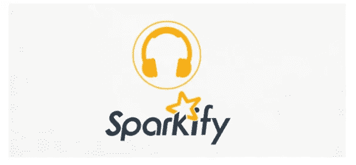

由 Udacity 提供的 Sparkify 虚构徽标

Sparkify 已经收集了一个关于其平台上成千上万独立用户活动的大型数据库。作为一项不断发展的服务，Sparkify 将在未来继续产生更多的数据(当然，前提是它已经存在)。在这种情况下，Spark 被证明是一个合适的工具，因为它提供了急需的可伸缩性。

# 问题陈述

Sparkify 提供的大型数据集(~12GB)，包含用户活动的详细信息。具体来说，每一行代表一个用户活动，包括关于用户的基本信息(用户 ID、名字、姓氏、性别、他们的订阅级别、他们是否登录过……)和关于活动性质的进一步信息(例如，活动的时间戳、他们访问的页面的名称，或者他们请求的艺术家、歌曲和歌曲长度的名称)。每个唯一用户可以在数据集中记录多个活动。

给定数据集，主要任务是清理数据(如果必要的话)，执行数据探索和分析，特征提取，最后，实现机器学习模型来对搅动的用户进行分类。理想情况下，当给定用户活动列表时，解决方案模型应该能够预测他们是否是搅动者(当然，不需要查看数据集中的取消事件)。

这些模型是根据它们的 F1 分数而不是准确性进行评估的，因为在这种情况下，与平台上的用户总数相比，被搅动的用户数量很少，并且数据是不平衡的。

# **设置**

对于这个项目，我在 IBM Watson Studio 上使用了 *Python 3.7* 和 *Spark 3.0.1* ，它提供了 2 个执行器:1 个 vCPU 和 4 GB RAM，以及一个驱动程序:1 个 vCPU 和 4 GB RAM，采用 Lite 计划。由于硬件容量的原因，我只处理了原始数据集(大约 12GB)的一个子集(大约 200MB)。

# 数据探索

子数据集包含 **543705** 个观察值，每个观察值代表属于 **448** 个唯一用户之一的活动，以及 **18** 个特征。

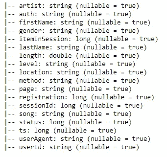

数据模式—按作者分类的图像

**页面**列特别有趣，因为它包含记录的用户活动类型。

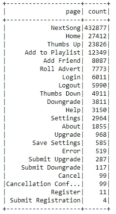

第**页**的独特价值—作者图片

请注意，该列中没有丢失数据，NextSong 是最受欢迎的活动，这是可以理解的，因为 Sparkify 是一种音乐流媒体服务。

然而**升级**和**降级**的数量相对于**提交升级**、**提交降级**、**取消**、**取消确认**的数量，甚至是唯一用户的数量，都是巨大的。因此，我们可能会猜测**升级**和**降级**是用户可以选择升级或降级其订阅的页面，而不是这样做的实际事件。

## 清理数据集

下一步是清理数据集。查看每列中缺失数据的数量，有两组:

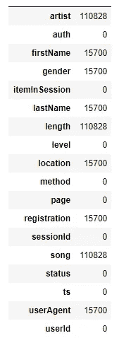

每列中缺失值的数量-按作者排序的图像

1.  当且仅当**页面**类型为**下一首歌曲时，**艺术家**、**长度**和**歌曲**不为空(包含一些值)。**
2.  **名字**、**姓氏**、**性别**、**地点**、**注册**和**用户代理**在用户未登录或未注册时缺失。事实上， **userId** 在这种情况下也会丢失，但是丢失的值被伪装成空字符串。然而，这些用户无法访问 Sparkify 的主要功能，因此，我们可以安全地删除所有这些观察。

## 定义流失

接下来，我使用**取消**和**取消确认**来定义客户流失。特别地，任何具有这些事件中的至少一个的用户被认为是被搅动的用户。我还检查了这些事件实际上是同时发生的，并且有 **99** 个用户，大约是数据集中用户总数的 **22%** 。

## 可视化数据

在清理数据集和定义客户流失后，我用一些图表来回答我认为对客户流失预测和用户行为至关重要的 4 个问题。

**用户参与度和用户留存之间有什么关系？**

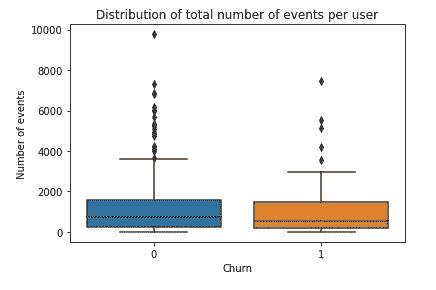

每位用户的事件/互动总数-按作者分类的图片

我们可以看到，流失用户对服务的参与度略有下降。

在此分析中，时间戳有用吗？

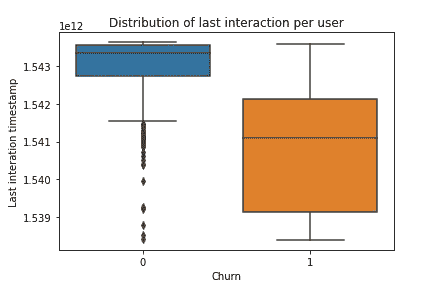

作者图片

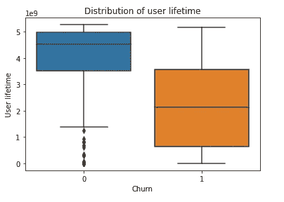

作者图片

绝对是的，用户群之间的上次交互和用户生存期明显不同。我们还可以注意到，长期用户对服务更忠诚。

**免费用户会取消他们的服务吗？**

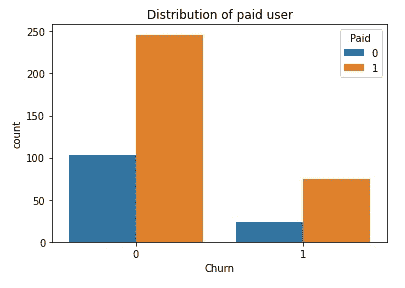

作者图片

不幸的是，也是的。事实上，免费用户和付费用户的取消率大致相同。

**关于流失，用户活动能告诉我们什么？**

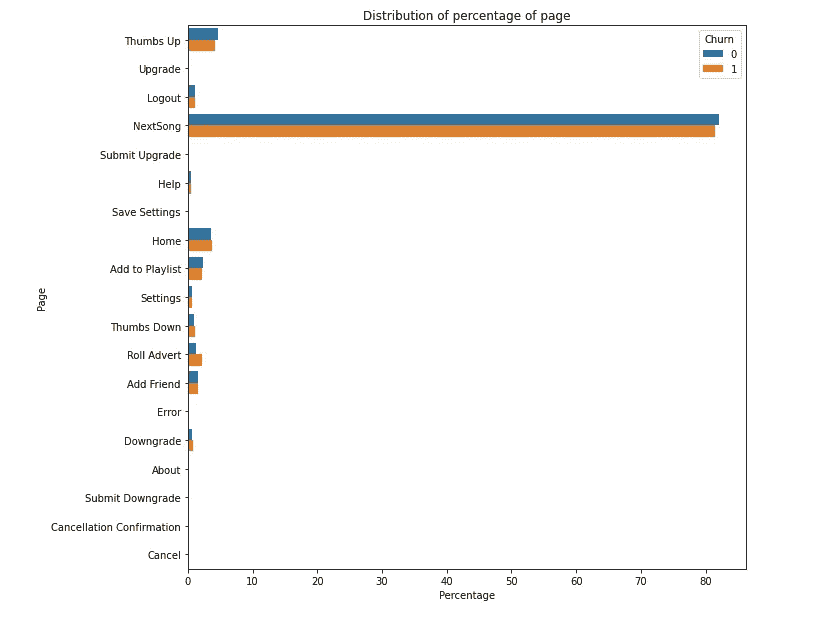

作者图片

一般来说，被取消的用户竖起大拇指的**少，下一首**的**少，加入播放列表**的**少，竖起大拇指**的**多，滚动广告**多，降级**的**多。我们可以看到，总的来说，这些用户并没有像以前那样喜欢这项服务。

*注意:记住* ***降级*** *不是实际的账户降级事件，而可能是用户可以选择降级其账户的页面。*

# 建模

## **功能选择**

我按照**用户 Id** 对数据集进行分组，并选择了我认为最相关的 **13** 个特性:

*   *交互总数*
*   *注册时间戳*
*   *上次交互时间戳*
*   *用户寿命*
*   *一生中的平均相互作用*
*   *等级(1 表示付费，0 表示免费)*
*   *竖起大拇指的百分比*
*   *拇指向下的百分比*
*   *回家的百分比*
*   *next song 的百分比*
*   *添加到播放列表的百分比*
*   *滚动广告的百分比*
*   *降级百分比*

然后，产生的数据集被分成训练和测试数据集(分别为 90%和 10%)。

## 建造管道

在获得训练和测试数据集后，我为两种不同的分类方法建立了三个机器学习管道:逻辑回归和随机森林。每个管道执行三个主要任务:

*   根据 PySpark 输入模式的要求，将所选要素组装成矢量。
*   对矢量进行标准化(缩放平均值为 0，标准偏差为 1)，将所有要素放在相似的尺度上。还有其他的缩放方法；然而，标准化对异常值是最稳健的。
*   执行网格搜索并使用 F1 分数选择最佳超参数。

网格搜索中使用的超参数如下:

对于*物流回收*:

*   *regParam:* [0.01，0.1]

对于 *RandomForestClassifier* :

*   *maxDepth(一棵树的最大深度)* : [12，30]
*   *numTrees(树的总数)*:【20，100】

## 结果

最佳逻辑回归模型能够在训练数据集上达到 F1 得分 **0.868** ，并且在测试数据集(F1 得分 0.912，准确度 0.917)中正确预测 36 个用户中的 33 个，其中 *regParam=0.01* 。

有了一个 *maxDepth* 12 和 *numTrees* 100 的随机森林，我能够在 train 数据集上取得更好的结果(F1 得分= **0.887** )。该模型在测试数据集上产生了相同的预测(36 个中有 33 个正确，F1 值为 0.912，准确度为 0.917)。

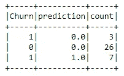

两种方法在测试数据集上的预测结果—作者提供的图片

但是，测试数据集上的这种性能并不意味着随机森林模型不好。仅包含 36 个用户的测试数据集根本不够大，无法用于有效地比较不同的模型。

我认为，在这种情况下，随机森林比逻辑回归更好，因为它可以对一系列数据进行分组(例如，流失用户的寿命通常在 10 亿到 30 亿'*时间单位'*)而逻辑回归只能根据与某个值(大于或小于该值)的比较对数据进行分类。为了用逻辑回归区分一系列数据，我们需要添加隐藏层，因此，使用深度学习。因此，我认为随机森林模型是一个更好的选择。

此外，随机森林的一个优点是，我们可以通过查看特性的重要性来了解每个特性对结果的影响:

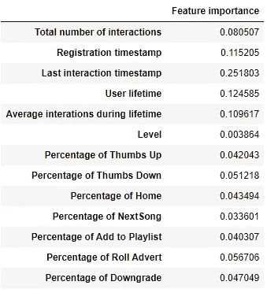

作者图片

正如在上面的数据可视化部分中所猜测的，用户订阅**级别**贡献不大，而**最后一次交互**和**用户生命周期**对模型的性能至关重要。因此，为了提高客户保持率，最简单和最有效的方法之一是针对最近不活跃的用户(**上次互动**的较低值)提供特殊优惠和折扣。这些折扣也可以在用户点击**取消**页面时提供。

## 可能的进一步改进

*   使用 **last interaction** 可能不是最好的主意，因为我们可能想知道谁不喜欢 Sparkify，甚至在他们想取消之前。相反，我们可以把目标人群锁定在约会少、**否决**、滚动广告**、**多、访问**降级**页面更频繁的人群。
*   在这个项目中，我没有使用用户听过的**艺人**和**歌曲**，或者用户的**地点**和**性别**。这些特性可能对更好的模型有用。

# 结论

总之，我通过可视化和分析探索了数据集。我还清理、转换了数据，提取了 Sparkify 上关于用户的相关特征。根据这些特征，我使用逻辑回归和随机森林建立了不同的机器学习管道，并比较了结果。最佳随机森林模型在训练数据集上达到了 0.887 的 F1 分数，并且在测试数据集中对 36 个用户中的 33 个进行了正确分类。

通过这个项目，我学会了 Spark，并能够将我的知识应用到实际问题中。我还以一个漂亮的顶点项目结束了我与 Udacity 上的数据科学家 Nanodegree 的旅程。