# 带有 Azure DevOps 和的 Lambda 函数的 CI/CD。网络核心

> 原文：<https://towardsdatascience.com/ci-cd-for-lambda-functions-with-azure-devops-and-net-core-9131b36582c0?source=collection_archive---------19----------------------->


卡尔·海尔达尔在 [Unsplash](https://unsplash.com?utm_source=medium&utm_medium=referral) 上拍摄的照片

## 自 AWS Lambda 功能首次发布([2014 年 11 月](https://docs.aws.amazon.com/lambda/latest/dg/lambda-releases.html))以来，我们一直在挑战自己，以不同的方式思考开发。

随着时间的推移，[无服务器](https://en.wikipedia.org/wiki/Serverless_computing)模式越来越多地出现在具有新资源、工具和方法的软件开发中。

然而，如果没有控制，我们很容易制造一场噩梦。就像本叔叔说的:“权力越大，责任越大”。

帮助我们完成这一“责任”的方法之一是为 Lambda 函数建立 CI/CD 管道，并提取完整 ALM 的全部好处。

在这篇文章中所有这些观点的激励下，我们将创建一个管道来部署我们的 Lambda 函数。

所以，我们开始吧！:D

# 要求

*   Azure DevOps 帐户
*   AWS 帐户
*   C#的基础知识

# AWS 帐户

我们需要创建一个[编程访问用户](https://docs.aws.amazon.com/IAM/latest/UserGuide/id_users_create.html)，负责连接 AWS 和 Azure DevOps 账户。

对于**测试**且仅对于**测试**，您可以为您的用户设置此权限:

绝不、绝不、绝不授予生产中的所有访问权限。在安全性方面，越少越好:)

通过我们的 AWS 编程用户、访问密钥和秘密密钥，我们可以创建 Azure DevOps 项目。

# Azure DevOps 管道

我最喜欢的 Azure DevOps 特性之一是管道。我是这种资源的忠实粉丝，因为它非常容易使用，必要时可以用来处理巨大而复杂的场景。

首先，我们将连接两个帐户:

# Azure DevOps 的 AWS 工具包

这个工具包对于创建服务连接和启用我们将在管道作业中使用的 *LambdaDeployFunction* 任务是必要的。

您可以通过此链接安装[工具](https://marketplace.visualstudio.com/items?itemName=AmazonWebServices.aws-vsts-tools)。

在我们的帐户上安装了工具包后，我们可以进入下一步。

# 将 AWS 帐户连接到 Azure DevOps

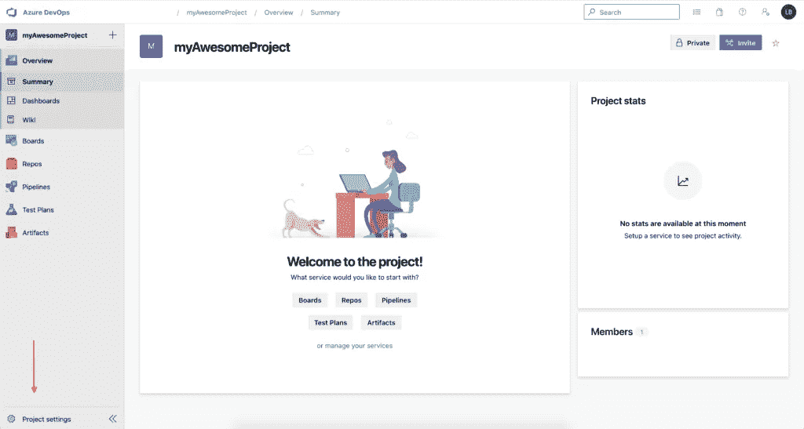

Azure Devops —项目主页

并创建服务帐户:

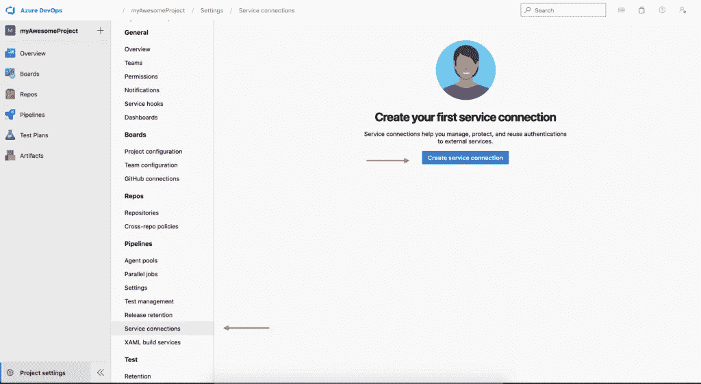

Azure DevOps —服务连接

AWS 服务连接:

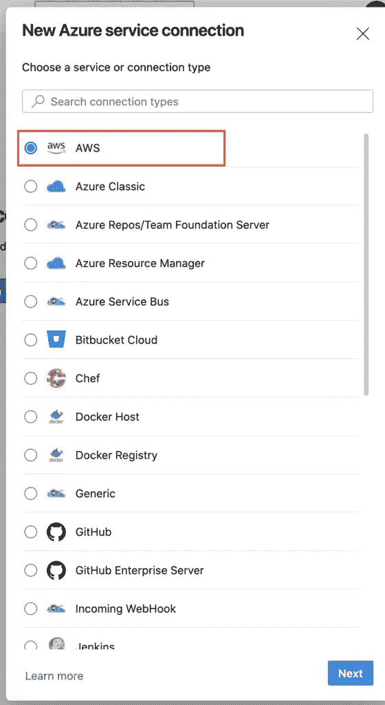

Azure DevOps —服务连接

用您的 AWS 凭据填充它，并添加一个名称:

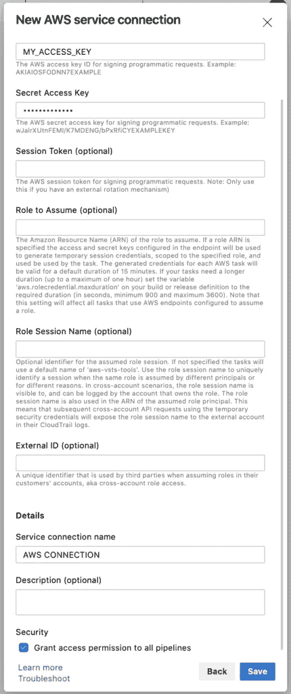

Azure DevOps —服务连接

# Azure DevOps 变量组

对于这个例子，一个变量组是必要的，因为我们将使用它来存储 Lambda 函数 ARN，这个[链接](https://docs.microsoft.com/en-us/azure/devops/pipelines/library/variable-groups?view=azure-devops&tabs=classic)包含创建和配置该组所需的所有信息。

厉害！现在，我们已经在 AWS 帐户中连接了 Azure DevOps 项目。让我们最终看到一点代码:D

# 。网络核心

您可以从这里克隆完整的源代码:

```
git clone [https://github.com/lbazetto/dotnet-core-aws-lambda-ci-cd-pipeline-azuredevops.git](https://github.com/lbazetto/dotnet-core-aws-lambda-ci-cd-pipeline-azuredevops.git)
```

由于该项目基于[。Net Lambda Tools](https://github.com/aws/aws-extensions-for-dotnet-cli#aws-lambda-amazonlambdatools) ，我们保留了推荐的文件夹结构:

```
.
├── awsLambdaCICDPipeline.sln
├── azure-pipelines.yml
├── src
│   └── awsLambdaCICDPipeline
│       ├── Function.cs
│       └── awsLambdaCICDPipeline.csproj
└── test
    └── awsLambdaCICDPipeline.Tests
        ├── FunctionTest.cs
        └── awsLambdaCICDPipeline.Tests.csproj
```

*src* 文件夹包含 Lambda 函数，而 *test* 文件夹包含单元测试。

因为这个想法关注的是进程而不是 Lambda 函数本身，所以代码非常简单，它只是接收一个字符串并执行一个 ToUpper。在单元测试中，它只是模拟上下文并调用函数:

# 多级管道 YAML

一切都整理好了，是时候检查本教程最重要的部分，管道。我们的渠道分为两个阶段:

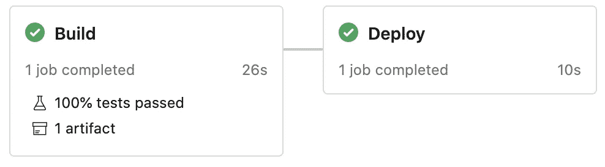

Azure DevOps —多级管道

# 构建阶段

这个阶段负责构建、运行单元测试，并将[工件](https://docs.microsoft.com/en-us/azure/devops/artifacts/?view=azure-devops)发布到 Azure DevOps。

# 部署阶段

该阶段部署在第一阶段创建的 Lambda 函数。

# 为什么我们有两个阶段？

将我们的构建定义分成几个阶段使它更加灵活，并帮助我们为每种情况创建一些特定的规则。在这个场景中，我们可以在创建拉请求或完成拉请求时运行相同的定义。

YAML 的定义:

# 创建 Azure DevOps 管道

现在是创建管道的时候了:

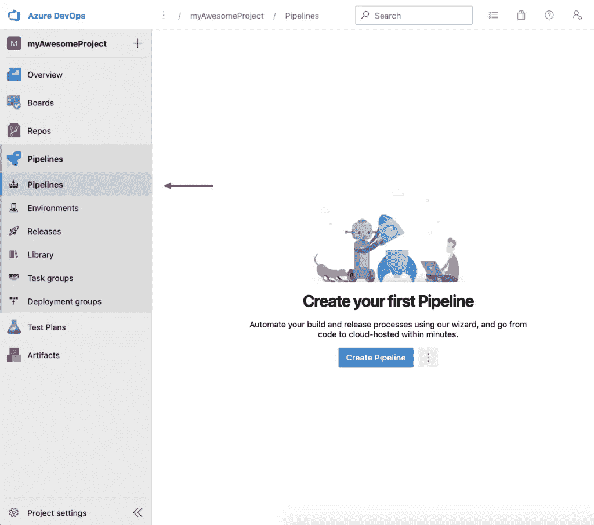

Azure DevOps —管道视图

选择代码位置:

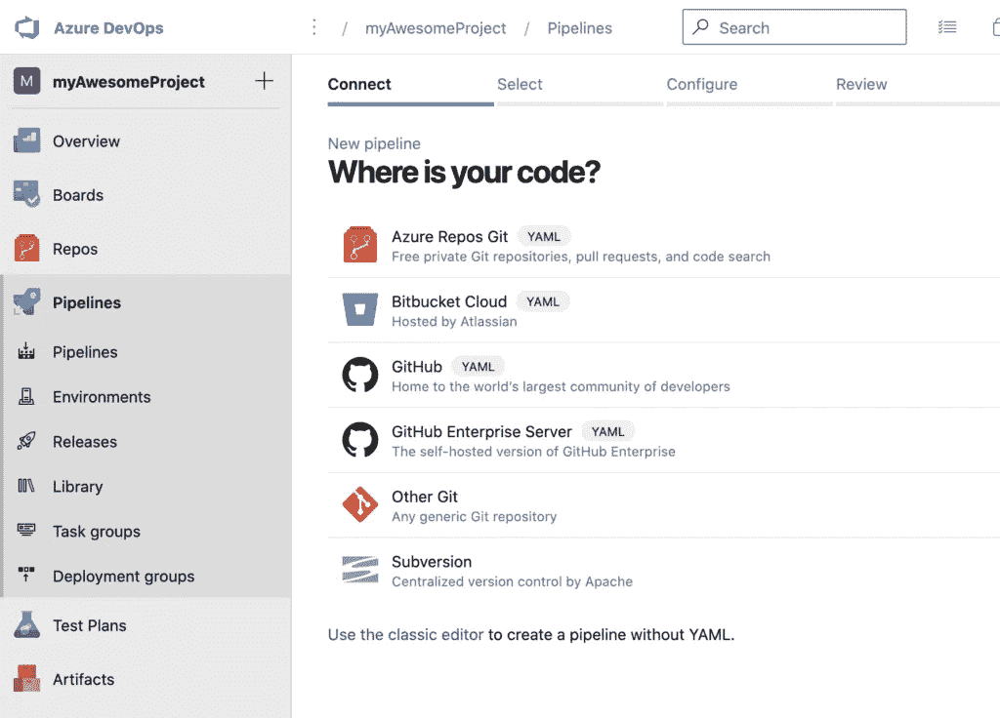

Azure DevOps —源代码位置

根据您的代码位置，您可能需要输入一些凭据。

我们现在可以看到 YAML 的定义了:

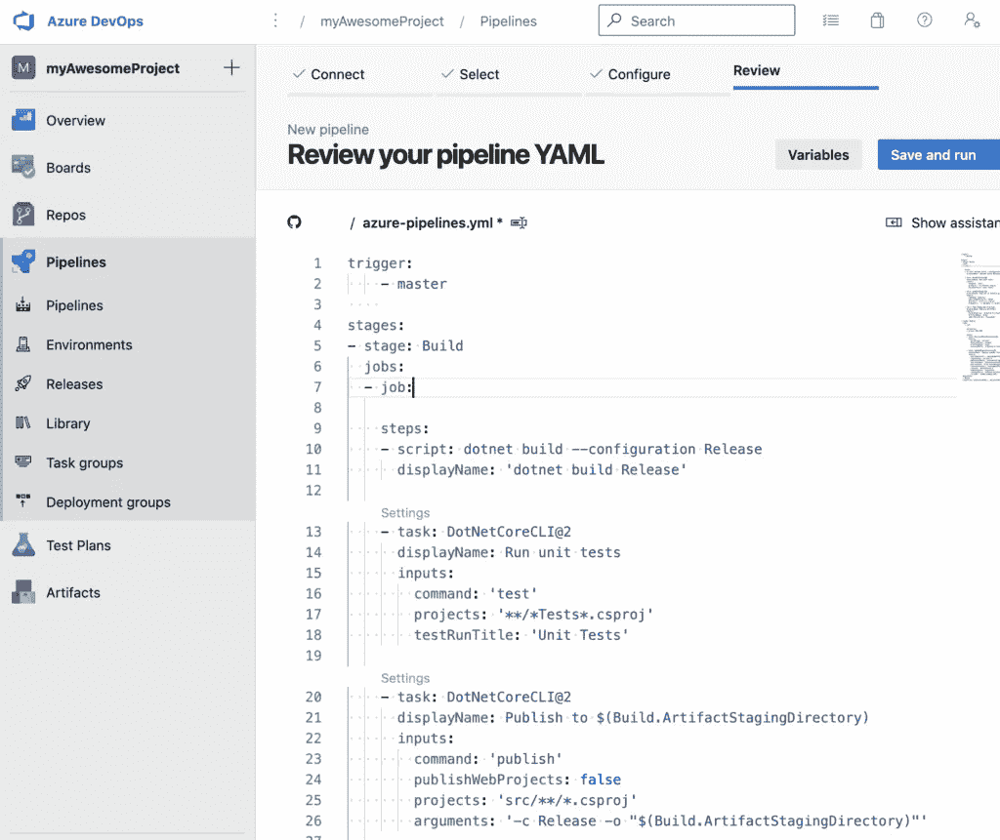

azure devo PS-YAML 管道

只要保存它，您就可以在您的回购中看到管道。
**重要提示**:如果你的代码在 Github 上，会自动创建一个 pull 请求验证。如果没有，您可以通过[分支策略](https://docs.microsoft.com/bs-cyrl-ba/azure/devops/repos/git/branch-policies?view=azure-devops)进行设置。

# 一起测试

我们现在有:

*   链接到 AzureDevOps 的 AWS 帐户
*   带有λ函数和 YAML 定义的源代码

# 拉请求管道

当一个拉动被创建时，我们可以在 Github 上看到检查。

如果您单击 pipeline details，可能会注意到部署阶段已被跳过。

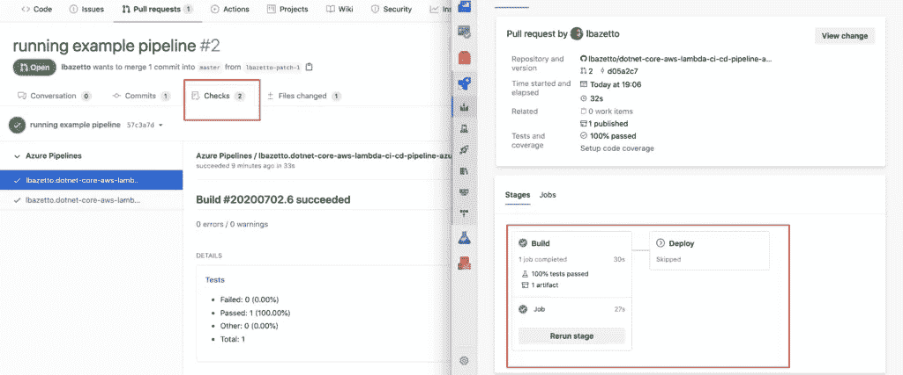

GitHub 管道检查和 Azure DevOps 多阶段

# 主管道

一旦管道完成，代码被合并到 master，我们就可以看到两个阶段都已运行:

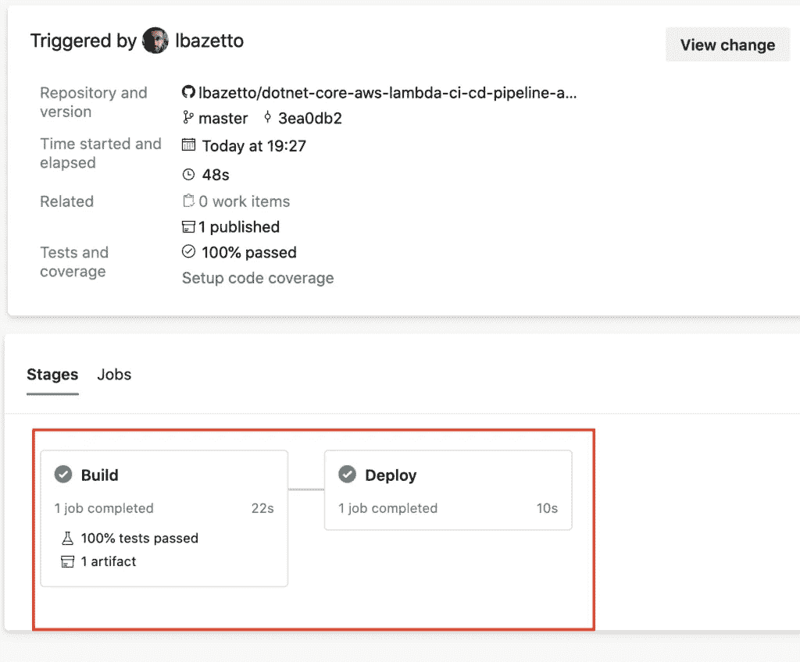

Azure DevOps —管道阶段

# λ函数

最后，我们可以看到从 Azure DevOps 部署的 Lambda 函数:

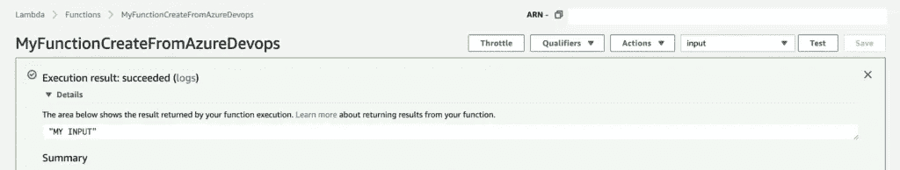

亚马逊 AWS Lambda 执行

就是这样！

你怎么想？你有没有用另一种方式做一些事情，或者你认为我可以改进？请告诉我:)

非常感谢您的宝贵时间！

最初发布于[https://devandops . cloud/ci-CD-for-lambda-functions-with-azure-devo PS-and-net-core/](https://devandops.cloud/ci-cd-for-lambda-functions-with-azure-devops-and-net-core/)