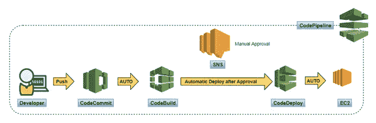
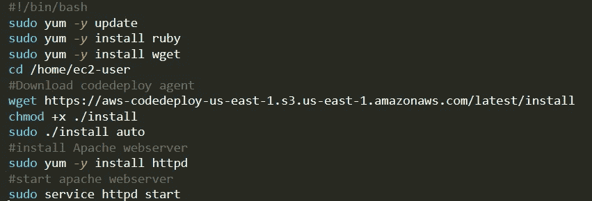
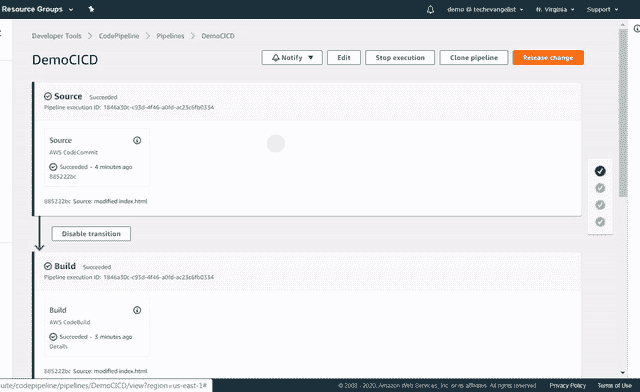

# 在 AWS 上构建 CICD 管道

> 原文：<https://towardsdatascience.com/ci-cd-logical-and-practical-approach-to-build-four-step-pipeline-on-aws-3f54183068ec?source=collection_archive---------18----------------------->

## DevOps — AWS CI/CD

## 在 20 分钟内建立一个无服务器的全自动 CICD 管道。

在本文中，我们将使用 AWS 原生工具构建一个 4 步 CI/CD 管道。为了从概念上理解 CI/CD 渠道，强烈建议重温以前的文章[*&持续集成【持续交付——神话、陷阱和，实用方法*](https://medium.com/@rashimparmar/continuous-integration-continuous-delivery-myths-pitfall-and-practical-approach-aaec22edacc5) *。*

AWS 上的四步 CI/CD 管道

在这篇文章中，我们将集体讨论选择构建 CI/CD 渠道的工具背后的思维过程和推理。在 AWS 平台上，我们将构建一个托管在 EC2 服务器上的简单 web 应用程序，并使用所有 AWS 本地服务。简要介绍为 CI/CD 实施选择正确工具的重要性:

**安全性** —任何实施的第一步都应该是安全性。总的来说，应用程序架构、硬件、网络和数据应该有助于构建安全的环境。

> 还记得臭名昭著的优步事件吗？黑客获得了嵌入 GitHub 软件库中的 AWS 证书，窃取了 5700 万用户和 60 万名司机的个人信息。

需要注意的一点是，每一层的安全性都很重要。

**架构** —架构应该允许多个并发的实现。同时，它应该允许对应用程序进行严格的测试，以确保一次成功(FTR)。微服务架构最适合实现这些目标；然而，不同的应用程序可能有不同的适用架构，如面向服务的架构(SOA)和 Lambda 架构。最终，重点应该是实现目标。

我们将使用以下服务建立 CI/CD 管道-

**源代码管理存储库:** AWS 代码提交

**构建:** AWS 代码构建

**部署:** AWS 代码部署

**通知:** AWS SNS

**托管网络服务器:** EC2 AMI

**CI/CD 管道:** AWS 代码管道

# **阶段 1:源代码控制库——AWS 代码提交**

AWS 代码提交是无服务器的。默认情况下，静态数据是加密的，并且为传输中的数据启用了 SSH 或 HTTPS 端点。它提供数据持久性、数据可用性、自动扩展，并且更重要的数据存储在远离计算资源的地方。同时也相当便宜。

AWS 代码提交流程

我们将在 AWS 上设置代码库，将代码从本地机器推送到代码提交库。在整篇文章中，我们将使用 AWS 地区作为所有服务的 us-east-1 (N. Virginia)。

1.  **创建存储库-** 登录 AWS 管理控制台，搜索代码提交。在主页上，单击“创建存储库”。填写以下详细信息，然后单击“创建”

我们可以使用 CodeCommit 控制台、AWS CLI 或 GIT 客户端将代码推送到 CodeCommit。在本文中，我们将使用 GIT bash。如果还没有安装 GIT 客户端，请按照官方[网站](https://git-scm.com/)给出的说明进行安装。

**2。克隆存储库**——在 AWS 控制台中，选择页面右上角的克隆 URL，然后选择克隆 HTTPS。克隆 GIT 存储库的地址被复制到剪贴板。打开 GIT bash，键入命令 GIT clone，后面跟着前面复制的 URL。这是第一次，它将提示输入通过 GIT 连接到 AWS 的凭证。

**3。将代码推送到库—** 点击[此处](https://github.com/rashimparmar/awscicd)或按照截图从我的 Github 库中下载示例代码。将代码放在文件夹 DemoCICD 中。作为最佳实践，我们应该创建一个分支并将代码合并到分支，但是为了使本文简单，我们现在将代码合并到主节点。切换到当前目录，使用下面的命令添加新文件。切换到当前目录，使用下面的命令添加新文件。

添加新文件后，使用下面的命令提交更改

现在使用下面的命令将文件推送到 AWS CodeCommit 存储库

检查 AWS 中的存储库，应复制所有文件。Appspec.yml 包含 CodeDeploy 的设置。Buildspec.yml 包含代码构建的设置

AWS 代码提交存储库

# **构建的先决条件:**

**EC2 实例托管应用程序并部署代码部署代理-** 我们将启动 EC2 Linux 实例来托管 web 应用程序。然后我们将部署 codedeploy 代理，以便将构建工件部署到机器上。在启动实例之前，让我们创建一个 IAM 角色来分配正确的访问权限。

**实例角色**

1.点击此处的[打开 IAM 控制台](https://console.aws.amazon.com/iam/)

2.从控制台仪表板中，选择角色，然后选择创建角色。

3.在“选择受信任实体的类型”下，选择 AWS 服务。在选择用例下，选择 EC2，然后选择下一步-权限。

4.搜索并选择名为 AmazonEC2RoleforAWSCodeDeploy 的策略，然后选择 Next- Tags。

5.选择下一步:复习。输入角色的名称(例如，DemoCICDEC2InstanceRole)，然后选择“创建角色”。

**启动 EC2 实例:**

1.点击[这里](https://console.aws.amazon.com/ec2/)打开亚马逊 EC2 控制台

2.从控制台仪表板中，选择启动实例

3.在步骤 1:选择一个 Amazon 机器映像(AMI)，找到 Amazon Linux 2 AMI (HVM)，SSD 卷类型，然后选择 Select。

4.在“步骤 2:选择实例类型”页面上，选择 t2.micro 类型(符合自由层条件)，然后选择下一步-配置实例详细信息。

5.在“步骤 3:配置实例详细信息”页面上，执行以下操作:

在自动分配公共 IP 中，选择启用。

在 IAM 角色中，选择您在前面的过程中创建的 IAM 角色(例如，DemoCICDEC2InstanceRole)。

6.展开高级详细信息，并在用户数据字段中输入将在启动安装时执行的以下脚本。

7.点击添加存储->点击添加标签->创建一个标签，其关键字为“目的”，值为 DemoCICD”。我们将使用这些标记来标识 EC2 实例以进行部署。->配置安全组

8.在“配置安全组”下，选择分配安全组:“创建新的安全组”。安全组名称为“SG-EC2-CICD”。添加 SSH(通过 putty 访问实例)和 HTTP(访问 web 应用程序)类型的端口，并在 source 中选择“My IP”。点击“查看并启动”。下载密钥文件，然后按“启动”。

# **构建包— AWS 代码构建**

AWS service CodeBuild 是一个完全托管的服务，它编译代码、运行测试并创建一个可以随时部署的软件包。选择这项服务的原因是

**无服务器** —您不需要管理构建服务器。

**可伸缩性** —它自动伸缩，可以同时处理多个构建。

**经济高效的** — CodeBuild 基于“按需付费”模式，这意味着构建一个包需要按分钟付费。

**安全—** 构建工件使用由 AWS KMS 管理的客户专用密钥进行加密。此外，可以使用 AWS IAM 提供细粒度的访问。记住提供最低特权访问。

下一步是从 CodeCommit 中的代码构建一个包。

AWS 代码构建流程

## **构建项目:**

在这一步中，我们将创建一个构建项目，AWS CodeBuild 将使用它来运行构建。登录 AWS 管理控制台并搜索 CodeBuild 或点击[此处](https://console.aws.amazon.com/codesuite/codebuild/home)。选择同一个 AWS 地区(N. Virginia)。单击“创建构建”并填写以下详细信息:

**项目名称:** BuildCICD。根据最佳实践填写描述并创建标签。

**源下:**源提供者— AWS 代码提交，存储库— DemoCICD，引用类型—分支，分支主

在环境下—选择托管映像，操作系统为 Amazon Linux 2，运行时—标准，映像—Amazon Linux 2–86 _ 64—标准:1.0(或适合您的使用情形)，服务角色—新服务角色

在 Buildspec 下——选择一个 buildspec 文件(我们将很快对此进行讨论)

保持其他一切不变，然后单击 create build project

build spec—build spec 是 codeBuild 服务用来运行构建的命令和相关设置的集合。您可以将 buildspec.yml 文件作为源代码的一部分，或者在构建项目时输入构建命令。我们已经在代码库中上传了 buildspec.yml 文件。

它可以有不同的阶段，如安装、预构建、构建和后构建。

# **使用 AWS 代码部署的部署**

CodeDeploy 是一个完全托管的服务，用于完全自动化软件部署。它可用于将代码部署到 AWS EC2 或本地服务器、AWS Fargate 和 AWS Lambda。优点是

**完全托管服务:** CodeDeploy 可随您的基础设施自动扩展，这意味着除了您正在部署的基础设施(如 EC2)之外，无需管理任何其他基础设施。CodeDeploy 可以与自动扩展组集成，以自动扩展 EC2 容量。

**蓝/绿展开:**该选项对应蓝/绿展开。应用程序的新版本与旧版本一起启动。一旦新版本经过测试并宣布就绪，CodeDeploy 就可以根据您的规范将流量从您以前的版本转移到您的新版本。

**集中控制—** CodeDeploy 允许您轻松启动和跟踪部署状态。它提供了详细的部署报告，您可以为更新配置推送通知。

**定价—** 通过 CodeDeploy 部署到 EC2 或 AWS Lambda 是免费的。对于其余的部署，它非常便宜。

在代码部署中，我们将创建一个包含要部署的软件应用程序的应用程序。我们将创建 CodeDeploy 包并将其安装到 EC2 实例中。

AWS 代码部署流程

CodeDeploy 角色:在 IAM 控制台中，通过单击“选择受信任实体的类型”下的**创建角色- >** 来创建角色，在“选择用例”下选择 AWS 服务- >，选择“CodeDeploy - >选择“下一步:权限”AWSCodeDeployRole 托管策略已附加到角色- >选择“下一步:标记- >下一步:审阅- >输入角色的名称(CodeDeploy) - >创建角色。

## 在代码部署中创建应用程序

1.单击此处的[打开 CodeDeploy 控制台](https://console.aws.amazon.com/codedeploy)

2.如果“应用程序”页面没有出现，请在“AWS 代码部署”菜单上选择“应用程序”。

3.选择创建应用程序。在应用程序名称中，输入 CICDDemoApplication。

4.在计算平台中，选择 EC2/内部部署。

5.选择创建应用程序。

**部署组—** 在部署组中，我们将定义与部署相关的设置。在显示应用程序的页面上，选择“创建部署组”。

1.  在部署组名称中，输入 DemoCICDDeploy。
2.  在“服务角色”中，选择您之前创建的服务角色(例如，CodeDeploy)。
3.  在“部署类型”下，选择“就地”。
4.  在环境配置下，选择 Amazon EC2 实例。在“关键字”字段中，输入用于标记实例的名称(例如，MyCodePipelineDemo)。
5.  在部署配置下，选择 CodeDeployDefault.OneAtaTime。
6.  在“负载平衡器”下，清除“启用负载平衡”。对于本文，您不需要设置负载平衡器或选择目标组。
7.  选择创建部署组。

至此，我们已经完成了构建管道所需的所有服务的配置。现在，我们将使用上面创建的服务构建一个即插即用的 CI/CD 管道。

# **CI/CD 管道**

四步 AWS CI/CD 管道

AWS 代码管道是一个完全托管的无服务器服务，有助于自动化整个软件交付版本。这是一个管道，我们可以在其中以任何顺序和任何次数调用所有其他服务，如代码构建、代码提交、手动批准、测试和部署等。它之所以适合，是因为它完全不需要服务器，采用随用随付的方式，成本模型完全安全且可配置的工作流，并且支持一个位置监控和快速软件交付。

1.登录 AWS 管理控制台，点击[这里](http://console.aws.amazon.com/codesuite/codepipeline/home)打开代码管道控制台

2.选择创建管道。将管道名称命名为“DemoCICD”。按如下所述填写详细信息:

## 源阶段

## **构建阶段-**

提供作为 AWS 代码构建的构建提供程序，并按如下所述填写详细信息，然后单击下一步。

## **部署阶段**

选择 deploy provider as CodeDeploy，并像下面这样填写其余的详细信息。

单击下一步并查看更改。如果一切正常，那么点击创建管道。这将首次启动管道。如果一切都设置正确，它应该会成功。现在，这是持续部署。如果您提交任何更改，管道将自动触发。因为我们已经创建了一个 web 服务器，所以您可以尝试使用 EC2 实例公共 IP 访问网站。

## 产品升级和技术支持服务-手动批准:

让我们创建一个新步骤来添加手动批准。为此，请单击管道页面上的编辑。我们将在构建阶段后添加批准。为此，在构建阶段后单击+添加阶段。命名为“生产-签署”。在“生产-签署”下，单击“添加行动组”。我已经创建了一个 SNS 主题来发送电子邮件给我审批。

单击完成。这样，我们成功地添加了一个手动批准阶段。为了自动触发完整的管道，我们只需在本地修改 index.html，然后进行代码提交。我已经添加了一个重定向到我在 index.html 的媒体简介。这将自动启动管道。你的收件箱里一定有一封批准它的邮件。一旦完成应用程序将被部署，你可以使用 EC2 实例公共地址访问网站。

部署前的电子邮件批准

# 结论:

我们已经成功建立了一个 4 步 CI/CD 管道。记住舞台布置应该仔细考虑。如果你喜欢这篇文章，请告诉我，并关注我的下一篇文章。

*免责声明——本文中的观点仅代表作者个人，并不代表作者所属任何组织的观点。*