# 通过 Azure DevOps 为数据科学项目提供 CI/CD 管道。

> 原文：<https://towardsdatascience.com/ci-cd-pipeline-with-azure-devops-for-data-science-project-f263586c266e?source=collection_archive---------18----------------------->

## CI/CD 管道实施，或数据科学的持续集成/持续部署。

在本文中，我将展示如何使用 Azure DevOps 为机器学习项目构建持续集成和持续交付管道。

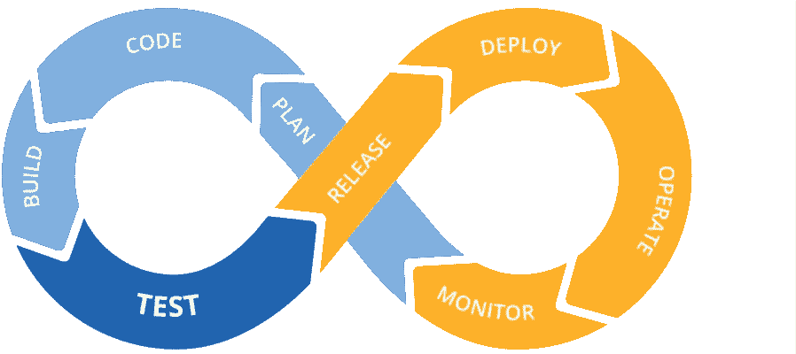

[CI/CD 管道](https://www.clipartkey.com/view/iRihwiw_ci-cd/)

首先，我们来定义一下 CI/CD。正如 [Wiki](https://en.wikipedia.org/wiki/CI/CD) 所说,“CI/CD 通过在应用程序的构建、测试和部署中实施自动化，在开发和运营活动以及团队之间架起了一座桥梁。现代的 DevOps 实践涉及软件应用程序在其整个开发生命周期中的持续开发、持续测试、持续集成、持续部署和持续监控。 **CI/CD** 实践或 **CI/CD 管道**构成了现代开发运营的支柱。”

好，让我们分别找出 CI 和 CD。

[*持续集成*](https://www.infoworld.com/article/3271126/what-is-cicd-continuous-integration-and-continuous-delivery-explained.html) 是一种编码哲学和一套实践，驱动开发团队实现小的变更，并频繁地将代码签入版本控制库。因为大多数现代应用程序需要在不同的平台和工具上开发代码，所以团队需要一种机制来集成和验证它的更改。

[*连续交货*](https://www.infoworld.com/article/3271126/what-is-cicd-continuous-integration-and-continuous-delivery-explained.html) 在连续积分结束的地方拾取。CD 自动向选定的基础架构环境交付应用程序。大多数团队使用除生产环境之外的多种环境，例如开发和测试环境，CD 确保有一种自动的方式将代码变更推给他们。

那么，它为什么重要呢？机器学习应用程序在我们的行业中变得越来越流行，但是，与更传统的软件(如 web 服务或移动应用程序)相比，开发、部署和持续改进它们的过程更加复杂。

好，让我们试着为我的项目建立一个简单的管道。该项目是关于以下 Azure 服务的预测分析:Azure SQL，Azure 数据工厂，Azure 存储帐户 V2，Azure 数据砖。

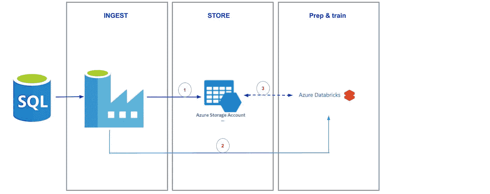

解决方案架构

这个解决方案包括三个步骤。第一步—运行 data ADF 数据流以从 SQL DB 获取数据，转换并从表中选择几个列格式，然后将这些结果保存到 Azure Data Lake 中的 Stage 文件夹。第二步—使用关于存储帐户的指定参数从 ADF 运行 Azure Databriks notebook，以准备历史数据集并运行训练模型。在这一步，我们可以使用 MLflow rack 实验来记录和比较参数和结果。最后一步——从 ADF 运行 Azure Databriks notebook，并使用关于存储帐户的指定参数对我们的模型进行评分，并将结果保存到 Azure Data Lake。

为了启动这个项目，我需要在 Azure 门户网站中创建 3 个资源组。这些资源组将负责不同的环境—开发、试运行和生产。在这些环境中，我创建了以下服务——Azure SQL、Azure Data Factory、Azure 存储帐户 V2、Azure Data Bricks 和 Azure Key Vault。

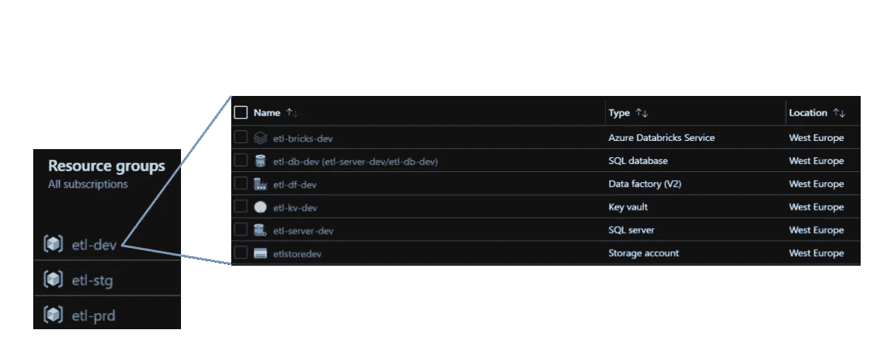

Azure 资源组和服务

在所有 Azure SQL 中，我上传了两个表——历史数据和分数数据。这个数据的描述你可以通过这个 [*链接*](https://www.kaggle.com/c/house-prices-advanced-regression-techniques/data) 找到。在 Azure 存储帐户中，我创建了一个包含三个文件夹的容器——RawData、PreprocData 和 Results。下一步是在 Azure 密钥库中创建秘密。我需要一个 Azure 存储帐户的秘密，在那里我为我的 Azure SQL DB 使用了访问密钥和连接字符串。重要的是，要从 Azure Data Factory 访问您的秘密，您需要在 Azure 存储帐户的访问策略中进行一些配置

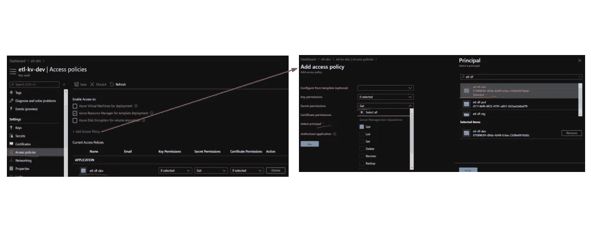

访问策略配置

正如你所看到的，我添加了一个带有适当的 Azure 数据工厂服务和 Azure 数据块的访问策略，这是我早期创建的，允许获取一个秘密。

下一步是配置 Azure 数据块。为了引用 Azure Key Vault 中存储的秘密，我创建了一个由 Azure Key Vault 支持的秘密范围。要创建它，请转到`https://<databricks-instance>#secrets/createScope`。此 URL 区分大小写；`createScope`中的作用域必须大写，并填写下表:

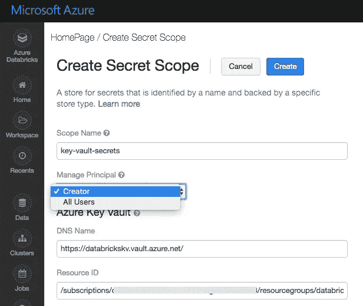

[创建 Azure 密钥库支持的秘密范围](https://docs.microsoft.com/en-us/azure/databricks/security/secrets/secret-scopes)

Azure Databricks 配置的下一步是—将我的笔记本连接到 Azure DevOps 存储库。要做到这一点，只需打开你的笔记本，按下同步，并填写关于你的 Azure DevOps 存储库的信息表单。这样，您可以将笔记本中的更新提交到存储库中。

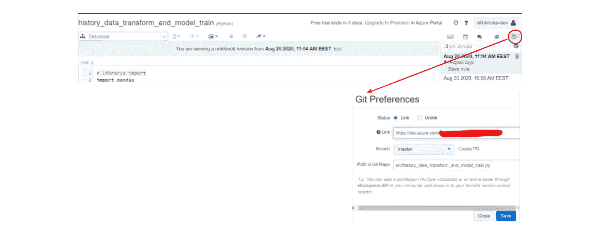

Azure Databricks 笔记本连接到 Azure DevOps 存储库。

Azure 服务的基本配置已经完成，让我们开始在 Azure 数据工厂中创建管道。第一步是将 ADF 连接到 Azure DevOps 存储库。我可以通过两种方式连接它——在服务创建期间和在 ADF 配置中。我只需要为开发环境配置这个连接。

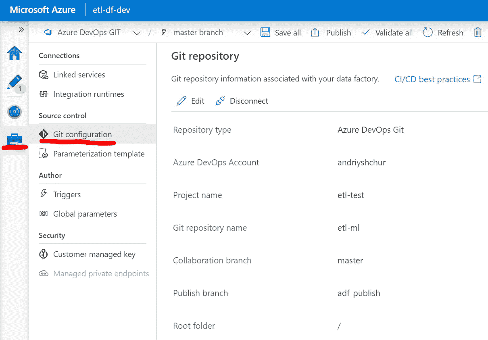

Azure 数据工厂连接到 Azure DevOps 存储库。

好了，现在我们可以选择我们想要发展管道的分支。下一步——创建所有 Azure 服务的链接服务。

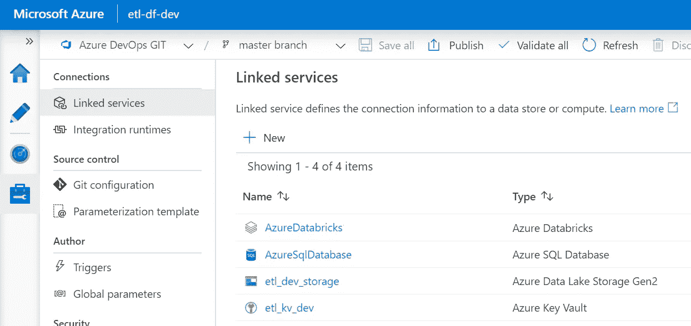

列表链接的服务

为了创建 Azure Databricks 链接服务，我填写了下一个表单:

Azure Databricks 链接服务配置

为了创建 Azure SQL DB 链接服务，我填写了下一个表单:

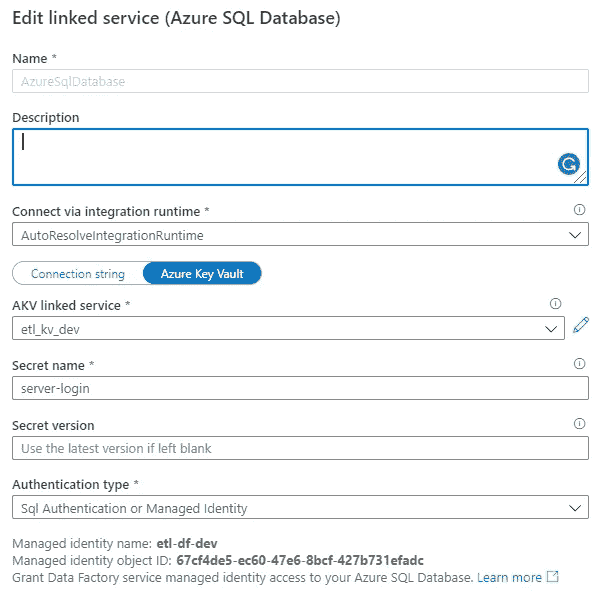

Azure SQL 链接服务配置

为了创建 Azure 存储帐户关联服务，我填写了下一个表单:

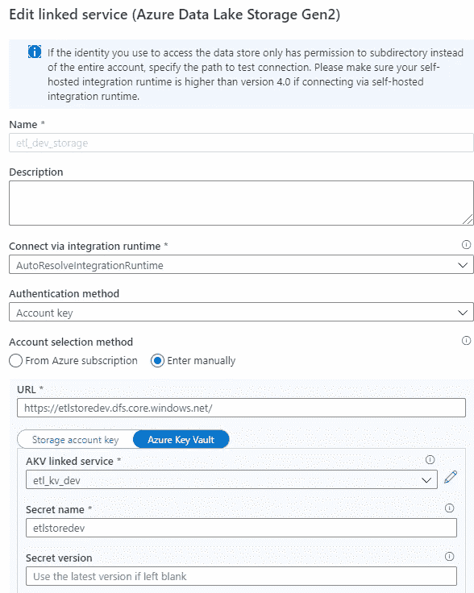

Azure 存储帐户链接服务配置

为了创建 Azure Key Vault 链接服务，我填写了下一个表单:

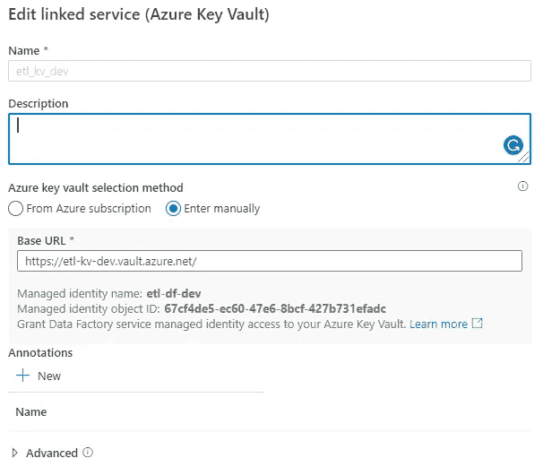

为了创建 Azure Key Vault 链接服务，我填写了下一个表单:

为了控制不同环境之间的链接服务名称，我在 ADF 中使用了全局参数，创建了三个参数— dev、stg、prd。

让我们创建一个管道:

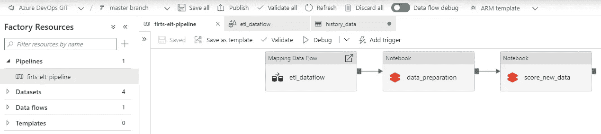

ADF 管道

我的管道的第一步是数据流:

ADF 数据流

在这个数据流中，我从 Azure SQL DB 获取数据，转换数据格式，从表中选择一些列，并将结果上传到 Azure Data Lake 的适当文件夹中。此流程是为历史记录和分数(新数据)表创建的。

管道的下一步是运行 data_preparation_model_train 和 score_new_data 脚本。为此，我们需要:

1.  选择合适的链接服务
2.  选择笔记本的目的地
3.  添加带有存储名称的参数

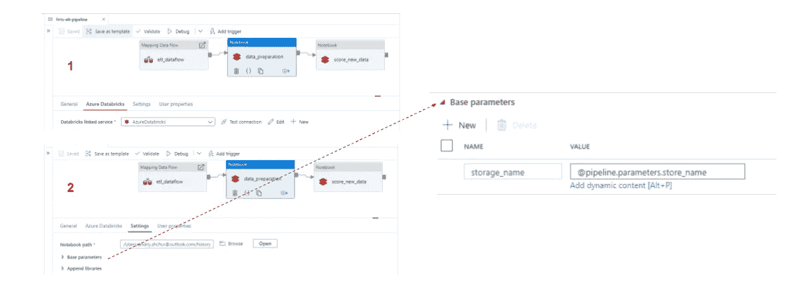

配置 Azure Databricks 笔记本从 ADF 运行

与 score_new_data 脚本相同。

这是我的 ADF 管道的所有阶段，接下来的步骤是验证，创建 pull 请求以将我的分支与 master 连接，然后将所有更新从 ADF 发布到 master 分支。结果是:

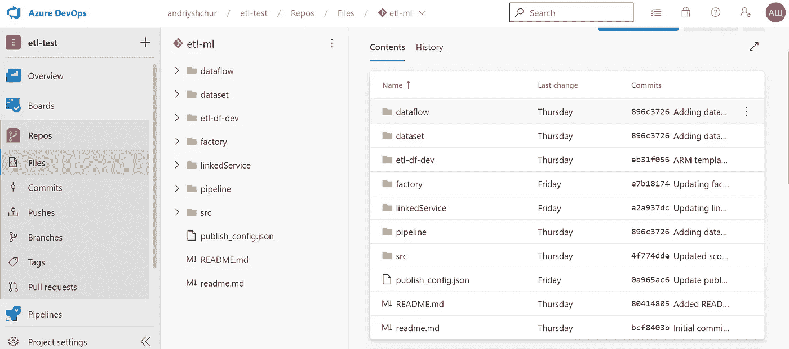

Azure DevOps 存储库结构

让我们开始在 Azure DevOps 中配置 CI/CD。

第一步——创建新的发布管道(在 Azure DevOps 门户中，导航至“管道”->“发布”并点击新管道)

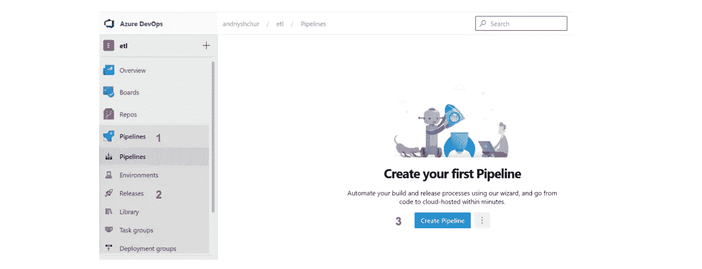

创建新的发布渠道(步骤 1)

选择显示各种预配置模板的**模板**窗口。在数据工厂的情况下，选择是创建一个**空作业**，并将其命名为**—***ADF-devo PS 2020-CICD:*

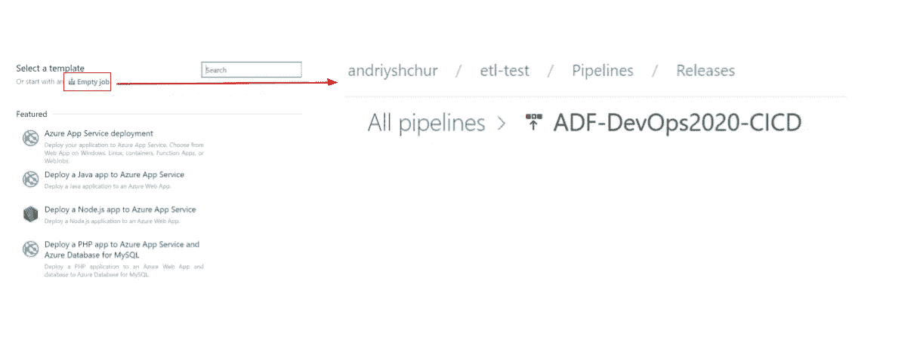

创建新的发布渠道(步骤 2)

创建一个新的阶段“登台”(测试环境):

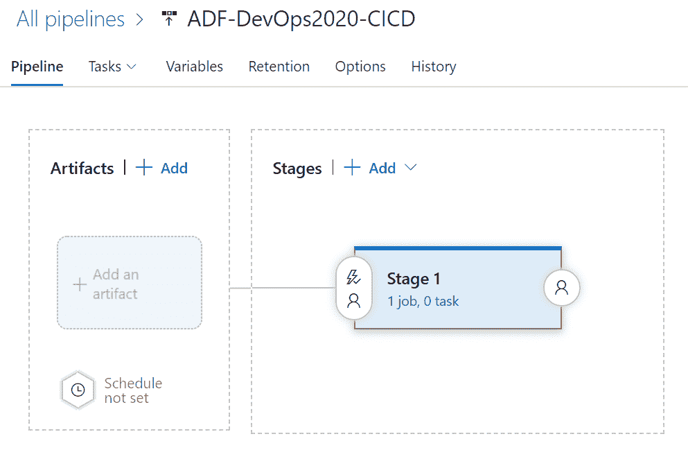

空白释放管道

现在我们已经创建了一个空白的发布管道。下一步是创建任务将使用的变量组和变量。为此，我们需要导航到 Pipelines -> Library 并创建一个新的变量组。在新表单中填写下一个信息，然后克隆它，为生产阶段创建相同的信息。

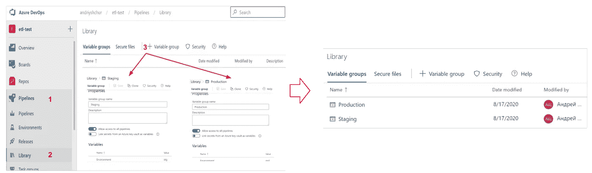

变量组创建

结果，我得到了两个变量组。稍后我将被映射到相应的阶段。

下一步—创建发布管道变量。由于变量组值的继承，变量将包含与环境无关的值。因此，变量值将被调整到使用它的阶段。为了创建它，返回到**管道- >释放**，然后打开标签**变量**。我创建了下一个变量:

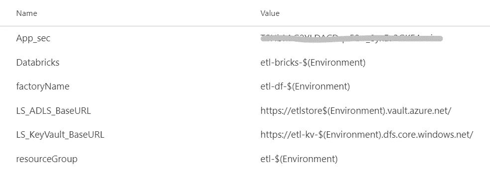

管道变量

是时候创建和配置开发阶段了。

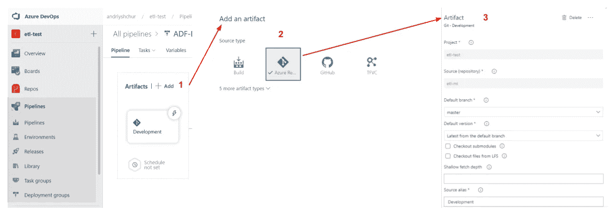

配置开发阶段。

这些行动将创造一个发展阶段。每次我们更新我们的`master`分支时，它都会触发持续交付管道，将更新后的 ARM 模板交付给其他环境，如试运行和生产。我们还可以自动完成创建触发器的过程:

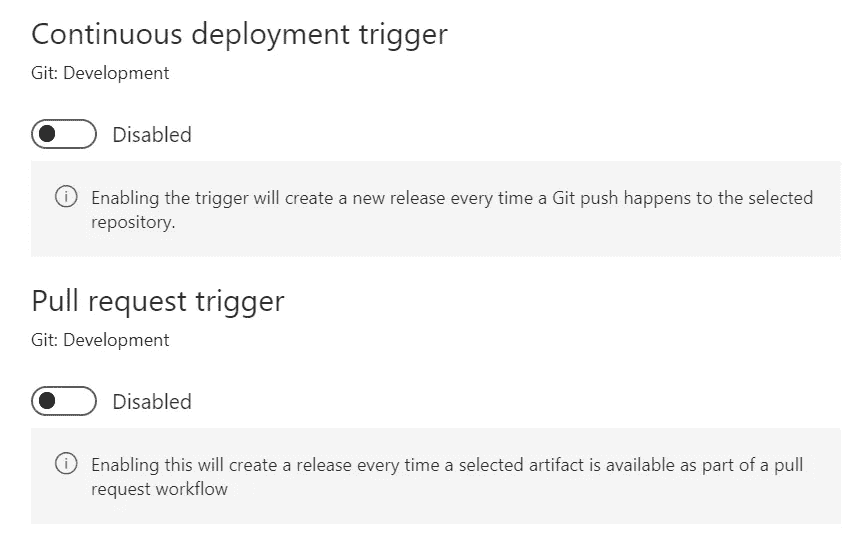

连续部署触发器

现在是时候配置试运行或测试阶段了。是时候为这个阶段创建几个任务了。对于我的第一个管道，我创建了两个工作——在 Azure Data Factory 中部署管道和将 Python 笔记本复制到 Azure Databricks。

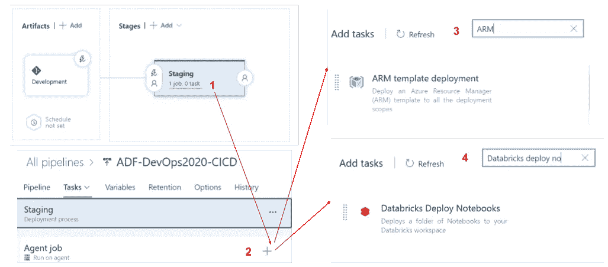

测试阶段的工作

让我们更详细地了解任务臂模板部署。我想描述的主要内容是-

*   在资源组字段中填入一个变量:`$(resourceGroup)`。
*   选择模板位置:“链接工件”
*   选择 ARM 模板和模板参数文件

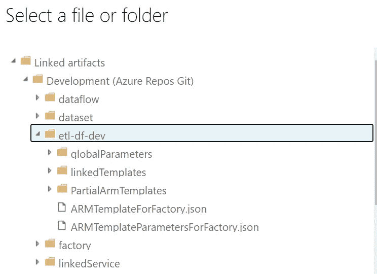

ARM 模板和模板参数文件位置

*   用先前创建的变量覆盖默认模板参数

模板参数

在结果中，我们得到了下一种形式:

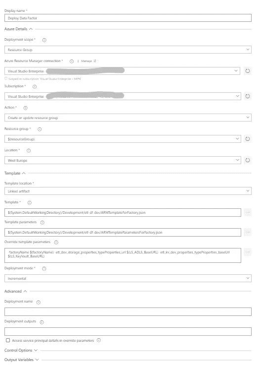

部署 ADF 任务

我的下一个任务是部署笔记本电脑。让我们更详细地了解一下。我们需要填充:

1.  我要将 Azure Databricks 中的笔记本复制到的文件夹。app id，我之前创建的。(如何创建— [*链接*](https://docs.microsoft.com/en-us/azure/active-directory/develop/quickstart-register-app) )。)
2.  相同的应用程序 id
3.  订阅 id
4.  租户 id

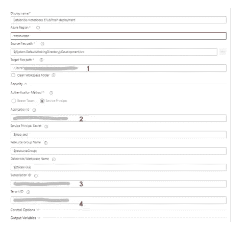

复制数据块笔记本任务

因此，我在这个阶段有两个任务:

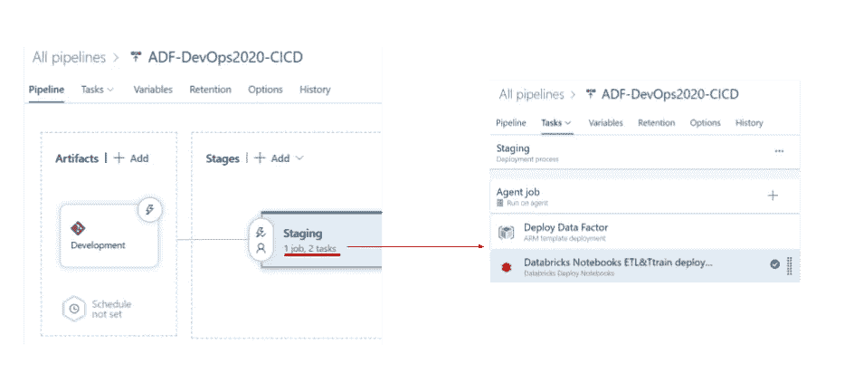

我还需要**制作**阶段。点击克隆**暂存**环境到**生产**:

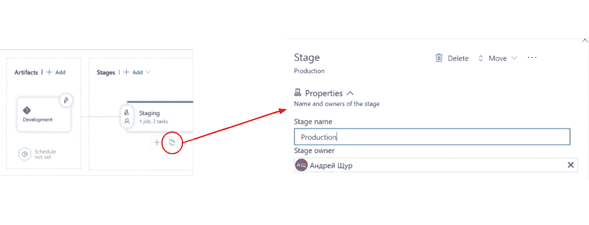

克隆测试阶段

生产阶段是通过克隆一个阶段创建的，没有额外的调整或添加。这是因为底层作业是由变量配置的，这些变量包含指向所有外部引用的指针，如资源组、密钥库、存储帐户。此外，对于此阶段，建议创建“预部署”批准。因此，当分段部署结束时，执行流将等待分配的批准者的操作。我可以通过电子邮件通知或使用 DevOps 门户 UI 直接做出反应。

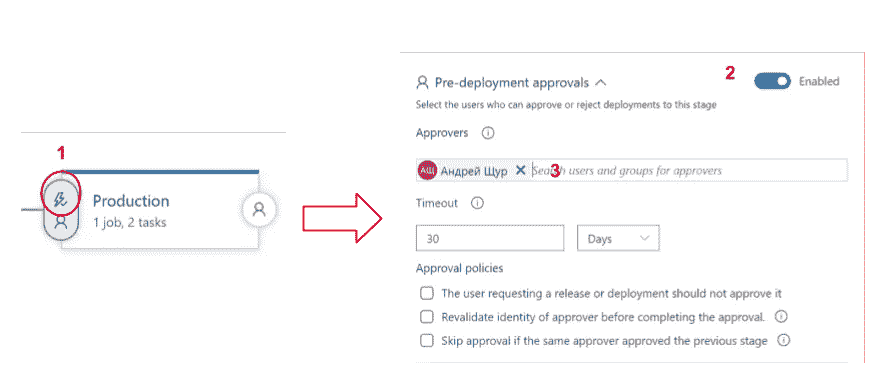

配置“预部署”批准

所有配置的最后一步是将变量组映射到阶段。这一步对于将特定于阶段的变量值映射到特定阶段是必要的。例如，如果流水线在生产阶段处理作业，则变量$(环境)具有值“prd ”,并且如果作业在暂存阶段被触发，则将该值设置为“stg”。要使它打开标签变量->变量组并点击“链接变量组”。将变量组“生产”映射到阶段“生产”，并选择范围“阶段生产”而不是“发布”，然后对“阶段”重复相同的操作。

将变量组映射到阶段

是时候运行并检查这个简单的管道了。

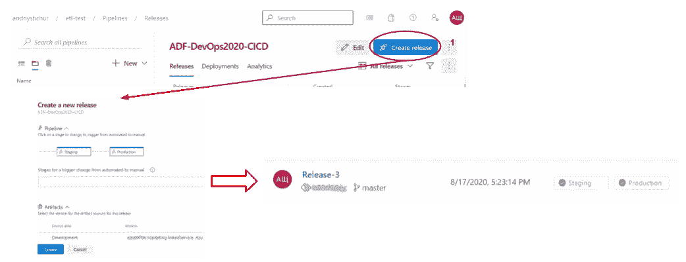

创建并运行发布

结果，我在 Stage and Production Resource 组的适当服务上找到了 ADF pipeline 和 Azure Databricks 笔记本。我还可以分析每个阶段所有任务的细节，例如:

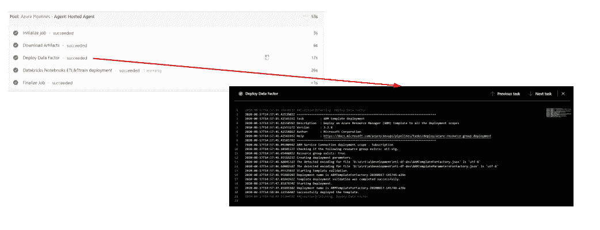

在测试阶段分析部署 ADG 任务

为了使这个管道更加完整，我还可以在测试阶段添加一些测试任务。例如，这些测试可以运行 ADF 管道并分析其结果 Azure Data Lake 中的一个又一个副本表、MLflow 日志以及得分后表中的结果。通过所有这些测试后，我们可以批准**生产**阶段。

在这个故事中，我将一步一步地详细说明如何创建和配置发布管道，以在 Azure 数据工厂环境中实现 CI/CD 实践。它显示了 Azure DevOps、Azure Data Factory、Azure SQL DB、Azure Data Lake 和 Azure Databricks 在一起使用时可能带来的限制和可能性。

感谢阅读。

有用的链接:

*   [*蔚蓝 DevOps 文档*](https://docs.microsoft.com/en-us/azure/devops/?view=azure-devops)
*   [*Azure 数据工厂*](https://docs.microsoft.com/en-us/azure/data-factory/introduction)
*   [*Azure data bricks ml flow*](https://docs.microsoft.com/en-us/azure/databricks/applications/mlflow/)