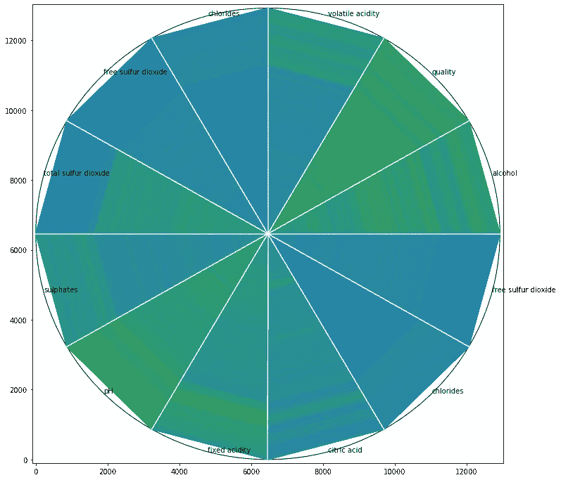
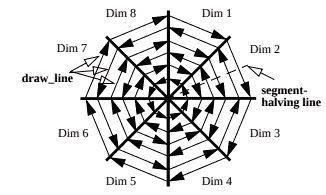
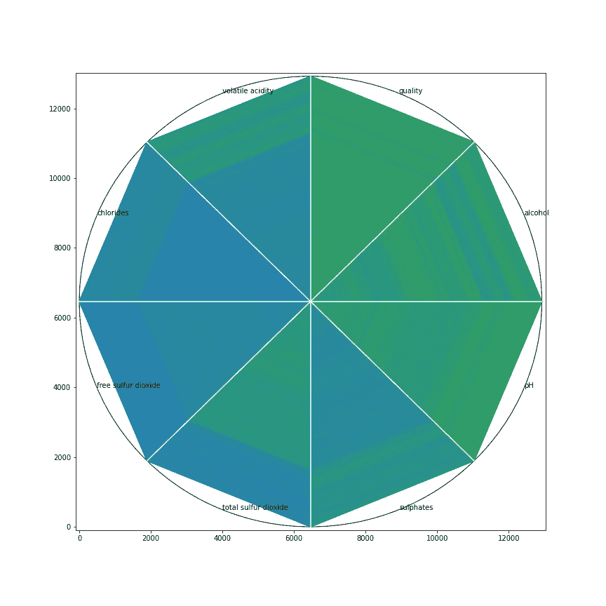

# 圆形线段:2D 的多维数据

> 原文：<https://towardsdatascience.com/circle-segments-high-dimensional-data-on-2d-de67380db55f?source=collection_archive---------52----------------------->

## 数据可视化

## 用 python 中的“matplotlib”实现高维数据的圆段数据可视化

雷内·伯默的照片

可视化数据有助于更好地理解探索性数据分析。数据的频率、相关性和比例很容易解释。这些统计数据在决定机器学习方法时也起着重要的作用。尤其是理解变量之间的关系。因此，散点图是了解特定位置上一个或多个变量的分布或关系的最常用技术之一。散点图的挑战是可视化高维数据。人类可理解的维度最多只能是 x、y 和 z 三个。这意味着我们只能在同一个图中将三个变量可视化为点。此外，解释 3D 图比 2D 图更难。因此，我们可以尝试将颜色、形状和大小作为其他维度添加到 2D 图中。然而，这个问题的另一个解决方案是散点图矩阵。散点图矩阵是一种用每对变量创建 2D 散点图并在矩阵结构上显示它们的方法。由于这一点，我们可以在同一视图中看到所有散点图。

还有另一种在 2D 上可视化高维数据的选择，称为“**圆段**，由 Ankerst，m .等人在 2001 年提出[1]。在这篇文章中，我将解释；什么是圆段可视化，如何在 *matplotlib* 上应用。我们将看到以下部分:

*   什么是圆段可视化
*   圆分段算法如何工作
*   “matplotlib”在圆线段中的应用

## 什么是圆段可视化

众所周知，颜色是可视化的主要组成部分之一。它可用于可视化另一个维度的数据，而无需向绘图添加任何轴。圆段可视化技术主要依赖于颜色。它基本上将圆分割成变量(维度)的数量。从第一次观察到最后一次观察，每个切片都将变量值表示为像素。算法根据观察值给每个像素分配颜色。比如说；我们将变量的最高值设置为蓝色，最低值设置为红色。假设 X 变量的值从第一次观察到最后一次观察增加，Y 变量的值从第一次观察到最后一次观察减少。因此，片 X 中像素的颜色将从蓝色开始，并在片的末端变成红色，而片 Y 中的颜色将从红色开始，并在末端变成蓝色。另外，我们可以添加更多的切片(变量)并在 2D 图上进行比较。

我们将在本文中创建一个圆形部分可视化输出的例子(作者可视化)

**圆分段算法如何工作**

圆形片段可视化技术处理停留在切片下的像素。因此，如果有更多的观察，视觉将有更多的像素。变量切片下的像素根据该变量的值进行处理。但是，定义显示像素着色的方向也很重要。在比较不同的切片时，方向起着重要的作用。

圆段着色方案(由 Ankerst，m .等人于 2001 年创建[1])

上图显示了如何用圆形线段技术给像素着色。第一次观察从圆心开始，最后一次观察在圆的边界结束。这种方法已在研究中提出[1]。但是，当有太多的数据点时，可能很难跟踪每个像素来了解变量之间的相关性。因此，在另一项研究[2]中，切片边界之间的线条被着色，而不是像素。这种方法在切片边界之间画线，并根据值给它们着色。在本文中，我们将按照第二种方法创建圆段可视化。

## “matplotlib”在圆线段中的应用

“ *matplotlib* ”中没有任何自动创建圆段可视化的方法。因此，我们将在本节中从头开始创建一个关于“ *matplotlib* 的算法。开始之前，请确保您的系统中安装了“ *matplotlib* ”。我们将使用 [*葡萄酒质量*](https://www.kaggle.com/rajyellow46/wine-quality) 数据集，您也可以从 Kaggle 下载。

如前所述，我们将在切片边界之间绘制线条，而不是像素。这种方法更容易理解。因此，我们需要定义在可视化中将使用多少个变量，以便决定在圆中有多少个切片。为此，我们需要完成以下步骤:

*   导入所需的包
*   读取数据文件并删除丢失的值
*   选择将在可视化上显示的变量
*   获取观察值和变量的数量
*   获取变量名(为了显示附近的切片)

完成这一步后，我们知道将使用多少个切片(#26 处的“var”)以及将在切片中绘制多少条平行线(#23 处的“r”)。现在，我们可以创建一个方法，在每个切片和坐标之间绘制直线，这些坐标在切片内彼此平行，以表示变量中的每个值。我们还可以找到变量名的坐标，以便显示哪个切片属于哪个变量。

“切片”方法采用两个参数作为“ *num* 和“半径”。“ *num* 代表一个圆将有多少个切片，“*半径*代表将画多少条线。因此，“半径”将等于观测值的数量，“ *num* 将等于变量的数量。该方法返回 3 个数组，分别为“*点*”、“*行*”和“*标签点*”。“点”是将在切片之间绘制的线的坐标，“线”是每个切片中代表每个值的线的坐标，“ *labelPoints* ”是用于定位变量名的坐标。

我们还需要再创建两个方法。其中一个用于计算变量的单个值应该使用哪种颜色，另一个用于通过使用第一种方法从变量创建 RGB 数据。这个过程也称为线性颜色插值。" *matplotlib* "有自己的颜色插值方法，但它不符合我们可视化算法的要求。这就是为什么，我们将从头开始创建它。

方法“ *colorFader* ”采用三种颜色作为十六进制格式。第一种颜色代表最低值，第二种代表中间值，第三种代表变量中的最高值。它的作用是取 0 到 1 之间的单个值，并将其转换为 RGB 代码。例如，如果一个变量的值为 1，那么 RGB 将等于最高值的颜色。如果它是 0.75，RGB 颜色将是混合中间色和最高色的颜色

方法“*发生器*”取四个自变量为“ *df* ”、“*低*”、“*中*”、“*高*”。" *df* "是 Pandas 数据框，包括所有变量和其他自变量颜色代码(十六进制字符串类型),用于最低、中间和最高值。最重要的部分是，我们需要通过使用最小-最大归一化方法来归一化 0 和 1 之间的每个变量。因为“ *colorFader* ”将颜色分配给 0 到 1 之间的值。标准化后，它会转换数据框中的每个值，以获得它们的 RGB 代码。

好吧！现在，我们所有的方法都准备好创建圆段可视化。我们需要做的就是将这些方法应用于我们的数据，并通过使用“ *matplotlib* ”在极坐标系统上绘制/着色线条。您可以执行以下代码来创建绘图。

运行上面的代码后，您应该会看到下面的画面。根据数据大小，渲染视觉效果可能需要一些时间。蓝色代表最高值，绿色代表中间值，红色代表最低值。例如，挥发性酸度的值从最高值开始到中间值，而总二氧化硫的值从中间值开始到最高值。这意味着当挥发性酸度增加时，总二氧化硫减少。因此，我们可以说挥发性酸和总二氧化硫之间存在负相关关系。我们还可以通过详细考虑颜色模式来检查其他变量。你也可以添加更多的变量和改变颜色。

## 结论

在这篇文章中，我们学习了如何使用圆段可视化技术来可视化 2D 空间上的高维数据。我们讨论了什么是圆段可视化技术，它的算法是如何工作的，以及如何用" *matplotlib* "应用该算法。正如你从技术输出中看到的，通过使用颜色插值，我们可以很容易地比较不同的变量。虽然，技术允许我们增加数量变量。由于这一点，我们可以在同一个绘图中检查更多的变量。

如果你有任何问题，请随时提问。希望有帮助…

## 参考

[1]安克斯特，米哈伊尔&凯米，丹尼尔&克里格尔，汉斯-彼得。(1996).圆形线段:一种可视化探索大型多维数据集的技术。第一次出版。见:可视化' 96，热门话题会议，旧金山，加州，1996 年 11 月。

[2] *林春平，王绍林，谭国生，Navarro，Jain，2010，使用圆段可视化技术进行神经网络特征选择和分析，神经计算，73，第 613–621 页。*