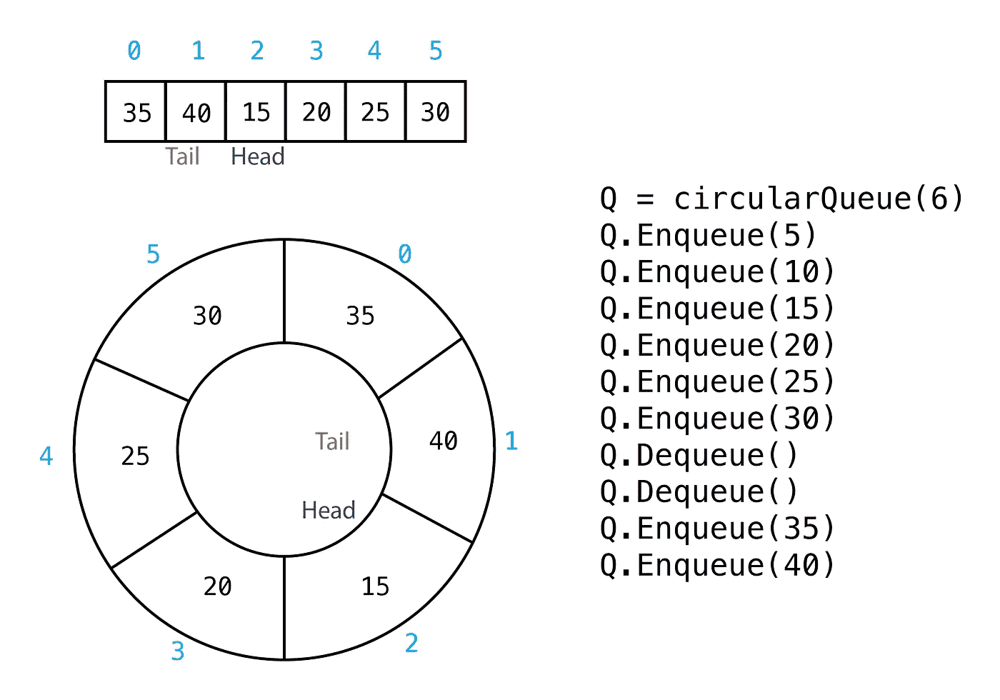
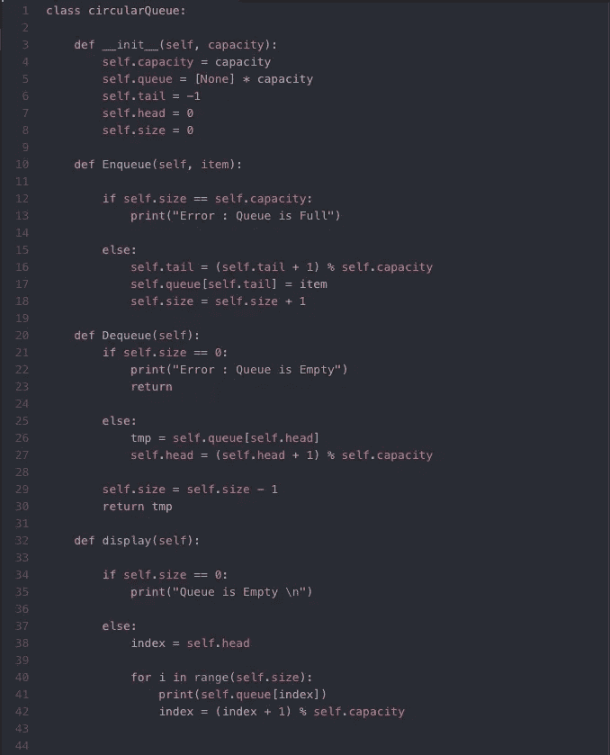

# 循环队列或环形缓冲区

> 原文：<https://towardsdatascience.com/circular-queue-or-ring-buffer-92c7b0193326?source=collection_archive---------3----------------------->

## **Python 和 C 实现。**



## 介绍

循环队列有许多不同的实现方式，它们都可能更适合特定的应用。这篇博文旨在帮助理解循环队列的工作原理及其用途和优点。

## 环形队列

队列是一种简单的数据结构，它实现了 FIFO(先进先出)排序。这仅仅意味着添加到队列中的第一个项目是第一个出来的。就像在熟食店排队一样，第一个排队的顾客是最先被服务的。一个**循环队列**本质上是一个具有最大大小或容量的队列，它将继续以循环运动的方式返回自身。

## 应用程序

当数据流的输入和输出以不同的速率发生时，环形缓冲区是常用的数据结构。

*   缓冲数据流
*   计算机控制的交通信号系统
*   内存管理
*   CPU 调度

## 优势

循环队列提供了一种快速、干净的方式来存储最大大小的 FIFO 数据。

*   不使用动态内存→没有内存泄漏
*   节省内存，因为我们只存储我们的容量(相反，如果输入超过输出，队列可能会继续增长。)
*   简单实施→易于信任和测试
*   从不需要重新组织/复制数据
*   所有操作都发生在常数时间 O(1)中

## 不足之处

循环队列只能存储预先确定的最大数量的元素。

*   必须事先知道最大尺寸

## **它是如何工作的？**(数组实现)

循环队列中有两个主要操作:

1: **入队(项目):**将项目添加到队列中。

```
if Queue.isfull()
    print "Queue is Full"
else 
    increase tail by 1
    Queue[tail] = item
    size++
```

2: **Dequeue()** :返回行前(头)的项，并将其移除。

```
if Queue.isEmpty()
    print "Queue is Empty"
else 
    tmp = Queue[head]
    increase head by 1
    size--
    return tmp
```

***注意*** *:我们实际上并没有从数组中移除任何东西，我们只是增加了* ***头*** *来指向下一个“in line”项目。*

让我们看看这些操作在大小为 6 的数组上是如何进行的:

*   请注意当我们将第七个项目(35)排队时,**尾**如何绕回零。
*   注意**头**是如何随着我们出列而增加的，但是没有值从数组中移除，它们只是在 Enqueue()到达数组中的那个位置时被覆盖。

## **模运算符**

如果我们应该将数组中的**头**和**尾**增加 1 个点，那么当我们到达末尾时，如何将它设置回零，以确保我们继续遍历数组？

我们可以这样做:

```
if (head + 1) = capacity 
    head = 0
else 
    head = head + 1
```

这真的没有错，但是，有一个更好的方法使用模操作符。模运算符 **(%)** 给出除法后的余数。在看两个整数 **a** 和 **b 的关系时；a** 将是 **b** 乘以某个整数 **q** 加上某个整数 **r :** 的乘积

```
a = b x q + r
    q : quotient = a div b
    r : remainder = a mod b
```

让我们看一些简单的例子:

```
a = b x q + r                    a % b = r
5 = 3 x 1 + 2                    5 % 3 = 2
2 = 5 x 0 + 2                    2 % 5 = 2
9 = 3 x 3 + 0                    9 % 3 = 0
9 = 2 X 4 + 1                    9 % 2 = 1
```

*注:这是欧几里德算法确定 GCD 的基础。*

让我们将它应用于我们的循环队列实现:

```
self.head = (self.head + 1) % self.capacity
```

*   现在，每当我们到达数组的末尾时，我们将自动从零开始。漂亮！让我们看看大小为 6 的循环队列会是什么样子:

```
0 % 6 = 0
1 % 6 = 1
2 % 6 = 2
3 % 6 = 3
4 % 6 = 4
5 % 6 = 5
6 % 6 = 0
...
```

## Python 实现

这是一个简单的实现，其中我们只有两个主要方法，Enqueue(item)、Dequeue()和 display()方法，我认为这有助于理解。许多其他实现也可能包括:

*   isFull():如果队列已满，则为 true，否则为 false。
*   isEmpty():如果队列为空，则为 true，否则为 false。
*   peek():查看队列最前面的内容，而不“删除”它。
*   等等..

许多其他实现不会存储当前大小，而是通过简单地比较头部和尾部来确定 isFull()和 isEmpty()。我认为存储大小可以更容易地跟踪正在发生的事情。



## 实施情况

您可以看到 C 实现与 Python 实现非常相似，只是增加了有趣的 C 元素，如结构和内存分配。这里我们还需要一个 create_queue()函数，因为我们使用了 structs。我们还使用了一些我们之前讨论过的辅助函数，比如 isFull()、isEmpty()等..

## 思考者

*   有哪些边界情况？
*   我们在做什么假设？
*   我们如何实现循环队列来动态改变容量呢？这将如何影响循环队列的优点和缺点？
*   如果队列已满，这两种实现都不允许您将新项目加入队列。你能想到循环队列的一些应用程序中这可能是不好的吗？我们如何改变实现以允许重写？

## 结论

我鼓励阅读这篇文章的人看看 web 上的其他实现，比较它们，并思考循环队列的不同应用。我自己还是个学生，还有很多东西要学。然而，我希望这可能对第一次学习循环队列的人有所帮助。感谢阅读！