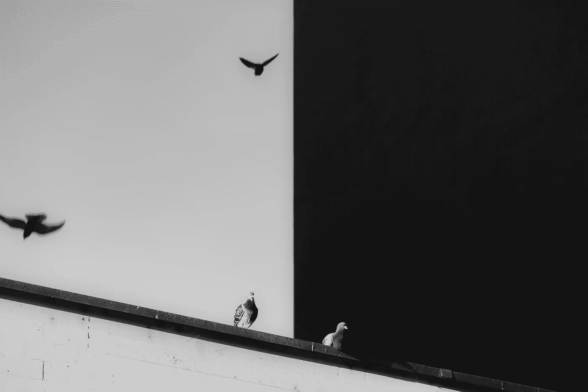
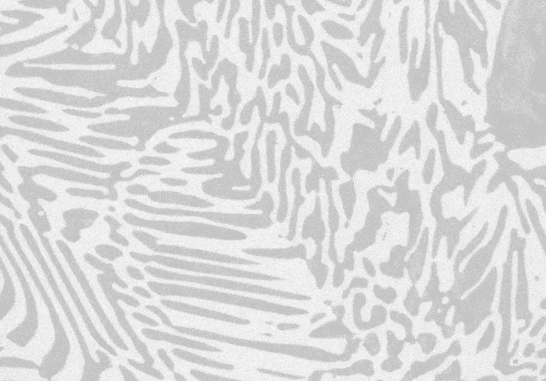
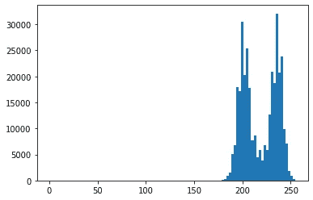
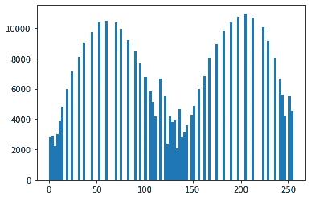
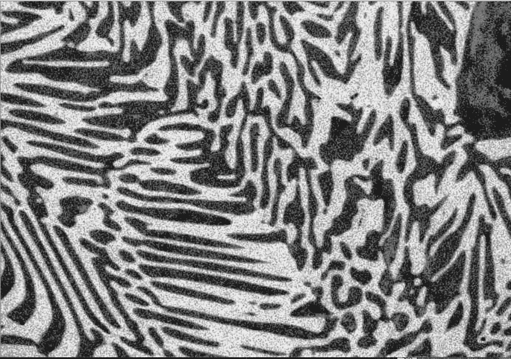
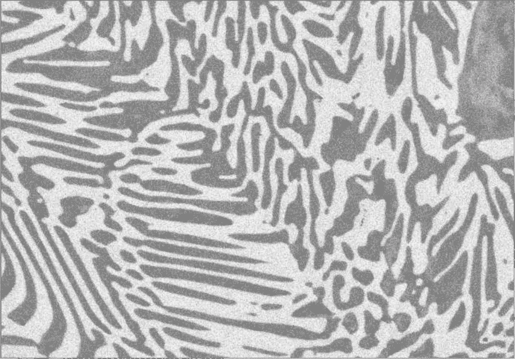
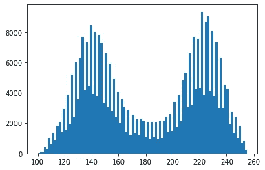
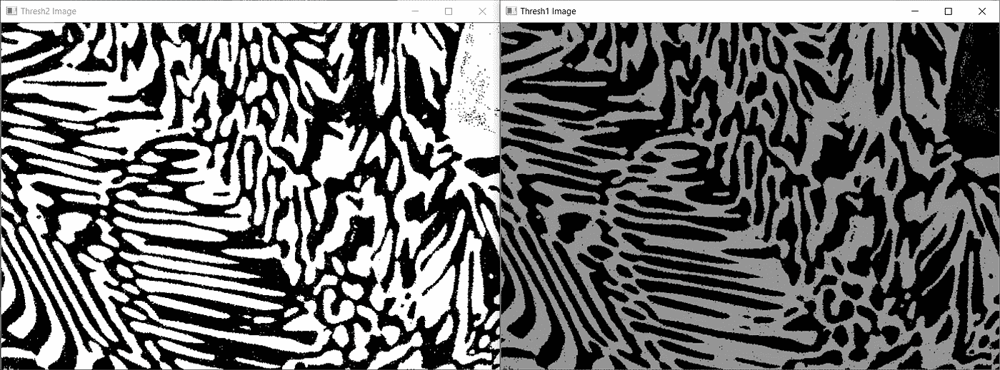

# Python 中的分类和阈值处理

> 原文：<https://towardsdatascience.com/clahe-and-thresholding-in-python-3bf690303e40?source=collection_archive---------5----------------------->

## Python 中使用 OpenCV 的对比度受限的自适应直方图均衡化和阈值化



照片由[菲利普·莱昂](https://unsplash.com/@philinit?utm_source=unsplash&utm_medium=referral&utm_content=creditCopyText)在 [Unsplash](https://unsplash.com/s/photos/contrast?utm_source=unsplash&utm_medium=referral&utm_content=creditCopyText) 上拍摄

# 介绍

在本文中，我们来谈谈直方图均衡化和图像阈值。直方图均衡化是我们用于图像预处理的工具之一，它使图像阈值化或分割任务变得更容易。

我们需要直方图均衡化的原因是，当我们收集褪色的图像或低对比度的图像时，我们可以拉伸直方图以跨越整个范围。

让我们看一个例子，图像是用电子显微镜采集的。



测试图像

在上面的图像中，我们可以看到分离，但它并不清楚。因此，让我们看看直方图，并使用均衡来拉伸直方图，以设定阈值。

```
import cv2
import numpy as np
from matplotlib import pyplot as plt img = cv2.imread("test.jpg", 0)
equ = cv2.equalizeHist(img)
```

首先，我将我的图像读取为灰度，并将其赋给变量`img`。为了执行直方图均衡化，我们可以运行`cv2.equalizeHist(img)`。

让我们看看测试图像的直方图。你可以看到它向右侧倾斜。

```
plt.hist(img.flat, bins=100, range=(0, 255))
```



均衡前

让我们看看均衡图像的直方图。你可以看到直方图一直延伸到 255。

```
plt.hist(equ.flat, bins=100, range=(0, 255))
```



均衡后

下面是直方图均衡化图像的结果，



均衡图像

正如你所看到的，上面的图像中有很多噪声，因为它考虑了图像的全局对比度，而不仅仅是局部对比度。因此，执行全局均衡可能无法很好地处理您的图像，在这种情况下，我们可以使用**自适应直方图均衡**或称为 **CLAHE(对比度限制自适应直方图均衡)**。

## 对比度限制自适应直方图均衡化(CLAHE)

对比度受限的 AHE ( **CLAHE** )是自适应直方图均衡化的变体，其中对比度放大是受限的，以便减少噪声放大的问题。简而言之，CLAHE 以高精度和对比度限制在小块或小块中进行直方图均衡化。

现在我们知道了 CLAHE 是什么，让我们看看如何设置它。

```
clahe = cv2.createCLAHE(clipLimit =2.0, tileGridSize=(8,8))
cl_img = clahe.apply(img)
```



CLAHE 图像

正如你从上面的图片中看到的，CLAHE 给出了比普通均衡图像更好的结果。但它仍然有很多噪声，让我们看看如何阈值工作，以获得更好的结果。

> **为了获得更好的图像效果，使用** `**.tiff**` **文件格式，而不是** `**.jpeg**` **文件格式**

在开始阈值处理之前，我们需要看看 CLAHE 图像的直方图。

```
plt.hist(cl_img.flat, bins=100, range=(100, 255))
```



CLAHE 图像直方图

从上面的直方图可以看出，在 160–200 之间有一个倾角，我们可以确定一个接近的数字来分隔这两个峰值。在我们决定一个接近的数字后，我们可以用它来做阈值(我选择了 190)

```
ret, thresh1 = cv2.threshold(cl_img, 190, 150, cv2.THRESH_BINARY)
ret, thresh2 = cv2.threshold(cl_img, 190, 255, cv2.THRESH_BINARY_INV)
```

忽略第一个参数`ret`，我们可以得到阈值图像的变量`thresh1`和`thresh2`。在上面的代码部分中，第一个参数是图像，其次是我们选择的阈值，第三，我们需要给所有被阈值化的像素赋予一个值，最后，我们需要给出一个方法。我给了`THRESH_BINARY`和`THRESH_BINARY_INV`来分开变量。



左阈值 2 和右阈值 1

在第一阈值图像(`thresh1`)中，灰度值为 150，第二阈值图像(`thresh2`)的灰度值为 255。这只是基于直方图的阈值处理。

在上面的例子中，我们通过参考直方图发现值 190 是最佳值。但是使用 OTSU 有一种更简单的方法来找到最佳值。

```
ret, thresh3 = cv2.threshold(cl_img, 0, 255, cv2.THRESH_BINARY + cv2.THRESH_OTSU)
```

使用 OTSU，我们可以自动分割它。


阈值 3 — OTSU

如果使用二进制阈值，OTSU 是找到最佳值的最佳方法。如果有必要，你甚至可以使用 K-means。

文章到此为止。如果你的图像有噪声，不要忘记先去噪。然后你可以做所有这些练习。

# 结论

总结一下，CLAHE 在大多数情况下都很有效。然后，您可以使用直方图将图像分为这两个阶段，但如果您不想绘制直方图来识别分离，则可以使用 OTSU。

## 资源

[](https://www.youtube.com/channel/UC34rW-HtPJulxr5wp2Xa04w) [## Sreeni 为显微镜专家开发的 Python

### 本频道将带您了解学习 Python 编码的整个过程；从基础到高级…

www.youtube.com](https://www.youtube.com/channel/UC34rW-HtPJulxr5wp2Xa04w)