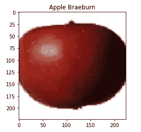

# 类激活映射

> 原文：<https://towardsdatascience.com/class-activation-mapping-using-transfer-learning-of-resnet50-e8ca7cfd657e?source=collection_archive---------11----------------------->

## 一种强有力的弱监督目标定位和调试方法

由 [Ales Nesetril](https://unsplash.com/@alesnesetril?utm_source=medium&utm_medium=referral) 在 [Unsplash](https://unsplash.com?utm_source=medium&utm_medium=referral) 上拍摄的照片

# 介绍

在这篇文章中，我想与你分享一个非常强大和有趣的技术。这种技术被称为类别激活图(CAMs)，是由麻省理工学院的研究人员在论文“[学习深度特征进行区分定位](https://arxiv.org/abs/1512.04150)”中首次引入的。CAMs 的使用使你不仅可以看到网络预测的类别，还可以看到网络特别感兴趣的图像部分。这有助于更深入地了解网络的学习，并且也简化了调试，因为用户不必显式地标记该对象的边界框就可以获得预测类的对象定位。在章节*方法论*中，我想浏览一下使用的数据，以及在哪里可以找到本文使用的代码。章节*模型*描述了所使用的模型及其训练。章节*类激活映射*描述了 CAMs 的概念以及如何计算它。第*章结论*应该是总结调查结果。

# 方法学

网络的训练过程和凸轮的计算是用 jupyter 笔记本和 tensorflow 完成的。使用来自 [Kaggle 的 360°水果挑战赛](https://www.kaggle.com/moltean/fruits)的数据集。它包含 90483 幅水果和蔬菜的图像，共有 131 个不同的类别。图 1 显示了一个以地面实况标签为标题的示例图像。相应的笔记本可以在我的 [Github](https://github.com/patrickbrus/TransferLearning_and_CMAP) 资源库中找到。

图 1:来自 [Kaggle 数据集](https://www.kaggle.com/moltean/fruits)的示例图像

# 模型

作为模型，我决定使用已经训练好的 ResNet50 [4]进行迁移学习(TL)。该模型在包含 1000 个不同类的 ImageNet 挑战上被训练。TL 对于快速训练一个大而深的网络非常有用，因为网络不用从头开始训练。通常，你越深入，过滤器在你的网络中学习的特征就越复杂。第一层的过滤器仅学习非常低级的特征，如边缘。这是因为第一层的滤光器只能看到输入图像的一小部分。在第二层，这部分(也称为感受野)已经更大，因此过滤器可以学习更复杂的特征。并且在最后的卷积层上，过滤器已经可以检测完整的对象。当使用 TL 时，预训练的模型被加载，分类层被删除。之后，除了新添加的分类层之外，整个 CNN 被冻结和训练，直到损失收敛。这避免了由于初始潜在的大梯度而破坏已经学习的特征。或者，您可以随后解冻 CNN 的剩余部分或只解冻最后的层，并微调它们的权重以适应您当前的任务。对于这项任务，我决定只重新训练分类层，以便专注于计算凸轮。因此，我在最后删除了 ResNet50 中的所有密集层，并添加了一个全局平均池层(请参见下一章为什么添加此层)以及 softmax 层，该层具有与要分类的类一样多的神经元。该架构将在下一章中详细描述。然后，该模型被训练五个时期，最终得到 99%的验证准确度。

# 类激活映射

CAM 是为每个图像生成的加权激活图[1]。它有助于识别 CNN 在对图像进行分类时正在查看的区域。摄像机不是在监督下训练的，而是以一种弱监督的方式。这意味着对象不必手动标记，本地化是“免费”学习的。在架构上唯一需要改变的是去掉末端完全连接的密集层，以保持最后一个卷积层输出中包含的空间信息。此外，之后还会添加一个全局平均池层。这一层通常用于正则化，以防止网络过拟合[2]。最后，添加输出 softmax 层，其神经元数量与要分类的类数量一样多(在我们的示例中为 131)。图 2 总结了所需的架构，并展示了如何计算 CAM。

图 2: CAM 架构和程序[1]

在我们的例子中，架构变化和训练已经完成(参见章节模型)，所以我们可以直接从计算 CAM 开始。作为第一步，我们向网络输入一幅图像，并计算网络的分类输出。下一步，我们获取连接到“获胜”神经元的权重。此外，我们存储最终卷积层的输出。然后，我们通过将来自最终卷积层的输出的每个深度乘以连接到“获胜”神经元的相应权重来计算 CAM(即，w1 将乘以最终卷积层输出的深度 1，w2 乘以深度 2，…)，并将它们全部相加。最后，我们使用双线性上采样来扩展 CAM 的大小以匹配输入图像的大小。图 3 显示了我的 github 页面上 jupyter 笔记本的功能。

图 3:计算 CAM 的函数(代码来自[3])

图 4 显示了六个示例 cam。每个 CAM 的标题显示了网络的预测标签。

图 CAM 的示例输出和网络预测

# 结论

可以看出，只需对网络架构稍作调整，就可以轻松计算 CAM，而且是免费的，因此没有人需要为数据贴上昂贵的标签。此外，CAM 还可以用于调试，因为可以看到网络聚焦在图像的哪个区域。例如，如果网络应该对图像中港口的存在进行分类，并且通过绘制 CAM 可以清楚地看出网络关注的是天空而不是港口本身，那么这可能是有帮助的。然后，用户可以调整数据集，使其也包含没有可见天空的港口的图像，从而避免这种错误的关联。

# 资源

[1]:周，Aditya Khosla，Agata Lapedriza，Aude Oliva，Antonio Torralba，[学习深度特征进行区分性本地化](https://arxiv.org/abs/1512.04150) (2015)，MIT
[2]:，，和水城颜， [Network In Network](https://arxiv.org/abs/1312.4400) (2013)，新加坡国立大学
[3]: Alexis Cook，[全球平均池](https://alexisbcook.github.io/2017/global-average-pooling-layers-for-object-localization/#:~:text=to%20avoid%20overfitting.-,Global%20Average%20Pooling,of%20a%20three-dimensional%20tensor.) (2017)，Github Blogpost
[4]:何，，，任