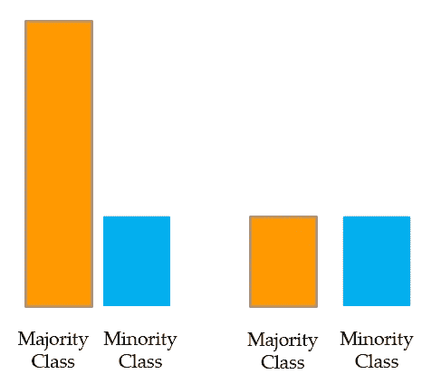
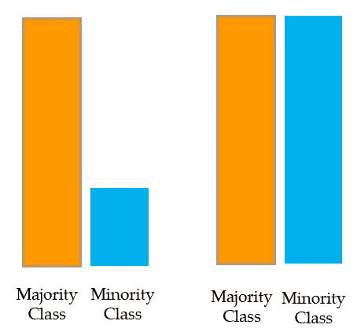
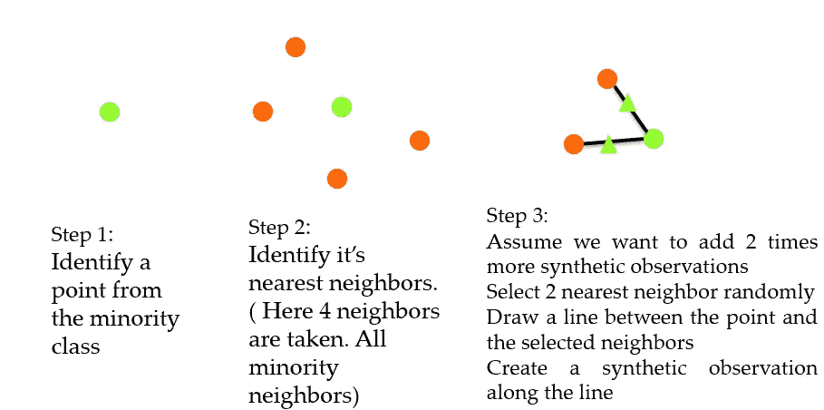
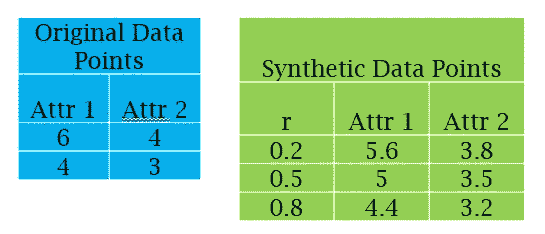
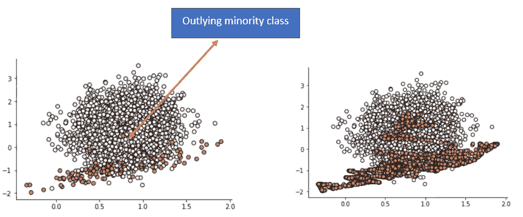
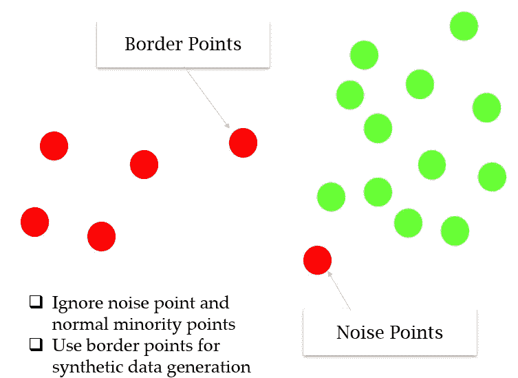
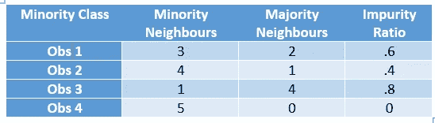

# 等级不平衡，SMOTE，临界 SMOTE，ADASYN

> 原文：<https://towardsdatascience.com/class-imbalance-smote-borderline-smote-adasyn-6e36c78d804?source=collection_archive---------15----------------------->

## 类别不平衡会使我们的算法失去平衡

[图像来源](https://unsplash.com/photos/t1XLQvDqt_4)

那是在 20 世纪 90 年代末，当时南佛罗里达大学的一名研究生 Niesh V . Chawla(SMOTE 背后的主脑)正在研究一个二元分类问题。他正在处理乳房 x 光摄影图像，他的任务是建立一个分类器，该分类器将像素作为输入，并将它分类为正常像素或癌变像素。当他达到 97%的分类准确率时，他相当高兴。当他看到 97.6%的像素正常时，他的快乐是短暂的。

你可能在想，这有什么问题？有两个问题

*   假设在一个 100 个像素的样本中，98 个是正常的，2 个是癌性的，如果我们写一个程序，它可以预测任何正常的东西。分类准确率会是多少？高达 98%。**程序学会了吗？一点也不。**
*   还有另一个问题。分类器努力在训练数据中获得良好的性能，并且随着正常观察值越来越多，**它们将更加专注于学习“正常”类的模式**。这就像任何学生知道 98%的问题来自代数，2%来自三角学时会做的一样。他们会安全地忽略三角测量

那么，为什么这个问题会表现出来呢？这是因为上课的频率和次数之间有很大的差异。**我们称这样的数据集为展示类不平衡。正常阶层被称为多数阶层，罕见阶层被称为少数阶层。**

作为少数派的海鸥([https://unsplash.com/photos/SQBtDa6cKDA](https://unsplash.com/photos/SQBtDa6cKDA))

现实应用中存在这种情况吗？以垃圾邮件检测、假新闻检测、欺诈检测、可疑活动检测、入侵检测等为例，其中表现出了类别不平衡问题。

# 实现某种平衡的解决方案:

基本的方法被称为重采样技术。有两种基本方法。

**欠采样:-**

欠采样或欠采样多数类(图像源作者)

我们从多数类中随机选取样本，并使其等于少数类计数。这被称为**欠采样或多数类**的下采样。

问题:**忽略或放弃这么多原始数据并不是一个好主意。**

**过采样:-**

对少数类进行过采样或上采样(图片来源作者)

这里，替换抽样应用于少数类，以创建与多数类一样多的观察值，并且这两个类是平衡的。这被称为**过采样或**少数类上采样。

问题:**相同少数类数据的重复导致过度拟合。**

**重击:**

SMOTE 的完整形式，综合技术。这里的综合观察是从少数类中产生的

SMOTE，合成少数观察生成过程(来源:作者)

假设有来自少数类的两个观察值(x1，y1)和(x2，y2)。作为第一步，创建一个介于 0 和 1 之间的随机数，我们称之为 r。合成点将是(x1 + r*(x2 -x1)，y1 + r*(y2 -y1))。下面的例子进一步说明了这一点。

从少数类生成的合成点(图片来源:作者)

【SMOTE 的一个问题:

左侧:原始数据右侧:应用 SMOTE 后的数据(图片来源:作者)

如果少数类中的观察值是外围的并且出现在多数类中，则通过创建与多数类的线桥，会给 SMOTE 带来问题。

**临界击打:-**

这解决了上述问题。

边界线 SMOTE:(图片来源作者)

该算法首先对少数类观测值进行分类。如果所有邻居都是多数类，则它会将任何少数观察分类为噪声点，并且在创建合成数据时会忽略此类观察(类似于 DBSCAN)。此外，它将几个点分类为具有多数和少数类作为邻域的边界点，并完全从这些点重新采样(支持向量通常会关注的极端观察)。

问题:结束对这些极端观察的更多关注。

**阿达辛:**

ADASYN 是一个更通用的框架，对于每个少数观察值，它首先通过取邻域中多数观察值与 k 的比值来找到邻域的杂质。

阿达辛杂质比率

现在，首先，通过使总和为 1，将该杂质比转换成概率分布。那么该比率越高，为该特定点生成的合成点就越多。因此，为 Obs 3 创建的合成观测数据的数量将是 Obs 2 的两倍。因此，它不像边界平滑那样极端，噪声点、边界点和常规少数点之间的边界要柔和得多。(不是硬性边界)。因此得名自适应。

这个在下面的视频教程里也有讲解，请给它一个[看](https://youtu.be/mKG7lnZNAOk)

**尾注**:

阶层失衡是一个非常现实的问题。基于重采样的方法没有前途，这促使研究人员开发 SMOTE，并通过 borderline SMOTE、ADASYN 等逐渐改进。要了解更多的变体，参考文献 2 是一个很好的读物。

参考

[1]舒拉 NV，鲍耶 KW，霍尔 LO，凯格尔迈耶 WP。SMOTE:合成少数过采样技术。人工智能研究杂志。2002 年 6 月 1 日；16:321–57.

[2]费尔南德斯 A、加西亚 S、埃雷拉 F、舒拉 NV。SMOTE 从不平衡数据中学习:进步与挑战，15 周年纪念。人工智能研究杂志。2018 年 4 月 20 日；61:863–905.