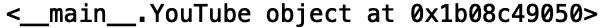
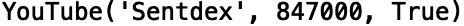
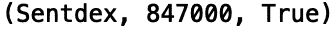
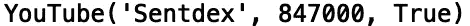
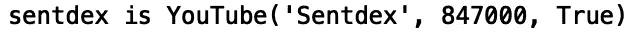
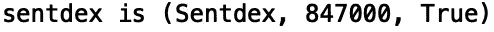

# Python 中的类实例

> 原文：<https://towardsdatascience.com/class-instances-in-python-d89ebf545ba4?source=collection_archive---------38----------------------->

## 类实例的字符串表示


[来源](https://www.pexels.com/photo/macbook-pro-on-black-table-3787591/)

自定义类实例的表示方式是简化调试和实例输出的好方法。在这篇文章中，我们将讨论如何通过定义“__repr__”和“__str__”方法来改变实例的字符串表示。

我们开始吧！

首先，让我们定义一个描述 YouTube 频道的类。该类将包含特定于 Youtube 频道的属性(数据)，如频道名称、订户和验证状态:

```
class YouTube:
    def __init__(self, channel_name, subscribers, verification):
        self.channel_name = channel_name
        self.subscribers = subscribers
        self.verification = verification
```

让我们创建一个 YouTube 类的实例。提醒一下，实例是一个类对象的具体实例。对于我们的实例，让我们设置对应于我最喜欢的 YouTube 频道之一的属性，[](https://www.youtube.com/user/sentdex/featured)*:*

```
*sentdex = YouTube('Sentdex', 847000, True)*
```

*现在我们已经创建了实例，让我们打印出实例:*

```
*print(sentdex)*
```

**

*我们看到在指定的内存地址中有一个类型为“YouTube”的对象。虽然这符合我们的预期，但它并不是我们的实例可读性最好的表示。如果我们想改变这个对象的表示方式，我们可以定义' __repr__ '和' __str__ '方法。首先，让我们定义' __repr__ '方法:*

```
*class YouTube:
    def __init__(self, channel_name, subscribers, verification):
        self.channel_name = channel_name
        self.subscribers = subscribers
        self.verification = verification

    def __repr__(self):
        return 'YouTube({0.channel_name!r}, {0.subscribers!r}, {0.verification!r})'.format(self)*
```

*让我们重新定义我们的对象' sentdex '，并打印结果:*

```
*sentdex = YouTube('Sentdex', 847000, True)
print(sentdex)*
```

**

*我们看到' __repr__ '方法返回了我们实例的代码表示。它只是对应于我们为创建实例而键入的代码。*

*现在，让我们定义' __str__ '方法:*

```
*class YouTube:
    def __init__(self, channel_name, subscribers, verification):
        self.channel_name = channel_name
        self.subscribers = subscribers
        self.verification = verification

    def __repr__(self):
        return 'YouTube({0.channel_name!r}, {0.subscribers!r}, {0.verification!r})'.format(self) def __str__(self):
        return '({0.channel_name!s}, {0.subscribers!s}, {0.verification!s})'.format(self)*
```

*让我们再次定义我们的实例并打印结果:*

```
*sentdex = YouTube('Sentdex', 847000, True)
print(sentdex)*
```

**

*我们看到我们现在有了实例的字符串表示。如果我们想要打印出代码表示，使用我们当前的类实现，我们可以使用内置的“repr()”方法:*

```
*sentdex = YouTube('Sentdex', 847000, True)
print(repr(sentdex))*
```

**

*我还想指出' __repr__()'和' __str__()'在文本格式上的区别。特别的！“r”格式代码指示应使用“__repr__()”的输出，而不是默认的“__str__()”。例如，如果我们包括！我们字符串中的“r ”:*

```
*sentdex = YouTube('Sentdex', 847000, True)
print('sentdex is {0!r}'.format(sentdex))*
```

**

*我们得到了代码表示。如果我们省略掉！r '代码，字符串表示用作默认值:*

```
*sentdex = YouTube('Sentdex', 847000, True)
print('sentdex is {0}'.format(sentdex))*
```

**

*定义“__repr__()”和“__str__()”方法通常是很好的做法，因为它可以使类实例更容易解释和调试。例如，记录实例的自定义字符串表示可以为程序员提供更多关于实例内容的有用信息。我就讲到这里，但是我鼓励你自己去研究代码。如果你有兴趣学习更多与 python 中的类定义相关的编程模式，我鼓励你去看看 Python 食谱[。](https://d.cxcore.net/Python/Python_Cookbook_3rd_Edition.pdf)*

# *结论*

*总之，在这篇文章中，我们讨论了类实例的字符串表示。我们展示了如何定义“__repr__()”和“__str__()”方法，这允许我们显示实例的代码表示和字符串表示。这种做法可以使类实例的内容透明，如果做得好，可以大大简化调试。我希望你觉得这篇文章有用/有趣。这篇文章中的代码可以在 [GitHub](https://github.com/spierre91/medium_code/blob/master/classes_in_python/class_instance_representation.py) 上找到。感谢您的阅读！*