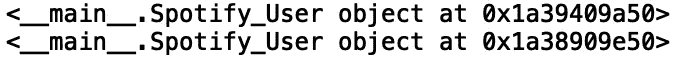
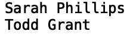

# Python 中的类

> 原文：<https://towardsdatascience.com/classes-in-python-e31c21120c3d?source=collection_archive---------17----------------------->

## 理解面向对象编程


[来源](https://www.pexels.com/photo/coffee-notebook-writing-computer-34601/)

类允许我们以某种方式组织数据和函数，使它们在将来易于重用和扩展。在这篇文章中，我们将讨论用 python 构建类的基础。

我们开始吧！

首先，让我们创建一个表示 Spotify 用户的简单类，没有数据(也称为属性)或函数(也称为方法):

```
class Spotify_User:
    pass
```

现在，让我们花些时间来区分类和类的实例。类基本上是创建实例的蓝图。我们创建的每个唯一用户都将是 Spotify_User 类的一个实例。例如，我可以定义两个 Spotify 用户实例，user_1 和 user_2:

```
user_1 = Spotify_User()
user_2 = Spotify_User()
```

这些用户中的每一个都将是他们自己的 Spotify_User 类的唯一实例。我们可以打印这两个对象:

```
print(user_1)
print(user_2)
```



我们看到这两个都是内存地址不同的 Spotify_User 对象。我们可以做的另一件事是创建实例变量，这些变量对于每个实例都是唯一的。让我们定义保存每个用户姓名的实例变量:

```
user_1.name = 'Sarah Phillips'
user_2.name = 'Todd Grant'
```

让我们给每个实例发一封电子邮件:

```
user_1.email = 'sphillips@gmail.com'
user_2.email = 'tgrant@gmail.com'
```

最后，让我们定义实例变量，告诉我们每个用户是否是 Spotify 的高级会员:

```
user_1.premium = True
user_2.premium = False
```

现在，这些实例中的每一个都具有每个实例独有的属性。让我们打印每个用户的姓名:

```
print(user_1.name)
print(user_2.name)
```



理想情况下，我们希望为每个用户自动设置所有这些信息，而不是手动设置这些值。为了获得类的全部好处，我们应该定义一个方法，允许我们用手动定义的值初始化每个用户实例。初始化方法基本上是一个构造函数，将被称为“__init__ ”:

```
class Spotify_User:
    def __init__(self, name, email, premium):
        self.name = name
        self.email = email
        self.premium = premium
```

这里,“self”参数是实例，它允许我们在实例中共享属性信息。例如，当我们写下:

```
user_1 = Spotify_User('Sarah Phillips', 'sphillips@gmail.com', True)
user_2 = Spotify_User('Todd Grant', 'tgrant@gmail.com', False)
```

每种情况下的“self”参数分别是 user_1 和 user_2 对象。如果我们打印电子邮件，我们会看到:

```
print(user_1.email)
print(user_2.email)
```

这允许我们用比手工定义属性少得多的代码来定义属性。现在假设我们想要对每个用户的属性执行一些操作。例如，我们可以定义一个方法来告诉我们用户是否拥有高级会员资格。在我们的方法中，如果“self.premium”为真，我们打印“用户是 Spotify 高级用户”，否则，我们打印“用户不是 Spotify 高级用户”:

```
def isPremium(self):
        if self.premium:
            print("{} is a Premium User".format(self.name))
        else:
            print("{} is not a Premium User".format(self.name))
```

让我们使用 user_1 实例调用该方法:

```
user_1.isPremium()
```


并且在用户 2 上:

```
user_2.isPremium()
```


如您所见，由于“self”参数被传递给“__init__”和“isPremium”，因此在初始化时，“isPremium”方法可以完全访问相应实例的属性。

我将在这里停下来，但是您可以随意摆弄代码。例如，您可以尝试定义 Spotify_User 类的几个额外的用户实例。在那里，您可以练习提取实例属性并使用类方法“isPremium”。一旦你觉得舒服了，我鼓励你定义额外的类方法。一个有趣的方法是为每个用户显示定制的播放列表。

## 结论

总之，在这篇文章中，我们讨论了用 python 定义类的基础。我们展示了如何定义类的实例、初始化实例、访问实例属性以及用方法操作属性。这篇文章的代码可以在 GitHub 上找到。感谢您的阅读！