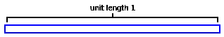
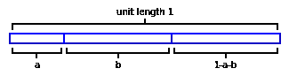
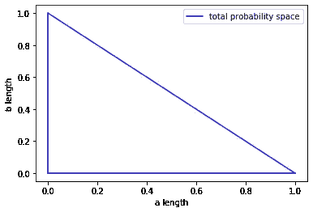
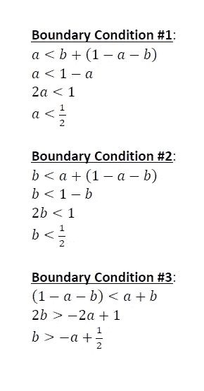
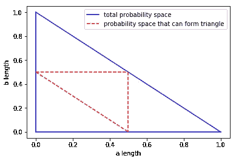
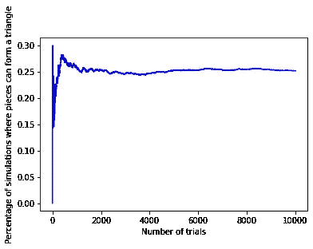

# 经典概率问题#1:折断的棍子、三角形和概率

> 原文：<https://towardsdatascience.com/classic-interview-question-1-broken-sticks-triangles-and-probability-98b0b1974fd8?source=collection_archive---------27----------------------->

## 数据科学和机器学习面试

以下是概率论中的经典玩具问题，作为数据科学和机器学习角色的精彩技术面试问题。问题如下:

**问题:**你有一根任意长度的棍子。你沿着棍子的长度在两个地方均匀地随机折断它，给你留下三个不同的碎片。你能用产生的三块组成一个三角形的概率是多少？

我们将首先解析地解决这个问题，然后通过计算模拟这个问题来验证我们的发现。

**解决方案:**注意我们的棍子是任意长度的。为了从数学上界定这个问题，让我们选择一个易于管理的长度。假设这根棍子的单位长度为 1。



现在，我们沿着棍子的长度在两个地方随机均匀地折断它，这样我们就有三段了。注意，因为我们已经将总长度定义为“单位长度 1”，所以只需要两个变量 **a** 和 **b** 来完全指定产生的三个片段的长度。第一段长度为 **a** ，第二段长度为 **b** ，第三段长度为 **1-a-b** :



请注意，每个片段的长度范围可以从 0 到 1，条件是三个片段的总和为 1。让我们以图形方式将总概率空间映射为 **a** 和 **b** 的函数:



现在问题来了，我们的三块拼成三角形了吗？让我们回忆一下所有三角形所要求的几何条件:三角形的每条边都严格小于其他两条边之和。因此，我们可以指定从三个部分形成三角形所需的三个不同的边界条件:



让我们将上述三个边界条件叠加在我们的概率空间上，以确定 **a** 和 **b** 的值，我们可以形成一个三角形:



从上图我们可以看到，边界条件指定了总概率空间的 1/4。因此，我们可以得出结论，这三个碎片有 1/4 的概率形成一个三角形。

现在让我们用 python 通过计算模拟这个问题，以确认我们的解析解:

```
######################
## import libraries ##
######################
import numpy as np
import pandas as pd
import math
import matplotlib.pyplot as plt## number of iterations 
iterations = 10000
results = pd.DataFrame()
results['iteration'] = list(range(1,iterations+1))
percentage = iterations*[None]np.random.seed(10815657)
count = 0
for i in range(0, iterations):
    random_draws = np.random.uniform(low=0, high=1, size=2)
    a = min(random_draws)
    b = abs(random_draws[0] - random_draws[1])
    if((a<0.5) and (b<0.5) and (0.5 < a+b)):
        count=count+1
    percentage[i] = count / (i+1)results['percentage'] = percentageplt.plot(results['iteration'], results['percentage'], color='blue')
plt.xlabel('Number of trials') 
plt.ylabel('Percentage of simulations where pieces can form a triangle')percentage[iterations-1]
```



如上所示，经过 10，000 次模拟，结果收敛到三个碎片可以形成三角形的概率为 1/4(即 25%)。

希望以上有见地。正如我在以前的一些文章中提到的，我认为没有足够的人花时间去做这些类型的练习。对我来说，这种基于理论的洞察力让我在实践中更容易使用方法。我个人的目标是鼓励该领域的其他人采取类似的方法。我打算在未来写一些基础作品，所以请随时在[**【LinkedIn】**](http://www.linkedin.com/in/andrew-rothman-49739630)和 [**上与我联系，并在 Medium**](https://anr248.medium.com/) 上关注我的更新！