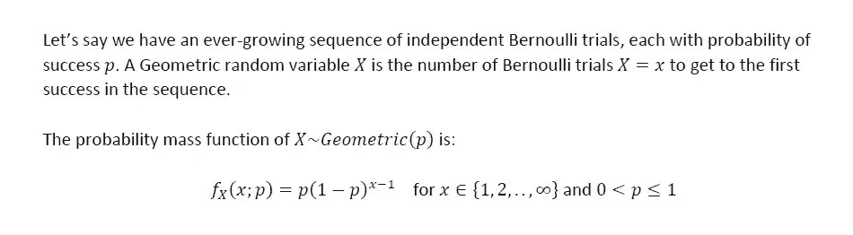
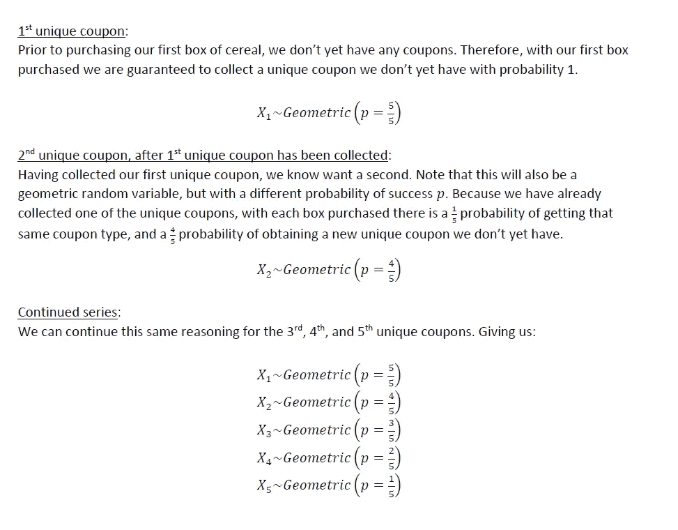
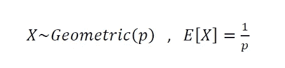
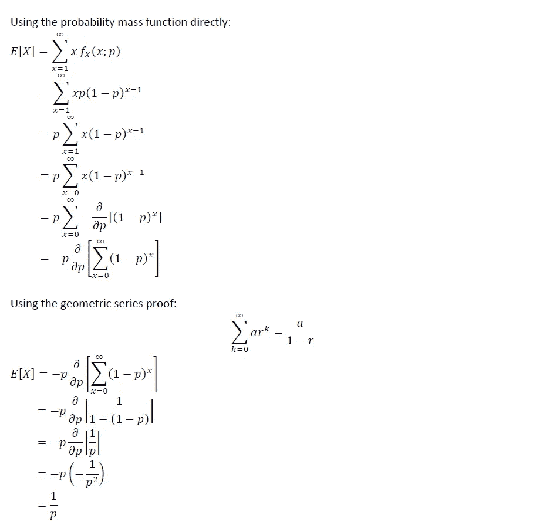
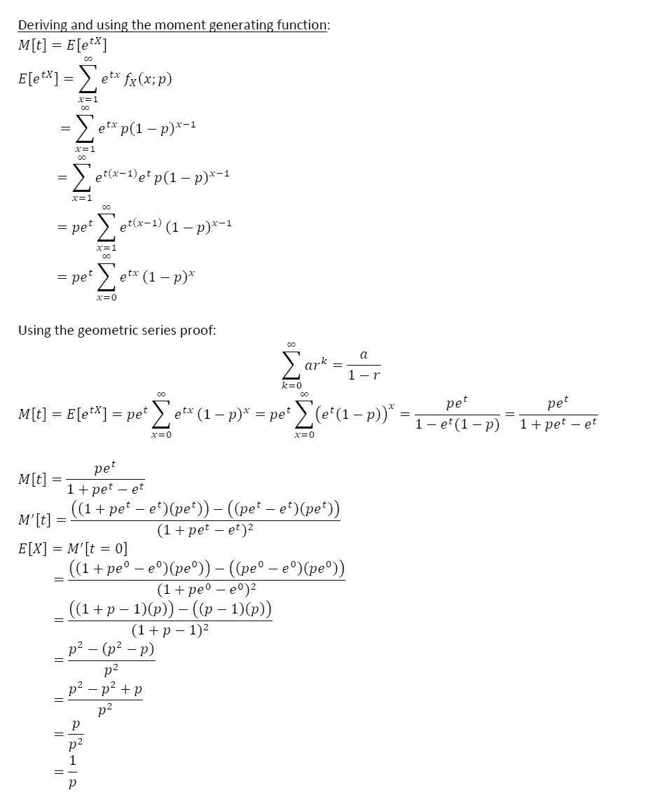
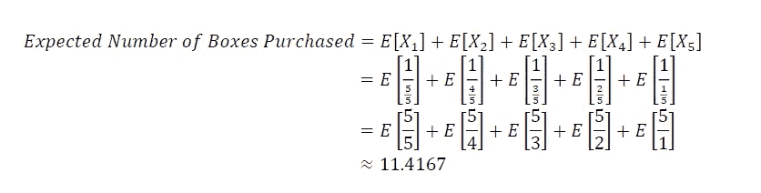
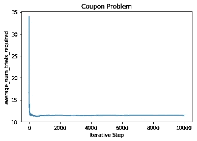

# 经典概率问题#2:优惠券问题

> 原文：<https://towardsdatascience.com/classic-probability-problem-2-the-coupon-problem-7acd7febaabd?source=collection_archive---------28----------------------->

## 数据科学和机器学习面试


从[freeimages.com](https://www.freeimages.com/photo/save-money-with-these-coupon-1619724)

这是我第二次进入概率论中的经典玩具问题。“息票问题”是一个需要注意的大问题；它出现在许多应用场合。从技术面试的角度来看，通过在最后添加一个小的计算组件，它可以作为对一般概率和编码知识的可靠测试。问题如下:

# 问题:

有一种品牌的麦片，每买一盒都有一张优惠券。有 5 种不同类型的优惠券。每购买一盒麦片，获得 5 张优惠券中任何一张的概率是一致的。目标是收集所有 5 种独特的优惠券类型。

**现在问题来了，你需要购买多少盒麦片才能收集到所有 5 张独特的优惠券？**

我们将首先解析地解决这个问题，然后通过计算模拟这个问题来验证我们的发现。

# 分析解决方案:

让我们从一些观察开始:

1.  购买的每一盒麦片都独立于最后购买的一盒(或多盒)。
2.  在给定的盒子中获得 5 种优惠券类型中的任何一种的概率是相同的。

我们需要某种数学方法来界定这个问题。也许我们可以使用一些参数工具？让我们快速绕道，讨论几何随机变量。

## 几何随机变量:

几何随机变量是具有单参数分布的离散随机变量，具体如下:



请注意，我们可以将我们的优惠券收集问题视为五个几何随机变量的期望值之和，每个变量具有不同的成功参数 ***p*** :



注意，几何随机变量的期望值是 1/p:



## 几何 RV 期望值的证明(可选部分):

对于那些对几何随机变量的期望值的推导感兴趣的人，下面我包括了两个推导(一个直接使用 PMF，另一个使用 MGF)。如果您对这些证明不感兴趣，可以跳过这一部分:



## 解决问题:

现在我们简单地将五个指定的随机变量的期望值相加:



因此，四舍五入到最接近的整数，我们需要购买的收集所有 5 个独特优惠券的预期盒数是 12 盒。

# 计算模拟:

现在让我们用 python 模拟这个场景，计算 10，000 次以上的迭代，以证实我们上面的分析结果:

```
import numpy as np
import pandas as pd
import matplotlib.pyplot as plt## specify number of coupons, and the probability of getting a coupon
num_coupons=5
expected_number_of_trials = 0
for i in range(num_coupons, 0, -1):
    expected_number_of_trials = expected_number_of_trials + (1/(i/num_coupons))iterations = 10000
df = pd.DataFrame()
df['iteration'] = range(1,iterations+1)
df['average_num_trials_required'] = Nonefor i in range(0, iterations):
    full_set = set(range(0,num_coupons))
    current_set = set([])
    total_number_of_coupons_collected = 0
    while(current_set != full_set):
        total_number_of_coupons_collected = total_number_of_coupons_collected+1
        random_coupon = np.asscalar(np.random.randint(low=0, high=num_coupons, size=1))
        update_set = list(current_set)
        update_set.append(random_coupon)
        current_set = set(update_set)
        del random_coupon, update_set

    if(i+1 == 1):
        df.loc[df['iteration']==i+1, 'average_num_trials_required'] = total_number_of_coupons_collected
    else:
        df.loc[df['iteration']==i+1, 'average_num_trials_required'] = float(((df.loc[df['iteration']==i, 'average_num_trials_required']*i) + total_number_of_coupons_collected)/(i+1))print(df['average_num_trials_required'][i])
```



如上所示，在该场景的 10，000 次迭代中，收集所有 5 个唯一优惠券所需购买的盒子数量的样本平均值约为 11.431。这个结果与我们上面的解析解一致。

# 最后的想法——我们为什么要关心这个问题，或者任何其他玩具问题？？

正如技术领域中大多数众所周知的玩具问题一样，这个“优惠券问题”和关于谷物和优惠券收集的傻孩子般的场景有一个重要的目的。这个问题(以及它的微小变化)在应用实践中不断出现；关于离散等待时间的期望值的问题，或者在某事发生之前可能需要发生的事件的数量的问题。这些问题通常可以归结为优惠券问题的某种变体。因此，拥有良好的基础知识和关于玩具问题的理论基础知识，比如这里讨论的，对你的应用实践有很大的帮助。

此外，值得一提的是，我们为 **5** 独特优惠券解决了这个问题。但是我们可以选择任何大于零的任意常数 **n** 唯一优惠券**。这里使用的方法仍然适用。**

最后，我想留给你一个挥之不去的问题。在我们上面的问题中，假设你已经收集了 4 个独特的优惠券，现在正在收集第 5 个也是最后一个独特的优惠券。张贴您收集的第四张独特优惠券，您已经购买了 50 多盒麦片，但所有都包含更多您已经拥有的 4 张独特优惠券。从那时起，您需要购买多少盒才能获得第五张优惠券？我给你一个提示，几何分布是指数分布的离散对应物，它有一个关于等待时间的独特性质。欢迎在评论中加入你的想法，以及我上面的谜语的可能答案。

希望以上有见地。正如我在以前的一些文章中提到的，我认为没有足够的人花时间去做这些类型的练习。对我来说，这种基于理论的洞察力让我在实践中更容易使用方法。我个人的目标是鼓励该领域的其他人采取类似的方法。我打算在未来写一些基础作品，所以请随时在 [**LinkedIn**](http://www.linkedin.com/in/andrew-rothman-49739630) 上与我联系，并在 Medium 上 [**关注我的更新！**](https://anr248.medium.com/)