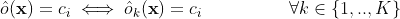
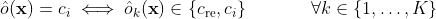
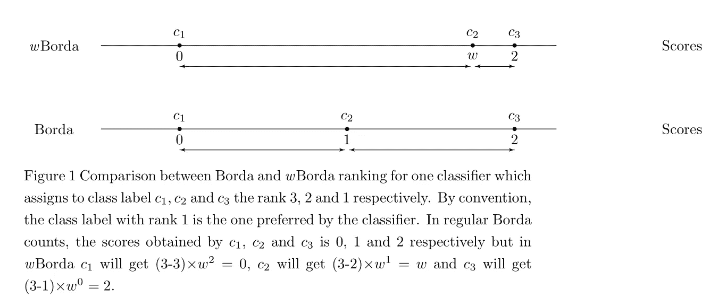
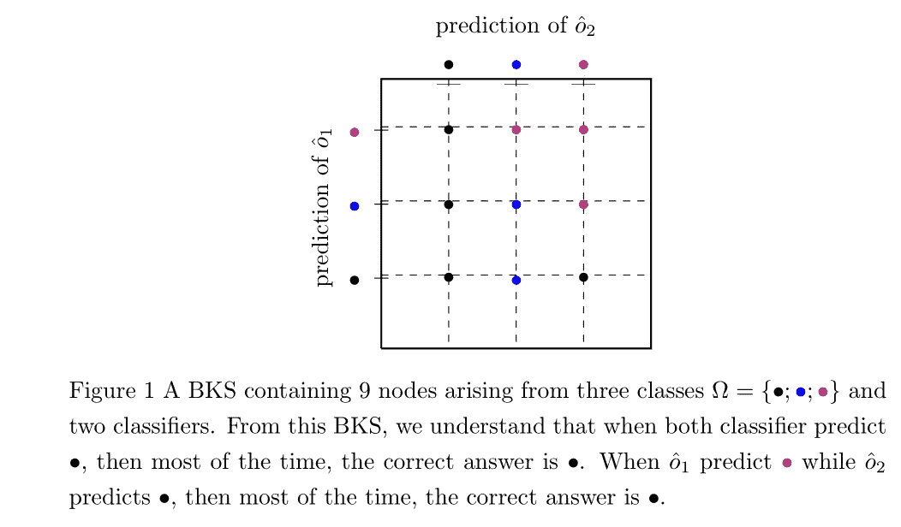

# 经典分类器组合技术:投票方法、Borda 计数和行为知识空间

> 原文：<https://towardsdatascience.com/classical-classifier-combination-techniques-voting-approaches-borda-counts-and-5b047faaffbc?source=collection_archive---------40----------------------->

在本文中，我们回顾了经典的分类器组合技术，这些技术通常被用作新提出的方法的基准。

在本文的其余部分，我们用ôᵏ( **x** 表示 kᵗʰ分类器关于测试样本的决策 **x** ，用 *K* 表示决策将被组合的小组中分类器的数量。类别标签的总数为 *m.*

# 投票方式

一个显而易见的方法是通过投票系统来协调一系列的决定。投票方案的几种变体可以用于分类器融合，并且其中一些可以集成上下文信息，例如单个分类器的准确度。投票原则背后的想法是基于直觉，即小组中分类器(专家)的数量越多，就越有可能做出正确的最终决定。

常见的投票方案如下:

*   *一致投票*是这样一种系统，其中如果所有个体分类器决策都是 cᵢ，则组合决策是标签 cᵢ，否则组合分类器拒绝输入 **x** :



*   *修改一致投票*是这样一种系统，其中如果所有个体分类器决策是 cᵢ或 cᵣₑ，则组合决策是标签 cᵢ，否则组合分类器拒绝输入**x。**换句话说，没有分类器应该预测不同于 cᵢ的分类标签



*   *多数表决*是一种系统，其中如果预测 cᵢ的分类器的数量最大，则组合决策是标签 cᵢ

# 博尔达和 *w* 博尔达计数

Borda counts 是一种基于等级的组合方案，其中每个分类器根据成为正确(真实)类别的机会对类别(候选)进行分级。每个等级与一个分数相关联，从第一个等级的 *m-1* 到最后一个等级的 0，其中 *m* 是等级的总数。第二次，计算每个班级获得的分数的总和，获得最高累积分数的班级标签是小组的最终决定。可能存在平局，即几个类别标签使累积分数最大化，在这种情况下，需要额外的算法步骤来解决平局。基线策略包括随机挑选一个具有最大累积分数的标签。博尔达法是一位名叫让-克洛德·博尔达的法国政治家在寻求真正民主的选举制度时发明的。瑙鲁共和国和斯洛文尼亚共和国目前使用这种方式选举议员。

*   示例 1:假设有四个候选类别标签ω= {c₁,c₂,c₃,c₄}.对于决策函数为{ 0，0 和 0 }的三个分类器，Borda 计数工作如下:每个分类器ôᵏ对标签进行排序(表 1):

```
+---------------+------------------+
| Classifiers   | Labels ranking   |
+---------------+------------------+
|       ô¹      |c₂ - c₃ - c₁ - c₄ |
|       ô²      |c₃ - c₁ - c₂ - c₄ |
|       ô³      |c₃ - c₂ - c₁ - c₄ |
+---------------+------------------+
Table 1: Ranks of the four candidates (labels)
```

然后计算每个标签的累积分数(表 2):

```
+---------------+------------------+
| Candidate     |      Score       | 
+---------------+------------------+
|      c₁       | 1 + 2 + 1 = 4    |
|      c₂       | 3 + 1 + 2 = 6    |
|      c₃       | 3 + 3 + 2 = 8    |
|      c₄       | 0 + 0 + 0 = 0    |
+---------------+------------------+
Table 2: Candidates and their accumulated points
```

Borda 计数被认为是最简单的非线性组合算法之一。在某些情况下(主要是当分类器的数量很大时)，可以观察到多数人的意见和由 Borda 计数推导出的决定之间的冲突。这个问题是帕克[0]提出来的。在博尔达计数中，

> *由同一分类器排序的每两个连续候选之间的分数差为 1，使得所有候选等距并且以均匀的方式分布在同一轴上*

**但** **这种假设并不总是有道理的。**

例如，概率分类器可以为两个标签分配非常高的概率，而为第三个标签分配低概率值(例如，对于三类分类问题，后验概率为 49%、48%、3%；显然，当应用 Borda 计数组合方法时，每个候选之间有一个单位差异并不能反映现实情况和分类器的置信度水平)。

帕克主张，对排名进行加权可能会有助于减少偏见。Fishburn [1]认为，来自混淆矩阵的上下文知识可以用来估计这些权重。将这样的权重分配给候选标签被认为是统一 Borda 计数的推广，通常称为 *w* Borda

*   示例 2:考虑到 *m* 类标签，当应用统一性时，等级为 *r* 的项目将被分配等于 *(m-r)* 的分数，但是在 *w* Borda 中，它可以被分配等于 *(m-r)*w* ᵖ的分数，其中 *p =( r-1)* 和 *w* 是权重。下图说明了 Borda 和 wBorda 之间的区别



作者图片

# 行为知识空间

黄和孙[2，3]提出的行为-知识空间(BKS)方法的优点是不依赖于前提假设，如分类器输出之间的统计独立性。

根据定义，BKS 是一个 *K* 维空间，其中 *k* ᵗʰ维与 *k* ᵗʰ分类器相关。在每个维度 *k* ， *m* 上，可以做出对应于ω中所有可能标签的决定。对于每个测试样本 **x，**我们获得一个决策向量[ôᵏ(**x**]//*k:{ 1，..，K}* 对应于 BKS 中的一个点。

对于 *mᵏ* 个可能点中的每个点，我们跟踪映射到该点的训练样本的数量以及它们的类别标签。

BKS 是在训练时建立的，它有*个 mᵏ* 个节点需要学习。因此，该方法在面板中分类器的数量或类别的数量方面都不能很好地扩展，因为可能有一些配置从未被访问过。为了决定测试样本的类别，输出[ôᵏ(**x**]//*k:{ 1，..，K}* 并映射到相应的 BKS 节点。预测标签是在该节点中出现次数最多的标签。



作者图片

# 结论

在本文中，我们看到了三种经典的分类器组合方法:投票系统、Borda 计数和 BKS。这些技术在许多应用中表现出良好的性能。

这篇文章是我第一篇题为“关于量词组合的**见解**”的文章的延续。这是从我的博士论文中摘录的，你可以在这个[链接](https://ori-nuxeo.univ-lille1.fr/nuxeo/site/esupversions/3c84dfb2-c274-442f-b760-1ab5701fa8b5)中找到。

## 参考

[0]j . r .帕克(2001 年)。来自混淆矩阵数据的等级和响应组合。*信息融合*， *2* (2)，113–120。

[1]菲什伯恩，P. (1999 年)。偏好结构及其数字表示。*理论计算机科学*， *217* (2)，359–383。

[2]黄友生、孙春英(1993 年 6 月)。多分类器组合的行为-知识空间方法。IEEE 计算机学会关于计算机视觉和模式识别的会议(第 347-347 页)。电气工程师协会。

[3]黄友生、孙春英(1995)。一种多专家联合识别无约束手写数字的方法。 *IEEE 模式分析与机器智能汇刊*， *17* (1)，90–94。