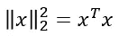

# 用 Python 实现定量光谱分析的经典最小二乘法

> 原文：<https://towardsdatascience.com/classical-least-squares-method-for-quantitative-spectral-analysis-with-python-1926473a802c?source=collection_archive---------19----------------------->


用经典最小二乘法寻找光谱成分

**摘要**。在这个简短的教程中，将解释计算光谱之间相似性的经典最小二乘法。这种方法也称为比尔法，可用于估算未知光谱中不同组分的浓度。首先，将介绍物理背景和朗伯-比尔定律，然后是经典的最小二乘理论方法和正规方程的推导。最后，将使用 Python 实现来展示一个应用程序示例，说明如何计算样品光谱中不同组分的浓度。

# 介绍

光谱学是研究固体、液体或气体发射、反射或散射光与波长的函数关系[1]。大多数光谱学方法因此被分类为吸收、发射或散射光谱学。一些例子是吸收、X 射线、红外和拉曼光谱等。

有时，光谱研究中的物质是未知的。如果需要知道这种物质的成分，可以将其测量光谱(查询光谱)与已知物质(成分)的光谱库进行比较，以便进行识别。为此，使用搜索算法来搜索未知光谱，该算法基于相似性度量来计算分数，从而提供最接近匹配或浓度的列表。相似性度量是量化两个对象之间的相似性的函数。在某种意义上，这种度量与距离度量相反:对于相似的对象，它们返回一个大值，而对于不相似的对象，则返回零或负值。规范化后，相似度的范围在 1(完全相似，表示对象相等)和 0(完全不相似)之间。相似性度量也是推荐系统、聚类、分类或异常检测等其他活动的非常基本的构件。
关于光谱学，有几种基于不同相似性度量的标准光谱搜索算法【2】。在下文中，经典的最小二乘法将用于识别未知物质的光谱，并获得混合物中已知物质的浓度。这种方法也称为直接最小二乘法、K 矩阵校准算法或比尔法，因为它是基于比尔-朗伯定律。

# 物理背景与经典最小二乘法——比尔法

比尔-朗伯定律将光的衰减与光穿过的材料的性质联系起来。它通常应用于物理和化学分析测量，并用于理解物理光学中的光衰减。比尔-朗伯定律表明，在任何给定的波长 I 下，吸光度( *A* )与所选波长 I 下纯物质(k)的吸光度系数和纯物质(c)的浓度成正比:


其中吸收系数(kᵢ = aᵢL)是光通过材料的路径长度(l)与纯物质在选定波长 I 下的摩尔衰减系数或吸收率(a)的乘积，这是构成这种分子“光谱”的分子特性。

Aᵢ = kᵢc 公式适用于样品中的单一纯物质或成分。当有多种吸收成分时，任何波长下的总吸光度是混合物中所有成分在该波长下的吸光度之和:


如果我们记录的不是给定波长 I 的单个值 A，而是具有 w 个点的整个吸收光谱，则最好用矩阵符号表示:


或者以更紧凑的方式


在哪里


因此，A 是我们记录的吸收光谱(也称为查询光谱，或未知光谱，因为我们还不知道它包含什么)，K 是纯组分光谱的矩阵(其中这些组分的光谱值排列在列中)，c 是 n 种纯物质浓度的向量。

因此，有了我们测得的未知光谱 Aᵢ的值，并知道组成混合物的纯组分光谱 Kᵢⱼ的值，我们可以找到最佳确定混合物吸光度的浓度 cⱼ*a。然而，*因为测得的光谱和纯物质光谱包含噪声，所以一般来说，方程 A = Kc 没有精确解。但是我们仍然可以找到 c，使得乘积 Kc 尽可能接近 A，如欧几里德范数所测量的:


换句话说，我们希望找到 c，使得误差 A-Kc 的平方和最小。误差定义为测得的光谱 A 与通过乘以 K 和 c 计算的光谱之间的差值，c 将是等式 A = Kc 的最佳最小二乘解。

利用这个事实



我们误差的欧几里德范数是


为了找到此类函数的最小值，我们只需对其进行推导，将结果表达式设置为零，并求解 c。为此，我们将利用属性


其中 x 是向量，M 是对称矩阵[4]。

所以，


将该表达式设置为 0，我们得到正规方程:


其可以被求解以最终获得测量光谱和库中已知光谱之间的相似性分数，或者同样地，未知混合物中纯物质的浓度:


请注意，A-Kc 的平方和的二阶导数是一个半正定矩阵，这意味着解 c 是全局最小值(而不是最大值或鞍点)。

关于这种方法的更详细的信息可以在《用于定量分析的化学计量技术》一书中找到[5]或者在 spectroscopyonline 网页上关于 CLS 的专栏[6]。

# **用 Python 实现的代码和示例**

首先，加载所需的 Python 包:

```
import numpy as np
import matplotlib.pyplot as plt
from numpy.linalg import inv
```

获得未知混合物中纯物质浓度的最小二乘公式定义为:

```
def least_sq(sample_spectrum, components): # sample_spectrum (unknown spectrum): array of w values.
   # components (known spectra): array of n (number of components) columns with w values.
   # This def returns an array of n values. Each value is the similarity score for the sample_spectrum and a component spectrum. similarity = np.dot(inv(np.dot(components, components.T)) , np.dot(components, sample_spectrum)) return similarity
```

接下来，我们制作了一些光谱。这些光谱将由高斯峰组成。因此高斯函数被定义为:

```
def Gauss(x, mu, sigma, intensity = 1):# x is an array
# mu is the expected value
# sigma is the square root of the variance
# intensity is a multiplication factor
# This def returns the Gaussian function of x return intensity/(sigma * np.sqrt(2*np.pi)) * np.exp(-0.5*((x-mu)/sigma)**2
```

并用它来创建三个不同的组件:

```
# X-axis (Wavelengths)
x_range =  np.linspace(100, 200, 1000)# Let's create three different components# Component A
mu_a1 = 120
sigma_a1 = 2
intensity_a1 = 1mu_a2 = 185
sigma_a2 = 2
intensity_a2 = 0.2gauss_a =  Gauss(x_range, mu_a1, sigma_a1, intensity_a1) + Gauss(x_range, mu_a2, sigma_a2, intensity_a2)# Component B
mu_b = 150
sigma_b = 15
intensity_b = 1
gauss_b = Gauss(x_range, mu_b, sigma_b, intensity_b)# Component C
mu_c1 = 110
sigma_c1 = 2
intensity_c1 = 0.05mu_c2 = 160
sigma_c2 = 10
intensity_c2 = 1gauss_c = Gauss(x_range, mu_c1, sigma_c1, intensity_c1) + Gauss(x_range, mu_c2, sigma_c2, intensity_c2)# Spectra normalization:
component_a = gauss_a/np.max(gauss_a)
component_b = gauss_b/np.max(gauss_b)
component_c = gauss_c/np.max(gauss_c)# How do they look?
plt.plot(x_range, component_a, label = 'Component 1')
plt.plot(x_range, component_b, label = 'Component 2')
plt.plot(x_range, component_c, label = 'Component 3')
plt.title('Known components in our mixture', fontsize = 15)
plt.xlabel('Wavelength', fontsize = 15)
plt.ylabel('Normalized intensity', fontsize = 15)
plt.legend()
plt.show()
```

这导致接下来的三个不同的组件:


这三个光谱将构成我们的分量矩阵或 K 矩阵，其中光谱按行排列。

为了生成查询谱，这三个分量将被乘以一个浓度并加在一起。为了让它更真实一点，将会添加一些噪声。

```
# What concentrations we want them to have in our mixture:
c_a = 0.5
c_b = 0.3
c_c = 0.2# Let's build the spectrum to be studied: The mixture spectrum
query_spectra = c_a * component_a + c_b * component_b + c_c *component_c
# Let's add it some noise for a bit of realism:
query_spectra = query_spectra +  np.random.normal(0, 0.02, len(x_range))plt.plot(x_range, query_spectra, color = 'black', label = 'Mixture spectrum with noise')
plt.title('Mixture spectrum', fontsize = 15)
plt.xlabel('Wavelength', fontsize = 15)
plt.ylabel('Intensity',  fontsize = 15)
plt.show()
```

得到的混合光谱看起来像:


我们的查询谱由三个已知成分(n=3)组成。因此，对于这个例子，矩阵形式的方程组看起来像:


其中 w = 1000(波长轴有 1000 个值)。因此，A 是由 1000 个值组成的向量，c 是由 3 个值(三种成分浓度)组成的向量，K 是 3×1000 矩阵。

已知 A 和 K，现在可以重新计算“未知”混合物中 3 种成分的浓度:

```
# Generate the components matrix or K matrix
components = np.array([component_a, component_b, component_c])# Apply Least squares
cs = least_sq(query_spectra, components)# And plot the result:plt.plot(x_range, query_spectra, color = 'black', label = 'Mix spectrum' ) # Plot the unknown spectrumplt.plot(x_range, np.dot(cs,components), color = 'red', linewidth = 2, label = 'Calculation') # Plot the calculated spectrumfor i in np.arange(len(cs)):
    plt.plot(x_range, cs[i]*components[i], label = 'c' + str(i)+ ' =               ' + str(np.round(cs[i], 3)))plt.title('Mixture spectrum and calculated components', fontsize = 15)
plt.xlabel('Wavelength', fontsize = 15)
plt.ylabel('Intensity', fontsize = 15)
plt.legend()
plt.show()
```


图:混合光谱(黑色)、计算光谱(红色)和计算成分光谱(蓝色、橙色和绿色)

图中图例所示的计算浓度与设定值完全一致。
注意混合物光谱没有归一化。在混合物光谱被归一化的情况下，这种归一化常数的倒数应该应用于所获得的浓度，以便具有正确的值。

下图显示了另外三个例子，其中计算的浓度与之前设定的值一致(参见图的标题)。


再举三个例子。查询光谱是使用第一光谱的浓度= (0，0.5，0.5)、第二光谱的浓度 c = (0.1，0.5，0.4)和第三光谱的浓度 c = (0.2，0.2，0.6)生成的。用最小二乘法计算的曲线以蓝色、橙色和绿色显示，其计算的浓度写在图例框中。

**使用 Python 库的最小二乘法:SciPy 和 Skit-learn**

或者，最小二乘问题也可以使用一些 Python 的库来解决。

以 SciPy 为例:

```
import scipy.optimize as optimizationx0 = np.array([1,1,1])def func(params, xdata, ydata):
    return (ydata - np.dot(xdata.T, params))**2optimization.leastsq(func, x0, args=(components, query_spectra))[0]
```

或使用 Scikit-learn:

```
import sklearn.linear_model as linear_modellinear_model.LinearRegression().fit(components.T, query_spectra).coef_
```

导致组分 A、B 和 C 的浓度分别为 0.48、0.30、0.20。

# 总结和进一步的考虑

在这个简短的教程中，使用了一种经典的最小二乘法来计算光谱之间的相似性，并展示了这种方法如何用于估算吸收光谱中不同组分的浓度(比尔法)。给出了用 Python 实现这一点的三种不同方法(基于正规方程并使用 SciPy 和 Scikit-learn 包)。重要的是，这种方法不仅可以应用于吸收光谱，还可以应用于任何种类的光谱数据，例如拉曼光谱、红外光谱等。然而，由于某些伪像和副作用的存在，在应用任何相似性度量之前，需要几个光谱预处理步骤来清理光谱[2，7]。这些步骤包括光谱的裁剪和插值、尖峰去除(见我以前的帖子)、基线扣除、平滑和光谱归一化，这些在处理弱信号(例如拉曼光谱)时特别重要。但这将是另一篇文章的主题。

Jupyter 的原版笔记本可以在 [GitHub](https://github.com/nicocopez) 上找到。

**致谢。**我要感谢[豪尔赫·路易斯·希塔博士](https://medium.com/u/9fd2702e9b85?source=post_page-----1926473a802c--------------------------------)、[阿维纳什·米什拉](https://medium.com/u/931dc03d0fba?source=post_page-----1926473a802c--------------------------------)和[安娜·索拉古伦-比斯科博士](https://medium.com/u/eb06b41f4c3e?source=post_page-----1926473a802c--------------------------------)花时间校对这些笔记。

# 参考资料:

[1]光谱学。维基百科。[https://en.wikipedia.org/wiki/Spectroscopy](https://en.wikipedia.org/wiki/Spectroscopy)

[2] Khan，S. S .，& Madden，M. G. (2012 年)。拉曼光谱的新相似性度量。*化学计量学和智能实验室系统*， *114* ，99–108。

[3]在 Python 中实现五个最流行的相似性度量。[https://data aspirant . com/2015/04/11/five-most-popular-similarity-measures-implementation-in-python/](https://dataaspirant.com/2015/04/11/five-most-popular-similarity-measures-implementation-in-python/)

[4]济科·科尔特，Chuong Do(2015 年 9 月 30 日)。线性代数复习和参考笔记。[http://cs229.stanford.edu/section/cs229-linalg.pdf](http://cs229.stanford.edu/section/cs229-linalg.pdf)

[5] Kramer，R. (1998 年)。定量分析的化学计量学技术。CRC 出版社。

[6]沃克曼和马克(2010 年)。光谱学中的化学计量学:经典最小二乘法，第一部分:数学理论
[http://www . spectroscopyonline . com/classic-Least-Squares-Part-I-Mathematical-Theory？id =&pageID = 1&sk =&date =](http://www.spectroscopyonline.com/classical-least-squares-part-i-mathematical-theory?id=&pageID=1&sk=&date=)

[7] Bocklitz，T. W .，Guo，s .，Ryabchykov，o .，n .，& Popp，J. (2016)。基于拉曼的分子成像和分析:生物医学应用的灵丹妙药！？。*分析化学*， *88* (1)，133–151。