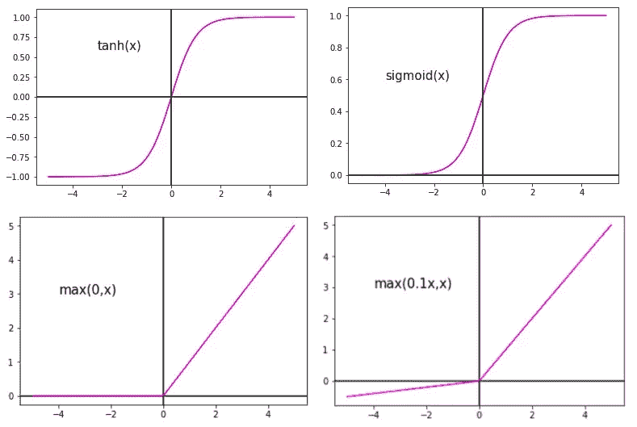
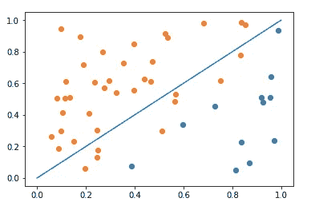
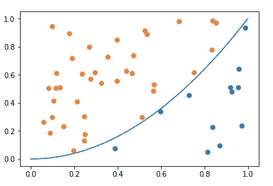
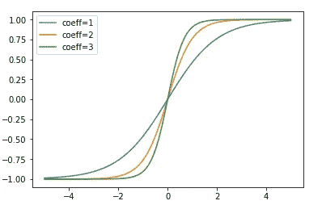
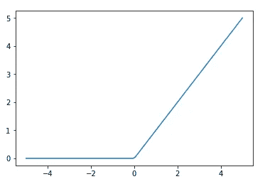
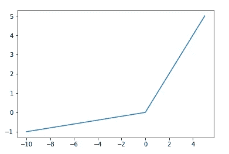

# 经典神经网络:为什么/哪些激活功能？

> 原文：<https://towardsdatascience.com/classical-neural-net-why-which-activations-functions-401159ba01c4?source=collection_archive---------32----------------------->

权利:自有形象

## 今天我将教你不同的可能的激活函数以及它们在经典神经网络中的用途。

激活函数是一族函数，其目的是在层计算之后引入非线性。

事实上，如果没有激活函数，无论进行多少增强或训练，都不会出现良好的拟合(该模型不够复杂):

不合适(权利:自有图像)

这可能是该决策的界限(该模型足够复杂):

良好的拟合(权利:自有图像)

上面解释的原因只是给出了一个经验上的见解，在我写的关于神经网络层的文章中给出了更深入的解释，其中我谈到了具有一个隐藏层的连续函数的近似。

希望你相信，让我们继续前进！

## Sigmoid 函数:

*   Sigmoid 是逼近阶跃函数的第一个直观的连续函数
*   通过高梯度值，增加系数允许更清晰的近似

Sigmoid 情节(权利:自有形象)

## 双曲正切函数:

*   Tanh 与 Sigmoid 非常相似，但当用作输出图层的激活函数时，它允许负值
*   它还在 0 附近具有更尖锐的过渡(即更高的梯度),而不必增加权重值

Tanh 情节(权利:自有形象)

## 校正线性单位函数:

*   与 Tanh 和 Sigmoid 不同，ReLU 在权重的正值方面没有消失梯度问题
*   它的简单性也受到高度赞扬

热卢情节(权利:自有形象)

## 泄漏整流线性单位函数:

*   类似于 ReLU，但是在权重值被转移到负值的情况下，我们允许一些空间来避免渐变消失
*   我们定义负值的方式可能存在差异(例如:指数线性单位，swish →非常有趣)

漏雷鲁情节(权利:自有形象)

显然，这些函数是常见的，列表并不详尽，但是您很少会看到其他函数，也很少会发现其他函数有用。

总结一下隐藏层中的激活函数:

*   由于消失梯度问题，Sigmoids 和 tanh 函数有时会被避免，但它们有助于避免权重值激增。
*   再次为了避免一些更棘手的消失梯度，漏 ReLU 有时可以用来代替 ReLU
*   通常的做法是对所有隐藏层使用 ReLU

对于输出层中的激活功能:

*   对于分类，例如，逻辑回归，您应该使用 sigmoid，这样您就有了增强逻辑回归的效果。
*   如果你知道你想要接近的函数(有一个粗略的想法), ReLU 可以用作输出层激活函数，例如当你可以保证积极性并且可以只留下你的最后一个线性组合作为你的输出时。

感谢您的阅读，敬请关注，因为更多内容即将到来:经典神经网络的解释和非常好的每日文章！此外，点击这个[链接](https://direct-link.net/91830/aitechfordummies)(指向联盟计划)真的会帮我解决问题！您只需完成一些快速任务(只需等待和激活通知)，所有这些将真正帮助我了解更多未来的硬件相关内容！