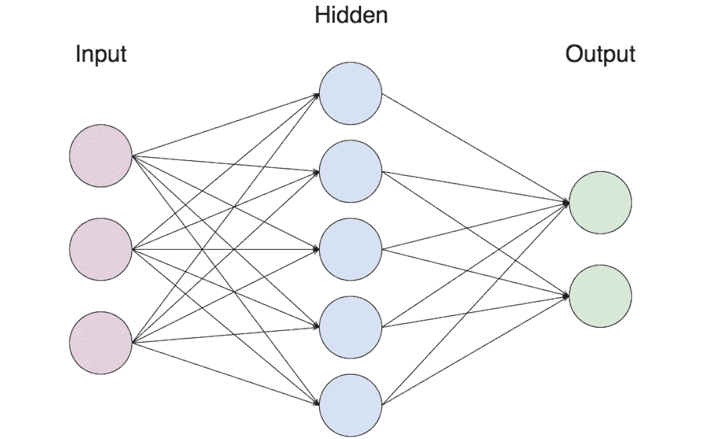
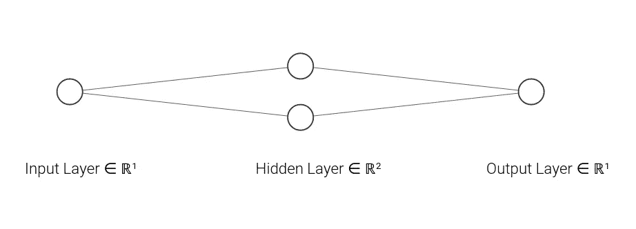
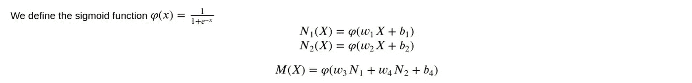
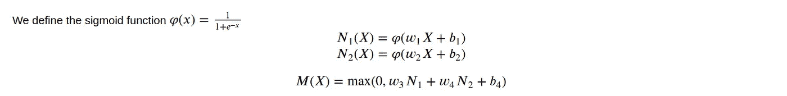
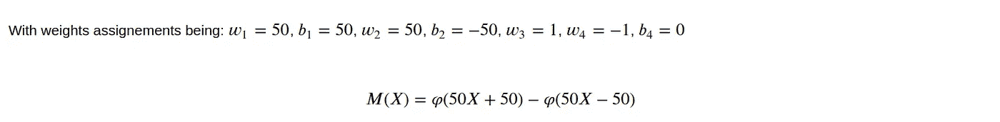
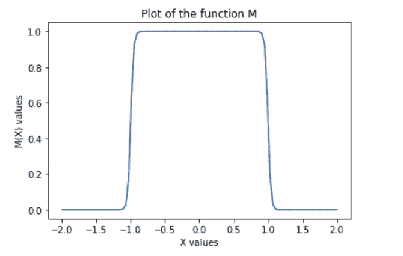

# 经典神经网络:什么是真正的节点和层？

> 原文：<https://towardsdatascience.com/classical-neural-network-what-really-are-nodes-and-layers-ec51c6122e09?source=collection_archive---------10----------------------->



权利:[来源](https://webkid.io/blog/neural-networks-in-javascript/)

## 一个节点和一个层在数学上代表什么？简单易懂的幕后概念介绍。

我们之前已经讨论过激活函数，正如承诺的那样，我们将解释它与神经网络架构中的层和节点的联系。

注意，这是对经典神经网络的解释，而不是对专门神经网络的解释。尽管如此，这些知识在研究特定的神经网络时还是有用的。

好吧，说了这么多，我们开始吧。

首先，我们将以下面非常简单的神经网络(NN)结构为例。(图 1)



图一(右图:[来源](http://alexlenail.me/NN-SVG/index.html)

*   输入层:节点 1 → X |激活:sigmoid
*   隐藏层:节点 1 →N1 和节点 2 → N2(从上到下)|激活:sigmoid
*   输出层:节点 1 → M |激活

```
#This code is the keras implementation of the above described NNdef simple_nn():
    model = Sequential()
    model.add(Dense(2, input_dim=1, activation='sigmoid'))
    model.add(Dense(1, activation='sigmoid'))
    model.compile(loss='mean_squared_error', optimizer='sgd')
    return model
```

## 这个神经网络代表哪种功能？

给定上面的符号，我们得到下面的函数(图 2):



图 2(权利:自己的形象)

这里需要注意多种情况:

*   神经网络的输出将总是属于[0，1]。正如我们在激活功能文章中提到的，输出层激活功能非常重要，它定义了你想要实现的模型类型(例如分类/回归等)
*   由于只有一个由两个节点组成的隐藏层，我们最终得到一个维数为 7 的权重向量。这使得当节点数量增加时，训练变得困难。
*   除了激活函数，操作都是线性组合。再次，激活函数引入了非线性。

## 为什么我们要使用线性组合和这些类型的激活函数？

首先，尽管深度学习(多层神经网络的研究)本身是一种研究，但它与经典的机器学习有着相同的目标:“从数据点(大部分时间)接近特定的底层模型/分布”。因此，神经网络的目标也是逼近一个分布，即一个函数，但如何实现呢？这里介入一些关于分析的基础知识，振作起来！

为了简单起见(如果你有兴趣知道更一般的解释，可以联系我)，我们将改为下面的架构。下面是它的功能(图 3):



图 3(权利:自己的形象)

我们先从一个从实数到实数的连续函数开始。让我们为自己设定一个接近这样一个函数的目标。开始的标准方法是首先画出我们的神经网络所代表的函数(图 3)。由于我们不需要任何具体的数据来解释这个想法，我们将不训练神经网络，而只是简单地任意分配权重(图 4)。



图 4(权利:自己的形象)

下面是曲线图(图 5):



图 5(权利:自己的形象)

惊喜！这是什么形状？一个长方形！！！

所以我们的神经网络实际上是在模仿一个矩形的分布(或多或少)。对于一些人来说，这似乎并不特别，但对于其他一些听说过黎曼积分和阶梯函数的人来说，他们或多或少会明白我的意思。确切地说，是像神经网络这样的阶跃函数对连续函数的近似(不完全是阶跃函数，但是求和完成了这项工作)。

还有几件事需要注意:

*   矩形边缘的锐度由 X 前面的标量定义，高值导数的位置由加到乘积上的标量定义。
*   两个节点足以构成一个矩形，因此要实现连续函数，我们只需添加节点！(在奇数个节点的情况下，我们将简单地使用矩形和阶梯函数)

尽管这很难描述，但在更高维度中，连续函数的近似值几乎是一样的(除了我们重新调整值的那一步)。

既然我们已经看到了这样的近似，我们可以对神经网络逼近分布(即使是非连续的)的能力充满信心。但这种解释仍然缺乏一些东西，我们任意地给我们的神经网络一些准确的权重，但不幸的是，我们无法在一般的数据集这样做，因为我们忽略了分布。这里介入了优化技术，如著名的 SGD(随机梯度下降)或批处理 GD(等等)。假设这些优化确实让我们得到了一个足够接近的解决方案，这将意味着我们超出了我们给出的原始权重(对于矩形)。显示上面的例子(矩形)在某种程度上给出了精确度的下限，即使提到的技术看起来是最佳的，权重的优化可能不一定收敛于该技术的最佳值，但会再次超过它。

感谢您的阅读，敬请关注后续文章。此外，点击这个[链接](https://direct-link.net/91830/aitechfordummies)(指向联盟计划)真的会帮我解决问题！您只需完成一些快速任务(只需等待和激活通知)，所有这些将真正帮助我了解更多未来的硬件相关内容！