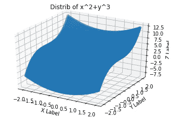

# 经典神经网络:损失函数景观看起来像什么？

> 原文：<https://towardsdatascience.com/classical-neural-networks-what-does-a-loss-function-landscape-look-like-f69518270223?source=collection_archive---------29----------------------->

(权利:[来源](http://chris35wills.github.io/courses/PythonPackages_matplotlib/matplotlib_3d/))

> 有没有想过我们在什么样的拓扑结构上优化我们的神经网络？现在你知道了！

每个神经网络的目标/损失函数都要最小化！但是这个损失函数到底是什么样子的呢？今天，我们将展示两个不同神经网络的损失函数(N1，N2:图 1)。

图 1(权利:自己的形象)

我们在训练时将损失函数的族是 MSE(均方误差)。尽管其他损失函数族可能会很有趣，但为了便于说明，我们将坚持使用这一个。

对于特别好奇的人来说，我们将训练 N2 神经网络(训练部分不是很有趣，因为我们想要的是一个风景图)这个分布(图 2:是的，我懒得添加噪声)

图 2(权利:自己的形象)

和 N1 神经网络(图 3):

图 3(权利:自己的形象)

## 作为输入函数的损失函数值(N2)

让我们先简单地画出损失函数本身(图 4)。

图 4(权利:自己的形象)

要做的说明:

*   我们看到，在[-1，1]中，x=-2 和 y 附近的误差值特别高。
*   除了看到损失函数是什么样子，拥有这样的插图对于想要有目的地攻击这样的神经网络的人来说是有用的！对于对手来说，这可能是试探性的第一步。

## 作为权重函数的损失函数值(N1)

能够将损失函数视为输入的函数固然很好，但这并不是人们感兴趣的。看到风景进行优化肯定更适合制作建筑！正如我在之前的[文章](/classical-neural-network-what-really-are-nodes-and-layers-ec51c6122e09)中提到的，N1 有 7 个权重标量需要优化。绘制一个 7 维空间对于我们的理解来说只有很小的意义，所以我们将任意地投射到 2 维空间。请注意，我们固定了输入，因此变量只有两个权重。(图 5)

图 5(权利:自己的形象)

这是一个数据点的情况。需要注意以下几点:

*   如果我们在该图上优化(最小)，任意选取两个权重，那么一个数据点的损失将明显减少。
*   现在，为了最小化这样一个函数，任何简单的梯度搜索就足够了，甚至不需要 SGD，因为它是一个严格的凸分布，但因为它有一个平台，我们需要一些动量下降而不是一般下降来获得足够大的梯度方向。

当使用 MSE 作为损失度量时，可以对多个数据点进行这样的绘图。由于权重的数量，能够描绘一般神经网络中的损失更加困难，但这可以是一种在训练时不随机尝试优化算法的方法，而是理解您想要接近的底层数据模型。我再次希望这有助于人们理解机器学习不是黑魔法，而是真正需要分析！超参数发现不一定是随机试验。

感谢阅读！敬请关注更多文章！此外，点击这个[链接](https://direct-link.net/91830/aitechfordummies)(指向联盟计划)真的会帮我解决问题！您只需完成一些快速任务(只需等待和激活通知)，所有这些将真正帮助我了解更多未来的硬件相关内容！