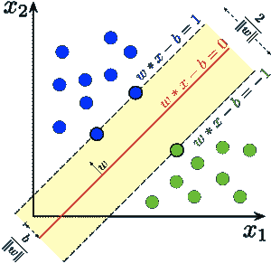

# 分类、异常检测和预测

> 原文：<https://towardsdatascience.com/classification-anomaly-detection-and-prediction-68b046d9c436?source=collection_archive---------40----------------------->

## 为了准确识别各种网络攻击，必须仔细分析底层系统的行为和生成的数据。

因此，有必要分析和研究现有的和新开发的网络安全系统，以确定其弱点，并通过整合机器学习算法提出可能的改进措施。现有的基于特征的检测和行为分析系统为攻击者和入侵者的工作提供了便利。他们可以通过隐藏的门进入系统。

基于网络入侵和检测的异常在受保护网络中起着至关重要的作用。

机器学习和数据挖掘算法可以通过代表性的学习算法对数据进行进一步分类。这使得系统能够自动识别从原始数据中识别和分类特征所需的表示。它们用于处理和分析生成的大数据、检测异常、检测威胁、对特征进行分类等等。例如，可以使用代表性的学习算法对熟悉和未知的单元进行分类。这种方法需要一个包含正常和异常样本的已标记数据集来构建用于分类未来数据点的预测模型。当涉及到检测异常时，SVM(支持向量机)算法可以在学习区域捆绑正常的数据行为。

支持向量机(维基百科)

这些方法对于实时系统是有用的，但是具有非常高的错误警报百分比，并且会破坏底层系统的性能。

还有其他使用空间和时间特征的方法，这些空间和时间特征是通过非侵入式传感器模态的正常活动来学习的，然后被输入特征。DeepFall 框架是一种使用自动编码器学习深度函数的方法。有一个基于 RNN(递归神经网络)的时间序列异常检测器，它由一系列时间序列和每个异常的一组时间和空间特征组成。这类似于使用非侵入式传感器模态从正常活动中学习空间或时间特征，然后将特征输入神经网络的另一种方法。

对于我个人的研究，我试图建立一个 LSTM(长短期记忆——一种特殊的 RNN，能够学习长期依赖关系)自动编码器，在许多信号中找到异常并进行分类。我认为分析博客异常将是这个实验的良好开端，所以我在网络服务器的帮助下做了这件事。如果信号与其过去和未来之间的偏差很大，则事件会影响其发生的概率。为此，最常用的算法是支持多种数据类型的受监控神经网络(受监控神经网络)。

视觉发现异常检测也可以通过视觉发现来实现。检测视频异常的方法基于模型的类型和检测的标准进行检查，并分为两类:基于深度学习的方法和不基于深度学习的方法。异常检测系统通过考虑各种数据类型(如视频、音频、文本、图像等)来检测计算机和工作中的问题。

另一个例子是变分自动编码器(UAE)来检测时间序列中的异常。一旦安装，模型的编码器部分可用于编码和压缩数据序列，这又可用作预测新类别预测模型(例如，时间序列的预测模型)的基础。

根据我的个人经验，在预测异常检测模型和支持人为干预以获得真实和准确结果所需的解释之间架起一座桥梁。

## **引用来源**

*   [https://deepai . org/publication/an-anomaly-contribution-explainer-for-cyber-security-applications](https://deepai.org/publication/an-anomaly-contribution-explainer-for-cyber-security-applications)
*   【https://dl.acm.org/doi/fullHtml/10.1145/3331174 
*   [http://weekend cabs . com/dbrcs/lstm-auto encoder-anomaly-detection-github . html](http://weekendcabs.com/dbrcs/lstm-autoencoder-anomaly-detection-github.html)
*   [http://fond . Crimea-inside . ru/nu hpn/opencv-anomaly-detection . html](http://fond.crimea-inside.ru/nuhpn/opencv-anomaly-detection.html)
*   [https://www . geeks forgeeks . org/异常检测机器学习/](https://www.geeksforgeeks.org/machine-learning-for-anomaly-detection/)