# 分类基础:Iris 数据集演练

> 原文：<https://towardsdatascience.com/classification-basics-walk-through-with-the-iris-data-set-d46b0331bf82?source=collection_archive---------11----------------------->

## 从 iris 数据集中学习使用引导代码进行分类的基础知识


桑迪·米勒在 [Unsplash](https://unsplash.com?utm_source=medium&utm_medium=referral) 上拍摄的照片

当我第一次学习如何编码时，我会在不同的数据集上练习我的数据技能，以创建迷你 Jupyter 笔记本参考指南。由于我发现这是一个非常有用的工具，我想我应该开始分享代码走查。希望这对那些学习使用 Python 进行数据科学的人来说是一个积极的资源，并且可以在未来的项目中参考。完整代码可在 [Github](https://github.com/jewelbritton/Iris-Data-Walkthrough) 上获得。

# 正在设置

第一步是从 scikit-learn python 库中导入预加载的数据集。更多关于“玩具”数据集的信息可以在[这里](https://scikit-learn.org/stable/datasets/index.html#toy-datasets)找到。数据描述还将提供关于特性、统计数据和来源的更多信息。

```
from sklearn.datasets import load_iris#save data information as variable
iris = load_iris()#view data description and information
print(iris.DESCR)
```

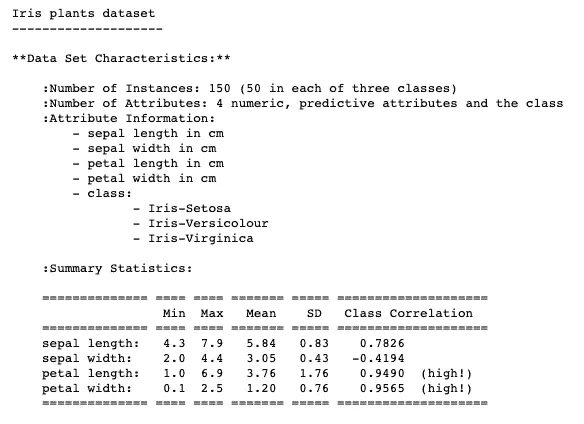

数据将预先保存为带有*键*“数据”和“目标”的字典，每个键都与一个列表数组配对，作为*值*。最初，信息将像这样输出:

```
{'data': array([[5.1, 3.5, 1.4, 0.2],
        [4.9, 3\. , 1.4, 0.2],
        [4.7, 3.2, 1.3, 0.2],
        [4.6, 3.1, 1.5, 0.2],
        [5\. , 3.6, 1.4, 0.2],
        [5.4, 3.9, 1.7, 0.4],
        [4.6, 3.4, 1.4, 0.3] ...
'target': array([0, 0, 0, 0, 0, 0, 0, 0, 0, 0, 0, 0 ...}
```

# 将数据放入数据框

## 特征数据

为了更容易地查看数据，我们可以使用 Pandas 库将这些信息放入数据框中。让我们首先创建一个数据框来存储关于花的特征的数据信息。

```
import pandas as pd#make sure to save the data frame to a variabledata = pd.DataFrame(iris.data)
data.head()
```

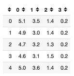

使用 data.head()将自动输出前 5 行数据，但是如果我们还可以在括号中指定我们想要的行数，data.head(10)。

现在，我们有了一个包含虹膜数据的数据框，但是没有清楚地标记列。查看我们上面打印的数据描述，或者参考源代码可以告诉我们更多关于特性的信息。在文档中，数据特征如下:

*   *以厘米为单位的萼片长度*
*   *以厘米为单位的萼片宽度*
*   *以厘米为单位的花瓣长度*
*   *花瓣宽度厘米*

让我们重命名这些列，这样功能就清晰了。

```
data.columns = ['sepal_length', 'sepal_width', 'petal_length', 'petal_width']#note: it is common practice to use underscores between words, and avoid spacesdata.head()
```

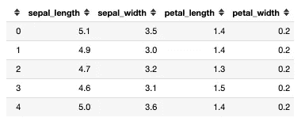

## 目标数据

既然与要素相关的数据已经整齐地放在数据框中，我们就可以对目标数据做同样的事情了。

```
#put target data into data frame
target = pd.DataFrame(iris.target)#Lets rename the column so that we know that these values refer to the target values
target = target.rename(columns = {0: 'target'})
target.head()
```

目标数据框只有一列，它给出了值 0、1 和 2 的列表。我们将使用来自特征数据的信息来预测一朵花属于组 0、1 还是 2。但是这些数字指的是什么呢？

*   0 是鸢尾
*   1 是虹膜杂色
*   2 是北美鸢尾

# 探索性数据分析

为了帮助我们更好地理解我们的数据，让我们首先合并我们刚刚创建的两个数据框。这样我们可以一起看到花的特征和分类。

```
df = pd.concat([data, target], axis = 1)#note: it is common practice to name your data frame as "df", but you can name it anything as long as you are clear and consistent#in the code above, axis = 1 tells the data frame to add the target data frame as another column of the data data frame, axis = 0 would add the values as another row on the bottomdf.head()
```

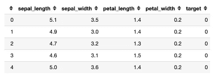

现在我们可以清楚地看到单朵花的特征和它的类别之间的关系。

## 数据清理

检查你的数据，确保它是干净的，并开始探索特征和目标变量之间的关系，这是非常重要的。因为这是一个相对简单的数据集，所以不需要做太多的清理工作，但是让我们来完成这些步骤。

1.  **看数据类型**

```
df.dtypes
```

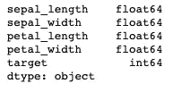

**=带小数的数字(1.678)
**int** =不带小数的整数或整数(1，2，3)
**obj** =对象、字符串或单词(' hello')
这些数据类型后的 **64** 是指该值占用多少位的存储空间。你会经常看到 32 或 64。**

**在这个数据集中，数据类型都已准备好进行建模。在某些情况下，数值将被编码为对象，因此我们必须在执行统计建模之前更改数据类型。**

**2.**检查缺失值****

```
df.isnull().sum()
```

**该数据集没有丢失任何值。虽然这使得建模容易得多，但通常情况并非如此——现实生活中的数据总是杂乱无章的。如果有缺失值，您可以删除有缺失值的数据行，或者有几个选项可以用来填充缺失的数字(使用列的平均值、前一个值……)。**

**3.**统计概述****

```
df.describe()
```

**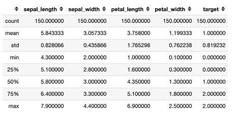**

**这使我们能够快速浏览数据。我们可以通过查看每列相对于平均值的最小值和最大值来检查异常值。花点时间浏览这个图表，开始理解数据的分布。**

# **肉眼观察**

**EDA 过程的下一步是开始可视化一些关系。**

## **相关**

**Seaborn 库有一个很好的热图可视化工具，可以用来映射特性之间的相关性。数字越大，两个元素之间的相关性越大。高的正相关表示两个元素具有正的线性关系(一个增加，另一个也增加)，低的负相关表示负的线性关系(一个增加，另一个减少)。**

```
import seaborn as sns
sns.heatmap(df.corr(), annot = True);#annot = True adds the numbers onto the squares
```

**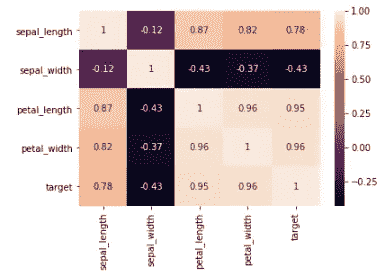**

**花瓣长度和宽度与目标最相关，这意味着随着这些数字的增加，目标值也会增加。在这种情况下，这意味着类别 2 中的花通常比类别 0 中的花具有更长的花瓣长度和宽度。萼片宽度最不相关，表明类别 0 中的花比类别 2 中的花具有最大的萼片宽度。我们还可以看到一些特征之间的相互关系，例如花瓣的宽度和长度也高度相关。这些信息不一定是分析数据的最佳方式，但它让我们开始看到这些关系。**

## **散点图**

**为了开始查看特征之间的关系，我们可以创建散点图来进一步可视化不同种类的花与萼片和花瓣数据的关系。**

```
# The indices of the features that we are plotting (class 0 & 1)
x_index = 0
y_index = 1# this formatter will label the colorbar with the correct target names
formatter = plt.FuncFormatter(lambda i, *args: iris.target_names[int(i)])plt.figure(figsize=(5, 4))
plt.scatter(iris.data[:, x_index], iris.data[:, y_index], c=iris.target)
plt.colorbar(ticks=[0, 1, 2], format=formatter)
plt.xlabel(iris.feature_names[x_index])
plt.ylabel(iris.feature_names[y_index])plt.tight_layout()
plt.show()
```

**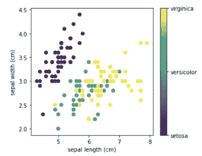**

**三类花的萼片宽度与长度的关系。Virginica 和 versica 在萼片大小上看起来相对相似，但 setosa 在左侧创建了自己的簇。**

**现在让我们创建相同的散点图来比较花瓣数据点。**

```
x_index = 2
y_index = 3# this formatter will label the colorbar with the correct target names
formatter = plt.FuncFormatter(lambda i, *args: iris.target_names[int(i)])plt.figure(figsize=(5, 4))
plt.scatter(iris.data[:, x_index], iris.data[:, y_index], c=iris.target)
plt.colorbar(ticks=[0, 1, 2], format=formatter)
plt.xlabel(iris.feature_names[x_index])
plt.ylabel(iris.feature_names[y_index])plt.tight_layout()
plt.show()
```

**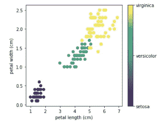**

**可视化花瓣长度和宽度之间的关系。我们可以看到，花开始单独成簇，与花瓣大小相关的元素可能是类的一个强有力的决定因素。**

# **建模**

**既然我们已经清理和探索了数据，我们就可以开始开发模型了。我们的目标是创建一个逻辑回归分类模型，根据花瓣和萼片的大小来预测花属于哪一类。**

```
#divide our data into predictors (X) and target values (y)
X = df.copy()
y = X.pop('target')
```

## **列车测试分离**

**一旦我们从目标中分离出特性，我们就可以创建一个训练和测试类。顾名思义，我们将在训练集上训练我们的模型，并在测试集上测试模型。我们将随机选择 80%的数据用于我们的培训，20%作为测试。**

```
from sklearn.model_selection import train_test_splitX_train, X_test, y_train, y_test = train_test_split(
    X, y, test_size=0.2, random_state=1, stratify = y)'''
by stratifying on y we assure that the different classes are represented proportionally to the amount in the total data (this makes sure that all of class 1 is not in the test group only)
'''
```

## **使标准化**

**随着 X 值在训练和测试之间分离，现在我们可以标准化这些值。这将数字放在一个一致的范围内，同时保持它们之间的比例关系。**

```
from sklearn.preprocessing import StandardScalerscaler = StandardScaler()
X_train = pd.DataFrame(scaler.fit_transform(X_train), columns=X_train.columns)
X_test = pd.DataFrame(scaler.transform(X_test), columns=X_test.columns)
```

## **基线预测**

**基线是模型实现前预测类的概率。如果数据被平均分成两类，就有 50%的机会将一个元素随机分配给正确的类。我们模型的目标是改进这个基线，或随机预测。此外，如果存在严重的类别不平衡(如果 90%的数据在类别 1 中)，那么我们可以改变每个类别的比例，以帮助模型更准确地预测。**

```
df.target.value_counts(normalize= True)
```

**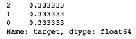**

**这个模型的基线预测是 1/3**

## **逻辑回归模型**

```
from sklearn.linear_model import LogisticRegression#create the model instance
model = LogisticRegression()#fit the model on the training data
model.fit(X_train, y_train)#the score, or accuracy of the model
model.score(X_test, y_test)
# Output = 0.9666666666666667#the test score is already very high, but we can use the cross validated score to ensure the model's strength 
from sklearn.model_selection import cross_val_scorescores = cross_val_score(model, X_train, y_train, cv=10)
print(np.mean(scores))
# Output = 0.9499999999999998
```

**在没有任何调整或优化的情况下，该模型已经表现得非常好，测试得分为 0.9667，交叉验证得分为 0.9499。这意味着该模型在大约 95%的时间里预测了花的正确类别。远高于 33%的基准线！**

# **理解预测**

**通常会对参数进行大量的微调和实验，以找到得分最高的模型。然而，由于这个数据集是简单明了的，我们现在可以继续，开始看看模型是如何做出预测的。**

## **系数**

```
df_coef = pd.DataFrame(model.coef_, columns=X_train.columns)
df_coef
```

**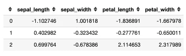**

**逻辑回归中的系数通常有点难以解释，但我们可以了解每个特征在决定一朵花是否属于该类时的影响程度。例如，花瓣长度几乎不是一朵花是否属于第一类的决定性因素，但花瓣宽度是第二类的一个强有力的预测因素。**

## **预测值**

**我们还可以将模型预测的值与实际值进行比较。**

```
predictions = model.predict(X_test)#compare predicted values with the actual scores
compare_df = pd.DataFrame({'actual': y_test, 'predicted': predictions})
compare_df = compare_df.reset_index(drop = True)
compare_df
```

**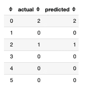**

**预测几乎完美地排列在一起，只有一次模型错误地预测一朵花属于第 1 类，而它实际上属于第 2 类。**

## **混淆矩阵**

**为了更仔细地观察模型做出的预测，我们可以使用混淆矩阵。在混淆矩阵中，预测值是列，实际值是行。它可以让我们看到模型在哪里做出了正确和错误的预测，如果它预测错误，我们可以看到它错误地预测了哪个类。**

```
from sklearn.metrics import confusion_matrix
pd.DataFrame(confusion_matrix(y_test, predictions, labels=[2, 1, 0]),index=[2, 1, 0], columns=[2, 1, 0])
```

**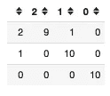**

**我们可以看到，0 类和 1 类都被正确预测了 10 次，但在一个实例中，模型错误地将 2 类标记为 1 类。**

## **分类报告**

**检查模型性能的另一个好方法是查看分类报告。它显示了精确度、召回率、f1 分数和准确度分数，下面是对这些特性的简要说明。**

*   ****精度**:在*预测的*海滨鸢尾花总数(10)中，正确预测的海滨鸢尾花数(10)。预测海滨鸢尾的精度=10/10 = 1.0**
*   ****回忆**:在*实际*的黑鸢尾数量中，正确预测的黑鸢尾数量。回忆= 9/10 = .9**
*   **F1 得分:这是精确度和召回率的调和平均值。公式为 F1 得分= 2*(精度*召回)/(精度+召回)**
*   ****准确性**:将所有类别的所有正确预测相加，然后除以预测总数。29 个正确预测/30 个总值= 0.9667 的准确度。**

```
from sklearn.metrics import classification_report
print(classification_report(y_test, predictions))
```

**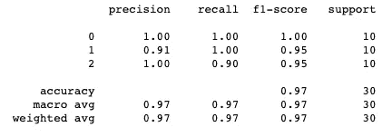**

## **预测概率**

**使用下面的代码，我们可以查看每行数据被分配到三个类之一的概率。默认情况下，模型会将该项分配给概率最高的类。如果我们想要调整准确度或精度，我们可以通过更改阈值来实现，在将预测概率分配给该类之前，该阈值必须有多高。**

**在这种情况下，错误地将一朵花分配给另一个类别不会产生后果，但用于检测癌细胞的模型会调整其模型以“假设最坏的情况”,并更经常地将其分配为真正的癌细胞。这在许多情况下使用，当过度谨慎比错误地将细胞标记为安全和健康更好时。**

```
probs = model.predict_proba(X_test)#put the probabilities into a dataframe for easier viewing
Y_pp = pd.DataFrame(model.predict_proba(X_test), 
             columns=['class_0_pp', 'class_1_pp', 'class_2_pp'])
Y_pp.head()
```

**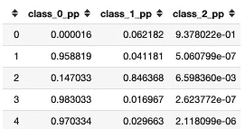**

# **结论**

**希望这个演练有助于展示数据科学项目过程中的一些主要步骤。当然，这并不是对该数据集可以采取的步骤的详尽列表，但它旨在仔细展示分类的一些重要步骤。**

**这是一个经典的数据集，因为它相对简单，但这里强调的步骤可以应用于任何类型的分类项目。请关注未来更简单(和高级)的数据集演练！**

**寻找下一步？阅读关于回归的[基础知识，一个预测汽车销售价格的数据科学项目。](/regression-basics-code-walk-through-c2eac24da2e9)**