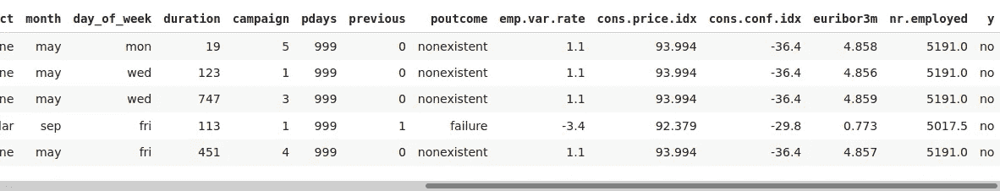
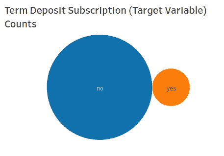
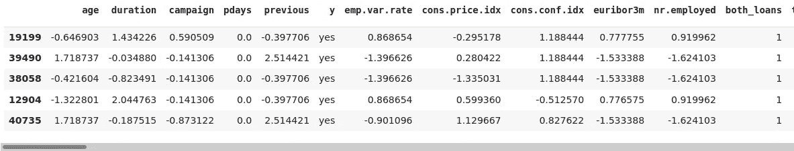
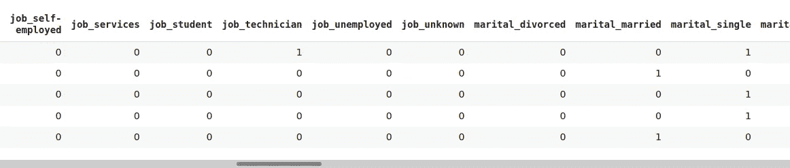
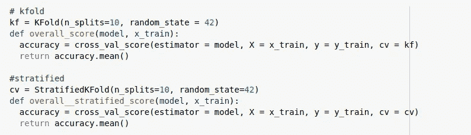
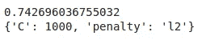
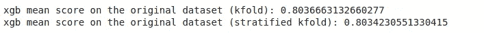
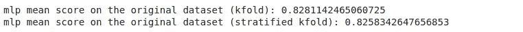

# 不平衡数据集中的分类。

> 原文：<https://towardsdatascience.com/classification-framework-for-imbalanced-data-9a7961354033?source=collection_archive---------10----------------------->

## 理解和利用不平衡数据。

# 介绍

C **分类**是机器学习中的一种监督学习，处理将数据分类成类。监督学习意味着模型将输入与其匹配的输出相结合来训练模型，该模型稍后可以在没有输出的情况下对一组新数据做出有用的预测。分类问题的一些例子包括:*邮件中的垃圾邮件检测、订阅分析、手写数字识别、生存预测*等。它们都涉及利用训练数据来理解输入变量如何与输出(目标)变量相关的分类器的使用。


米切尔·施瓦茨在 [Unsplash](https://unsplash.com?utm_source=medium&utm_medium=referral) 上的照片

**类别不平衡**指的是分类中的一个问题，类别的分布是偏斜的。这种不平衡从轻微到极端都有。

这是一个问题，因为大多数分类算法对少数类的预测精度较低，因为它们是在假设类之间存在平衡的情况下运行的。

类别不平衡的一个例子是信用卡欺诈检测。在这种情况下，类别是*欺诈*和*非欺诈*。大多数交易都是*不欺诈，*因此*欺诈*阶层是少数阶层。少数类预测的准确性低是有问题的，因为它是最重要的类。

这篇博客涵盖了处理不平衡数据集中的分类问题的步骤。包含所有代码的 Github 库可以在这里[找到。](https://github.com/ada-k/BankTermDepositPrediction)

# 资料组

使用的数据来自 UCI 机器学习知识库。该数据与葡萄牙银行机构的营销活动相关。分类的目标是预测客户是否会订阅定期存款(变量 **y** )。

有效的模式有助于提高营销活动的效率，因为可以将更多的精力放在订阅机会高的客户身上。

数据示例:



可视化目标变量(y ),以观察类别不平衡:



图片作者。

圆圈的大小代表每个类的值计数。显然存在极端的阶级不平衡。这将在预处理部分处理。

# 预处理

预处理包括以下步骤:

## *输入空值*

需要处理缺失值，因为它们可能会导致错误的预测，还可能导致任何给定模型的高偏差。

分类特征将用列*模式*估算，离散数字特征用列*中位数*估算，连续数字特征用列*平均数*估算。

## *处理异常值*

离群值是许多机器学习算法的问题，因为它们会导致重要见解的丢失或扭曲真实结果，最终导致模型不太准确。

将使用第 10 个和第 90 个百分位数对异常值进行剪裁。

## *特征生成*

从现有要素生成新要素增加了在模型训练期间可访问的新信息，因此提高了模型精度。

## *缩放数值变量*

用[标准定标器](https://scikit-learn.org/stable/modules/generated/sklearn.preprocessing.StandardScaler.html)对数字特征进行标准化，以消除不同测量单位带来的差异。

## *编码分类变量*

大多数机器学习和神经网络算法需要数字输入，因此为了利用分类特征，我们必须重新映射它们。

应用一种热编码技术。它获取一个包含分类数据的列，然后将该列拆分成多个列。条目被 0 和 1 替换，这取决于哪一列有什么值。

## 对不平衡数据集进行重采样。

重采样包括创建不平衡数据集的新版本。

重采样有两种主要方法:

*   *过采样*:随机复制少数类中的条目。适用于小型数据集。
*   *欠采样*:从多数类中随机删除条目。适用于大型数据集。

我们的数据集有 41188 行和 21 列，因此使用过采样是安全的。

预处理类:

预处理类代码。

```
# calling the class and its methodsd = DataPrep()
path = '/content/bank-additional-full.csv'
data = d.read_data(path)
data = d.treat_null(data)
data = d.outlier_correcter(data)
data = d.generate_features(data)
data = d.scaler(data)
print('After scaling:', data.shape)
data = d.encoder(data)
data = d.over_sample(data)
data.head()
```

输出:



请注意分类和数字列中的变化。

# 建模


照片由[亨特·哈里特](https://unsplash.com/@hharritt?utm_source=medium&utm_medium=referral)在 [Unsplash](https://unsplash.com?utm_source=medium&utm_medium=referral) 上拍摄

从预处理到进行预测，我们首先使用训练和验证数据来训练和评估我们的模型。但首先，我们必须分离目标和预测变量，然后将它们分成训练集、验证集和测试集。测试集不是单独提供的，因此我们从数据集中检索它。

```
# split the data to have the predictor and predicted variables
x = data.drop(['y'], axis = 1)
y = data[['y']]# Encode labels in target df.
encoder = LabelEncoder()
y = encoder.fit_transform(y)# get the sets
x_train, x_test, y_train, y_test = train_test_split(x, y, test_size = 0.10, random_state = 42)x_train, x_val, y_train, y_val = train_test_split(x_train ,y_train, test_size = 0.20, random_state = 42)
```

有待探索的算法:

*   XGBoost :

XGBoost 分类器是一种基于树的集成学习算法，是梯度推进机器的一种实现。

它针对速度和性能进行了优化。

* **多层感知器:**

多层感知器(MLP)是一类前馈人工神经网络。它至少由三层节点组成:输入层、隐藏层和输出层。

它区分不可线性分离的数据的能力是我们探索它的原因。

* **逻辑回归:**

逻辑回归是一种简单但非常有效的分类算法，它使用对数比值比来预测组成员。

它的简单性和使用对数比值比代替概率是我们探索它的原因。

## 交叉验证

*交叉验证*是一种重采样程序，用于在有限的数据样本上评估机器学习模型。

使用的技术:

*   K-fold : K-Fold CV 是将给定的数据集分成 n 个折叠，其中每个折叠在某个点用作测试集，其余的用作训练集。
*   **分层 K 折叠**:分层 K 折叠将数据打乱，然后将其分成 n 个折叠，每个折叠都用作一个测试集。分层保持数据集目标之间的平衡(每个分层折叠保持目标类的相同比率)。这种策略在不平衡数据的情况下是最好的。

在这两种技术中，默认的评分标准是 [**准确度分数**](https://scikit-learn.org/stable/modules/generated/sklearn.metrics.accuracy_score.html) (做出的正确预测数除以做出的预测总数)。

实施:



现在，我们使用这些技术在训练数据上观察我们的模型性能。

```
# using grid search to find optimal parametersregressor = LogisticRegression()
grid_values = {'penalty': ['l1','l2'], 'C': [0.001,0.01,0.1,1,10,100,1000]}model = GridSearchCV(regressor, param_grid=grid_values)
model.fit(x_train,y_train)
print(model.best_score_)
print(model.best_params_)
```



```
# using the optimal parametes printed out
regressor = LogisticRegression(C = 1000, penalty= 'l2')
regressor.fit(x_train, y_train)# using kfolds
print('Logistic Regression mean accuracy score using kfold:', overall_score(regressor, x_train))# stratified KFold
print('Logistic Regression mean accuracy score using Stratifiedkfold :', overall__stratified_score(regressor, x_train))
```

输出:

```
Logistic Regression mean accuracy score using kfold: 0.742437522099093
Logistic Regression mean accuracy score using Stratifiedkfold : 0.7420879248958712
```

对 XGBoost 和 MLP 重复相同的过程。

```
xgb = XGBClassifier(silent = True,max_depth = 6, n_estimators = 200)
xgb.fit(x_train, y_train)# using kfolds
print('xgb mean score on the original dataset (kfold):', overall_score(xgb, x_train))# stratified KFold
print('xgb mean score on the original dataset (stratified kfold):', overall__stratified_score(xgb, x_train))
```



```
mlp = MLPClassifier() # working with default parameters
mlp.fit(x_train, y_train)# using kfolds
print('mlp mean score on the original dataset (kfold):', overall_score(mlp, x_train))# stratified KFold
print('mlp mean score on the original dataset (stratified kfold):', overall__stratified_score(mlp, x_train))
```



在所有的 3 个模型中，K-fold 产生了最高的准确性，尽管它随分层的变化是如此之小。如前所述，分层最适合不平衡的数据，但我们已经在预处理过程中对数据进行了重新采样，使其不再有用。

# **进一步评估**

我们可以通过验证集探索其他准确性指标。

*   **ROC** — ROC 曲线是针对 0.0 和 1.0 之间的多个不同候选阈值的真阳性率(y 轴)与假阳性率(x 轴)的关系图。
*   [**精度和召回**](https://scikit-learn.org/stable/auto_examples/model_selection/plot_precision_recall.html) **—** 精度是正确鉴定的阳性结果的数量除以所有阳性结果的数量，包括那些没有正确鉴定的阳性结果，召回是正确鉴定的阳性结果的数量除以所有本应被鉴定为阳性的样本的数量。
*   [**F1 分数**](https://scikit-learn.org/stable/modules/generated/sklearn.metrics.f1_score.html) — F1 分数是对测试准确性的衡量。它是根据测试的精确度和召回率计算出来的。

当每类的观察值大致相等时，应使用 ROC 曲线。当存在中等到大的类别不平衡时，应该使用精确召回曲线。

由于我们对数据进行了重新采样以保持平衡，ROC 是我们的最佳选择。

ROC 图:实施:

*这些图在其他模型上实现:RandomForest、CatBoost 和 LGBM，它们可以被编辑以适合任何模型。(代码可在*[*github*](https://github.com/ada-k/BankTermDepositPrediction)*链接中共享)。*

```
from sklearn.datasets import make_classification
from sklearn.metrics import roc_curve
from sklearn.metrics import roc_auc_score#predict probabilities
ns_probs = [0 for _ in range(len(x_val))]  # no skill classifier
f_prob = forest.predict_proba(x_val)
c_prob = cat.predict_proba(x_val)
l_prob = lgbm.predict_proba(x_val)# keep probabilities for the positive outcome only
f_prob = f_prob[:, 1]
c_prob = c_prob[:, 1]
l_prob = l_prob[:, 1]# calculate scores then print them
f_auc = roc_auc_score(y_val, f_prob)
c_auc = roc_auc_score(y_val, c_prob)
l_auc = roc_auc_score(y_val, l_prob)
ns_auc = roc_auc_score(y_val, ns_probs)print('RandomForest:', f_auc)
print('CatBoost: ', c_auc)
print('LGBM:', l_auc)# calculate roc curves
f_fpr, f_tpr, _ = roc_curve(y_val, f_prob)
c_fpr, c_tpr, _ = roc_curve(y_val, c_prob)
l_fpr, l_tpr, _ = roc_curve(y_val, l_prob)
ns_fpr, ns_tpr, _ = roc_curve(y_val, ns_probs)# plot the roc curve for the model
plt.figure(figsize = (12,7))
plt.plot(f_fpr, f_tpr, marker='.', label='random forest')
plt.plot(l_fpr, l_tpr, marker='.', label='lgbm')
plt.plot(c_fpr, c_tpr, marker='.', label='catboost')
plt.plot(ns_fpr, ns_tpr, linestyle='--', label='No Skill')plt.legend()
plt.title('ROC curves for different models')
plt.xlabel('False Positive Rate')
plt.ylabel('True Positive Rate')
```

输出:


图片作者。

曲线下的面积越大，精确度越高。

无技能分类器是一种不能区分类别的分类器，它在所有情况下都会预测随机类别或恒定类别。(我们的基准)。

# 预言

使用 MLP，我们最初 3 个模型中表现最好的。

```
# mlp
pred = mlp.predict(x_test)
pred_df = pd.DataFrame(pred)
pred_df.columns = ['y']
pred_df.to_csv('pred_df.csv') # export to a csv file
```

# 结论

我们可以继续研究我们的分类问题，探索不同的技术，比如降维，仅仅是为了获得一个性能更好的模型。但是现在，我们知道拥有不平衡的数据并不妨碍我们进行预测，它只是召唤我们使用适当的技术来避免对少数类的糟糕预测。

附言:向我在 10academy.org 的所有同学和导师表示敬意，感谢他们无尽的支持。

# 参考

1.  [如何在 Python 中使用 ROC 曲线和精确召回曲线进行分类](https://machinelearningmastery.com/roc-curves-and-precision-recall-curves-for-classification-in-python/)。

2.[了解 AUC — ROC 曲线。](/understanding-auc-roc-curve-68b2303cc9c5)

3.XGBoost 算法:愿她统治长久！

4.[处理不平衡数据。](/methods-for-dealing-with-imbalanced-data-5b761be45a18)

5. [XGBoost 文档。](https://xgboost.readthedocs.io/en/latest/)

6.[不平衡数据:如何处理不平衡分类问题。](https://www.analyticsvidhya.com/blog/2017/03/imbalanced-data-classification/)

7.[为什么不平衡分类很难？](https://machinelearningmastery.com/imbalanced-classification-is-hard/)