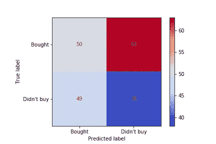

# 人们应该知道的分类度量数据

> 原文：<https://towardsdatascience.com/classification-metrics-everyone-should-know-b67fd0044c0c?source=collection_archive---------46----------------------->

## 了解数据科学成功的基础！

学习分类标准可能是一个模糊的混乱。☁️:有很多衡量标准。很多听起来很像。有时同一个东西有两个名字。有时有五个。🤦‍♀️🤦‍♂️

这一系列文章旨在拨开迷雾。🌤这是一个帮助您理解、使用和记住七个最常见的分类标准的指南。

今天我们将探索每个人都需要的基础。数据科学家和统计学家必须先打好基础，然后才能进入更高级的指标。😀

我们开始吧！🚀


雾蒙蒙的。资料来源:pixabay.com

在二元分类问题中有两种可能的结果:真或假，1 或 0，买或不买，感染或不感染，等等。在本文中，我们将重点关注二进制分类，因为它很常见，而且这种东西与两个结果类就足够混淆了。😉

我们要查看的指标在 scikit-learn Python 包中。每个函数都是从 [*sklearn* 中导入的。*指标*模块](https://scikit-learn.org/stable/modules/classes.html)模块。

我们将使用一些假设的分类任务来说明这些指标是如何工作的。让我们从预测网站访问者是否会在 Jeff 的牛逼夏威夷衬衫店购买衬衫开始吧！🏝+🌺+👕+💵

# 混淆矩阵

混淆矩阵是构建指标的基础。它显示了你的模型的预测有多少是正确的，有多少是不正确的，由实际的积极和消极的结果组织。

矩阵的一个轴是现实生活中的结果——正面和负面的情况。在我们的例子中，如果访问者购买了一件衬衫，这是一个实际的积极因素。😀如果游客不买衬衫，这是一个实际的负面影响。☹️

```
 **Predicted Label**        
                Predicted Positive    Predicted Negative
  **True Label       ** Actual Positive     
Actual Negative 
```

另一个轴是你的模型的预测。如果你的模型预测到访问者会买一件衬衫，那就是一个积极的预测。如果你的模型预测访客不会买衬衫，那就是负面预测。

结合预测和实际结果，你会得到四个象限:

真阳性
真阴性
假阳性
假阴性

或简称 *TP、TN、FP、*和 *FN* 。😁

```
 Predicted Positive    Predicted Negative
Actual Positive            **TP**               **FN**
Actual Negative            **FP**               **TN**
```

让我们将这四组分解开来:

*真*指模型预测正确的情况。*假*指模型预测错误的情况。你希望你的模型预测准确，所以你希望更多的*真*和更少的*假*。👍

如果这个群体在名字*、*中有*阳性*，那么这些人就是模型预测会购买的人。如果该组的名称中有*负数*，则这些是模型预测不会购买的人。

理解这四个群体是关键。在继续之前，确保你能用自己的话解释这四个象限。☝️

请注意，其他混淆矩阵图可能会以不同的顺序显示行和列。可惜没有标准顺序。☹️

下面是从混淆矩阵创建四个结果变量的 Python 代码(导入了 *numpy* 库，从 *sklearn.metrics 导入了*混淆矩阵*):*

```
tn, fp, fn, tp = confusion_matrix(y_test, predictions).ravel()
```

这段代码将基础事实( *y_test* )和预测传递给*混淆 _ 矩阵*函数，用*拉平结果。ravel()* ，*，*然后把结果解包成四个变量。

您可以使用 scikit-learn 的新[*plot _ confusion _ matrix*](https://scikit-learn.org/stable/modules/generated/sklearn.metrics.plot_confusion_matrix.html)函数绘制更漂亮的混淆矩阵图。向凯文·马卡姆致敬。🧢

这里有一个混淆矩阵的例子:



下面是我用来制作这个混淆矩阵的代码(带有作为 *plt* 导入的 *matplotlib.pyplot* 和从 *sklearn.metrics* 导入的 *plot_confusion_matrix* ):

```
plot_confusion_matrix(
    clf, 
    X_test, 
    y_test, 
    values_format=’d’, 
    display_labels=[‘Bought’,’Didn\’t buy’], 
    cmap=plt.cm.coolwarm
);
```

请注意，您必须首先通过评估程序。我添加了一些额外的参数来显示标签，使情节更漂亮。如果您想更改输出值，使它们不是科学记数法格式，那么`values_format`参数可以解决您的问题。🎉

现在让我们看看如何使用混淆矩阵中的这四个数字来制作我们最常用的分类度量。


少雾。资料来源:pixabay.com

# 准确(性)

术语*准确性*在一般对话中通常用来表示“良好的性能”，但是在分类度量领域中它有一个特定的定义。准确度分数回答了以下问题:

你猜对了几次？

精确度的公式为:

*准确度=* (真阳性+真阴性)/所有观测值

或者，简称:

*精度* = (TP + TN) /全部

以下是我们的模型预测游客是否会在杰夫的夏威夷衬衫店购物的假设结果。🌺👕

## 困惑矩阵#1:

```
 Predicted Positive    Predicted Negative
Actual Positive          80  (TP)            20 (FN)
Actual Negative          50  (FP)            50 (TN)
```

该模型预测了 130 次购买和 70 次不购买。实际上有 100 次购买和 100 次不购买。

我们来计算一下准确率得分。将*真阳性*和*真阴性*相加，并除以观察总数。

(80 + 50 ) / 200

看起来模型正确预测了 200 个案例中的 130 个，准确率为 65%。听起来不可怕。😀

但是我们并不真正知道我们的模型做得有多好，直到我们把它与另一个模型的预测进行比较。最基本的替代模型是一个简单的决策规则，它预测购买的概率为 50%。我们的模型比 50%的基线做得更好，这很了不起。😉

请注意，当模型正确预测所有事情时，可能的最佳准确度分数是 1 (100%)。当模型没有正确预测时，最差的分数可能是 0。

现在让我们看看当结果类不平衡时会发生什么。

## 不平衡数据

假设你在一家银行工作🏦并且想要检测信用卡交易中的欺诈。你要预测 1000 笔交易。你建立了一个机器学习模型来预测哪些是欺诈性的，这是产生的混淆矩阵:

## 困惑矩阵#2:

```
 Predicted Fraud   Predicted Not-fraud
Actual Fraud               1                      8
Actual Not-fraud           2                    989
```

我们的四个混淆矩阵值如下所示:

TP=1
TN=989
FP=2
FN=8

该模型预测有 3 个案例是欺诈性的，而实际上有 9 个案例是欺诈性的。

准确率为(1+989)/1000 = 99%。听起来很神奇，对吧？🏆

但是等等。沉住气。少了什么？🤔

该模型将 9 个实际欺诈案例中的 8 个分类错误！我们想找的 9 样东西，我们漏掉了 8 样！那可不行。☹️

99%的准确率分数并没有反映出模型在工作中做得有多好。事实上，如果很多人只看到正确的分数，就会误导他们。许多人不知道去问这些课程是否平衡。这是人们有意或无意误导统计数据的方式之一。☝️

一些好消息是，在 scikit-learn 中不需要手工计算精度。准确性是默认的分类评分标准。此外，您可以使用函数[*accuracy _ score*](https://scikit-learn.org/stable/modules/generated/sklearn.metrics.recall_score.html)*来查找任何一组预测值和实际值的精确度。🎉*

## *结果*

*准确度同等地加权混淆矩阵的所有象限。当两种结果类别的数量相对相等时，这是一个很好的汇总统计。当您更关心避免误报或漏报时，您会希望使用我们将在下一篇文章中探讨的其他度量之一。*

*你肯定想知道术语*的准确性*及其被不平衡数据误导的风险。😀*

# *概述*

*您已经了解了混淆矩阵和准确性，这是数据科学家需要了解的最基本的分类术语。在下一篇文章[中，我们将探索你肯定想知道的三个基本指标，但这可能很难保持直线。](/the-3-most-important-basic-classification-metrics-3368dd425f74)*

*我希望这篇关于分类标准基础部分的介绍对您有所帮助！如果你有，请在你最喜欢的社交媒体上分享，这样其他人也可以找到它。😀*

*我写了关于 Python、T2、SQL、T4、Docker 和其他技术主题的文章。如果你对此感兴趣，请关注我，在这里阅读更多。👍*

*[](https://dataawesome.com)***

*不再有雾。资料来源:pixabay.com*

*分类快乐！📊*