# 解释了分类指标和阈值

> 原文：<https://towardsdatascience.com/classification-metrics-thresholds-explained-caff18ad2747?source=collection_archive---------8----------------------->

## 揭开常用分类指标的神秘面纱


马库斯·温克勒在 [Unsplash](https://unsplash.com?utm_source=medium&utm_medium=referral) 上的照片

# 分类评估

我们用来评估分类器的度量取决于我们想要解决的问题的性质和预测误差的潜在后果。让我们检查一个非常常见的癌症诊断例子(即分类为患癌或未患癌)。我们希望我们的模型能够预测尽可能多的实际/真实癌症诊断，但我们也知道，从统计学角度来看，正确识别所有真实的癌症诊断是不可能的。我们的模型最终会在某人实际上没有患癌症时将其分类/预测为患有癌症(假阳性)，并在某人实际上患有癌症时预测其没有患癌症(假阴性)。我们必须问自己的问题是“什么更糟？预测某人会得癌症，而实际上他们不会，还是预测某人不会得癌症？”。这个例子中的答案是显而易见的，因为告诉某人他们没有癌症的后果远远超过前者。让我们记住这个例子，但是让我们回顾一下常用的分类性能指标。

## 分类性能指标

## 混淆矩阵

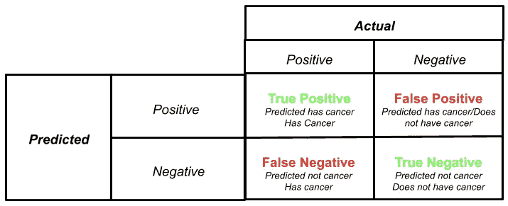

混淆矩阵总结了模型的预测。它给出了正确预测的数量(真阳性和真阴性)和不正确预测的数量(假阳性和假阴性)。在我们的癌症例子中，如果我们的模型预测某人患有癌症，并且这个人患有癌症，这是一个真正的肯定。当我们的模型预测某人没有患癌症，而那个人没有患癌症，这是一个真正的否定。当我们的模型预测某人患有癌症，但那个人没有患癌症时，这是假阳性(即该模型错误地预测了阳性癌症诊断)。最后，当我们的模型预测某人没有患癌症，但他们确实患了，那就是假阴性(即该模型错误地预测了阴性癌症诊断)。

其余的许多性能指标都是从混淆矩阵中得出的，因此，您必须很好地理解。

## 准确(性)

简而言之，准确性详细说明了我们的模型正确的频率。换句话说，就是正确预测数(TP，TF)除以预测总数。准确性通常是第一个衡量标准，但如果不仔细考虑，它可能会非常误导人。例如，让我们考虑一个用于训练我们的模型的不平衡数据集。我们有 1000 个非癌症诊断和 10 个癌症诊断。模型能够正确预测 900 个非癌症诊断，1 个癌症诊断的准确率为 0.89% ((900+1)/1010=0.89)。

***(TP+TN)/(TP+FP+FN+TN)***

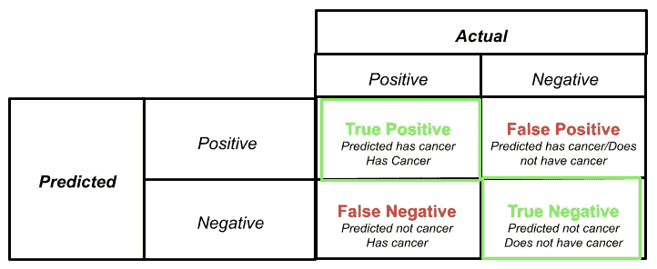

## 精确度(也称为特异性)

精度告诉我们预测的正类中有多少是正确的。换句话说，预测的癌症诊断中有百分之多少实际患有癌症。Precision 只关心我们的模型准确地预测了正类。我喜欢把精确度看作是衡量一个模型正确预测阳性癌症诊断的“挑剔”程度或“确定”程度的标准。一个不同的例子可能与僵尸启示录有关。即使允许一个被感染的僵尸进入你的营地，也会导致每个人都被感染。一个具有高精度的模型将确保你让进入你的营地的那些人是健康的。然而，该模型也会有很高的假阴性计数(即被认为感染的健康人)。高精度与低 FP 速率相关。当假阳性的后果很严重时首选。

***TP/(TP+FP)***

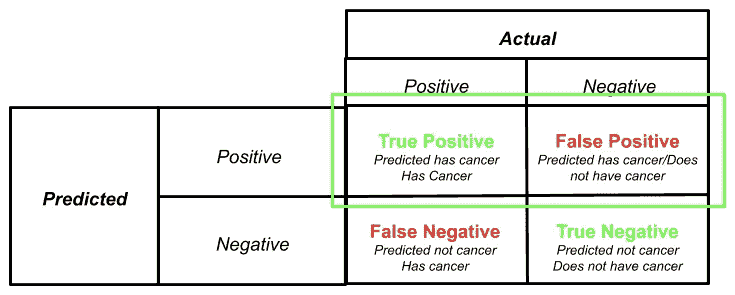

## 回忆(也称为敏感度)

召回率是我们的模型预测的实际阳性的百分比。我们的模型预测(由医生)诊断患有癌症的人有多少百分比患有癌症。回忆不太关心准确预测阳性病例，而是确保我们已经捕获了所有的阳性病例，因为当某人患有癌症时，将其归类为非癌症的后果要严重得多。我们希望我们的模型具有高召回率，以将尽可能多的实际癌症诊断分类为患有癌症。不幸的是，这意味着该模型还会将大量没有患癌症的个体归类为患有癌症(即假阳性)。高召回率与低 FN 率相关。当假阴性的后果很严重时首选。

***TP/(TP+FN)***

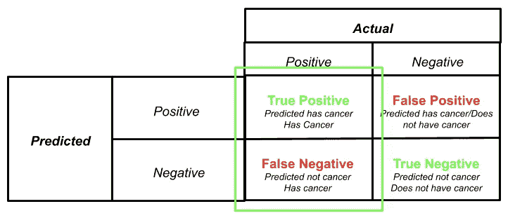

## F1 分数

从数学上讲，同时拥有高精确度和高召回率是不可能的，这就是 F1 分数派上用场的地方。F1 分数是精确度和召回率的调和平均值。如果你想建立一个平衡精确度和召回率的模型，F1-score 是一个很好的选择。当数据集不平衡时，F1-score 也是一个不错的选择。一个好的 F1 分数意味着你有低 FP 和低 FN。

***2*(召回*精度)/(召回+精度)***

## ROC 曲线/AUC 得分

接收器工作特性曲线(ROC)绘制了在任何概率阈值下的真阳性率与假阳性率。阈值是将观察结果分类为 0(无癌症)或 1(有癌症)的指定临界值。

那是一口……..

这将帮助我们更好地理解什么是阈值，我们如何通过改变阈值来调整模型的预测，以及如何创建 ROC 曲线。这个例子还将引入你在上面学到的 TP、TN、FN 和 FP 的概念。

我保证，这一切都是有意义的

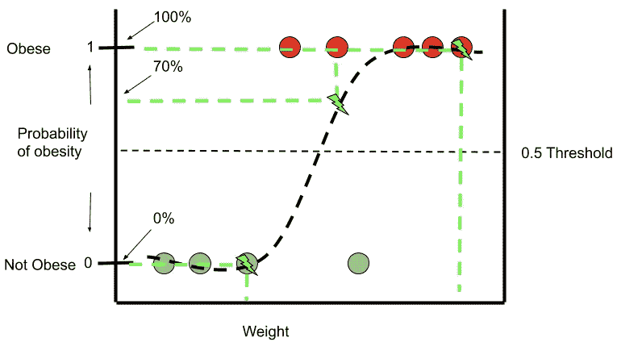

逻辑回归是一个二元分类器，在上面的例子中，我们试图只根据一个特征/预测因子体重来正确预测肥胖。我们有一个包含 9 个观察值的数据集，其中 4 个(绿色)观察值不肥胖，5 个(红色)观察值肥胖。基于对数回归产生的 sigmoid 函数(曲线),前 3 个绿色非肥胖观察值基于其体重被预测为肥胖的几率为 0%。最后 3 个红色肥胖观察值也有 100%的概率被预测为肥胖。第二个红色肥胖观察有大约 70%的机会被预测为肥胖。

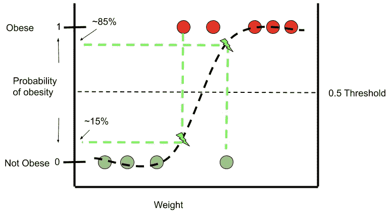

然而，第四个绿色的非肥胖观察有大约 85%的机会根据其体重(必须非常肌肉)被预测为肥胖，但我们知道这是错误的预测。此外，第一次肥胖观察有大约 15%的机会肥胖，这再次是错误的预测。记住阈值是 0.5，因此，任何处于 51%肥胖概率的数据点将被分类为肥胖，任何低于 50%的数据点将被分类为非肥胖。

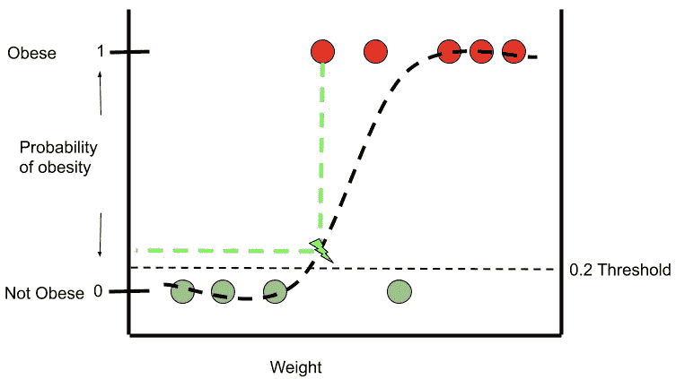

让我们假设，当某人实际上肥胖时，错误地预测他不肥胖的后果是很严重的。换句话说，我们希望调整模型，以捕捉或预测尽可能多的实际肥胖个体(即高召回)。为了完成这项任务，我们需要改变我们的门槛。随着阈值降低到 0.2，我们的模型将正确地将所有 5 个肥胖观察预测为肥胖。任何高于 0.2 阈值的数据点将被归类为肥胖，反之亦然。

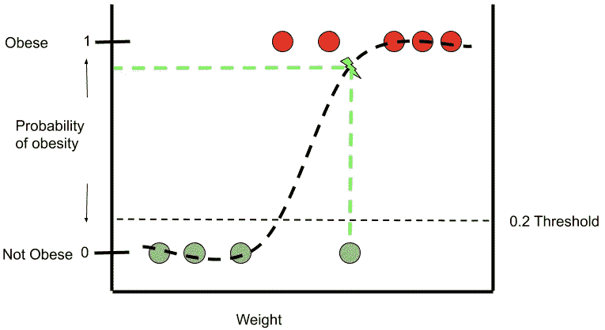

然而，通过将阈值降低到 0.2，第四次非肥胖观察现在被预测为肥胖。这是我们在调整模型的阈值时所做的权衡。

让我们再一次考虑我们的癌症例子。我们可以接受阈值为 0.2 的模型，因为它可以正确预测所有实际的癌症诊断(即真阳性)并且具有非常高的召回率。然而，该模型将做出权衡，因为它最终将更多实际上没有患癌症的个体预测为患有癌症(即假阳性)。假阳性的后果没有错误地预测某人没有患癌症那么严重。

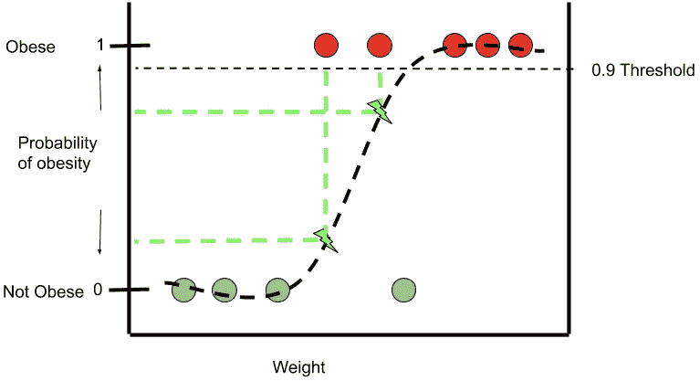

现在，阈值为 0.9 的模型会做与阈值为 0.2 相反的事情。它将确保预测所有 4 个非肥胖个体为非肥胖，然而，前两个肥胖个体最终将被预测为非肥胖。既然我们理解了阈值及其目的，让我们回到 ROC 曲线。

> 那么 ROC 曲线在哪里起作用呢？

这是一个简单的例子，只有 9 个数据点，阈值很容易看到和解释。如果你有一百万个观察值和一个比我们的肥胖或癌症例子更复杂的情况呢？在这种情况下，最佳阈值是多少？我们是不是要做一堆这样的图，才能找到最符合我们需求的阈值？".答案是否定的。ROC 曲线是快速总结这些数据的好方法，这样你就可以选择你的阈值。

这是一个 ROC 曲线的例子(绿线)，注意 y 轴上的真实阳性率(实际肥胖和预测为肥胖)和 x 轴上的假阳性率(非肥胖但预测为肥胖)。最后，请记住 ROC 用于总结不同阈值下的 TP 比率和 FP 比率。曲线不会显示阈值，但会显示不同真阳性率下的假阳性率。

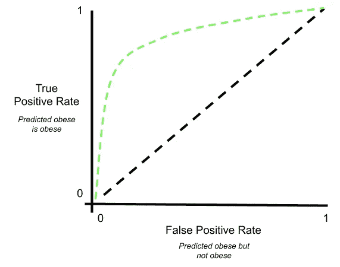

## 真实阳性率


**真阳性率=TP/(TP+FN)**

## 假阳性率

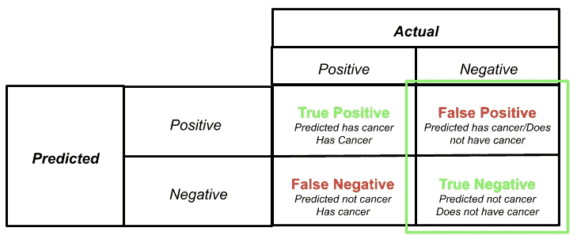

**假阳性率=FP/(FP+TN)**

让我们快速比较 ROC 曲线上的 3 个独立阈值。0.9 的阈值具有下面的混淆矩阵，从中我们可以计算出 0.6 的 TP 速率和 0 的 FP 速率。

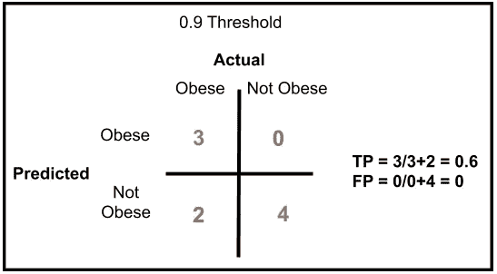

让我们在 ROC 曲线上绘制 TP 比率和 FP 比率点。为了演示，我们还绘制了阈值为 0.6 和 0.2 时的 TP 和 FP 速率。

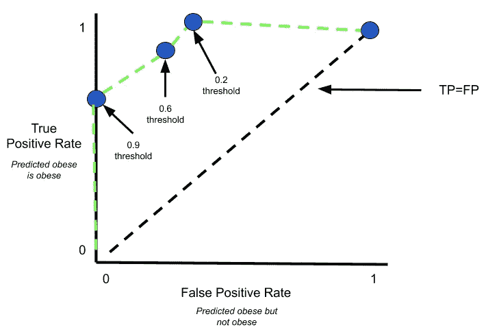

绿色虚线代表 ROC 曲线。单独的蓝点是 4 个单独的混淆矩阵的结果，其中阈值被调整。现在问问你自己，“如果这是一个癌症的例子，你想确保你捕捉/预测所有实际的癌症诊断，你会选择哪个阈值？”

如果你说 0.2 你就对了！在这个阈值，你的 TP 率是 100%，这意味着你捕捉/预测了所有实际的癌症诊断。你的 FP 率约为 0.33，这意味着你的模型将一些非癌症诊断错误分类为癌症，但这没关系。恐吓某人，让他们花钱去做检查，比告诉他们没有癌症的人后果要轻。

现在，ROC 简单地连接每个点，以帮助可视化阈值从非常保守到更加宽松。最后，ROC 曲线有助于显示 AUC。

> 那么曲线下面积(AUC)是多少呢？

你经常会看到一个 ROC 图，有许多 ROC 曲线，每条曲线是一个不同的分类器(即。对数回归、SVC、决策树等。).AUC 是一个非常简单的指标，它提供了一个从 0 到 1 的十进制数，数字越大，分类器越好。AUC 衡量所有可能阈值的模型预测质量。一般来说，AUC 代表正确分类真阳性和真阴性数据点的概率。

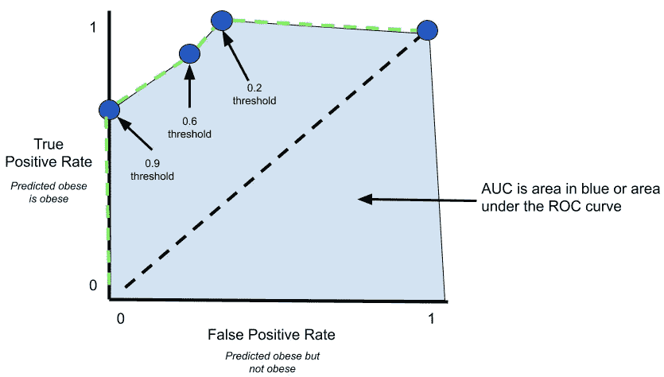

## 怎么才能调整门槛？

```
# Adjusting the threshold down from 0.5 to 0.25
# Any data point with a probability  of 0.25 or higher will be 
#  classified as 1\. clf = LogisticRegression()
clf.fit(X_train, y_train)
THRESHOLD = 0.25
y_pred = np.where(clf.predict_proba(X_test)[:,1] >= THRESHOLD, 1, 0)
y_pred_proba_new_threshold = (clf.predict_proba(X_test)[:,1] >= THRESHOLD).astype(int)
```

逻辑回归没有调整阈值的内置方法。也就是说，因为我们知道默认情况下阈值设置为 0.50，所以我们可以使用上面的代码来说明任何高于 0.25 的值都将被归类为 1。

# 结论

我希望我能够帮助澄清一些关于分类标准的困惑。我发现保持所有的条款(即。召回、精准、TP、TN 等。)当你用一个特定的例子来记忆它们时，你的头脑会更清楚。癌症诊断)。

请随时提供您的反馈，并感谢您的阅读。