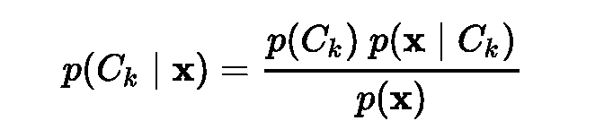
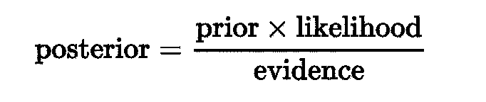
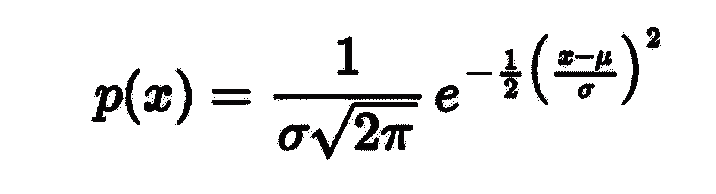
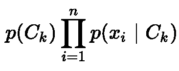

# 从零开始的分类模型

> 原文：<https://towardsdatascience.com/classification-model-from-scratch-49f24bdd0636?source=collection_archive---------37----------------------->

## 使用 Python 从头构建朴素贝叶斯分类模型(简单分类模型)的初学者指南。

## [Github 库](https://github.com/amindazad/Naive_Bayes_Classifier)

[卡梅隆·福克斯里《旧电脑的基本编程》](https://dribbble.com/shots/2194312-Hello-World)

在机器学习中，我们可以使用概率来进行预测。也许最广泛使用的例子是所谓的朴素贝叶斯算法。它不仅简单易懂，而且在一系列问题上取得了令人惊讶的好结果。

朴素贝叶斯算法是一种基于贝叶斯定理的分类技术。它假设一个类中的一个特性与任何其他特性的存在无关。如以下公式所示，该算法依赖于给定预测值的类的后验概率:

其中:

*   **P(c|x)** 是给定一个预测值的类的概率
*   P(x|c) 是给定 la 类的预测值的概率。也称为可能性
*   P(c) 是类的先验概率
*   **P(x)** 是预测值的先验概率。

或者用简单的英语来说，朴素贝叶斯分类器等式可以写成:

好消息是朴素贝叶斯分类器易于实现并且表现良好，即使训练数据集很小。在预测数据类别时，这是最好的快速解决方案之一。 [Scikit-learn](https://scikit-learn.org/stable/modules/naive_bayes.html) 为各种类型的问题提供不同的算法。其中之一就是**高斯朴素贝叶斯**。当要素为连续变量时使用，并假设要素遵循高斯分布。让我们深入挖掘，使用 Python 从头开始构建我们自己的朴素贝叶斯分类器。

# 1.加载所需的库

构建自己的朴素贝叶斯分类器唯一需要的库是 [NumPy](https://numpy.org/) 。NumPy 是一个开源项目，旨在用 Python 实现数值计算，我们将使用它进行算术运算。

# 2.实例化该类

下一步是实例化我们的朴素贝叶斯分类器类。一个类就像一个对象构造器，或者一个创建对象的“蓝图”。在面向对象的编程语言中，几乎所有东西都是对象，包括它的属性和方法。

“__init__”是 python 类中的保留方法。在面向对象的概念中，它被称为构造函数。当从类创建对象时调用此方法，它允许类初始化类的属性。

# 3.分开上课

根据贝叶斯定理，在试图预测某一特定类别之前，我们需要知道该类别的先验概率。为了计算这一点，我们必须将特征值分配给特定的类。我们可以通过分离类并将它们保存到字典中来做到这一点。

字典是 Python 对一种数据结构的实现，这种数据结构通常被称为关联数组。字典由一组键值对组成。每个键-值对都将键映射到其关联的值。

# 4.功能摘要(统计信息)

给定类别的可能性或预测值的概率假定为正态分布([高斯](https://en.wikipedia.org/wiki/Gaussian_function))，并基于平均值和标准差*(见公式)*进行计算。我们将为数据集中的每个特征创建一个摘要，这样做可以使我们在将来更容易地访问特征的均值和标准差。

*   这里的`zip()`函数是元组的迭代器，其中每个特性的值被配对在一起。在 Python 中，元组是不可变的复合数据类型。
*   我们选择`yield`,因为我们想要生成一个值序列，稍后我们将对其进行迭代，而不需要显式地将该序列保存在内存中。

# 5.高斯分布函数

使用高斯分布函数计算遵循正态分布的要素的可能性:

为了使用该公式进行进一步的计算，我们定义了一个分配方法，并完全按照上面的公式嵌入了该公式。

# 6.训练模型

训练模型意味着将模型应用于数据集，以便它可以遍历数据集并学习数据集的模式。在朴素贝叶斯分类器中，训练包括计算每个类的每个特征的平均值和标准差。这将允许我们计算用于预测的可能性。

如果我们仔细看看上面的代码片段，我们可以看到我们已经在训练数据集中分离了类。然后，计算每类的均值和标准差，然后使用`len(feature_values)/len(X)`计算该类的先验概率。

# 7.预测

为了预测一个类，我们必须首先计算每个类的后验概率。具有最高后验概率的类别将是预测的类别。

后验概率是联合概率除以边际概率。边际概率或分母是所有类的总联合概率，并且在所有类中都是相同的。我们需要具有最高后验概率的类，这意味着它将是最大的联合概率。

## **联合概率**

联合概率是用于计算后验概率的分数的分子。对于多个特征，联合概率公式为:

使用 Python 应用相同的公式会产生以下代码片段:

仔细看看上面的片段，我们对每个类都遵循了以下步骤:

*   获得摘要(平均值、标准偏差和先验概率)
*   计算每个特征的正态概率
*   获得总可能性(所有正态概率的乘积)
*   将先验概率乘以总似然得到联合概率。

## **预测班级**

有了每个类的联合概率后，我们可以选择联合概率值最大的类:

`max(joint_proba, key=joint_proba.get)`

## **将所有这些放在一起**

如果我们将联合概率步骤和预测类步骤放在一起，我们可以用下面的代码片段预测测试数据集中每一行的类。

# 8.准确度分数

计算准确度分数是测试任何机器学习模型的基本部分。为了测试我们的朴素贝叶斯分类器的性能，我们将正确预测的数量除以预测的总数，得到一个从 0 到 1 的数。

# 我们的 naive Bayes classifier vs . sk learn gaussianb

现在我们已经建立了分类模型，让我们使用 [UCI 葡萄酒数据集](https://archive.ics.uci.edu/ml/datasets/Wine)来比较我们的模型与 scikit-learn 的 GaussianNB 模型的性能。

## 朴素贝叶斯分类器

naive Bayes 分类器精度: **0.972**

## Sklearn 高斯 NB(朴素贝叶斯)

sci kit-学习高斯精度: **0.972**

如您所见，模型的准确性是相同的，这意味着我们从头开始实现了一个成功的高斯朴素贝叶斯模型。

请随意使用这里的 [github 资源库](https://github.com/amindazad/Naive_Bayes_Classifier)来查找整个 python 文件和用于创建本文的笔记本。

# 参考

[朴素贝叶斯分类器如何在机器学习中工作](https://dataaspirant.com/2017/02/06/naive-bayes-classifier-machine-learning/)

[UCI 葡萄酒数据集](https://archive.ics.uci.edu/ml/datasets/Wine)

[Scikit-学习朴素贝叶斯](https://scikit-learn.org/stable/modules/naive_bayes.html)