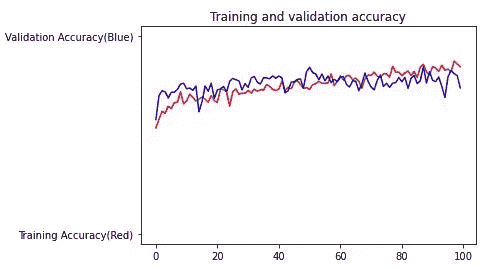

# 脑 MRI 的肿瘤/非肿瘤分类

> 原文：<https://towardsdatascience.com/classification-of-brain-mri-as-tumor-non-tumor-d48838ccc162?source=collection_archive---------24----------------------->

## 学习训练和应用一个简单的 CNN 来区分有肿瘤的 MRI 和没有肿瘤的 MRI。

大家好！作为一名生物医学本科生，如果我没有向大家展示一个 ***AI 在医学*** 中的应用，这难道不是我的错吗？在这个故事中，我将介绍 d ***eep learning*** 在医学领域的实际应用，以及它如何在很大程度上帮助医生和放射科医生。

## 概观

我将在这个实验中使用的数据集来自 Kaggle 链接[https://www . ka ggle . com/navoneel/brain-MRI-images-for-brain-tumor-detection](https://www.kaggle.com/navoneel/brain-mri-images-for-brain-tumor-detection)

首先，让我描述一下我们将在这里解决的问题。在这种情况下，我们希望将在轴面上获得的患者大脑的 **MRI 扫描**分类为是否存在肿瘤。我正在分享一个有肿瘤和没有肿瘤的核磁共振扫描的样本图像。


有肿瘤的核磁共振


没有肿瘤的磁共振成像

我们看到在第一张图片中，在大脑的左侧，有一个肿瘤形成，而在第二张图片中，没有这样的形成。因此，我们可以看到这两幅图像之间有明显的区别。现在，我们将如何使用人工智能或深度学习来将图像分类为肿瘤或不是肿瘤？

答案是**卷积神经网络** ( **CNN** )。CNN 或 ***ConvNet*** 是深度学习的一类，多应用于分析视觉图像。python 中有很多框架可以应用 CNN 如 *TensorFlow* 、 *PyTorch* 来训练模型。我将使用带有 TensorFlow 后端的 Keras 库来训练这个模型。好吧！技术术语说够了，让我们回到解决问题上来。

## 步骤 1:数据可视化

第一步，我们将分析 MRI 数据。在这个问题中，我们一共有 *253 张*核磁共振图像。其中， *155* 标注为“ ***是”*** ，表示有肿瘤，其余 *98* 标注为“ ***否*** ”，表示没有肿瘤。

```
print("The number of MRI Images labelled 'yes':",len(os.listdir('yes')))print("The number of MRI Images labelled 'no':",len(os.listdir('no')))The number of MRI Images labelled 'yes': 155The number of MRI Images labelled 'no': 98
```

现在，在一个 CNN 中，我们要训练一个 ***神经网络*** ，它可以被可视化为一系列的算法，可以识别一组数据中图像之间的关系，并可以对它们进行分类。


CNN 架构的一个例子。(图片来自 e[ngmrk.com](https://engmrk.com/module-22-implementation-of-cnn-using-keras/))

简单来说，神经网络的功能类似于 ***人脑*** 。我们用一组带有标签(是或否)的图像来训练神经网络，它有能力理解这两个类别之间的差异。因此，当我们给神经网络一个新的未标记图像时，它可以用训练过程中获得的知识对该图像进行分类。很简单，不是吗？

在我们的例子中，我们有 253 个图像，其中 155 个属于“是”类，98 个属于“否”类。我们遇到了一个新问题，称为数据不平衡。 ***数据不平衡*** 是每类的观测值数量分布不均匀的地方(这里我们有 155 个属于“是”类，只有 98 个属于“否”类)。难道我们的神经网络不会在“不”类中得不到足够的训练吗？:(

## 步骤 2:数据扩充

为了解决这个问题，我们使用了一种叫做 ***的技术，数据扩充*** 。这是医学中一个非常重要的方面，在医学中会有很多数据不平衡的例子。不明白吗？加油！通常，在大多数情况下，不健康患者的数量会比健康患者的数量少得多。不是吗？

在数据增强中，我们获取特定的 MRI 图像，并执行各种类型的 ***图像增强*** ，例如旋转、镜像和翻转，以获得更多数量的图像。我们将对图像数量较少的类应用更多的增强，以使两个类的图像数量大致相等。


数据扩充

从上面的图像中，我们可以看到应用于“是”类 MRI 图像的各种增强。通过这种方式，我们增加了数据集的所有图像。

因此，在对我们的数据集应用数据扩充之后，我们有“是”类的*图像 1085 和“否”类的 ***图像 979*** 。几乎相等，对吗？*

```
*print(f"Number of examples: {m}")print(f"Percentage of positive examples: {pos_prec}%, number of pos examples: {m_pos}")print(f"Percentage of negative examples: {neg_prec}%, number of neg examples: {m_neg}")Number of examples: 2064 Percentage of positive examples: 52.56782945736434%, number of pos examples: 1085 Percentage of negative examples: 47.43217054263566%, number of neg examples: 979*
```

## *步骤 3:拆分数据*

*下一步，我们将数据分为训练集和测试集。图像的 80% ( *1651 个图像*)将进入训练集，我们的神经网络将使用该训练集进行训练。剩余的 20% ( *413 张图像*)将进入测试集，我们将使用该测试集应用我们训练好的神经网络并对其进行分类，以检查我们的神经网络的准确性。*

```
*The number of MRI Images in the training set labelled 'yes':868The number of MRI Images in the test set labelled 'yes':217The number of MRI Images in the training set labelled 'no':783The number of MRI Images in the test set labelled 'no':196*
```

## *步骤 4:构建 CNN 模型*

*好吧！很好，你已经明白了。现在，我一直告诉你的神经网络在哪里？只是在这个下一步，我们设计了一个神经网络使用 *Keras* 库与各种卷积和池层。*

```
*model = tf.keras.models.Sequential([tf.keras.layers.Conv2D(16, (3,3), activation='relu', input_shape=(150, 150, 3)),tf.keras.layers.MaxPooling2D(2,2),tf.keras.layers.Conv2D(32, (3,3), activation='relu'),tf.keras.layers.MaxPooling2D(2,2),tf.keras.layers.Conv2D(64, (3,3), activation='relu'),tf.keras.layers.MaxPooling2D(2,2),tf.keras.layers.Flatten(),tf.keras.layers.Dense(512, activation='relu'),tf.keras.layers.Dense(1, activation='sigmoid')])model.compile(optimizer='adam'), loss='binary_crossentropy', metrics=['acc'])*
```

*对于本文来说，对这些层的解释有点复杂。我将在后面的文章中解释神经网络的设计。到目前为止，你可以把它看作是帮助'*记忆'*图像数据的一系列语句。*

## *步骤 5:预先训练 CNN 模型*

*在这之后，我们将创建一个“ ***train_generator*** 和“***validation _ generator***”来将我们的训练集和测试集的分割图像存储到两个类中(是和否)。*

```
*Found 1651 images belonging to 2 classes. 
Found 413 images belonging to 2 classes.*
```

*如我们所见，2084 幅图像被分为 1651 幅(80%)用于“训练 _ 生成器”的图像和 413 幅(20%)用于“验证 _ 生成器”的图像。*

## *步骤 6:训练 CNN 模型*

*最后，我们进入将图像数据拟合到训练好的神经网络的阶段。*

```
*history=model.fit_generator(train_generator,epochs=2,verbose=1,validation_data=validation_generator)*
```

*我们将训练大约 100 个“ ***时期*** ”的图像数据。一个时期可以被认为是一个*迭代*，其中我们一次又一次地馈送训练图像，以便神经网络用训练图像得到更好的训练。*

```
*Epoch 1/100 50/50 [==============================] - 22s 441ms/step - loss: 0.7400 - acc: 0.5703 - val_loss: 0.6035 - val_acc: 0.6901 Epoch 2/100 50/50 [==============================] - 20s 405ms/step - loss: 0.6231 - acc: 0.6740 - val_loss: 0.5508 - val_acc: 0.7409 Epoch 3/100 50/50 [==============================] - 20s 402ms/step - loss: 0.6253 - acc: 0.6460 - val_loss: 0.5842 - val_acc: 0.6852 Epoch 4/100 50/50 [==============================] - 20s 399ms/step - loss: 0.6421 - acc: 0.6517 - val_loss: 0.5992 - val_acc: 0.6562 Epoch 5/100 50/50 [==============================] - 20s 407ms/step - loss: 0.6518 - acc: 0.6599 - val_loss: 0.5719 - val_acc: 0.7433 Epoch 6/100 50/50 [==============================] - 21s 416ms/step - loss: 0.5928 - acc: 0.6920 - val_loss: 0.4642 - val_acc: 0.8015 Epoch 7/100 50/50 [==============================] - 21s 412ms/step - loss: 0.6008 - acc: 0.6840 - val_loss: 0.5209 - val_acc: 0.7579 Epoch 8/100 50/50 [==============================] - 21s 411ms/step - loss: 0.6435 - acc: 0.6180 - val_loss: 0.6026 - val_acc: 0.6973 Epoch 9/100 50/50 [==============================] - 20s 408ms/step - loss: 0.6365 - acc: 0.6480 - val_loss: 0.5415 - val_acc: 0.7627 Epoch 10/100 50/50 [==============================] - 20s 404ms/step - loss: 0.6383 - acc: 0.6354 - val_loss: 0.5698 - val_acc: 0.7966*
```

*从上图可以看出，训练集的“ ***acc*** 【精度】随着每次迭代不断提高。这意味着神经网络模型能够在将图像分类为肿瘤或非肿瘤方面有所改进。记下“***”val _ ACC***”[验证精度]，它表示测试集上模型的精度。很高，不是吗？*

*在第 100 个历元结束时，我们看到训练好的 CNN 模型的验证准确率为 **73.85%** 。*

*这表明我们的神经网络可以正确地将大约 74%的测试集图像分类为肿瘤或非肿瘤。很准，不是吗？*

```
*Epoch 100/100 50/50 [==============================] - 20s 402ms/step - loss: 0.3604 - acc: 0.8720 - val_loss: 0.5600 - val_acc: 0.7942*
```

## *第七步:CNN 模型的分析*

*在训练之后，我们最终为所有 100 个时期(迭代)绘制“训练 _ 生成器”和“验证 _ 生成器”的“准确性”和“损失”。*

***

准确度和损耗图* 

*在这个故事的最后，使用这个模型，你可以输入一个单独的核磁共振图像，检查它是否有肿瘤。很酷，不是吗？*

*我已经分享了我的 GitHub 资源库的链接，在那里你可以找到代码和数据供你试用。所以，继续吧，转到我的存储库并开始实验。*

*[](https://github.com/mk-gurucharan/Brain-Tumor-Detection) [## MK-gurucharan/脑肿瘤检测

### 这是一个储存库，有各种核磁共振成像的肿瘤检测代码。总共有 253 张图片，标签为…

github.com](https://github.com/mk-gurucharan/Brain-Tumor-Detection) 

希望我已经对这个问题做了很好的解释，让你了解 CNN 及其在医学上的应用。请务必查看我的 Github 以获得详细的代码版本。到那时，快乐的机器学习！*